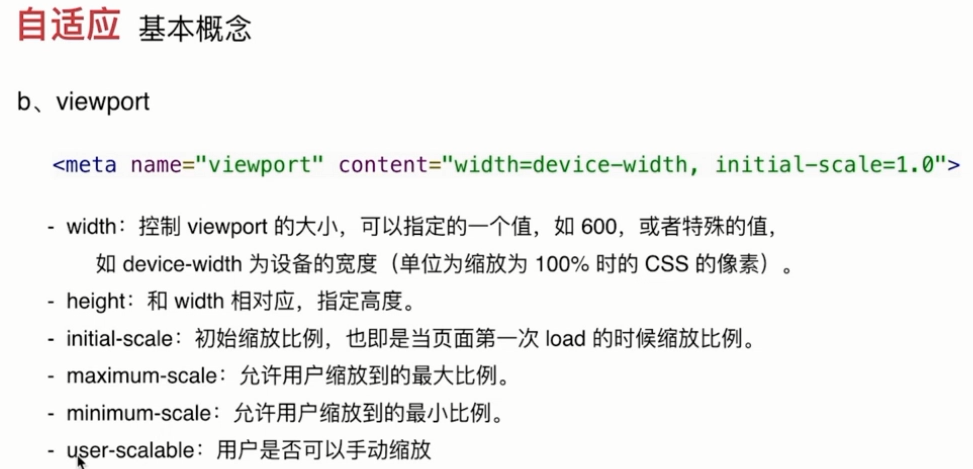

# HTML-CSS

## HTML固定结构代码

```javascript
<!DOCTYPE html>
<html>
	<head>
		<title>网页标题</title>
	</head>
	<body>
	
	</body>
</html>
```

```html
<!DOCTYPE html>
指定当前文档类型为html5版本

<html lang="en">
页面的一个根节点，网页从哪里开始到哪里结束

<head>
头部标签，用来存放页面辅助型标签，例如：title，meta，base，style，link等

<title>
网页标题标签，被head标签包裹，让页面拥有标题

<body>
主体标签，所有页面的内容，都是存放在这个标签内部
```

```html
<meta charset="UTF-8">
<meta name="viewport" content="width=device-width, initial-scale=1.0 user-scalable=no">
	name="viewport" 				//视口
	content="width=device-width 	//适配宽度
	initial-scale=1.0 				//网页加载不缩放
	user-scalable=no 				//禁止用户手动缩放
<meta http-equiv="X-UA-Compatible" content="ie=edge">
<meta name="description" content="描述说明">
<meta name="keyword" content="关键字">
<title>王昌然</title>  //标题
<link rel="shortcut icon" href="">   //头标图标
<link rel="stylesheet" href="./css/base.css">
<link rel="stylesheet" href="./css/common.css">
<link rel="stylesheet" href="./css/index.css">
<link rel="stylesheet" href="./fonts/iconfont.css">  //字体图标
```

### viewport

```html
width：控制 viewport 的大小，可以指定的一个值，如果 600，或者特殊的值，如 device-width 为设备的宽度（单位为缩放为 100% 时的 CSS 的像素）。
height：和 width 相对应，指定高度。
initial-scale：初始缩放比例，也即是当页面第一次 load 的时候缩放比例。
maximum-scale：允许用户缩放到的最大比例。
minimum-scale：允许用户缩放到的最小比例。
user-scalable：用户是否可以手动缩放。
以下实例演示了使用viewport和没使用viewport在移动端上的效果：
```


```
空格合并现象: 浏览器会换行以及空格符号不敏感,不管你有几个空格,或者换行都只会编译成一个空格
```


## HTML标签

| 标签                        | 描述                                       |
| --------------------------- | :----------------------------------------- |
| <h1···h6> <h1···h6>         | 标题标签                                   |
| <p> </p>                    | 段落标签                                   |
| <hr/>                       | 水平线标签(建议加/)                        |
| <br/>                       | 换行(建议加/)                              |
| <pre> </pre>                | 文字格式需要保留，例如原文中的换行，空格等 |
| <blcokquote>  </blcokquote> | 需要引用大段的文字，那么建议使用blockquote |
| <div> </div>                | 独自占据一整行                             |
| <span> </span>              | 一行可以显示多个                           |
| 列表标签————                | ———————————————————————                    |
| <ul></ul> <li> </li>        | 无序标签 type=“disc/circle/square”         |
| <ol></ol> <li> </li>        | 有序标签type=“a/A/i/I“                     |
| <dl></dl><dt></dt><dd></dd> | 自定义                                     |
| 文本格式化标签————          | ———————————————————————                    |
| <b></b> <strong></strong>   | 文字加粗                                   |
| <i></i>  <em></em>          | 文字斜体                                   |
| <s></s> <del></del>         | 加删除线                                   |
| <u></u> <ins></ins>         | 加下划线                                   |

## **html标签-拓展**

```javascript
反方向输出文字
<bdo dir="rtl">
   Here is some Hebrew text
</bdo>

<q>文字</q>  输出："文字" （自带双引号）

<blockquote> 文本 </blockquote>
浏览器会插入换行和margin。（margin-left=40px；top=16px）
```

## ul列表样式

| 属性                | 描述                                                         |
| ------------------- | ------------------------------------------------------------ |
| list-style-type     | circle、square、、、、、改变圆点样式-查询                    |
| list-style-position | inside、outside 小圆点内外显示                               |
| list-style-image    | list-style-image:url('sqpurple.gif')                         |
| list-style          | 可以设置的属性（按顺序）：<br /> list-style-type, list-style-position, list-style-image. |
|                     |                                                              |

| list-style           |                                                           |
| -------------------- | --------------------------------------------------------- |
| disc                 | 标记是实心圆                                              |
| circle               | 标记是空心圆                                              |
| square               | 标记是实心方块                                            |
| decimal              | 标记是数字                                                |
| decimal-leading-zero | 0开头的数字标记。(01, 02, 03, 等)                         |
| lower-roman          | 小写罗马数字(i, ii, iii, iv, v, 等）                      |
| upper-roman          | 小写罗马数字(I, II, III, IV, V, 等)                       |
| lower-alpha          | 小写英文字母The marker is lower-alpha (a, b, c, d, e, 等) |
| upper-alpha          | (A, B, C, D, E, 等)                                       |
| lower-greek          | 小写希腊字母(alpha, beta, gamma, 等)                      |
| lower-latin          | 小写拉丁字母(a, b, c, d, e, 等)                           |
| upper-latin          | 大写拉丁字母(A, B, C, D, E, 等)                           |
| hebrew               | 传统的希伯来编号方式                                      |


## **img标签**

### 1、img标签

```html
语法结构：

```

|     属性名     |                            属性值                            |                           作用描述                           |
| :------------: | :----------------------------------------------------------: | :----------------------------------------------------------: |
|      src       |                         图片路径url                          |                  使img标签通过路径找到图片                   |
|      alt       |                             文字                             |                  图片加载失败，显示描述文本                  |
|     title      |                             文字                             |                   鼠标悬停时，显示描述文本                   |
|     width      |                            像素值                            |                        设置图片的宽度                        |
|     height     |                            像素值                            |                        设置图片的高度                        |
|     align      | bottom（默认）<br />middle<br />top<br />left 左浮动<br />right 右浮动 |                         图片对齐方式                         |
|     border     |                            px、%                             |                           控制圆角                           |
|   响应式图片   |                                                              |           {max-width：100%；<br />height：auto；}            |
|     filter     |                           ！待了解                           |                             滤镜                             |
| vertical-align |                        文字与中线对齐                        | vertical-align:middle<br />默认vertical-align:baseline基线对齐 |

问题：h标签中h>a>img;可能出现图片与a标签不能对齐；

原因：忘记给body加line-height：1；

### **2、img拓展**-图像映射

```javascript
图像映射


<map name="planetmap" id="planetmap">

<area
shape="circle"
coords="180,139,14"
href ="../example/html/venus.html" tppabs="http://www.w3school.com.cn/example/html/venus.html"
target ="_blank"
alt="Venus" />

<area
shape="circle"
coords="129,161,10"
href ="../example/html/mercur.html" tppabs="http://www.w3school.com.cn/example/html/mercur.html"
target ="_blank"
alt="Mercury" />

<area
shape="rect"
coords="0,0,110,260"
href ="../example/html/sun.html" tppabs="http://www.w3school.com.cn/example/html/sun.html"
target ="_blank"
alt="Sun" />

</map>

注：位于w3c “HTML图像”进一步掌握。
圆形：shape="circle"，coords="x,y,z"
这里的 x 和 y 定义了圆心的位置（"0,0" 是图像左上角的坐标），r 是以像素为单位的圆形半径。

多边形：shape="polygon"，coords="x1,y1,x2,y2,x3,y3,..."
每一对 "x,y" 坐标都定义了多边形的一个顶点（"0,0" 是图像左上角的坐标）。定义三角形至少需要三组坐标；高纬多边形则需要更多数量的顶点。

多边形会自动封闭，因此在列表的结尾不需要重复第一个坐标来闭合整个区域。

矩形：shape="rectangle"，coords="x1,y1,x2,y2"
第一个坐标是矩形的一个角的顶点坐标，另一对坐标是对角的顶点坐标，"0,0" 是图像左上角的坐标。请注意，定义矩形实际上是定义带有四个顶点的多边形的一种简化方法。

还需进一步了解。
```


## **a标签**

### 1、语法结构

```css
<a href=”跳转目标页面路径“ target=”目标页面打开方式“>文本或者图片</a>
```

### 2、a标签的使用方式

```
1.本地链接跳转，直接设置本地路径即可。
2.网络地址跳转，需要注意域名完整。
3.网络资源跳转，设置资源网络路径。
4.空链接：#号代替路径，点击不会跳转。
```

### 3、target属性

```css
target属性，可以控制跳转页面的打开方式，两种方式：
_self:直接打开页面，不保留原来的页面，默认方式。
_blank:打开新的窗口跳转，保留原来的页面。
```

### 4、base标签

```css
可以统一控制页面上所有a标签的跳转方式。(前提，a标签本身没有设置target属性)
语法结构：
<head>
	<base target="_blank">
</head>
```

### 5、锚点定位

```
语法结构：
<a href="#id名">内容</a>
其中的逻辑，主要是通过标签的唯一标识id，进行定位。
```

### 6、清除a标签样式

```css
清除a标签下划线：
text-decoration:none
--------------------------
移动端-清除点击高亮样式：
-webkit-tap-highlight-color: transparent;
```

### 7、a标签伪类

```
- :link      /* 未访问的链接 */
- :visited   /* 已访问的链接 */
- :hover     /* 鼠标移动到链接上 */
- :active    /* 选定的链接 */
注意顺序：lv包包hao
```

```js
 btn.onclick = function(){
     window.location.href="地址"
 }

```


## **路径**

```
绝对路径
完整的文件路径（带有盘符的路径，就是绝对路径）；
完整的网络地址；

相对路径
1.同一目录下结构。

2.下一级目录结构。

3.上一级目录结构。

```


## **转义符**


# HTML 布局

## **table表格 左右 布局**

```javascript
<table border="0" width="100%" cellpadding="10">
<tr>
	<td width="50%" valign="top">
		This is some text. This is some text.
	</td>

	<td width="50%" valign="top">
	Another text. Another text. Another text.  
	</td>
</tr>
</table>
```

## **垂直布局frameset**

```javascript
<!DOCTYPE html>
<html>

<frameset cols="25%,50%,25%">
  <frame src="表单练习.htm">  注：文件格式htm,非html
  <frame src="表单练习.htm">
  <frame src="表单练习.htm">
</frameset>

</html>
cols、rows和表格table中的使用方式相同。
可以实现多种布局。

frame中添加，不显示边框
noresize="noresize"
不支持的浏览器用<noframes> 标签

好像是不安全，基本不用。
```


# 表格table

### **1.创建表格的基本语法：**

```javascript
<table>
  <tr>
    <td>单元格内的文字</td>
    ...
  </tr>
  ...
</table>
```

```
1. table用于定义一个表格标签。
2. tr标签 用于定义表格中的行，必须嵌套在 table标签中。
3. td 用于定义表格中的单元格，必须嵌套在<tr></tr>标签中。
4. 表头标签<th></th>;替代相应的单元格标签<td></td>;自动加粗、居中。
```

### **2.table**

| 标签名              | 定义           | 说明                                         |
| ------------------- | -------------- | -------------------------------------------- |
| <table></table>     | 表格标签       | 就是一个四方的盒子                           |
| <tr></tr>           | 表格行标签     | 行标签要再table标签内部才有意义              |
| <td></td>           | 单元格标签     | 单元格标签是个容器级元素，可以放任何东西     |
| <th></th>           | 表头单元格标签 | 它还是一个单元格，但是里面的文字会居中且加粗 |
| <caption></caption> | 表格标题标签   | 表格的标题，跟着表格一起走，和表格居中对齐   |
| clospan             | 合并属性       | 跨列合并                                     |
| rowspan             | 合并属性       | 跨行合并                                     |

```
<td valign="top"> 内容上对齐
```

### **3.表格table属性**

| 属性名          | 含义                                                         | 常用属性值                           |
| --------------- | ------------------------------------------------------------ | ------------------------------------ |
| border          | 边框                                                         | px                                   |
| cellspacing     | 设置单元格与单元格之间边框之间的空白间距                     | px（默认2px）                        |
| cellpadding     | 设置单元格内容与单元格边框之间的空白间距                     | px（默认1px）                        |
| width           | 设置宽度                                                     | px                                   |
| height          | 设置高度                                                     | px                                   |
| align           | 设置表格在网页中的水平对齐方式                               | left、center、right                  |
| ————            | 拓展——                                                       | ————                                 |
| <thead></thead> | 用来放标题之类的东西。<thead> 内部必须拥有 <tr> 标签！       |                                      |
| <tbody></tbody> | 用于定义表格的主体                                           |                                      |
| <tfoot></tfoot> | 放表格的脚注之类                                             |                                      |
| frame=“ ”       | box 全部显示框<br />above 上显示横框<br />below 下横框<br />hsides 横框<br />vsides 竖框 |                                      |
| caption-side    | 设置标题位置：left、top、bottom、right                       |                                      |
| border-collapse | collapse：合并为一条边框<br />separate：默认拥有两条边框<br />inherit：从父级继承<br />css属性 | 表格的边框是否被合并为一个单一的边框 |

关于talbl设置height、width：

table：height设置的是最小值；width是最大值，但图片除外，图片会撑大表格width；

tr不起作用；会平分总height值；

td设置最小值，内容可超出；

特点：以容纳内容为先；后考虑设置的宽高；

# input控件

### **input属性值**

| 属性        | 属性值                                                       | 描述                         |
| ----------- | ------------------------------------------------------------ | ---------------------------- |
|             | text                                                         | 单行文本输入框               |
|             | password                                                     | 密码输入框                   |
| type        | radio                                                        | 单选按钮                     |
|             | checkbox                                                     | f复选框                      |
|             | button                                                       | 普通按钮 (可单独左标签)      |
|             | submit                                                       | 提交按钮                     |
|             | reset                                                        | 重置按钮（form里）           |
|             | image                                                        | 图像形式按钮                 |
|             | file<br />this.files[0](获取上传的文件内容)<br />获取文件属性<br />URL.createObjectURL(icon)获取上传文件的地址(创建url) | 文件域（选择文件）           |
| name        | 由用户自定义                                                 | 控件的名称                   |
| value       | 由用户自定义                                                 | input控件中默认的文本        |
| size        |                                                              | 多用width设置宽度            |
| checked     | 标签内加入 checked="checked"                                 | 选择控件中指定默认选项       |
| maxlength   |                                                              | 控件输入最多字符数           |
| placeholder | 显示提示文字                                                 | input::placeholder选中该属性 |
|             | transition: 0.5s;设置动画时长                                |                              |
| outinline   | outinline：none                                              | 取消点击样式                 |
|             | border：none                                                 | 取消边框样式                 |
| ：focus     |                                                              | 点击输入框时改变样式         |
| box-sizing  | box-sizing-border-box                                        | 呈现边框和内边距一起计算     |
|             | ！如何改变input初始样式，学习                                |                              |
| multiple    | 标签中加入此可多选                                           |                              |

```
input::placeholder {
	color: red;
}
改变input文字颜色；
```


### **label标签**（元素绑定）

```javascript
第一种用法就是用label直接包括input表单。
<label> 用户名： <input type="radio" name="usename" value="请输入用户名">   </label>

第二种用法 for 属性规定 label 与哪个表单元素绑定。
<label for="sex">男</label>
<input type="radio"  id="sex">
```

### 拓展-自定义复选框

```css
利用:把伪类after作为勾选框，通过checked伪类、改变after样式。
<input type="checkbox" id="awesome" />
<label for="awesome">Awesome!</label>
--------------------------------------------
input[type="checkbox"] + label::before {
        content: '\a0'; /* 不换行空格 */
        display: inline-block;
        vertical-align: .2em;
        width: .8em;
        height: .8em;
        margin-right: .2em;
        border-radius: .2em;
        background: silver;
        text-indent: .15em;
        line-height: .65;
        }
        input[type="checkbox"]:checked + label::before {
        content: '\2713';
        background: yellowgreen;
        }
// 隐藏自带选框。
input[type="checkbox"] {
 position: absolute;
 clip: rect(0,0,0,0);
}
```


### textarea控件(文本域)

```
<textarea name="" id="" cols="30" rows="10">
  文本内容
</textarea>

cols每行字符数
rows显示行数

清除拖动:resize:none;
注：
设置拖动：resize: horizontal;
可用于div等，也可通过伪类覆盖右下角拖动样式。
```

### **select下拉列表**

```javascript
出生年月:<select multiple> //multiple可点击ctr进行多选
  <option>选项1</option>
  <option>选项2</option>
  <option>选项3</option>
  ...
</select>

- 注意：
1. <select>中至少包含一对 option 
2. 在option 中定义selected =" selected "时，当前项即为默认选中项。
```

**form表单域**

```javascript
<form action="url地址" method="提交方式get/post" name="表单名称">
  各种表单控件
</form>
```

### **表单-拓展**

```javascript
<fieldset>
	<legend>健康信息：</legend>
	<form>
		<label>身高：<input type="text" /></label>
		<label>体重：<input type="text" /></label>
	</form>
</fieldset>
在数据周围绘制一个带标题的框

```


# CSS引入

css引入方式

| 引入类型         |                                                              |
| ---------------- | ------------------------------------------------------------ |
| 行内样式表       | <标签名 style="属性1:属性值1; 属性2:属性值2; 属性3:属性值3;"> 内容 </标签名> |
| 内联（嵌）样式表 | < style type="text/CSS"><br />选择器 {属性1:属性值1; 属性2:属性值2; 属性3:属性值3;}
</style> |
| 外链样式         | <head><br/>   <link href="CSS文件的路径"  rel="stylesheet" /><br/></head> |

```
注：link标签需要放在head头部标签中
```

```
href：定义所链接外部样式表文件的URL，可以是相对路径，也可以是绝对路径。
type：定义所链接文档的类型，在这里需要指定为“text/CSS”，表示链接的外部文件为CSS样式表。
rel：定义当前文档与被链接文档之间的关系，在这里需要指定为“stylesheet”，表示被链接的文档是一个样式表文件。
```

# css选择器

| 选择器类型             |                                                              |
| ---------------------- | ------------------------------------------------------------ |
| 标签-选择器            | span                                                         |
| 类-选择器              | .类目                                                        |
| 多类名-选择器          |                                                              |
| id-选择器              | #                                                            |
| 通配-符选择器          | *                                                            |
| 交集-选择器            | .a .b                                                        |
| 并集-选择器            | .a ,.b                                                       |
| 后代-选择器            | .a  .b .c                                                    |
| 子代-选择器            | div > ul > li                                                |
| 链接伪类               | :link      /* 未访问的链接 */<br /> :visited   /* 已访问的链接 */<br /> :hover     /* 鼠标移动到链接上 */<br /> :active    /* 选定的链接 */ |
| 结构（位置伪类）选择器 | :first-child 选取属于其父元素的首个子元素的指定选择器<br />:last-child 选取属于其父元素的最后一个子元素的指定选择器<br />:nth-child(n)匹配属于其父元素的第 N 个子元素且为该元素，不论元素的类型<br />：not（：nth-child（n+4））小于第4子元素<br />:nth-last-child(n)<br />：nth-of-type() 父元素下第N个该元素 |
| 属性选择器             | div[class^=font] 表示 font 开始位置就行了<br />div[class$=footer] 表示 footer 结束位置就行了<br />div[class*=tao] 表示tao 在任意位置都可以 |
| 伪元素选择器           | E::first-letter 文本的第一个单词或字<br />E::first-line 文本第一行<br />E::selection 可改变选中文本的样式； |
|                        | E::before和E::after                                          |
|                        | input[type="text"]                                           |

# CSS三大特性

## 层叠性

```
当多个相同的选择器(权重相同),发生属性冲突,后面的属性会把前面的覆盖,后来者居上
```

## 继承性

```
 存在父子关系的盒子,子元素会继承父元素的部分属性 

​    1.a标签: 不继承颜色 

​     2.h系列标签: 不继承字体大小 
```

## 优先级

```
继承性  <  通配符  <  标签选择器  <  类选择器  <  id选择器  <  行内式  <  !important 

​        !important:对继承是没有效果的 .

在属性值后加.
```


# 标签显示模式

## **块级元素特点**

1. 独自占据一行 

2. 可以设置宽高 

3. 如果块级元素没有设置宽度,那么宽度默认等于父盒子。

4. 塌陷。

   ```
   margin的垂直塌陷:垂直方向的margin,会重叠,不是相加,取最大值.
   
   包含塌陷: 存在父子关系的盒子,给子元素添加margin-top的时候,会把父元素带跑;
   给父元素加：
   1.加上边框border;
   2.上内边距padding;
   3.给父元素设置: overflow:hidden;
   ```
   
   
   
   ```
   常见的块元素有<h1>~<h6>、<p>、<div>、<ul>、<ol>、<li>等，其中<div>标签是最典型的块元素。
   ```

## **行内元素(inline-level)**

1.可以一行显示多个 

2.不能设置宽高,宽高由内容决定 

```
常见的行内元素有<a>、<strong>、<b>、<em>、<i>、<del>、<s>、<ins>、<u>、<span>等，其中<span>标签最典型的行内元素。
```

## **行内块元素（inline-block）**

1. ```
   1. 一行显示多个 
   2. 可以设置宽高 
   3. 垂直方向的padding margin无效;
   
      行内块元素:  input img
   
   注:回车符编译成一个空格,行内元素并排排列会有缝隙.浮动可解决.
   ```

   

## **标签显示模式转换** **display**

```html
块转行内：display:inline;
行内转块：display:block;
块、行内元素转换为行内块： display: inline-block;
浮动float:转换为inline-block;
position:absolute:转为inline-block;
```


# 盒子模型

margin、border、padding、content

## margin外边距

```
垂直方向的margin,会重叠,不是相加,取最大值.

margin的垂直塌陷:

包含塌陷: 存在父子关系的盒子,给子元素添加margin-top的时候,会把父元素带跑;
1.加上边框border;
2.上内边距padding;
3.给父元素设置: overflow:hidden;
```

## width:min-content

设置宽度为内容宽度。

# border属性

## border属性

|               |                                                              |
| ------------- | ------------------------------------------------------------ |
| border-style  | none、solid单实线、 dashed虚线、dotted点线、double双实线     |
| border-width  | px 设置宽度                                                  |
| border-color  | 颜色值、#十六进制、rgb(r,g,b)、 rgb(r%,g%,b%)                |
| 连写一        | border：1px solid color；                                    |
| 连写二        | border-top（方位）：1px solid color；                        |
|               | border-方位-样式（style、weigth、color）                     |
| border-radius | 设置圆角；设置椭圆角border-radius：75px /50px；<br />border-radius：50%；<br />border-radius：左上px 右上px 右下px 左下px；<br />border-radius：左上px 右上px 右下px 左下px(x轴) / 左上px 右上px 右下px 左下px(y轴)；<br />糖果按钮http://simurai.com/archive/button |
| border-image  |                                                              |
|               |                                                              |
| box-shadow    | x y 模糊距离 阴影尺寸 阴影颜色 内/外阴影（inset、outset）；  |
| outline       | outline：5px solid color;<br />outline-offset:15px;  可设置负值，outline距离调整。不受radius影响。 |

内盒初始化

```js
* {
    box-sizing: border-box;
    -webkit-tap-highlight-color: rgba(0, 0, 0, 0);
}

*:before,
*:after {
    box-sizing: border-box;
}
```


# 投影box-shadow

## box-shadow

|                         |                                                              |
| ----------------------- | ------------------------------------------------------------ |
| box-shadow              | x y 模糊距离 阴影尺寸 阴影颜色 内/外阴影（inset、outset（默认））；可叠加 |
| **filter**: drop-shadow | **filter**: drop-shadow(2px 2px 10px rgba(0,0,0,.5));        |

​    box-shadow：盒子阴影；只对盒子阴影。可阴影叠加。

​	filter: drop-shadow：阴影；盒子有尖角、透明、、、按图形阴影；不能阴影叠加。

​	同样的数值box-shadow更深；

## 内圆角 外方角解决方案

```css
<----方案一、父子盒子、子border-radius---->

<----方案二、一个盒子--边框用outline（不随radius变化）、box-shadow填充边角------->
    background: tan;
    border-radius: .8em;
    padding: 1em;
    box-shadow: 0 0 0 .6em #655;
    outline: .6em solid #655;
 注：box-shadow最小填补距离为（√2-1）r =~ 0.42xr 

裁剪元素:
clip-path: polygon(0% 0%, 100% 0%, 80% 100%, 0% 100%);
```


# CSS字体样式font属性

| 属性             | 说明                                                         |
| ---------------- | ------------------------------------------------------------ |
| font-size        | 设置字号，常用单位：em、px                                   |
| font-family      | p{ font-family:"微软雅黑";} （尽量使用系统默认字体）escape()  来测试属于什么字体 |
| font-weight      | 字体粗细，属性值：normal（400）、bold（700）、<br />bolder、lighter、100~900（100的整数倍）。（b  和 strong 标签） |
| font-style       | 字体倾斜属性值：normal、italic、oblique                      |
| 综合设置字体样式 | 选择器{font: font-style  font-weight  font-size/line-height  font-family;} |
| color            | color：#343434；<br />color：rgb（255，0，0）；<br />color：red； |
| font-variant     | 小型大写之母体 small-caps                                    |
|                  |                                                              |

```
文字抗锯齿:
-webkit-font-smoothing:
属性：
none  关闭抗锯齿，字体边缘犀利。
antialiased  字体平滑。
subpixel-antialiased  默认值

【火狐浏览器】
-moz-osx-font-smoothing
属性：
auto 览器只能选择字体渲染表现。
grayscale 灰度抗锯齿渲染。
```


# CSS文本样式text属性

## 文本样式属性

|                          |                                                              |
| ------------------------ | ------------------------------------------------------------ |
| line-height              | 行间距                                                       |
| letter-spacing           | 文字之间间隔（一个字母、一个文字为单位）                     |
| word-spacing             | 单词之间空白-对中文无效                                      |
| text-align               | 水平对齐方式left、center、right                              |
| text-align:justify       | 两端对齐无效解决方法：<br />加::after{<br />content：“‘;<br />display:inline-block;<br />width:100%;}<br />问题原因：只对最后一行的前一行有效。 |
| text-align-last: justify | 文本两端对齐。一行两端对齐方式。                             |
| vertical-align           | 设置元素的垂直对齐 （行元素）baseline基线,top,bottom,midden  |
| text-indent              | 首行缩进 单位：em、px                                        |
| text-decoration          | 文本的装饰：<br />none 默认。（清除a标签下划线）<br />underline 定义文本下的一条线<br />overline 定义文本上的一条线<br />line-through 定义穿过文本下的一条线。 |
| text-transform           | 大小写转换 属性值：<br />capitalize 首字母大写、<br />uppercase 转大写、<br />lowercase 转小写 |
| writing-mode             | 文字书写方向：横向、竖向<br />lr-tb 左-右 上-下；（横排 左到右）<br />tb-lr 上-下 右-左；（竖排 右到左）<br />vertical-rl<br />vertical-lr<br />horizontal-tb |
| text-shadow              | text-shadow:X Y 模糊 颜色;<br />text-shadow:2px 2px 8px #FF0000; |
| overflow                 | hidden隐藏 scroll 滚动条\auto自动                            |
| white-space:nowrap       | div中文字不换行                                              |
| white-space:normal       | 默认,文字单词自动换行.字母数字不换行.                        |
| text-overflow:ellipsis   | 超出显示省略号                                               |
| user-select:none         | 不可选择文本                                                 |

-webkit-user-select:none;
-moz-user-select:none;
-ms-user-select:none;文本超出-省略号

```html
overflow：hidden；
white-space：nowrap；
text-overflow：ellipsis；
word-break:break-all
```


```html
 多行超出省略
	text-overflow:-o-ellipsis-lastline;//Opera 10.60

	overflow: hidden;
    text-overflow: ellipsis;
    display: -webkit-box; //必须,将对象作为弹性伸缩盒子模型显示
    -webkit-line-clamp:3; //Webkit支持
	line-clam:2; //限制行数
    -webkit-box-orient: vertical; //必须,设置或检索伸缩盒子元素的排列方式

    word-break:break-all
可设置p标签行数，超出隐藏省略号；

js方法:
$(".figcaption").each(function(i){
    var divH = $(this).height();
    var $p = $("p", $(this)).eq(0);
    while ($p.outerHeight() > divH) {
        $p.text($p.text().replace(/(\s)*([a-zA-Z0-9]+|\W)(\.\.\.)?$/, "..."));
    };
});
```

```css
/*文案显示，一行多余省略、二行多余省略、三行多余省略*/
.three-line {
    display: -webkit-box;
    -webkit-box-orient: vertical;
    -webkit-line-clamp: 3;
    word-break: break-all;
    overflow: hidden;
}
.two-line {
    display: -webkit-box;
    -webkit-box-orient: vertical;
    -webkit-line-clamp: 2;
    /* word-break: break-all; */
    word-wrap: break-word;
    overflow: hidden;
}
.one-line {
    white-space: nowrap;
    text-overflow: ellipsis;
    overflow: hidden;
}
```


## 文字镂空

```js
background-clip: border-box|padding-box|content-box;

 background-clip: text;
-webkit-background-clip: text;
-webkit-text-fill-color: transparent;
//设置背景颜色透明,不继承
-webkit-text-stroke: 2px #fff;//连写,文字描边
-webkit-mask-image: url(./img/txtpattern.png);//可不要
```


## 拓展-文本栏格解决方案

```css
			padding: .5em;
            line-height: 1.5;
            background: rgb(4, 161, 12);
            background-size: auto 3em;        //size为 line-height 的两倍。
            background-origin: content-box;
            background-image: linear-gradient(rgba(0,0,0,.2) 50%,
            transparent 0);
```

## 拓展-文字凹凸效果

```css
利用text-shadow文字投影；
凹字体：文字下投影亮色；
凸字体：文字上投影深色；
text-shadow: 0 -1px 1px black;

伪3D文字：
text-shadow: 0 1px hsl(0,0%,85%),
 0 2px hsl(0,0%,80%),
 0 3px hsl(0,0%,75%),
 0 4px hsl(0,0%,70%),
 0 5px hsl(0,0%,65%),
 0 5px 10px black;
多层投影叠加，最后一层模糊。
```

## 文字竖排

```css
竖排 左右:
writing-mode: vertical-lr;
writing-mode: tb-lr;
竖排 右左:
writing-mode: tb-lr;
```


# CSS背景-background

| 属性                       | 作用         | 值                                                           |
| -------------------------- | ------------ | ------------------------------------------------------------ |
| background-color           | 背景颜色     | --transparent设置透明背景                                    |
| background-image           | 背景图片     | background-image : url(“images/demo.png”)                    |
| background-repeat          | 是否平铺     | repeat / no-repeat / repeat-x / repeat-y                     |
| background-position        | 背景位置     | background-position：x y ；top center ····<br />background-positionX<br />background-positionY |
| background-attachment      | 是否固定     | scroll默认  /   fixed 固定                                   |
| 背景透明                   |              | background: rgba(0,0,0,0.3);<br />opacity: 0.4;              |
| 背景简写--------           |              | background:url(image.jpg) repeat-y  scroll center top 颜色   |
| background-size            | 背景图片大小 | px / % / cover整体填充 / contain按图比例填充,会留边          |
| background-origin          | 背景指定区域 | border-box  padding-box   content-box （写在连写后面）       |
| 设置多个背景（后可添参数） |              | background-image : url(“demo.png”)，url(“demo.png”)；        |
| background-clip            | 背景裁剪     | border-box  padding-box   content-box                        |
| clip:rect                  |              | clip:rect(上 右 下 左)                                       |
| clip:-path:polygon()       | 多边形裁剪   | (四个点坐标)                                                 |
| background:linear-gradient | 渐变         | linear-gradient(right / 90deg, #00dbde, #fc00ff);            |
| repeating-conic-gradient   | 圆锥渐变     | background: repeating-conic-gradient（svg）                  |

```javascript
Bennett Feely 的图案库 http:// bennettfeely.com/gradients
```


```javascript
几种定位方法：
<----background-position：方案----->
	background:url(image.jpg) repeat-y  scroll center top 颜色；

<----background-origin: 方案2----->
    background: url("code-pirate.svg") no-repeat bottom right #58a ;
	background-origin: content-box;

<----calc()：/计算/ 方案3----->
	background: url("./01.png") no-repeat calc(100% - 200px) calc(100% - 100px) red ;
```

```javascript
制作网格：
    background: #58a;
    background-image:
     linear-gradient(white 1px, transparent 0),
     linear-gradient(90deg, white 1px, transparent 0);
    background-size: 30px 30px;
```

# pre

```css
保留格式，且能换行  
white-space: pre-wrap; /*css-3*/
   white-space: -moz-pre-wrap; /*Mozilla,since1999*/
   white-space: -pre-wrap; /*Opera4-6*/
   white-space: -o-pre-wrap; /*Opera7*/
   word-wrap: break-word; /*InternetExplorer5.5+*/
```


## 背景渐变linear-gradient

```javascript
背景渐变
兼容：
-webkit-linear-gradient
-o-linear-gradient
-moz-linear-gradient

background: linear-gradient(#fb3 33.3%,#58a 0, #58a 66.6%, yellowgreen 0);
background-size: 100% 45px;           size小，自动平铺，后面数值为0，则从上一个颜色位置开始。

                            
background:linear-gradient(to right, #00dbde, #fc00ff); 默认是to bottom；
                           
background: repeating-linear-gradient(45deg,#fb3, #58a 30px);  循环渐变；    
                           
background: repeating-radial-gradient(45deg,#fb3, #58a 30px);    圆循环渐变；
                           
background: repeating-linear-gradient(60deg,#fb3, #fb3 15px, #58a 0, #58a 30px);
双色条纹（无渐变）；
                            
background:
 linear-gradient(to left bottom,transparent 50%, rgba(0,0,0,.4) 0)no-repeat 100% 0 / 2em 2em；   //产生尖角  /后是background-size
```

## 背景图+渐变

方法一、

原理：

https://www.cnblogs.com/iverson666/p/6042872.html

```
background:url(./) repeat,linear-gradient(to right,#ccc ,#fff);

注意：背景图 要写在 背景颜色前；
```

方法二、

多添加一个标签；

## 弧度切角

```javascript
background:
        radial-gradient(circle at top left, transparent 0, transparent 20px, #f15a24 0) top left,
        radial-gradient(circle at top right, transparent 0, transparent 20px, #f15a24 0) top right,
        radial-gradient(circle at bottom right, transparent 0, transparent 20px, #f15a24 0) bottom right,
        radial-gradient(circle at bottom left, transparent 0, transparent 20px, #f15a24 0) bottom left;
        background-size: 50% 50%;
        background-repeat: no-repeat;
                        
---------          
css3 的 mask
```

## 倾斜-transform: skew(-45deg)

## 平行四边形transform: skew(-45deg);

```javascript
倾斜：父级倾斜；文字倾斜回来；
<a href="#yolo" class="button">
  <div>Click me</div>
</a>
.button { transform: skewX(-45deg); }
.button > div { transform: skewX(45deg); }

倾斜：利用伪类元素倾斜；不影响文字；
.button {
 position: relative;
 /* 其他的文字颜色、内边距等样式…… */
}
.button::before {
 content: '';
 position: absolute;
 top: 0; right: 0; bottom: 0; left: 0;
}
```

## 棱形

```javascript
tranform：rotate（45deg）； 旋转

裁剪：
clip-path: polygon(50% 0, 100% 50%, 50% 100%, 0 50%); （分别为四个点的坐标）。
```


# 添加小图标方法

1.背景：同盒子添加padding，添加背景图片定位；

2.伪类：用::before\::after,转inline-block设置宽高；加入背景；(input不能添加伪类)

3.添加i标签，添加背景图定位；

4.字体图标;

5.input类标签，可设置文字为0，消除文字；再添加背景图标。

```html
引入:
<link rel="stylesheet" href="./iconfont.css">
选取图标类名:
<span class="iconfont icon-xxx">&#x33;</span>
或输入图标Unicode:
<span class="iconfont icon-xxx">&#x33;</span>
```

# 浮动float

## 浮动特点

元素的浮动是指 设置了浮动属性的元素会脱离标准流(文档流)的控制，移动到其父元素中指定位置的过程。

浮动元素拥有inline-block元素特性。

```
选择器{float:属性值;}
值：left\right\none;
```

## 浮动的影响

会使没有设置高度的父元素高度为零。父元素没有设置高度,当所有的子元素都浮动了,那么父元素会失去高度。

## 清除浮动方法

| 清除浮动的影响-方法                    | 说明                               |
| -------------------------------------- | ---------------------------------- |
| 父元素添加高度                         | 固定高度可以。动态高度不能自动撑开 |
| 父元素添加：overflow:hidden            | 不用                               |
| 在子元素最后添加额外标签设置clear:both | 添加多余的标签，导致标签冗余。     |
| 伪类清除                               | 利用后添加标签法方法；             |

```
单伪类清除：
.clearfix::after {
	content:".";		/*小点兼容低版本火狐*/
	display:block;
	clear:both;
	height:0;			/*去除点的高度*/
	visibility:hidden;  /*去除小点*/
}
.clearfix {
	*zoom:1;     /*兼容低版本IE*/
}
_____________________________________
双伪清除法：
.clearfix::before
,.clearfix::after {
	content:"";
	display:block;
}
.clearfix::after {
	clear:both;
}
.clearfix {
	*zoom:1;
}
```

# 定位position

## position特点

1.实现模式转换,拥有行内块的特点
2.脱离标准流,不占据标准流的位置

|                    |                                                        |
| ------------------ | ------------------------------------------------------ |
| position：fixed    | 固定定位                                               |
| position：relative | 相对定位 <br />1.不能实现模式转换<br/>2.不能脱离标准流 |
| position：absolute | 绝对定位                                               |
| z-index            | 叠放次序                                               |
| position:static    | 标准流                                                 |


固定定位元素默认参考body。

## 定位居中方法

```js
方法一: 子
    先走父元素的一半,再往回走自己的一半:
    position：absolute；
    top:50%;
    left:50%;
    margin-top:-小盒子一半height；
    margin-left:-小盒子一半width；
--------------------------
方法二:子
    position：absolute；
    top:50%;
    left:50%;
    transform:translate(-50%,-50%);
    注:需要兼容,-webkit-,-moz-,-ms-,-o-;
--------------------------
方法三:子
    position：absolute；
    margin:auto;
    left:0;
    right:0
    top:0;
    bottom:0;
--------------------------
方法四:display:table-cell
父元素:
	display:table-cell;
    vertical-align: middle;
    text-align: center;
子元素:
	display:inline-block;
	
--------------------------

方法五:display:flex;父元素设置。
    justify-content:center;
    align-items:center; 
    
方法六:http://www.ruanyifeng.com/blog/2019/03/grid-layout-tutorial.html
Grid
```


## 层级z-index

层级：标准流《浮动《定位《越往后越高

# 鼠标样式cursor

```css
cursor:default 默认箭头

cursor:pointer 小手

cursor:text 光标

cursor:move 移动光标

cursor:wait 等待

cursor:not-allowed 静止

cursor:help 帮助

cursor:n-resize;向上改变大小

cursor:s-resize: 向下

cursor:e-resize: 向右

cursor:w-resize: 向左


North	East	West	Souuth 

cursor:nw-resize: 向上左

cursor:ne-resize: 向上右

cursor:se-resize: 向下右

cursor:sw-resize: 向下左

：focus 选择输入框;类似hover用法;
```


# 动画

## transition

```html
transition:all 1s linear 延迟s；
配合hover使用。
：focus

linear	规定以相同速度开始至结束的过渡效果（等于 cubic-bezier(0,0,1,1)）。
ease	规定慢速开始，然后变快，然后慢速结束的过渡效果（cubic-bezier(0.25,0.1,0.25,1)）。
ease-in	规定以慢速开始的过渡效果（等于 cubic-bezier(0.42,0,1,1)）。
ease-out	规定以慢速结束的过渡效果（等于 cubic-bezier(0,0,0.58,1)）。
ease-in-out	规定以慢速开始和结束的过渡效果（等于 cubic-bezier(0.42,0,0.58,1)）。
cubic-bezier(n,n,n,n)	在 cubic-bezier 函数中定义自己的值。可能的值是 0 至 1 之间的数值。

贝塞尔曲线
https://cubic-bezier.com/
```

## 2D转换transform

|                                     |          |                  |
| ----------------------------------- | -------- | ---------------- |
| transform：translate（Xpx，Ypx）    | 位移     | 百分比相对于自身 |
| transform：scale（2，4）            | 大小缩放 |                  |
| transform：rotate（30deg）          | 旋转     |                  |
| transform：perspective              | 视距     |                  |
| transform:skew(xdeg,ydeg)           | 倾斜/    |                  |
| transtion-origin：                  |          |                  |
| transform:matrix() 如下对于的矩阵： |          |                  |
| matrix(1,0,0,1,x,y)                 | 位移     |                  |
| matrix(x,0,0,y,0,0)                 | 缩放     |                  |
| matrix(x,0,0,y,0,0)   待确定0       | 旋转     |                  |
| matrix(1,tan(y),tan(x),1,0,0)       | 变形     |                  |

```css
matrix(a,b,c,d,e,f)
ax+cy+e=x`
bx+dy+f=y`

matrix(a,b,c,d,e,f)

```

## transition3D

|                                                           |      |      |
| --------------------------------------------------------- | ---- | ---- |
| transform：translate(Xpx) translate(Ypx) translate(zpx）; |      |      |
| 必须设置                                                  |      |      |
|                                                           |      |      |

```css
transform：translate(Xpx) translate(Ypx) translate(zpx）;
transform：rotate(Xdeg) rotate(Ydeg) rotate(Zdeg); //没有逗号。
必须设置视距；
perspective：800px，一般给父元素加。图片给body设置；
		视距
                a.以后开发中，如果3D效果不对，一般原因就是把视距添加到运动的父盒子上去了
                b.解决方案：把视距添加到不动的父元素上，如果还不行就继续往上级父元素加.
                
transform-style: preserve-3d; //开启3D效果显示：默认浏览器没有开启


```

## animation

```css
动画路径：
@keyframes  name{
	from {
	
	}
	to {
	
	}
}
-------------------------
@keyframes  name{
	50% {  //百分比相对animation设置的时间
	
	}
	100% {
	
	}
}
-------------------------
animation：name 1s linear 次数（infinite循环）；

animation: name duration timing-function delay iteration-count direction;
animation: name  //
animation-duration //花费的时间，以秒或毫秒计
animation-timing-function //速度曲线 linear ease(低速) ease-in ease-out ease-in-out
animation-delay //开始之前的延迟 3s
animation-iteration-count //应该播放的次数 infinite
animation-direction //轮流反向播放动画  alternate
```


# ==移动端web==

## meta标签viewport介绍

```html
<meta name="viewport" content="width=device-width, initial-scale=1.0,user-scalable=no">
	name="viewport" //网页窗口的大小
	content="width=device-width //适配宽度
	initial-scale=1.0 //网页加载不缩放
	user-scalable=no" //禁止用户手动缩放
```

代码顺序：https://www.cnblogs.com/huangshan-huangshan/p/5723707.html

位置-大小-背景-字体-其他；



## 流式布局

宽度设置百分比。

min-width；

max-width；

## <u>弹性布局flex</u>

​    工具：focusky动画演示大师。

特点:

查看兼容:caniuse.com

兼容工具:postCss

兼容:display:-webkit-box;

默认：X为主轴；Y为次轴；

​	主轴内容不超出，次轴内容会超出。

|                               |                              |                                    |
| ----------------------------- | ---------------------------- | ---------------------------------- |
| display:flex                  | 父元素设置                   | 子元素可设置以下属性               |
| flex-direction 子元素排列方式 | 父元素设置                   | 改变主轴方向                       |
|                               | row（默认）                  | 横向排列                           |
|                               | row-reverse                  | 横向翻转                           |
|                               | column                       | 纵向                               |
|                               | column-reverse               | 纵向翻转                           |
|                               |                              |                                    |
| justify-content  内容 对齐    | 主轴对齐方式                 |                                    |
|                               | center                       | 居中                               |
|                               | space-between                | 两端                               |
|                               | space-around                 | 拉手布局（子盒子左右两边间距相同） |
|                               | flex-start                   | 局左 （默认）                      |
|                               | flex-end                     | 居右                               |
|                               |                              |                                    |
| align-items  纵向排列对齐     | 次轴对齐方式                 |                                    |
|                               | center                       | 居中                               |
|                               | flex-start                   | 顶部 默认                          |
|                               | flex-end                     | 底部                               |
|                               | baseline                     | 基线（文字）                       |
|                               | stretch                      | 平铺（默认）                       |
|                               |                              |                                    |
| flex-wrap 包裹方式            | 子元素超过父元素才能换行     |                                    |
|                               | nowrap 默认                  | 不换行                             |
|                               | wrap                         | 换行                               |
|                               |                              |                                    |
| align-content                 | 多行对齐方式垂直排列         | 只对多行                           |
|                               | stretch                      | 拉伸(默认)                         |
|                               | center                       | 居中                               |
|                               | flex-start                   | 顶部                               |
|                               | flex-end                     | 底部                               |
|                               | space-between                | 两端                               |
|                               | space-around                 | 拉手布局（子盒子左右两边间距相同） |
|                               |                              |                                    |
| flex-flow                     | "flex-direction" "flex-wrap" | 简写                               |
|                               |                              |                                    |
| flex:1;                       | 子元素分父元素的份数         | 子元素设置。设置宽高无效。         |
| align-self:                   | 设置个别子元素次轴对齐方式   |                                    |
|                               | center                       |                                    |
| order:number（默认0）         | 标记元素排序大小             | 元素 从小到大排列                  |
|                               |                              |                                    |

## rem

rem-相对HTML根元素字体大小；

em-相对当前父元素字体大小；

```css
html {
    font-size:16px;
}
大部分浏览器默认字体是16px；
一个P标签设置12px的字体大小那么用rem表示；
p {
    font-size: 0.75rem; //12÷16=0.75（rem）
}
计算方式：
	px/根字体大小=rem
```

实现宽高等比例缩放。一个相对单位rem=当前屏幕宽度1/10；（通过js实现）

```javascript
(function(){
	var calc = function(){
		var rem = document.documentElement.clientWidth/10;
		document.documentElement.style.fontSize = rem + 'px';
		rem = document.documentElement.clientWidth > 750?37.5:rem;
		console.log(rem);
	}
	calc();
	window.addEventListener('resize',calc);
})();
```

rem+sass换算：

```css

@function px2rem($px){
    $rem : 37.5px;
    @return ($px/$rem) + rem;
}
```

cssrem设置

```js
vscode 首选项 搜索cssrem 设置font-size
```


## less

引入less文件：@import "one";

变量：@w=100px；引用：width：@w；

混合：.w { 属性：值；}。 引用：.w();

嵌套：

伪类选择：&：hover


## media查询-响应式布局

https://www.runoob.com/cssref/css3-pr-mediaquery.html

25个经典响应式网站：:<http://www.daqianduan.com/4614.html?tdsourcetag=s_pcqq_aiomsg

媒体查询：

```html
标准写法:
	@media screen and (width:1000px) {
	}

简写：
	@media（width：1000px）{
	}

区间查询：大于等于1200px时显示；
	@media （min-width：1200px）{
	}

范围设定：
	@media（min-width：100px） and （ max-width：1000px）{
	}
注：
	书写顺序：
		max-width为判断时，从大写到小；
		min-width为判断时，从小写到大；
原因：权重相同，同时满足条件，后面会覆盖前面。


引入样式方式：
<linkrel="stylesheet" type="text/css" href="styleB.css" media="screen and (min-width: 600px) and (max-width: 800px)">
    宽度大于600小于800时，应用styleB.css
```


设备类型

| 设备类型 | 屏幕尺寸 | 版心 |
| -------- | -------- | ---- |
| 大PC     | >=1200px | 1170 |
| 小pc     | 992-1200 | 970  |
| 平板     | 768-992  | 750  |
| 手机     | <768     | 100% |

## 响应式布局bootstrap

官方网：www.bootcss.com

**Bootstrap栅格系统介绍：**随着屏幕或视口（viewport）尺寸的增加，系统会自动分为最多12列。

通过定义好的类名控制不同视口所展现的内容，选择显示(visible-md-1)、隐藏(hidden-md)、宽度（col-md-）。减少媒体查询设置过多样式。

|                 | <768px          | ≥768px       | ≥992px       | ≥1200px      |
| --------------- | --------------- | ------------ | ------------ | ------------ |
| .container      | 100%            | 750px        | 970px        | 1170px       |
| .row            |                 |              |              |              |
| 类名前缀        | .col-xs-        | .col-ms-     | .col-md-     | .col-lg-     |
| 偏移（offsets） | col-md-offset-4 |              |              |              |
| 显示visible     | .visible-xs-    | .visible-ms- | .visible-md- | .visible-lg- |
| 隐藏hidden      | .hidden-xs      | .hidden-sm   | .hidden-md   | .hidden-lg   |

```html
注意：引入文件。
	<link rel="stylesheet" href="./css/bootstrap.min.css">	//bootstrap-css文件
    <script src="./js/bootstrap.min.js"></script> //bootstrap-js文件
    <script src="./js/jquery-1.12.4.min.js"></script>  //JQ-js文件

```

```javascript
拓展：一行显示7等份；
	<style>
     .col-lg-1{
            width: 14.2857%;
        }
	</style>
 	<div class="container-fluid">
        <div class="row">
            <div class="col-lg-1"></div>
            <div class="col-lg-1"></div>
            <div class="col-lg-1"></div>
            <div class="col-lg-1"></div>
            <div class="col-lg-1"></div>
            <div class="col-lg-1"></div>
            <div class="col-lg-1"></div>
        </div>  
    </div>
思路：
	源码文件设置.col-lg-1为1/12=8.3333%；
	7等分：设置.col-lg-1为 1/7=14.2857%；
```

## 富文本框的实现

```html
 <div contenteditable="true" id="rich-editor"></div>
```

移动端代替hover

```js

document.body.addEventListener('touchstart', function () {})

:hover 换成 :ative
```

# DOMContentLoaded 与 load事件

 DOMContentLoaded 意思就是：当初始的 HTML 文档被完全加载和解析完成之后，DOMContentLoaded 事件被触发，而无需等待样式表、图像和子框架的完成加载 

### load

 意思就是：当一个资源及其依赖资源已完成加载时，将触发load事件。 


# 1px解决方案

1.after


```css
4边

&.hairline {  
          position: relative;
          &::after {
            content: "";
            position: absolute;
            box-sizing: border-box;
            right: -50%;
            bottom: -50%;
            left: -50%;
            top: -50%;
            border: 1px solid red;
            transform: scale(0.5);
          }
        }

.setBorderAll{
     position: relative;
       &:after{
           content:" ";
           position:absolute;
           top: 0;
           left: 0;
           width: 200%;
           height: 200%;
           transform: scale(0.5);
           transform-origin: left top;
           box-sizing: border-box;
           border: 1px solid #E5E5E5;
           border-radius: 4px;
      }
    }
1条
.setOnePx{
  position: relative;
  &::after{
    position: absolute;
    content: '';
    background-color: #e5e5e5;
    display: block;
    width: 100%;
    height: 1px; /*no*/
    transform: scale(1, 0.5);
    top: 0;
    left: 0;
  }
}


```

2.border + border-image

```css
  border: 1px solid transparent;
  border-image: url('./../../image/96.jpg') 2 repeat;
```

3.box-shadow

```
box-shadow: 0  -1px 1px -1px #e5e5e5,   //上边线
            1px  0  1px -1px #e5e5e5,   //右边线
            0  1px  1px -1px #e5e5e5,   //下边线
            -1px 0  1px -1px #e5e5e5;   //左边线

```

4.viewport的scale

```js
不适用于viewport 
var viewport = document.querySelector("meta[name=viewport]");
          //下面是根据设备像素设置viewport
          if (window.devicePixelRatio == 1) {
              viewport.setAttribute('content', 'width=device-width,initial-scale=1, maximum-scale=1, minimum-scale=1, user-scalable=no');
          }
          if (window.devicePixelRatio == 2) {
              viewport.setAttribute('content', 'width=device-width,initial-scale=0.5, maximum-scale=0.5, minimum-scale=0.5, user-scalable=no');
          }
          if (window.devicePixelRatio == 3) {
              viewport.setAttribute('content', 'width=device-width,initial-scale=0.3333333333333333, maximum-scale=0.3333333333333333, minimum-scale=0.3333333333333333, user-scalable=no');
          }
          var docEl = document.documentElement;
          var fontsize = 32* (docEl.clientWidth / 750) + 'px';
          docEl.style.fontSize = fontsize;


```

```js
.scale-hairline-common(@color, @top, @right, @bottom, @left) {
  content: '';
  position: absolute;
  background-color: @color;
  display: block;
  z-index: 1;
  top: @top;
  right: @right;
  bottom: @bottom;
  left: @left;
}

.hairline(@direction, @color: @border-color-base) when (@direction = 'top') {
  border-top: 1PX solid @color; //大写PX不会转换rem

  html:not([data-scale]) & {
    @media (min-resolution: 2dppx) {
      border-top: none;

      &::before {
        .scale-hairline-common(@color, 0, auto, auto, 0);
        width: 100%;
        height: 1PX;
        transform-origin: 50% 50%;
        transform: scaleY(0.5);

        @media (min-resolution: 3dppx) {
          transform: scaleY(0.33);
        }
      }
    }
  }
}


```

