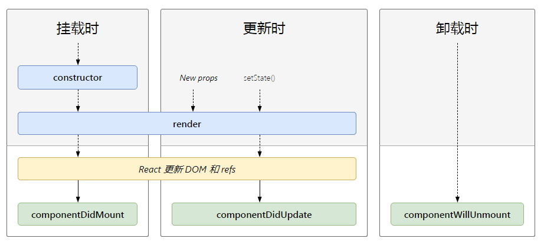
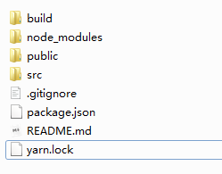
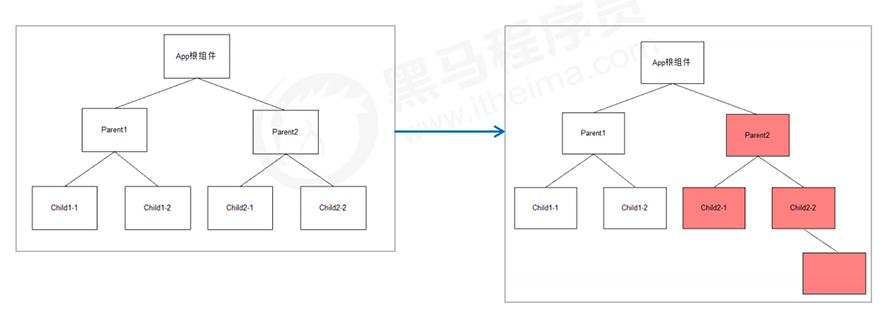
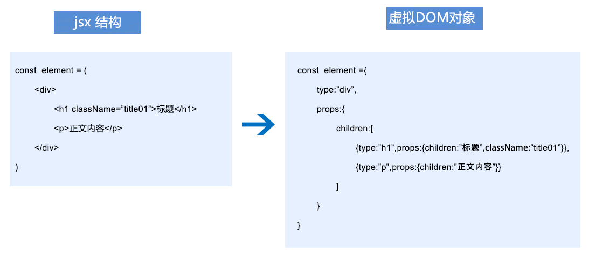
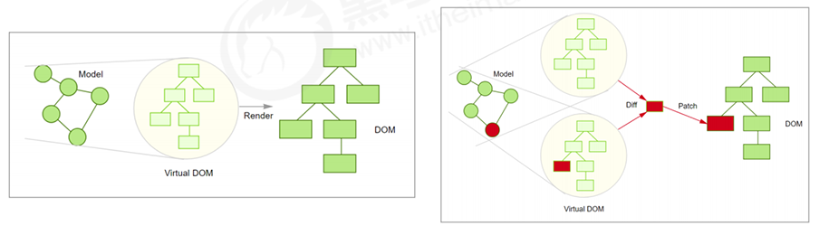
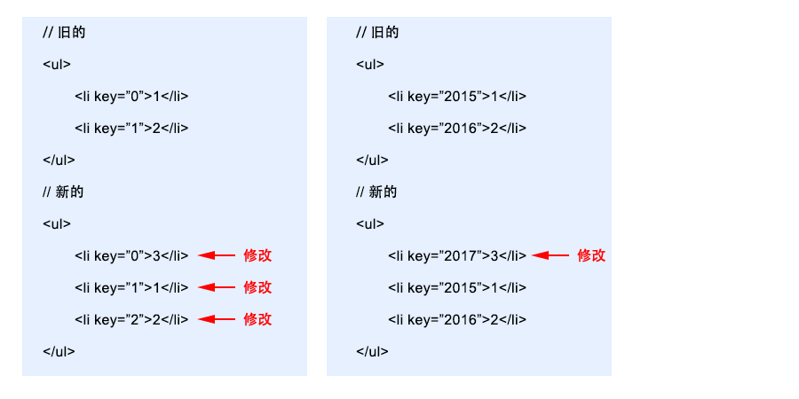

#  react入门

## JSX语法

jsx语法是一种类似于html标签的语法，它的作用相当于是让我们在JavaScript代码中直接写html代码，但是jsx不完全是html，它是 JavaScrip 的一种扩展语法，它具有 JavaScript 的全部能力，我们还可在jsx代码中插入变量或者表达式，用jsx语法写出来的语句是一个对象，我们可以将它存为一个变量，这个变量作为ReactDOM对象的render方法的第一个参数。

```javascript
let el = <h1>Hello world!</h1>;
ReactDOM.render(
    el,
    document.getElementById('root')
)
```

#### 基本语法示例

jsx的结构还可以写得更复杂，可以是嵌套结构，如果是嵌套结构，需要有唯一的一个外层标签。标签中如果是单个的标签，在结尾要加“/”,在jsx中可以通过“{}”插入变量，表达式或者函数调用。

```javascript
<script type="text/babel">
    let iNum01  = 10;
    let sTr = 'abc123456';
    function fnRev(s){
        return s.split('').reverse().join('');
    }    
    let el = (
        <div>
            {/* jsx注释定义方法 */}
            <h3>jsx语法</h3>
            {/* 插入变量及运算 */}
            <p>{ iNum01+5 }</p>
            {/* 插入表达式 */}
            <p>{ sTr.split('').reverse().join('') }</p>
            {/* 插入函数调用 */}
            <p>{ fnRev(sTr) }</p>
            {/* 插入三元运算表达式 */}
            <p>{ ok?'YES':'NO' }</p>                
        </div>
    );

    ReactDOM.render(
        el,
        document.getElementById('root')
    )

</script>
```

#### 标签属性定义方法

jsx中指定标签的属性值建议用双引号，不能不用引号，其中class属性需要写成className，属性值如果是可变的，也可以写成“{}”的形式，里面可以和上面写法一样。 标签如果是单个的，在结尾一定要加“/”

```javascript
{/* 定义class */}
<p className="sty01">使用样式</p>
{/* 单个标签，结尾要加“/” */}

```

#### 使用行间样式

行间样式一般不建议使用，但是有的组件结构中会少量用到，定义的方式是在“{}”中，将样式属性写成对象的键值对形式，值可以不加单位，直接写成数字，带“-”的属性名要写成驼峰式。

```
 <p style={{width:'300px',height:200,color:'#ddd',backgroundColor:'hotpink'}}>这是一个使用style样式的段落</p>
```

## 函数组件和参数props

组件可以理解成是一个组成页面的部件或者零件，每个部件都有自己完整的结构和功能，多个部件拼装在一起就可以组成一个页面，从组件的实现来看，组件最终是要返回一个jsx对象，组件有两种定义方式：一种是函数式定义，一种是类定义。

#### 函数式定义组件

通过函数来定义一个组件，组件名称首字母要大写，函数可以接收一个参数props，这个props是一个对象，这个对象中的属性是通过在使用组件时传入的，函数最终需要返回一个jsx对象。

```javascript
// 定义不含props参数的组件
function Welcome(){
    return <h1>Hello,Tom</h1>
}

// 定义含props参数的组件，props是一个对象，在使用组件时通过属性的方式传入
function WelcomeName(props){
  return <h1>Hello, {props.name}</h1>;
}
```

#### 组件渲染

组件渲染和jsx对象一样，我们可以通过ReactDOM.render()方法来渲染组件，组件以标签的方式使用，可以写成单个标签或者双标签，写成单个便签，结尾要加"/"

```javascript
 // ReactDOM.render(<Welcome />,document.getElementById('root');
    ReactDOM.render(<WelcomeName name="Sara" />,document.getElementById('root');
```

#### 组件的变换写法

定义函数可以用匿名函数赋值的形式，而匿名函数又可以改写成箭头函数的形式，另外，props是一个对象，所以，在传参时也可以使用解构赋值的形式，所以，上面的两个组件可以改写成下面的形式：

```
const Welcome = ()=><h1>Hello,Tom</h1>;
const WelcomeName = ({name})=><h1>Hello,{name}</h1>;
```

#### 组件组合

可以在一个组件内，拼装其他的组件，从而组合成一个更大的组件

```javascript
function WelcomeName(props) {
  return <h1>Hello, {props.name}</h1>;
}

function App() {
  return (
    <div>
      <WelcomeName name="Sara" />
      <WelcomeName name="Cahal" />
      <WelcomeName name="Edite" />
    </div>
  );
}

ReactDOM.render(
  <App />,
  document.getElementById('root')
);
```


## es6语法之类和类的继承

定义react组件会用到es6语法中类的写法，所以先来了解一下这些写法

#### 基于原型的类和类的继承定义方法

es6之前，javascript中是通过函数和原型的方式来模拟类和类继承，写法如下：

```javascript
function Person(name,age){
    this.name = name;
    this.age = age;
}
Person.prototype.showname = function(){
    alert('我的名字是：'+ this.name)
}
Person.prototype.showage = function(){
    alert('我的年龄是：'+ this.age)
}
var Andy = new Person('刘德华',60);

alert(Andy.name);
Andy.showage();


function Student(name,age,school){
    Person.call(this,name,age);
    this.school = school;
}

Student.prototype = new Person();

Student.prototype.showschool = function(){
    alert('我的学校是：'+this.school);
}

var Xiaoming = new Student('小明',15,'深圳一中');

alert(Xiaoming.name);
alert(Xiaoming.school);
Xiaoming.showname();
Xiaoming.showage();
Xiaoming.showschool();
```

#### es6类和类的继承定义方法

es6中增加了class语法来大大简化了类的创建和类的继承。

```javascript
// 定义类，类的首字母要大写
class Person {
    // 定义构造函数
    constructor(name,age){
        this.name = name;
        this.age = age;
    }
    // 定义方法
    showname(){
        alert('我的名字是：' + this.name);
    }
    showage(){
        alert('我的年龄是：' + this.age);
    }
}

// 通过类实例化对象
let Andy = new Person('刘德华',55);

// 调用对象的方法
Andy.showname();
Andy.showage();

// 定义类继承Person类
class Student extends Person{
    constructor(name,age,school){
        super(name,age);
        this.school = school;
    }
    showschool(){
        alert('我的学校是：' + this.school);
    }
};

// 通过类实例化对象
let Tom = new Student('小明','16','北京一中');

// 调用对象的方法
Tom.showname();
Tom.showschool();
```

## 类组件

类组件就是通过es6类的方式来定义组件，组件的名称首字母需要大写，定义的类，需要继承于React.Component类，类组件最少需要有一个render方法，这个方法会返回一个jsx对象，类里面使用的props属性是在React.Component类上面继承过来的，所以可以直接使用。

```javascript
class WelcomeName extends React.Component {
  render() {
    return <h1>Hello, {this.props.name}</h1>;
  }
}
```

类组件的使用方式和函数式组件使用方式相同，可以直接渲染出来，也可以组合使用：

```javascript
ReactDOM.render(<WelcomeName name="Sara" />,document.getElementById('root');
```

这样定义的组件相对于函数式定义的组件没有什么优势，我们其实可以在这种组件的基础上增加方法和属性，让它有更多的功能。


## 绑定事件

React绑定事件和JavaScript中的行间事件类似，事件绑定是写在标签中的，但是，React事件是在原生事件的基础上做了封装，它的事件使用**驼峰命名**，而不是全部小写。事件需要传递一个函数作为事件处理程序，这个函数在哪里定义呢？我们可以通过类定义组件，将这个函数作为一个方法定义在组件中。

定义一个点击能弹出名称的组件：

```javascript
class Helloname extends React.Component {
   fnHello(){
       alert('Hello,Tom');
   }
   render(){
       return (
           <input type="button" value="打招呼" onClick={this.fnHello} />
       )
   }
}

ReactDOM.render(<Helloname />, document.getElementById('root'));
```

如果想把这个组件定义成可以传递名称参数的，可以定义如下：

```javascript
class Helloname extends React.Component {
   fnHello(){
       alert(this.props.name);
   }
   render(){
       return (
           // 按钮在调用方法时，此时的this默认会指向这个按钮，所以在绑定事件时，需要绑定this
           <input type="button" value="打招呼" onClick={this.fnHello.bind(this)} />
       )
   }
}
ReactDOM.render(<Helloname name="Tom" />, document.getElementById('root'));
```

上面绑定this的方式实在是很麻烦，所以我们可以在定义方法的时候使用箭头函数来绑定this

```javascript
class Helloname extends React.Component {

   // 改成箭头函数的形式来绑定this
   fnHello=()=>{
       alert(this.props.name);
   }

   // 改成箭头函数，同时还需要传参
   fnHello2=content=>{
        alert(content + this.props.name);
   }

   render(){
       return (
           <div>
                {* 这里的fnHello就不需要绑定this了 *}
                <input type="button" value="打招呼" onClick={this.fnHello} />
                {* 这里的fnHello2通过绑定一个箭头函数来调用需要传参的函数*}
                <input type="button" value="打招呼2" onClick={()=>{this.fnHello2('Hello,')}} />
            </div>
       )
   }
}
ReactDOM.render(<Helloname name="Tom" />, document.getElementById('root'));
```


## 状态

组件如果需要定义默认属性呢？而且这个默认属性还是可变的呢？这个就是组件的状态属性了，状态属性默认名称是state，这个属性需要在组件定义时初始化，所以我们需要使用类的构造函数来对这个属性进行初始化。拥有state属性的组件叫做有状态组件，没有state属性的组件叫做无状态组件。所以用函数方式定义的组件都是无状态组件，用类的方式定义的组件，定义了state就是有状态组件，没定义state就是无状态组件。

定义一个点击按钮数字递增的

```javascript
class Increase extends React.Component{
    constructor(props){
        super(props);
        this.state = {
            iNum:10
        }
    }
    fnAdd=()=>{                
        // 设置state里面的值用setState
        // setState里面可以直接传递一个对象，对象可以是整体或者是部分的state中的键值对
        // setState里面还可以传递一个函数，函数需要返回一个对象
        // 设置值时想引用state最新的值用setState里面传递的函数中的state
        this.setState(state=>({iNum:state.iNum+1}));
    }
    render(){
        return (
            <div>
                <p>{ this.state.iNum }</p>
                <input type="button" value="递增" onClick={this.fnAdd} />
            </div>
        )
    }
}

ReactDOM.render(
    <Increase />,
    document.getElementById('root')
);
```

#### state注意点

1、不能直接修改state的值，应该用setState代替

```javascript
// 下面写法是不会更新组件，是错误的
this.state.iNum = 11;

// 应该写成setState的形式，里面接收一个修改后的对象，这个对象可以是完整的state对象，
// 也可以是针对个别几个键值对的对象
this.setState({iNum: 11});
```

2、出于性能考虑，React 可能会把多个 setState() 调用合并成一个调用。因为 this.props 和 this.state 可能会异步更新，所以你不要依赖他们的值来更新下一个状态。可以使用函数的形式，函数的参数中传递的第一个参数是state上一个状态的值，我们可以在这个值基础上修改。

```javascript
this.setState((state,props)=>({
    iNum:state.iNum+1
}));
```

#### 课堂实例

# react进阶

## 新增数组方法、属性表达式

#### map() 方法

map方法可以分别处理数组中的成员，返回一个新数组，也可以用于遍历数组

```javascript
let aList = ['a','b','c'];

// 第一个参数是数组的成员值，第二个参数是成员的索引值
aList.map(function(item,i){
    alert(i + ' | ' + item);
})
```

#### includes() 方法

includes方法返回一个布尔值，表示某个数组是否包含给定的值

```javascript
[1, 2, 3].includes(2)     // true
[1, 2, 3].includes(4)     // false
[1, 2, NaN].includes(NaN) // true
```

#### filter() 方法

和map类似，filter方法接收一个函数。但是和map不同的是， filter把传入的函数依次作用于每个元素，然后根据返回值是 true 还是false决定保留还是丢弃该元素。

```javascript
let aList01 = [1, 2, 4, 5, 6, 9, 10, 15];
let aList02 = aList01.filter(function (x) {
    return x % 2 !== 0; 
});
alert(aList02); // 1, 5, 9, 15
```

#### find() 方法

该方法主要应用于查找第一个符合条件的数组元素。它的参数是一个回调函数。在回调函数中可以写你要查找元素的条件，当条件成立为true时，返回该元素。如果没有符合条件的元素，返回值为undefined。

```
const myArr=[1,2,3,4,5,6];
var v=myArr.find(value=>value>4);
console.log(v);// 5
```

#### 扩展运算符(...)

扩展运算符（...），它用于把一个数组转化为用逗号分隔的参数序列

```javascript
let arr = [1,2,3];
let arr2 = [...arr,4];
console.log(arr2)  // [1,2,3,4]
```

#### 属性名表达式

对象的属性名可以通过中括号写成值或者变量的形式：

```javascript
let propKey = 'foo';
let obj = {
  [propKey]: true,
  ['a' + 'bc']: 123
};
alert(obj.foo); // true
alert(obj.abc); // 123
```

## 列表渲染

如何拼装数组中的数据放入页面呢？可以将数组中的数据通过数组遍历渲染成一个jsx对象，在通过React渲染这个对象就可以了。

```javascript
let aList = ['红海','复联3','碟中谍6','熊出没'];

let el = (
    <ul>
        { 
            aList.map((item,i)=><li key={i}>{ item }</li>)
        }        
    </ul>    
);

ReactDOM.render(
    el,
    document.getElementById('root')
)
```

通过map方法遍历数组中的成员，map方法的第二个参数是数组中的索引值，在循环生成li结构时，需要给每个li加上一个key，这个key的值可以用数组中的成员索引值。

## 条件渲染

根据条件渲染不同的结构，就是条件渲染，条件渲染有下面几种创建形式：

#### 组件内根据条件返回不同结构

```javascript
function Loginstate(props){
    if(props.isLogin==true){
        return <h2>欢迎回来！</h2>
    }else{
        return <h2>请登录！</h2> 
    }
}

ReactDOM.render(<Loginstate isLogin={true}/>,document.getElementById('root'));
```

#### 组件内根据条件返回不同子组件

```javascript
function Login(props){
    return <h2>欢迎回来！</h2>
}
function Logout(props){
    return <h2>请登录！</h2>
}
function Loginstate2(props){
    if(props.isLogin==true){
        return <Login />
    }else{
        return <Logout />
    }
}
ReactDOM.render(<Loginstate2 isLogin={true}/>,document.getElementById('root'));
```

#### 和运算符 && 一起使用

“&&”符号左边是条件运算式或者布尔值，右边是结构，如果左边为真，就生成右边的结构，如果为假，这一句整体忽略。

```javascript
class Notice extends React.Component{
    constructor(props){
        super(props);
        this.state={
            username:'张大山',
            messages:[
                '新邮件',
                '新的待办'
            ]
        }
    }
    render(){
        return(
            <div>
                <h2>你好，{this.state.username}</h2> 
                {
                    this.state.messages.length>0 && <p>你有{this.state.messages.length}条消息</p>
                }
            </div>
        )
    }
}

ReactDOM.render(<Notice />,document.getElementById('root'));
```

## 表单数据绑定

表单元件对应着数据，而且这些数据都是变化的，所以我们会将表单元件的数据对应于组件中的state属性值，让它们之间的值实现双向数据绑定的效果，要实现这个效果，需要在表单元件上绑定onchange事件，来将state中的值改变为表单元件中的值，同时也需要将表单的value属性值，设置为等于state中的属性值。这种表单的值和state中的值进行绑定的组件叫做受控组件。

#### 文本框绑定示例：

```javascript
class Myform extends React.Component {
    constructor(props){
        super(props);
        this.state = {
            username:'',
            password:''
        };
    }
    // e指的是系统自动产生的事件对象
    // e.target指的是发生事件的元素
    fnChange=e=>{
        this.setState({
            // 使用属性名称表达式
            [e.target.name]:e.target.value
        })
    }

    render(){
            return(
                <form>
                    <p>
                        <label>用户名：</label> { this.state.username } <br />
                        <input name="username" type="text" value={this.state.username} onChange={this.fnChange} />
                    </p>
                    <p>
                        <label>密码：</label> { this.state.password } <br />
                        <input name="password" type="password" value={this.state.password} onChange={this.fnChange} />     
                    </p>
                </form>
            );
        }
    }

    ReactDOM.render(
        <Myform />, 
        document.getElementById('root')
    );
```

## Refs操作元素，文件上传

#### Refs操作元素

有时候还是需要访问dom节点的，react提供了Refs方式，方便我们访问dom节点。 Refs 是使用 React.createRef() 创建的，并通过 ref 属性附加到 React 元素。在构造组件时，通常将 Refs 分配给实例属性，以便可以在整个组件中引用它们。

```javascript
class Myform extends React.Component{
    constructor(props){
        super(props);
        this.state = {};
        // 在组件初始化的时候创建一个ref对象
        this.myref = React.createRef();
    }
    // 在组件挂载到页面之后自动执行的方法
    componentDidMount(){
        //console.log( this.myref.current );
        // 让输入框获得焦点
        this.myref.current.focus();
    }
    render(){
        return (
            // 在标签中通过ref关联创建的ref对象
            <input type="text" ref={ this.myref } />
        )
    }
}
ReactDOM.render(<Myform />,document.getElementById('root'));
```

#### 文件上传

文件上传使用的表单元件是<input type="file">，这种表单元件，它的值是不适合和组件中的state进行绑定的，所以就不绑定值，而是通过获取dom节点的方式来操作它的值，获取节点可以用上面的Refs的方式，这种没有和state绑定数据的组件叫做非受控组件。 下面演示react中使用axios上传文件示例：

```javascript
class Fileform extends React.Component{
    constructor(props){
        super(props);
        this.state = {
            picUrl:''
        }
        this.myFile = React.createRef();
    }

    fnUpload=()=>{
        let file = this.myFile.current.files[0];
        let fd = new FormData();
        fd.append('pic',file);

        axios.post('http://localhost:3000/upload', fd, {
            headers: {
                'Content-Type':'multipart/form-data'
            },
            responseType: 'text'           
        }).then(dat=>{
            console.log(dat.data);
            this.setState({
                picUrl:dat.data
            })
        })
    }

    render(){
        return (
            <div>
                <input type="file" name="pic" ref={this.myFile}  />
                <input type="button" value="上传图片" onClick={this.fnUpload} /><br />
                {
                    this.state.picUrl && 
                }
            </div>
        )
    }
}
ReactDOM.render(<Fileform />,document.getElementById('root'));
```

和上面配套的nodejs编写的服务器程序如下：

```javascript
const express = require('express');
const multer  = require('multer');
const fs = require('fs');
const path = require('path');

const upload = multer({ dest: 'uploads/' })
const app = express();

// 设置跨域
app.use((req,res,next)=>{
    res.set('Access-Control-Allow-Origin','*');
    next();
});

// 设置静态资源文件夹为uploads文件夹
app.use(express.static('uploads'));

app.get('/',(req,res)=>{
    res.send('Hello world!');
});

app.post('/upload', upload.single('pic'), function (req, res, next) {
    // 设置保存的文件和上传的文件名一样
    fs.renameSync(req.file.path, path.join('uploads', req.file.originalname));
    res.send(req.file.originalname);
});


app.listen(3000,()=>{
    console.log('server start!');
});
```

## 生命周期方法

生命周期方法，指的是组件在某个时刻会自动执行的方法。下面按照组件从初始化到销毁的顺序列举出了这些方法：



### 常用的方法

##### constructor*方法*

这个方法是组件的构造函数，在组件初始化的时候会自动执行。

##### render方法

这个方法会在componentWillMount方法之后执行，也会在state和props的数据发生变化时执行，所以这个方法在组件开始会执行，在组件数据发生变化时也会执行。

##### componentDidMount方法

这个方法是组件在挂载到页面之后，自动执行。

##### componentDidUpdate方法

这个方法在组件更新之后执行。

##### componentWillUnmount方法

这个方法是在组件销毁之前执行。

### 不常用的方法

##### shouldComponentUpdate方法

这个方法在组件更新之前执行，不过这个方法可以决定是否要更新组件，它需要返回一个布尔值，如果返回一个true，就会先进入componentWillUpdate，然后进入render方法，接着进入componentDidUpdate方法，如果返回一个false，那么执行会停留在当前方法上，视图就不会更新了。

### 废弃的方法

下述方法即将过时，在新代码中应该避免使用它们，参见：https://zh-hans.reactjs.org/docs/react-component.html

##### componentWillUpdate方法

这个方法在组件更新之前执行。不过它是在shouldComponentUpdate方法之后执行。

##### componentWillMount方法

这个方法是在组件即将挂载到页面的时候自动执行

##### componentWillReceiveProps

这个方法定义在子组件中，子组件接收父组件参数，父组件的参数发生改变，然后父组件发生render方法之后，子组件就会自动执行这个方法。

测试代码如下：

```javascript
class Mycom extends React.Component{
    constructor(props){
        super(props);
        this.state={
            iNum:10
        }
    }

    fnAdd=()=>{            
        this.setState(state=>({iNum:state.iNum + 1}));
    }


    componentDidMount(){
        console.log('componentDidMount');
    }

    shouldComponentUpdate(){
        console.log('shouldComponentUpdate'); 
        return true;
    }

    componentDidUpdate(){
        console.log('componentDidUpdate');
    }

    componentWillUnmount(){
        console.log('componentWillUnmount');
    }

    render(){
        console.log('render');
        return (
            <div>
                <h1>{this.state.iNum}</h1>
                <input type="button" onClick={this.fnAdd} value="递增" />
            </div>
        )
    }
}    

ReactDOM.render(<Mycom />,document.getElementById('root'));

setTimeout(() => {
    ReactDOM.render(<h1>新组件</h1>,document.getElementById('root'));
}, 1000);
```

# 脚手架开发

## yarn

Yarn是由Facebook、Google、Exponent 和 Tilde 联合推出了一个新的 js 包管理工具 ，正如官方文档中写的，Yarn 是为了弥补 npm 的安装速度慢，安装包的版本不一致的缺陷而出现的。

#### 安装yarn

可以使用npm命令来全局安装yarn

```
npm i yarn -g
```

#### yarn常用命令

以下列出了Yarn和npm的区别，可以对比学习：

| NPM                         | YARN                 | 说明                                 |
| --------------------------- | -------------------- | ------------------------------------ |
| npm init                    | yarn init            | 初始化某个项目                       |
| npm install                 | yarn install         | 默认的安装依赖操作                   |
| npm install taco --save     | yarn add taco        | 安装某个依赖，并且默认保存到package. |
| npm uninstall taco --save   | yarn remove taco     | 移除某个依赖项目                     |
| npm install taco --save-dev | yarn add taco —dev   | 安装某个开发时依赖项目               |
| npm update taco --save      | yarn upgrade taco    | 更新某个依赖项目                     |
| npm install taco -g         | yarn global add taco | 安装某个全局依赖项目                 |

## 脚手架开发

React官方提供了完整的自动化开发工具及规划好了开发一个应用的项目目录，这些工具是通过nodejs开发的，我们可以安装这个工具，同时可以通过这个工具生成一个应用的项目目录。

#### 使用脚手架工具生成目录

脚手架工具为create-react-app，安装这个工具可以帮我们生成项目包，但是这个工具不是很常用，所以我们可以临时安装这个工具并且生成项目包，生成项目包后，这个工具会自行删除，这样可以节约空间。

1、临时安装create-react-app工具并且生成项目包my-app

```
npx create-react-app my-app
```

2、启动项目

```
cd my-app
yarn start
```

3、生成上线文件

```
yarn build
```

#### 项目目录说明



以上是执行生成命令自动生成的项目目录，对应的文件夹作用如下：
目录一：src目录，主开发目录，里面包含所有项目的组件，开发组件都是基于此目录
目录二：public目录，项目入口文件目录，目录中的文件不用动
目录三：项目开发依赖包文件目录，项目安装的包都会自动安装在这个文件夹中
目录四：build目录，项目上线时，执行npm run build生成的目录，这里面是自动化工具生成的上线文件


# react高级

## js模块化开发

js模块化开发指的是，一个文件代表一个模块，我们可以在一个文件中导入另外一个文件，然后就可以在当前文件中使用另外一个文件的资源，如果没有脚手架工具，js文件是不方便导入导出的，而使用脚手架工具，就可以很方便导入导出文件。

#### JavaScript文件导入导出

JavaScript文件首先需要导出，其他的js文件才能导入，而文件导出分为**名称导出**和**默认导出**，名称导出使用export，导出时需要有名称，名称导出的内容，导入时需要用相同的名称导入，名称导出可以导出多个变量、函数或者对象等。默认导出使用export default,默认导出可以不使用名称，默认导出只能导出一个变量、函数或者对象，默认导出的内容，导入时可以改名称。
js文件中的导出：

```
let iNum = 10;
let sTr = 'abcdefgh';
let oPerson = {name:'Tom',age:18};

// 名称导出
export { iNum,sTr };
// 名称导出
export { oPerson };

// 默认导出
export default {name:'Rose',age:17};
```

js文件中的导入：

```
import {iNum, sTr,oPerson } from './mod';
import girl from './mod';
```

#### 其他文件的导入

js之外其他的文件，比如css文件或者图片文件，可以在js文件中直接导入，导入的css文件可以直接起作用，图片文件可以用一个名字导入，这个名字可以赋值给img标签的src属性。

```javascript
import './main.css';
import mypic from './1.png';

......

```

## 数据传递

#### 父传子和子传父

父传子指的是父组件向子组件传递数据，这种传递方式可以使用子组件的props属性，将父级的值传递进去。子传父指的是子组件向父组件传递数据，这种传递方式也是使用子组件的props属性，将父级的一个方法的引用传递到子组件中，子组件中调用这个方法，将子组件中的数据传递出来给父级。

```javascript
class Father extends Component{
    constructor(props){
        super(props);
        this.state = {
            name:'Rose',
            iNum:0

        }
    }
    // 定义传给子组件的函数
    fnGetData=(num)=>{
        this.setState({
            iNum:num
        })
    }
    render(){
        return (
            <div>
                <h1>父组件</h1>
                <p>接收子组件传过来的数据：{ this.state.iNum }</p>
                <Son 
                // 传递值给子组件
                name={ this.state.name } 
                // 传递函数给子组件
                fnSet={ this.fnGetData } 
                />
            </div>
        )
    }
}
class Son extends Component{
    render(){
        return (
            <div>
                <h2>子组件</h2>
                <p>{ this.props.name }</p>
                <input type="button" value="传数据给父组件" onClick={()=>{ this.props.fnSet(10) } } />
            </div>
        )
    }
}
export default Father;
```

#### 同辈组件之间传递数据

使用系统提供的events模块，实例化模块中的EventEmitter类，通过实例的emit方法来发送数据，通过实例的on方法来接收数据。

```javascript
import { EventEmitter } from 'events';

// 实例化一个对象bus，兄弟组件之间通过它进行通信
const bus = new EventEmitter();
class Father extends Component{
    render(){
        return(
            <div>
                <h1>这是父组件</h1>
                <Son01 />
                <Son02 />
            </div>
        )
    }
}
class Son01 extends Component{
    constructor(props){
        super(props);
        this.state = {
            msg:''
        }
    }
    // 绑定监听，接收数据
    componentDidMount(){
        bus.on('go',dat=>{
            this.setState({
                msg:dat.msg
            })
        })           
    }
    render(){
        return(
            <div>
                <h2>这是子组件一</h2>
                <p>接收子组件传递过来的值：{ this.state.msg }</p>
            </div>
        )
    }
}
class Son02 extends Component{
    // 定义传递数据的函数
    fnSend=()=>{
        bus.emit('go',{
            msg:'我来也'
        })
    }

    render(){
        return(
            <div>
                <h2>这是子组件二</h2>
                <input type="button" value="传值给子组件一" onClick={ this.fnSend } />
            </div>
        )
    }
}

export default Father;
```

## 组件拆分

复杂功能的组件可以拆分成多个组件，可以方便功能的编写和复用，下面以todolist为例来拆分组件，以此来理解组件拆分的方法。
前面做的todolist可以拆分成三个组件，一、整体组件，负责整体列表数据的存储和数据交互方法，二、增加计划组件，负责增加计划内容的交互操作，三、计划展示列表组件，负责计划的展示。

#### 整体组件代码

```javascript
import React from 'react';
import './todo.css';
import Listshow from './listshow';
import Addlist from './addlist';

class Todolist extends React.Component{
    constructor(props){
        super(props);
        this.state = {
            aTodolist:['学习html','学习css','学习javascript','学习react']
        }
    }

    fnAdd=(sTodo)=>{
        this.setState(function(state){
            let aNewArr = [...state.aTodolist,sTodo];
            return {aTodolist:aNewArr}
        })
    }

    fnDel=(index)=>{
        this.setState(function(state){
            let aNewArr = [...state.aTodolist];
            aNewArr.splice(index,1);
            return { aTodolist: aNewArr }

        })
    }

    render(){
        let { aTodolist} = this.state;

        return (
            <div className="list_con">
                <h2>To do list</h2>
                <Addlist fnAdd={ this.fnAdd } />
                <Listshow aList={ aTodolist } fnDel={ this.fnDel } />
            </div>
        )
    }
}

export default Todolist;
```

#### 增加计划组件

```javascript
import React, { Component } from 'react';

class  Addlist extends Component{
    constructor(props){
        super(props);
        this.state = {
            sTodo:''
        }
    }
    fnChange=(e)=>{
        this.setState({
            sTodo:e.target.value
        })
    }

    fnSend=()=>{
        this.setState(state=>{
            if(state.sTodo===''){
                alert('请输入计划！')
                return;
            }else{
                this.props.fnAdd(state.sTodo);
                return { sTodo:'' }
            }
        })
    }

    render(){
        let { sTodo } = this.state;
        return (
           <div>
                <input type="text" name="" id="txt1" value={ sTodo  } onChange={ this.fnChange } className="inputtxt" />
                <input type="button" name="" value="增加" id="btn1" className="inputbtn" onClick={ this.fnSend  } />
            </div> 
        )
    }
}

export default Addlist;
```

#### 计划展示列表组件

```javascript
import React from 'react';

let Listshow = props=>(
        <ul className="list">
            {
                props.aList.map((item,index)=>{ 
                    return  <li key={ index }><span>{ item }</span><span className="del" onClick={()=>{ this.fnDel( index ) } }>删除</span></li>
                })
            }
            {
                props.aList.length===0 && <li style={{'border':'0px','textAlign':'center'}}>没有数据</li>
            }

        </ul>)


export default Listshow;
```

## 组件children属性

组件以标签使用时，可以用单标签的方式，也可以用双标签的方式，如果以双标签的方式使用，在双标签中插入内容，那么，组件的props上就有了children属性，children属性值就是组件标签中间的内容，children属性和props其他的属性一样，可以是文本、jsx对象、函数或者组件。

**属性是一般的文本**

```
// 定义组件
class Child extends Component {
    render() {
        return (
            <div>
                组件的children属性：{ this.props.children }
            </div>
        );
    }
}

// 使用组件
<Child>123</Child>
```

**属性是函数**

```
// 定义组件
class Child extends Component {
    render() {
        return (
            <div>
                <p>组件的children属性</p>
                <input type="button" onClick={ this.props.children } value="按钮" />
            </div>
        );
    }
}

// 使用组件
<Child>{ ()=>{ alert('hello') } }</Child>
```

## props校验

对于组件而言，props属性值是外部传入的，无法保证组件使用者传入的什么格式的数据，如果传入格式不对，会导致组件内部错误，关键是，有时候用户也不太清楚要出入什么格式的数据，如果在使用组件时，在传入错误的格式数据时，有报错提示用户应该传入什么格式，这样就可以方便用户使用组件，要让组件实现这个提示功能，我们可以加入props校验。

加入props校验，首先要安装一个包prop-types

```
yarn add prop-types
```

然后在组件中引入这个包，针对组件的props属性值编写校验规则：

```
import React, { Component } from 'react';
// 引入校验规则的包
import propTypes from 'prop-types';

class Propscheck extends Component {
    render() {
        return (
            <div>
                <p>总共有{this.props.iCount}条数据</p>
                <ul>
                    {
                        this.props.aList.map((item,i)=>(
                            <li key={i}>{ item }</li>
                        ))
                    }
                </ul>
            </div>
        );
    }
}

// 编写校验规则
Propscheck.propTypes = {
    // 规定iCount只能传入数字类型
    iCount:propTypes.number,
    // 规定aList只能传入数组类型
    aList:propTypes.array
}

export default Propscheck;
```

#### 常用的约束规则

- 常见类型：array、bool、func、number、object、string
- 必填项：isRequired
- 其中一个：oneof 比如：oneOf(['male', 'female'])

## props默认值

组件的props中的属性值，有些值在使用如果不传入，可以设置默认值，方便组件的初始化显示，可以使用组件自身的defaultProps属性值来设置：

```
// 定义组件
class Defaultprop extends Component {
    render() {
        return (
            <div>
                组件的默认props属性值：{ this.props.iPagesize }
            </div>
        );
    }
}

Defaultprop.defaultProps={
    iPagesize:10
}

export default Defaultprop;
```

使用组件是不传入值：

```
<Defaltprop />
```

## render-props模式

如果多个组件的部分功能相同，我们可以将这些部分相同的功能封装成一个组件，再通过一定的模式，将这个组件的功能赋予其他组件，从而达到组件功能复用的目的，复用组件的功能，其实就是复用组件的state以及操作state的方法，如何实现这种应用，我们可以用render-props模式，也可以使用高阶组件(HOC)。这两种方式不是新的api，而是通过react自身的编码技巧来实现的，从而形成固定的模式。

#### 实例：复用鼠标的位置状态

```
// 定义组件可以输出鼠标的位置
class Mouse extends Component {
    constructor(props){
        super(props);
        this.state = {
            x:0,
            y:0
        }
    }

    // 在window上绑定mousemove事件，发生事件时触发fnMouseMove方法
    componentDidMount(){
        window.addEventListener('mousemove',this.fnMouseMove)
    }

    // 定义mousemove触发的方法
    // 此方法的作用是将鼠标的坐标值设置到state中
    fnMouseMove=(e)=>{
        this.setState({
            x:e.clientX,
            y:e.clientY
        })
    }

    // 在组件销毁时解除事件绑定，优化组件的性能
    componentWillUnmount(){
        window.removeEventListener('mousemove',this.fnMouseMove);
    }

    // 在render方法中返回props上的show方法的调用
    // 同时将状态传入
    // props.show方法负责返回一个其它想复用这个状态的组件
    render() {
        return this.props.show(this.state)
    }
}

export default Mouse;
```

针对不同的组件复用这个组件：

```
// 复用一：
const Postion = props =><p> 鼠标的位置是：{props.x}-{props.y} </p>

ReactDOM.render(
    <Mouse show={mouse=><Postion {...mouse} />} />,
    document.getElementById('root')
);  


// 复用二：让图片跟随鼠标一起移动
const Cat = props => 

ReactDOM.render(
    <Mouse show={mouse => <Cat {...mouse} />} />, 
    document.getElementById('root')
);
```

#### 使用children属性的方式来实现

使用children属性的方式实现，需要修改两个地方：

```
// 组件内部修改成children调用的方式：
return this.props.children(this.state)

//使用组件时使用双标签的方式
ReactDOM.render(
    <Mouse>{mouse=><Postion {...mouse} />}</Mouse>, 
    document.getElementById('root')
);
```

## 高阶组件(HOC)

组件功能复用还可以使用高阶组件(HOC, Higher-Order Component),高阶组件是一个函数，它接收一个组件，返回增加了功能的组件，高阶组件内部创建了一个组件，组件内部提供可复用的状态和逻辑，传入的组件作为它的子组件，组件通过props属性将状态传递给这个子组件。最终这个函数将组件返回，返回的组件相当于是在传入的组件基础上增加了额外的功能。

#### 实例：复用鼠标的位置状态

```
// 定义高阶组件
function Withmouse(Comp){
    class Mouse extends Component {
        constructor(props){
            super(props);
            this.state = {
                x:0,
                y:0
            }
        }
        componentDidMount(){
            window.addEventListener('mousemove',this.fnMouseMove)
        }
        fnMouseMove=(e)=>{
            this.setState({
                x:e.clientX,
                y:e.clientY
            })
        }
        componentWillUnmount(){
            window.removeEventListener('mousemove',this.fnMouseMove);
        }

        render() {
            // 使用解构赋值的方式，将state的值传给Comp组件的props属性
            return <Comp {...this.state}  />
        }
    }

    return Mouse
}

export default Withmouse;
```

复用这个组件：

```
const Cat = props => 

// 使用高级组件函数返回一个组件
const WithMouseCat = Withmouse(Cat);

// 渲染返回的组件
ReactDOM.render(
    <WithMouseCat />, 
    document.getElementById('root')
);
```

#### 使用高阶组件props丢失的问题

在使用高阶组件时，如果传入props属性，组件中会接收不到这个属性

```
<WithMouseCat picalt="这是一只猫的图片" />
```

如果要组件接收到这个组件，需要在高阶组件中加上props属性，将父组件的props属性也传给子组件

```
 return <Comp {...this.state} {...this.props}  />
```

这个时候，在被包裹的组件中就可以使用这个属性了:

```
const Cat = props => 
```

## 组件更新机制及性能优化

react组件的更新机制是，如果当前组件更新了，那么当前组件的子组件也会跟着一起更新，即使子组件中没有更新的内容，这就是react组件的更新机制。



#### 实例演示

```
class Son extends Component {
    render() {
        console.log('子组件更新了！');
        return (
            <div>
                <p>我是子组件</p>
            </div>
        );
    }
}

class Father extends Component {
    constructor(props){
        super(props);
        this.state = {
           iNum:10
        }
    }

    fnAdd=()=>{
        this.setState(state=>({iNum:state.iNum+1}))
    }

    render() {
        console.log('父组件更新了！');
        return (
            <div>
                <p>我是父组件</p>
                <p>{ this.state.iNum }</p>
                <input type="button" value=" +1 " onClick={ this.fnAdd } />
                <Son />
            </div>
        );
    }
}
```

上面的例子中，父组件在更新数据，子组件也会跟着一起更新，其实这是没有必要的，这个时候，我们可以使用纯组件的方式来避免这种不必要的更新，纯组件的创建方式是，让类组件继承于 React.PureComponent。

```
// 创建一个纯组件
class Son extends React.PureComponent {
    render() {
......
```

有时候，父组件需要向子组件传值，如果传值过程中，有些时候是传递相同的值，这时候，子组件就没必要更新了，在这个时候，我们可以使用纯组件的方式，如果不使用纯组件，还可以使用生命周期函数shouldComponentUpdate，在生命周期函数中来判断两个值是否相同，如果不同，就返回true，组件更新，如果相同，就返回false，组件就不更新了。

```js
class Son extends Component {
    // 在生命周期函数中做判断
    // nextProps参数可以得到props最新的值，而this.props可以得到props之前的值
    shouldComponentUpdate(nextProps){
        //console.log(this.props.iNum, nextProps.iNum);
        return this.props.iNum !== nextProps.iNum
    }

    render() {     
        console.log('子组件更新了！');
        return (
            <div>
                <p>我是子组件</p>
                <p>子组件显示父组件数据：{ this.props.iNum }</p>
            </div>
        );
    }
}

class Father extends Component {
    constructor(props){
        super(props);
        this.state = {
          iNum:0
        }
    }

    fnAdd=()=>{
        this.setState({
            iNum: Math.floor(Math.random()*2)
        })
    }

    render() {
        console.log(this.state.iNum);
        console.log('父组件更新了！');
        return (
            <div>
                <p>我是父组件</p>
                <input type="button" value=" +1 " onClick={ this.fnAdd } />
                <Son iNum={ this.state.iNum } />
            </div>
        );
    }
}
```

不是什么时候都要用纯组件，因为纯组件在内部会做更新的判断，所以它的性能会比一般组件低，如果父组件不更新，子组件自己更新数据，这个时候就没必要用纯组件。

#### 组件性能优化

1、尽量减少state中的数据，不必要的变量可以存储在this中，也就是直接绑定在组件上，而不放到组件的state中，比如创建定时器返回的id值，可以将它放到组件this中。

2、减少不必要的更新，我们可以使用PureComponent纯组件或者shouldComponentUpdate来帮我们避免子组件不必要的更新。

## 虚拟dom及diff算法

在react中编写的jsx对象，最终会被转换成虚拟dom，虚拟dom，其实就是一个JavaScript对象，通过对象的方式来描述dom结构。 



组件初次渲染时，react会根据初始state(Model)，创建虚拟的dom树，然后根据这个虚拟dom树，生成真正的dom，渲染到页面中，当state中的数据发生变化时，会根据新的数据，生成新的虚拟dom树，之后，新的dom树会使用diff算法和上一次的虚拟dom树进行对比，得到需要更新的内容，最后，会将需要更新的内容生成真正的dom，更新到页面中。



#### 列表中的key在优化diff算法的作用原理

列表中的key需要给不重复且不变化的值，这样就可以优化diff算法，提高性能，比如，可以给数据每一列的id值，这个值是不重复且不变化的。如果再循环列表时给数组的索引值，这样就会降低性能。 



## React路由

路由就是通过访问地址的不同，让单页面的react系统在一个页面上加载不同的组件，从而实现系统功能的切换的，react是通过react-router-dom模块来实现路由的。

#### 基本用法

首先需要安装这个模块：

```
npm i react-router-dom -S
```

接着，我们在代码中导入对应的依赖

```javascript
import {HashRouter,Link,Route,Switch,Redirect} from 'react-router-dom'
```

其中：

- HashRoter 定义哈希路由整体的容器标签
- Link 单个标签，定义路由的链接，通过“to”属性来定义链接地址
- Route 单个标签，定义组件的容器标签，通过“path”定义和Link的to属性对应的地址，component属性定义链接对应的组件
- Switch 多个Route标签外面的容器标签，如果需要定义404跳转和重定向跳转，需要用此标签包裹Route标签
- Redirect 定义路由重定向，通过“from”属性定义原始路由，通过“to”属性定义重定向路由

路由的功能直接定义在组件中，下面是路由基本用法示例：

```javascript
// 定义子组件01
function Page01(props){
    return <p>页面内容一</p>
}

// 定义子组件02
function Page02(props){
    return <p>页面内容二</p>
}

// 定义子组件03
function Page03(props){
    return (
        <div>
            <p>页面内容三</p>
            <ul>
                {/* 链接地址传递参数 */}
                <li><a href="#/page03/detail/1001">新闻标题一</a></li>
                <li><a href="#/page03/detail/1002">新闻标题二</a></li>
                <li><a href="#/page03/detail/1003">新闻标题三</a></li>
            </ul>
        </div>

    ) 
}


// 定义负责路由的组件
class Myrouter extends Component{
    render(){
        return (
            <HashRouter>
                <p>
                    <Link to="/">页面一</Link> &nbsp; &nbsp;
                    <Link to="/page02">页面二</Link> &nbsp; &nbsp;
                    <Link to="/page03">页面三</Link>                      
                </p>
                <hr />

                {/* 加上exact是为了让path精确匹配，否则“/”和“/china”的路径会同时匹配 */}
                <Route exact path="/" component={ Page01 } />
                <Route path="/page02" component={ Page02 } />
                <Route path="/page03" component={ Page03 } />          
            </HashRouter>
        )
    }
}
export default Myrouter;
```

#### 路由传参

路由传参指的是路由携带参数，路由传参可以用params的方式，首先是Link标签的定义：

```javascript
<li><a href="#/page03/detail/1001">新闻标题一</a></li>
```

接着是Route标签的定义：

```javascript
<Route path="/page03/detail/:newsid" component={ Detail } />
```

组件中获取参数的方式：

```javascript
// 使用props属性获取路由传递过来的参数：
function Detail(props){
    // 通过 props.match.params.newsid 来接收传递的参数
    //console.log(props.match.params.newsid);
    return <p>这是新闻的详情页面,新闻的ID是{ props.match.params.newsid }</p>
}
```

#### 404页面及重定向

定义一个404对应的组件NotFound，Route配置如下：

```javascript
<Switch>
    {/* 加上exact是为了让path精确匹配，否则“/”和“/china”的路径会同时匹配 */}
    {/* <Route exact path="/" component={page01} /> */}
    <Route path="/page01" component={ Page01 } />
    <Route path="/page02" component={ Page02 } />
    <Route exact path="/page03" component={ Page03 } />
    <Route path="/page03/detail/:newsid" component={ Detail } />

    {/* 重定向要写在跳转路由的下面 */}
    <Redirect exact from="/" to="/page01" />

    {/* 404的路由需要写在最下面 */}
    <Route component={NotFound} />
</Switch>
```

#### 自定义路由

有时候，我们希望页面菜单能指示当前页面，就需要用到自定义路由

```javascript
function CustomLink({label,to,exact}){
    return (
    <Route
        path = { to }
        exact = { exact }
        // match参数是系统传入的，它是一个布尔值，匹配当前路由，就是true
        // 不匹配当前路由，就是false
        children = {({match})=>(
            <Link to={ to } className={ match?'active':''}>{ label }</Link>
        )}    
    />)
}
```

使用自定义路由：

```javascript
<CustomLink label="页面一" to="/" exact={ true } />
<CustomLink label="页面二" to="/page02"  />
<CustomLink label="页面三" to="/page03"  />
```

#### 子路由

react路由是直接写在组件中的，所以子路由就可以直接写在跳转的组件中就可以了，这个时候可以不写HashRouter容器标签，有时候，我们还需要在逻辑代码中跳转路由，这个叫做编程式导航，跳转的方式如下:

```javascript
this.props.history.push('/layout');
```

子路由使用场景示例：

```javascript
import React, { Component } from 'react';
import { HashRouter, Link, Route, Switch, Redirect } from 'react-router-dom'


class Login extends Component {
    constructor(props) {
        super(props)
    }
    fnJump = () => {
        this.props.history.push('/layout');
    }
    render() {
        return (
            <form action="">
                <input type="text" /><br />
                <input type="password" /><br />
                <input type="submit" value="登录" onClick={this.fnJump} />
            </form>
        )
    }
}
function Menu01(props) {
    return (
        <div>管理页面内容一</div>
    )
}
function Menu02(props) {
    return (
        <div>管理页面内容二</div>
    )
}
function Layout(props) {
    return (
        <div>
            <div>
                <Link to="/layout/menu01">菜单一</Link>
                <Link to="/layout/menu02">菜单二</Link>
            </div>
            <hr />
            <Route exact path="/layout" component={Menu01} />
            <Route exact path="/layout/menu01" component={Menu01} />
            <Route exact path="/layout/menu02" component={Menu02} />
        </div>
    )
}


class Myrouter extends Component {
    render() {
        return (
            <HashRouter>
                <Route exact path="/" component={Login} />
                <Route path="/login" component={Login} />
                <Route path="/layout" component={Layout} />
            </HashRouter>
        )
    }
}

export default Myrouter;
```

# react深入

## Redux

react中的数据保存在组件中，如果组件之间传递数据，对于简单的系统是没那么麻烦的，但是对于复杂的系统，组件之间传递数据就变得复杂而且难以维护，解决方法是将数据放在一个地方进行集中管理，所有的组件都共享同一个地方的数据，这样就可以简化数据的操作流程，而Redux就是实现这种数据管理方式的模块。

#### Redux基本原理


上面是redux的工作原理图，redux的功能可以分成图片的上面三块，下面蓝色块的是组件，以下对redux的三块功能做一个说明：

- Store 数据调控中心，相当于是数据仓库的管理员，组件可以通过它得到数据
- Action Creators 组件发起的数据变更需求，它相当于是仓库的变更工作工单，管理员会拿到工单，然后去仓库变更数据
- Reducers 数据仓库，数据的存储和变更在这里完成，完成之后，仓库会给Store返回最新的数据。

#### 代码实现

首先要安装这个模块：

```
npm i redux -S
```

1.创建store文件夹;

2.index.js

		>```
		>// 导入创建store的的工厂函数
		>import { createStore } from 'redux';
		>// 导入等会要创建的reducer文件
		>import reducer from './reducer'
		>
		>// 创建一个store
		>let store = createStore(reducer);
		>
		>export default store;
		>```

3.reducer.js

>```js
>const defaultState = {
>    "aList":[],
>    "sTodo":""
>};
>// state参数起始存放的是原始数据
>// action参数是由store传递进来的数据变更，它其实是一个对象
>let reducer = (state=defaultState,action)=>{
>    return state;
>}
>
>export default reducer;
>```

4.组件中

>```js
>/ 导入store文件夹下面的index.js文件，下面是简写方式
>import store from './store';
>
>class Todolist extends Component{
>    constructor(props){
>        super(props);
>        // 执行store.getState方法获取store中的数据
>        this.state = store.getState();
>        //订阅
>        store.subscribe(this.fnCartTotalChange);
>    }
>    ......
>	fnCartTotalChange=()=>{
>        this.setState({
>           this.state.data:
>        })
>    }
>```
>
>

5.修改store的数据

>```js
>// 数据变更的action其实就是一个对象
>// 通过store.dispatch方法将数据变更传给Store
>fnChange=(e)=>{ //触发事件执行
>    const action = {
>        type:'change_val',
>        value:e.target.value
>    }
>    store.dispatch(action);
>}
>```
>
>
>

6.接收修改

>```js
>let reducer = (state=defaultState,action)=>{
>    if(action.type=='change_val'){
>        const oNewState = JSON.parse(JSON.stringify(state));
>        oNewState.sTodo = action.value;
>        return oNewState;
>    }
>    return state;
>}
>export default reducer;
>```

然后在src文件夹中创建一个store文件夹，里面单独放置redux相关代码，首先在这个文件夹中创建一个index.js文件，在这个文件中编写上面图片中的Store模块对应的代码：

```javascript
// 导入创建store的的工厂函数
import { createStore } from 'redux';
// 导入等会要创建的reducer文件
import reducer from './reducer'

// 创建一个store
let store = createStore(reducer);

export default store;
```

接着在这个文件夹中创建一个reducer.js文件，文件里面编写上面图片中的Reducers对应的代码：

```javascript
const defaultState = {
    "aList":[],
    "sTodo":""
};
// state参数起始存放的是原始数据
// action参数是由store传递进来的数据变更，它其实是一个对象
let reducer = (state=defaultState,action)=>{
    return state;
}

export default reducer;
```

接下来，组件中就可以使用这个数据了：

```javascript
// 导入store文件夹下面的index.js文件，下面是简写方式
import store from './store';

class Todolist extends Component{
    constructor(props){
        super(props);
        // 执行store.getState方法获取store中的数据
        this.state = store.getState();
    }
    ......
```

要变更数据，就在组件的方法中编写Action Creators对应的代码：

```javascript
// 数据变更的action其实就是一个对象
// 通过store.dispatch方法将数据变更传给Store
fnChange=(e)=>{
    const action = {
        type:'change_val',
        value:e.target.value
    }
    store.dispatch(action);
}
```

Store会自动将变更传给Reducers，接着在reducer.js中编写对应变更代码：

```javascript
let reducer = (state=defaultState,action)=>{
    if(action.type=='change_val'){
        const oNewState = JSON.parse(JSON.stringify(state));
        oNewState.sTodo = action.value;
        return oNewState;
    }
    return state;
}
export default reducer;
```

数据变更后，Store拿到最新数据，需要通知组件更新state里面的数据，组件需要订阅Store的通知，一旦收到通知，就让组件重新获取Store中的数据：

```javascript
class Todolist extends Component{
    constructor(props){
        super(props);
        this.state = store.getState();
        // 订阅store中的通知，收到通知，就触发fnStoreChange方法重新或者数据
        // 订阅通知会返回一个函数，这个函数可以解除订阅
        this.unsubscribe = store.subscribe(this.fnStoreChange);
    }
    // 向store获取数据
    fnStoreChange=()=>{
        this.setState(store.getState());
    }
```

数据如果存放在数据库，组件初始化时可以通过ajax将远程数据读取回来存入redux中：

```javascript
// 在生命周期函数中自动去获取远程数据
componentDidMount(){
        axios.get('./data.json').then(res=>{
            store.dispatch({
                type:'init_data',
                value:res.data
            })
        })
    }
```

在reducer.js中添加对应代码：

```javascript
if(action.type=='init_data'){       
    return action.value;
}
```

#### todolist 代码示例

组件代码如下：

```javascript
import React, {Component} from 'react';
import store from './store';
import {CHANGE_VAL,ADD_LIST,DEL_LIST,INIT_DATA} from './store/actionType';
import axios from 'axios'

class Todolist extends Component{
    constructor(props){
        super(props);
        //console.log(store.getState());
        this.state = store.getState();
        this.unsubscribe = store.subscribe(this.fnStoreChange);

    }
    fnChange=(e)=>{
        const action = {
            type:CHANGE_VAL,
            value:e.target.value
        }
        store.dispatch(action);
    }

    fnAdd=()=>{
        const action = {
            type:ADD_LIST    
        }
        store.dispatch(action);
    }

    fnDel=(i)=>{
       store.dispatch({
           type:DEL_LIST,
           value:i
       })
    }

    fnStoreChange=()=>{
        this.setState(store.getState());
    }

    componentDidMount(){
        axios.get('./data.json').then(res=>{
            //console.log(res.data);
            store.dispatch({
                type:INIT_DATA,
                value:res.data
            })
        })
    }

    componentWillUnmount(){
        // 需要解除订阅，否则容易内存溢出
        this.unsubscribe();
    }

    render(){
        return (
            <div className="list_con">
                <h2>To do list</h2>
                <input type="text"  value={this.state.sTodo} onChange={this.fnChange} className="inputtxt" />
                <input type="button" value="增加" onClick={this.fnAdd} className="inputbtn" />

                <ul id="list" className="list">
                    {
                        this.state.aList.map((item,index)=>
                             <li key={index}><span>{index+1}、{item}</span><a href="javascript:;" className="del" onClick={()=>{ this.fnDel(index) }}>删除</a></li>
                        )
                    }                   
                </ul>
            </div>            
        )
    }
}

export default Todolist;
```

store文件夹(redux功能)中的index.js对应代码：

```javascript
import { createStore } from 'redux';
import reducer from './reducer'

let store = createStore(reducer);

export default store;
```

store文件夹(redux功能)中的reducer.js对应代码：

```javascript
import {CHANGE_VAL,ADD_LIST,DEL_LIST,INIT_DATA} from './actionType'

const defaultState = {
    "aList":[],
    "sTodo":""
};

let reducer = (state=defaultState,action)=>{
    if(action.type==CHANGE_VAL){
        const oNewState = JSON.parse(JSON.stringify(state));
        oNewState.sTodo = action.value;
        return oNewState;
    }

    if(action.type==ADD_LIST){
        const oNewState = JSON.parse(JSON.stringify(state));
        oNewState.aList.push(oNewState.sTodo);
        oNewState.sTodo = '';
        return oNewState;
    }

    if(action.type==DEL_LIST){
        const oNewState = JSON.parse(JSON.stringify(state));
        oNewState.aList.splice(action.value,1)
        return oNewState;
    }

    if(action.type==INIT_DATA){       
        return action.value;
    }

    return state;
}

export default reducer;
```

为了防止action中的type容易写错，将type中的字符串存为常量，独立成了一个文件为：actionType.js，文件代码为：

```javascript
const CHANGE_VAL = 'change_val';
const ADD_LIST = 'add_list';
const DEL_LIST = 'del_list';
const INIT_DATA = 'init_data';

export {CHANGE_VAL,ADD_LIST,DEL_LIST,INIT_DATA};
```

远程数据使用了一个json文件模拟，文件名为 data.json ,文件代码为：

```json
{
    "aList":["学习html","学习css","学习JavaScript","学习vue","学习react"],
    "sTodo":""
}
```

## react-redux

react-redux模块是对redux的使用进行优化，redux使用中，每个使用redux的组件都需要导入store，而且如果想跟踪store的变化，还需要订阅store，在组件销毁时还需要撤销订阅，这样使用非常麻烦，使用react-redux可以优化这些操作。

#### 使用方法

react-redux的官网：https://react-redux.js.org/introduction/quick-start
首先需要安装react-redux:

```
npm install react-redux
```

在react应用的index.js文件中导入store，然后在最外层的组件中通过provider注入store，那么，在组件里面引入的组件都不需要导入store了。

```javascript
import React from 'react'
import ReactDOM from 'react-dom'
import { Provider } from 'react-redux'
import store from './store'

import App from './App'

const rootElement = document.getElementById('root')
ReactDOM.render(
  <Provider store={store}>
    <App />
  </Provider>,
  rootElement
)
```

接下来，要应用redux的组件需要用connect来连接stroe，并且通过mapStateToProps和mapDispatchToProps， 将组件中的属性和方法全部映射到组件的props属性中。

```js
import React from 'react'
import { connect } from 'react-redux';

const List =props=>{
    return (
        <div>
               {
                props.aList.map...
               }
               <button onClick={ ()=>{ props.fnAddCart(item) } }>按钮</button>    
        </div>
    )
}

// 映射一般的属性和方法到props属性上
const mapStateToProps = (state) => {
    return {
        aList:state.aList
    }
}

// 映射操作redux的方法到props属性上
const mapDispatchToProps = dispatch =>{
    return {
        fnAddCart(goods){
            dispatch({
                type:'ADD_GOODS',
                goods:goods
            })
        }
    }
}

// 导出connet方法的返回值，方法将组件名作为参数传入
export default connect(mapStateToProps,mapDispatchToProps)(List);
```

# 创建

```js
class Wel extends React.Component {
        felon=(val)=>{
            listColor = {'color':'red'}
            console.log(val);
        }
        render(){
            return (
                <div>
                        <h1>{this.props.name},{this.props.age}</h1>
                <ul onClick={this.felon.bind(this,"我们")}>
                    <li  style={listColor}>1</li>
                    <li>2</li>
                    <li>3</li>
                    <li>4</li>
                </ul>    
                </div>
            )
        }
    }

    ReactDOM.render(<Wel name="kuku" age="lalal" />,document.getElementById('root'));
```


## 类的方式定义组件

```js
class Welcomename extends React.Component {
	render () {
		return (
			<h2> { this.props.name }</h2>
		)
	}
}
ReactDOM.render(<Welcomename name="walle" />,document)
```

## 事件绑定

```js
class Helloname extends React.Component {
   fnHello(){
       alert(this.props.name);
   }
    fnHello = ()=>{
       alert(this.props.name);
   }
   render(){
       return (
           // 按钮在调用方法时，此时的this默认会指向这个按钮，所以在绑定事件时，需要绑定this
           <input type="button" value="打招呼" onClick={this.fnHello.bind(this)} />
       )
   }
}
ReactDOM.render(<Helloname name="Tom" />, document.getElementById('root'));
```


# ES6类和类的继承

## 类

- class定义
- constructor定义构造函数
- extends关键之来继承
- super关键字继承属性
- 类的实例上面调用方法，其实就是调用原型上的方法。
- 类的内部所有定义的方法，都是不可枚举的

```js
类:
class Person {
	constructor(name,age){
		this.name = name;
		this.age = age;
	}		//无需,
	saiy(){ //必须es6简写  //本质是在原型上
		console.log('aa')
	}
}

类的继承:
class Stu extends Person { //extentds
    constructor(name,age,school){
        //等于 Person.call(this,name,age)
        super(name,age);
        this.school = school;
    }
}

typeof Person //"function"
Person === Person.prototype.constructor // true
```

## 原生类继承写法

```js
function Person(name,age){
    this.name = name;
    this.age = age;
}
Person.prototype.showname = function(){
    alert('我的名字是：'+ this.name)
}


function Student(name,age,school){
    Person.call(this,name,age);//继承属性
    this.school = school;
}

Student.prototype = new Person(); //继承原型
```

避免样式重叠

css module


https://jaredpalmer.com/formik/docs/api/withFormik#handlesubmit-values-values-formikbag-formikbag-gt-void

# 项目

