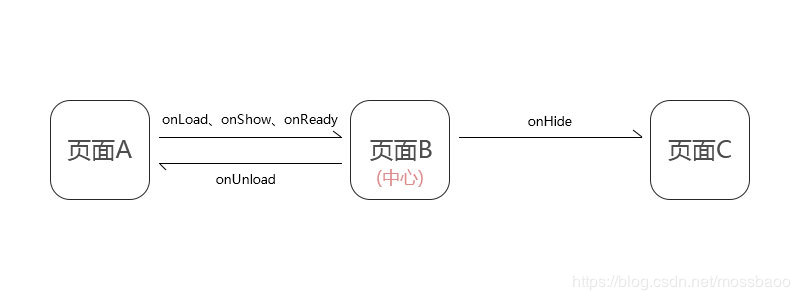

小程序构建npm

```js
fiddler 查看http请求
npm init

npm install --production  //安装依赖

项目地址：https://github.com/jovenwang1212
```

## setdata

```js
注意this是否被改变
改变普通值: 
this.setData({
	key:value
})

改变对象:
let key2 = "item.key"

this.setData({
    [key2]="value"
})

数组方式:
  var str = "isChecked[" + id + "].key"
    this.setData({
      [str]: false
    })
```


## 二.编程式导航

1. 声明式导航

    ```js
    <navigator url="/pages/index/index"></navigator>
    ```

2. 编程式导航

    ```js
    wx.navigateTo({url:'/pages/index/index'})
    ```

## 三.事件传参

```js
https://developers.weixin.qq.com/miniprogram/dev/framework/view/wxml/event.html
```

1. 注册事件：

    ```js
    <view bindtap="toIndex" data-参数名="参数值">
    ```

2. 接收

    ```js
    toIndex(event){
      event.currentTarget.dataset.参数名
    }
    
    currentTarget:事件所绑定事件的组件,如冒泡触发该组件的事件;
    target:事件触发源头,点谁是谁;
    ```

    

## 事件冒泡事件捕获

```js
冒泡:bindtab=""  catchtap="" 阻止冒泡
	等价:bind:tab=""  catch:tap="" 阻止冒泡
捕获:capture-bind:tap="" capture-catch:touchstart=""
```

## 小程序生命周期

  

| onLoad   | 监听页面加载         |
| -------- | -------------------- |
| onShow   | 监听页面显示         |
| onReady  | 监听页面初次渲染完成 |
| onUnload | 监听页面卸载         |
| onHide   | 监听页面隐藏         |

## app声明周期

 1. app在初始化,切换前后台时会调用

    |          |                      |
    | -------- | -------------------- |
    | onLaunch | 小程序初始化触发一次 |
    | onShow   | 从后台进入前台       |
    | onHide   | 从前台进入后台       |

    

## 页面栈感念

首页=>页面1=>页面2

getcurrentPages()里有数组保存页面记录

wx.switchTab()进入tabBar页面,其他页面销毁


| 路由方式   | 页面栈表现            | 方法            | 当期页面 | 后页面                   |
| ---------- | --------------------- | --------------- | -------- | ------------------------ |
| 打开新页面 | 新页面入栈            | wx.navigateTo   | onHide   | onLoad,onShow,onReady    |
| 页面返回   | 页面出栈,知道目标返回 | wx.navigateBack | onUnload | onShow                   |
| Tab切换    | 页面全部出栈留下tab页 | wx.switchTab    |          | 后面页面全部触发onUnload |

1.tab栏只会初始化第一个页面,第一层切换到某个tab时才会初始化tab,后续只会显示/隐藏

### 场景值

​	小程序入口

获取场景值:onShow(){options.scene}

事件上报–百度

## 请求

封装:

```js
const BASE_URL = "http//:"

export default function(options){
	return new Promise((resolve,reject)=>{
		wx.request({
			url:BASE_URL + options.url,
			data:options.data　|| {},
			method:options.method || "GET",
			header:options.header,
			dataTyope:options.dataType || "json",
			success:res =>{
				resolve(res)
			},
			fail:(err) =>{
				reject(err)
			}
		})
	})
}
```


开发-测试

```js
开源型评审 后台评审 ui评审 写静态 对接口 提测 修 bug 提审
```

## 路由

```js
wx.navigateTo)({ //保留当前页面，跳转到应用内的某个页面。但是不能跳到 tabbar 页面
    events:{}
})

唯一能跳到tabbar
wx.switchTab({ //跳转到 tabBar 页面，并关闭其他所有非 tabBar 页面
	url:'',
	success:'',
	fail:''
})

wx.reLaunch({ //关闭所有页面，打开到应用内的某个页面
    url:
})
```

## 页面传参

```js
一.
传参:
<navigator url="url?user_id='12345678'>跳转到B页</navigator>
接收:
data: {
    user_id:''
  },
onLoad: function (options) {
    this.setData({
      user_id:options.user_id
    })
    console.log(this.data.user_id)
  },


二.wx.navigateTo 拼接
 wx.navigateTo({
          url: '../pageB/pageB?used_id=' + that.data.used_id + '&used_name=' + that.data.used_name,
        })
```

# 登陆

```js
#登陆按钮 > wx.getSetting > wx.authorize
#登陆按钮
<button open-type="getUserInfo"
        @getuserinfo="getUserInfo"
        >登陆</button>

getUserInfo (e) {
      let that = this
      wx.getSetting({//回去用户是否授权
        success (res) {
          if (!res.authSetting['scope.record']) {
            wx.authorize({//授权
              scope: 'scope.userInfo',//获取用户信息
              success () {
                wx.setStorageSync('userInfo', e.mp.detail.userInfo)
                that.userInfo = e.mp.detail.userInfo
              }
            })
          } else {
            wx.setStorageSync('userInfo', e.mp.detail.userInfo)
            that.userInfo = e.mp.detail.userInfo
          }
        }
      })
    }
```


# 云开发

```js
app.js
wx.cloud.init({
      env: 'walletrip', //环境ID 在设置中
      traceUser: true, //跟踪用户信息
    })
```

## 云数据库操作

[地址]( https://developers.weixin.qq.com/miniprogram/dev/wxcloud/reference-server-api/database/collection.add.html )

```js
const db = wx.cloud.database()

const testDB = wx.cloud.database({
  env: 'card' //数据库名
})

testDB.add({
    data:{
        
    }
})


const watcher = db.collection('todos').where({
  team: 'our dev team'
}).watch({
  onChange: function(snapshot) {
    console.log('docs\'s changed events', snapshot.docChanges)
    console.log('query result snapshot after the event', snapshot.docs)
    console.log('is init data', snapshot.type === 'init')
  },
  onError: function(err) {
    console.error('the watch closed because of error', err)
  }
})

watcher.close()
```

## 云存储

上传文件

```js
wx.cloud.uploadFile({
  cloudPath: 'example.png', // 上传至云端的路径
  filePath: '', // 小程序临时文件路径
  success: res => {
    // 返回文件 ID
    console.log(res.fileID)
  },
  fail: console.error
})
```


## 云函数

[地址:](https://developers.weixin.qq.com/miniprogram/dev/wxcloud/guide/functions/getting-started.html)

```js
project.config.json

{
    "cloudfunctionRoot": "./cloudfunctions/" 
    //在同级目录下创建该文件名 的 文件夹
}
```

```js
新建函数文件夹  如:
add文件夹:会自动生成 index.js 和 package.json 文件

文件夹中引入依赖 npm i --production

-index.js-
const cloud = require('wx-server-sdk')

cloud.init()

const db = cloud.database()

const productsCollection = db.collection('products')


// 云函数入口函数
exports.main = async (event, context) => {
	return await productsCollection.add({
        data:
    })
    
  
}
```

小程序中调用:

```js
文件中调用
wx.cloud.callFunction({
  name: 'add',   // 云函数名称
  // 传给云函数的参数
  data: {
    a: 1,
    b: 2, 
  },
  success: function(res) {
    console.log(res.result.sum) // 3
  },
  fail: console.error
})

-----------------
promise格式
wx.cloud.callFunction({
  // 云函数名称
  name: 'add',
  // 传给云函数的参数
  data: {
    a: 1,
    b: 2,
  },
})
.then(res => {
  console.log(res.result) // 3
})
.catch(console.error)
```

# tcb-router

tcbrouter,设置中间件

```
npm i tcb-router
```

