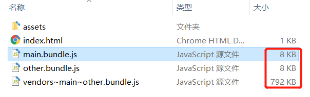
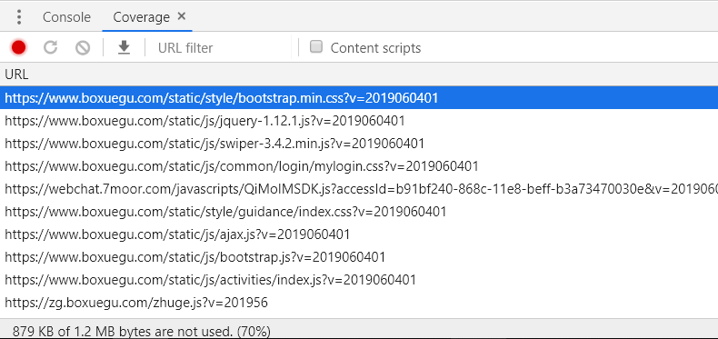

# webpack

英文官网:

```js
https://webpack.js.org/
```


```js
打包压缩混淆代码工具
官网:webpack.js.org
打包:npm run build  //vue-cli中打包
安装简写:npm i -D webpack webpack-cli

安装:
npm install --save-dev webpack
npm install --save-dev webpack@<版本号>
    
打包本地运行方法:
 nodejs:	npm install http-server -g
打包后目录:http-server
后端口运行即可 要在地址后面加 index.html#/

http://www.pianshen.com/article/1996316392/
```

## 入口出口

```js
创建webpack.config.js文件中

const path = require('path');

module.exports = {
  entry: './path/to/my/entry/file.js', //入口
  output: {
    path: path.resolve(__dirname, 'dist'), //出口绝对路径拼接
    //path:path.join(__dirname,'./dist/'),
    filename: 'bundle.js'
  },
    mode:'development' //默认production
};
```


## webpack的介绍

- `webpack` 就是一个打包工具，类似的工具还有 `gulp` 这之类的
- 现在要打包都是用 `webpack` 会在一些老项目里遇到别的工具
- 下载webpack模块

```npm
npm i -D webpack webpack-cli
```

- -D 是 --save-dev 的缩写

> 如果安装慢用淘宝镜像（cnpm）


- 打包命令

```$
npx webpack
```

> webpack会帮你打包src里面的文件，默认找的是src里index.js
>
> 它只会打包index.js这一个文件，如果发现index.js里面有对其他文件的依赖，那么才会其他文件
>
> 它也可以打包模块化的JS，让浏览器认识

## 开发自动编译

### watch

1. 在`webpack`指令后面加上`--watch`参数即可

    ```js
    npm webpack --watch
    ```

2. 配置文件添加watch:true

    ```js
    const path = require('path')
    
    // webpack的配置文件遵循着CommonJS规范
    module.exports = {
      entry: './src/main.js',
      output: {
        // path.resolve() : 解析当前相对路径的绝对路径
        // path: path.resolve('./dist/'),
        // path: path.resolve(__dirname, './dist/'),
        path: path.join(__dirname, './dist/'),
        filename: 'bundle.js'
      },
      mode: 'development',
      watch: true
    }
    ```

3. 配置package.json指定build

    ```js
    {
      "name": "walle-webc",
      "version": "1.0.0",
      "main": "index.js",
      "scripts": {
        "build":"webpack --config",
        "build:watch":"webpack --watch"
      },
      "author": "",
      "license": "ISC",
      "devDependencies": {
        "webpack": "^4.41.5",
        "webpack-cli": "^3.3.10"
      },
      "dependencies": {},
      "keywords": [],
      "description": ""
    }
    -------
        npm run build:watch
    ```


### webpack-dev-server

devServer会在内存中生成一个打包好的`bundle.js`;

并不是生成在dist文件里;位置如下图:

index.html中引入js为 /


```js
安装: 需要先安装webpack
npm i webpack-dev-server webpack -D
```

1. package.json

    ```json
    {
      "name": "walle-webc",
      "version": "1.0.0",
      "main": "index.js",
      "scripts": {
        "build:watch":"webpack --watch",
        "dev":"webpack-dev-server",
         "dev2":"webpack-dev-server --hot --open --port 8090"
          //--hot  热更替 只会重新加载修改部分
          //--open 自动启动浏览器
          //--port 指定端口
          //--compress 打包压缩gzip压缩
          //--contentBase src 当index位于src下 指定路径为src下
      },
    }
    
    --------------
    运行npm run dev
    ```

    

2. 配置文件webpack.config.js–devServer

    ```js
    const path = require('path')
    
    module.exports = {
      // 入口文件配置
      entry: './src/index.js',
      // 出口文件配置项
      output: {
        // 输出的路径，webpack2起就规定必须是绝对路径
        path: path.join(__dirname, 'dist'),
        // 输出文件名字
        filename: 'bundle.js'
      },
      devServer: {
        port: 8090,
        open: true,
        hot: true,
        contentBase:'./src'
      },
      mode: 'development'
    }
    ```

    ```js
    修改:package.json的scripts: "dev": "webpack-dev-server"
    运行 npm run dev
    ```

    

### webpack-dev-middleware

`webpack-dev-middleware` 是一个容器(wrapper)，它可以把 webpack 处理后的文件传递给一个服务器(server)。 `webpack-dev-server` 在内部使用了它，同时，它也可以作为一个单独的包来使用，以便进行更多自定义设置来实现更多的需求。

1. 安装 `express` 和 `webpack-dev-middleware`：

    `npm i express webpack-dev-middleware -D`

2. 新建`server.js`

    ```js
    const express = require('express');
    const webpack = require('webpack');
    const webpackDevMiddleware = require('webpack-dev-middleware');
    const config = require('./webpack.config.js');
    
    const app = express();
    const compiler = webpack(config);
    
    app.use(webpackDevMiddleware(compiler, {
      publicPath: '/'
    }));
    
    app.listen(3000, function () {
      console.log('http://localhost:3000');
    });
    ```

3. 配置`package.json`中的scripts:`"server": "node server.js"`

4. 运行: `npm run server`

注意: 如果要使用`webpack-dev-middleware`, 必须使用`html-webpack-plugin`插件, 否则html文件无法正确的输出到express服务器的根目录

#### 小结

只有在开发时才需要使用自动编译工具, 例如: webpack-dev-server

项目上线时都会直接使用webpack进行打包构建, 不需要使用这些自动编译工具

自动编译工具只是为了**提高开发体验**


# webpack有四大核心概念:

- 入口(entry): 程序的入口js
- 输出(output): 打包后存放的位置
- loader: 用于对模块的源代码进行转换  //module
- 插件(plugins): 插件目的在于解决 loader无法实现的**其他事**


[传送门](https://www.webpackjs.com/concepts/#%E5%85%A5%E5%8F%A3-entry-)

- 在文件里写以下代码

- 打包时要带上这个配置文件

```npm
npx webpack --config webpack.config.js

--config 后面指定按 指定文件打包
```

- 这个意思是打包，并且用webpack.config.js的配置来打包
- 默认它其实就会去找 webpack.config.js 这个文件来作为配置
- 在webpack老版本的时候，必须自己制定这个配置文件
- 也可以不叫 `webpack.config.js` 叫别的名字，叫别的名字必须制定配置文件的名字

[传送门](https://www.webpackjs.com/concepts/#%E5%87%BA%E5%8F%A3-output-)

- webpack.config.js

```js
const path = require('path')

module.exports = {

    //打包入口
    entry:"./src/index.js",

    //打包出口
    output:{

        // 打包后的路径，默认是./dist
        // 打包后的路径必须写绝对路径
        path: path.resolve(__dirname,'./dist'),
        //打包后的文件名，默认叫main.js
        filename:'index.js'
    }
}
```


## scripts作用

- npm run 后面要接 scripts 里面的名字
- npm run build 它就相当于找到 package.json 里面的 scripts 里面的 build ，再把 build 对应的代码执行起来
- 总结作用：它的作用可以把一串复杂的命令打包起来，然后要运行，只要 npm run xxx就行了

```js
package.json

"scripts": {
    "test": "echo \"Error: no test specified\" && exit 1",
    "buildcustom": "webpack --config webpack.custom.config.js", //指定打包配置文件
    "build": "webpack",
    "watch": "webpack --watch",
    "dev2": "webpack-dev-server --compress --hot --port 5000 --open --contentBase src",
    "server": "node server.js"
  },
      
--compress  //gzip压缩
--hot 		//热更新,保存自动更新页面
--port 5000 //端口
--open 		//npm run dev 后自动打开页面
--contentBase src", //指定默认打开路径
```


## --save 和 --save-dev 区别

- --save 会把你下载的第三方包信息保存到 `dependencies`
- --save-dev 会把你下载的第三方包保存到 `devDependencies`
- npm i 插件名 默认相当于  npm i --save 插件名


## devDependencies和 dependencies区别

- devDependencies ：开发时需要，正式上线不需要

    - 所以对于这类插件，记得下载时一定要用 --save-dev 的命令

- dependencies： 里面的插件代表开发打包后也会要用

    - 直接npm i 就行了，因为npm i 默认就是 --save
    - 如果是cnpm i 那么必须自己加 --save

    

# 打包loader

基本使用方法:

```js
1.安装loader:
	npm install --save-dev style-loader css-loader
2.module中添加rules:

```

## 打包css less sass

- webpack默认只认识.js文件，如果想打包解析别的文件格式，就需要对应的loader

- 下载loader

    - style-loader  css-loader

    - ```js
        npm install --save-dev style-loader css-loader
        npm install --save-dev less-loader less
npm install sass-loader node-sass webpack --save-dev
        ```
    
    - webpack.config.js
    
    - ```js
        module: {
          rules: [
              {test: /\.css$/,use: ['style-loader','css-loader']},
              {test: /\.less$/,use: ['style-loader','css-loader','less-loader']},
              {test: /\.s(a|c)ss$/,use: ['style-loader','css-loader','sass-loader']},
          ]
    }
        ```
    
        

## 打包图片,font

- 默认不支持打包图片

- 所以要下载对应loader

- ```js
    npm install --save-dev file-loader
    
    url路径的
    ```

- ```json
    webpack.config.js
    
    
    const path = require('path');
    
    module.exports = {
      entry: './src/index.js',
      output: {
        filename: 'bundle.js',
        path: path.resolve(__dirname, 'dist')
      },
      module: {
        rules: [
    +       {test: /\.(png|svg|jpg|gif)$/,use: ['file-loader']},
    		{test: /\.(png|svg|jpg|gif)$/,
    			use: {
    			  loader:'url-loader',
    			  options:{
    			  	limit:5 * 1024,  //大于5kb 转为base64
    			  	outputPath:'images',  //指定图片打不路径
    			  	name:'[name]-[hash:4].[ext]'  //防止重名
    			  }
    			}
    		},
          ]
        }
      };
    ```

## url-loader

```js
npm install --save-dev url-loader

url-loader 功能类似于 file-loader，但是在文件大小（单位 byte）低于指定的限制时，可以返回一个 DataURL。

module.exports = {
  module: {
    rules: [
      {
        test: /\.(png|jpg|gif)$/,
        test: /\.(png|jpe?g|gif|svg)(\?.*)?$/,
        test: /\.(woff2?|eot|ttf|otf)(\?.*)?$/,
        test: /\.(mp4|webm|ogg|mp3|wav|flac|aac)(\?.*)?$/,
        use: [
          {
            loader: 'url-loader',
             options: {
              outputPath:'img',
              name: '[name].[ext]'
            }
          }
        ]
      }
    ]
  }
}
```


## img标签图片资源loader

```js
npm install -s html-withimg-loader

html 标签中img src 中引入的图片会被打包
```

```js
webpack.config.js

{
	test:/\.(htm|html)$/i,
	loader:'html-withimg-loader'
}
```


## babel-loader

```json
ES6 ES7 转换为 ES5
babeljs.com

安装最新:npm i babel-loader @babel/core @babel/preset-env webpack -D

@babel/core  核心包
@babel/preset-env 预设包,语言包

{
    	test:/\.js$/,
        use:{
            loader:'babel-loader',
-                options:{
-                    presets:['@babel/env'],
-                    plugins:['@babel/plugin-proposal-class-properties']
-                }
        },
		exclude: /node_modules/ //不打包node_modules
}

建一个 .babelrc文件,json格式 把options写入这个文件
{
  "presets": ["@babel/env"],
  "plugins": [
    "@babel/plugin-proposal-class-properties",
    "@babel/plugin-transform-runtime"
  ]
}
```

### `generator`

如果需要使用`generator`，无法直接使用babel进行转换，因为会将`generator`转换为一个`regeneratorRuntime`，然后使用`mark`和`wrap`来实现`generator`

但由于babel并没有内置`regeneratorRuntime`，所以无法直接使用

需要安装插件:

​	`npm i @babel/plugin-transform-runtime -D`

同时还需安装运行时依赖:

​	`npm i @babel/runtime -D`

在`.babelrc`中添加插件:

```json
{
  "presets": [
    "@babel/env"
  ],
  "plugins": [
    "@babel/plugin-proposal-class-properties",
    "@babel/plugin-transform-runtime"
  ]
}
```

如果需要使用ES6/7中对象原型提供的新方法，babel默认情况无法转换，即使用了`transform-runtime`的插件也不支持转换原型上的方法

需要使用另一个模块:

​	`npm i @babel/polyfill -S`

该模块需要在使用新方法的地方直接引入:

​	`import '@babel/polyfill'`


## source map的使用

#### devtool

此选项控制是否生成，以及如何生成 source map。

使用 [`SourceMapDevToolPlugin`](https://www.webpackjs.com/plugins/source-map-dev-tool-plugin) 进行更细粒度的配置。查看 [`source-map-loader`](https://www.webpackjs.com/loaders/source-map-loader) 来处理已有的 source map。

选择一种 [source map](http://blog.teamtreehouse.com/introduction-source-maps) 格式来增强调试过程。不同的值会明显影响到构建(build)和重新构建(rebuild)的速度。

> 可以直接使用 `SourceMapDevToolPlugin`/`EvalSourceMapDevToolPlugin` 来替代使用 `devtool` 选项，它有更多的选项，但是切勿同时使用 `devtool` 选项和 `SourceMapDevToolPlugin`/`EvalSourceMapDevToolPlugin` 插件。因为`devtool` 选项在内部添加过这些插件，所以会应用两次插件。

| devtool                        | 构建速度 | 重新构建速度 | 生产环境 | 品质(quality)          |
| ------------------------------ | -------- | ------------ | -------- | ---------------------- |
| (none)                         | +++      | +++          | yes      | 打包后的代码           |
| eval                           | +++      | +++          | no       | 生成后的代码           |
| cheap-eval-source-map          | +        | ++           | no       | 转换过的代码（仅限行） |
| cheap-module-eval-source-map   | o        | ++           | no       | 原始源代码（仅限行）   |
| eval-source-map                | --       | +            | no       | 原始源代码             |
| cheap-source-map               | +        | o            | no       | 转换过的代码（仅限行） |
| cheap-module-source-map        | o        | -            | no       | 原始源代码（仅限行）   |
| inline-cheap-source-map        | +        | o            | no       | 转换过的代码（仅限行） |
| inline-cheap-module-source-map | o        | -            | no       | 原始源代码（仅限行）   |
| source-map                     | --       | --           | yes      | 原始源代码             |
| inline-source-map              | --       | --           | no       | 原始源代码             |
| hidden-source-map              | --       | --           | yes      | 原始源代码             |
| nosources-source-map           | --       | --           | yes      | 无源代码内容           |

#### 这么多模式用哪个好？

开发环境推荐：

​	**cheap-module-eval-source-map**

```js
plugins:[],
module:{},
devtool:'cheap-module-eval-source-map'
在webpack.config.js中
```

生产环境推荐：

​	**none(不使用source map)**

原因如下：

1. **使用 cheap 模式可以大幅提高 soure map 生成的效率。**大部分情况我们调试并不关心列信息，而且就算 source map 没有列，有些浏览器引擎（例如 v8） 也会给出列信息。
2. **使用 module 可支持 babel 这种预编译工具，映射转换前的代码**。
3. **使用 eval 方式可大幅提高持续构建效率。**官方文档提供的速度对比表格可以看到 eval 模式的重新构建速度都很快。
4. **使用 eval-source-map 模式可以减少网络请求。**这种模式开启 DataUrl 本身包含完整 sourcemap 信息，并不需要像 sourceURL 那样，浏览器需要发送一个完整请求去获取 sourcemap 文件，这会略微提高点效率。而生产环境中则不宜用 eval，这样会让文件变得极大。

### 插件

# plugin插件

基本使用方法:

```js
1.安装插件: 
	npm i clean-webpack-plugin -D`
2.引入插件: 
	const CleanWebpackPlugin = require('clean-webpack-plugin')
3.使用插件, 在plugins中直接创建对象即可:
    plugins: [
        new HtmlWebpackPlugin({
          filename: 'index.html',
          template: './src/index.html'
        }),
        new CleanWebpackPlugin()
     ],
```


## html-webpack-plugin

[传送门](https://www.webpackjs.com/guides/output-management/#%E8%AE%BE%E5%AE%9A-htmlwebpackplugin)

- webpack默认只能打包js

- 如果要打包html，还得下载一个html的插件

- 并且要修改配置文件，不能只是独立的html，还得给一个js的入口文件

- 步骤：

    - ```bash
        npm install --save-dev html-webpack-plugin
        ```

    - 修改webpack.config.js

    - 先导入

    - ```diff
        const HtmlWebpackPlugin = require('html-webpack-plugin');
        ```

    ```js
    plugins: [
          new HtmlWebpackPlugin({
                //title设置打包后的html标题
                title: '测试',
              filename: 'index.html', //打包后的文件名称
              template:'./src/index.html' //导入自己的html;
            })
        ],
    ```
```js
    
    - 会自动把入口文件的js  打包后的js文件 导入到打包后的html里面来
    - 如果只是写title，它会帮你创建新的空的html,并导入js依赖
    - 如果写template跟路径，就代表找到template对应的路径的html文件，把它打包起来，并添加依赖

1. devServer时根据模板在express项目根目录下生成html文件(类似于devServer生成内存中的bundle.js)
2. devServer时自动引入bundle.js
3. 打包时会自动生成index.html

## clean-webpack-plugin 

[中文传送门](https://www.webpackjs.com/guides/output-management/#%E6%B8%85%E7%90%86-dist-%E6%96%87%E4%BB%B6%E5%A4%B9)

[英文官网](https://webpack.js.org/guides/output-management/#cleaning-up-the-dist-folder)

- 

```

## 下载清空dist的插件

```
npm install clean-webpack-plugin --save-dev
```

- webpack.config.js

    ```js
    const { CleanWebpackPlugin } = require('clean-webpack-plugin');
    ```

    ```diff
     plugins: [
       //清空 dist 文件夹
       new CleanWebpackPlugin()
    ]
    ```

## copy-webpack-puugin

```js
npm i copy-webpack-puugin -D

const CopyWebpackPlugin = require('copy-webpack-plugin')

plugins:[
    new copyWebpackPuugin([
        {
            from:path.join(__dirname,'assets'), //从这里拷贝到to
            to:'assets'  //拷贝到src里的assets
        }
   ])
]
```

## BannerPlugin webpack内置插件

```js
new webpack.BannerPlugin  生成头部注释
```

<<<<<<< HEAD
   1. 引入webpack

      ```js
      const webpack = require('webpack')
      ```

   2. 创建插件对象

      ```js
      plugins: [
          new HtmlWebpackPlugin({
            filename: 'index.html',
            template: './src/index.html'
          }),
          new CleanWebpackPlugin(),
          new CopyWebpackPlugin([
            {
              from: path.join(__dirname, 'assets'),
              to: 'assets'
            }
          ]),
          new webpack.BannerPlugin('程序员牛逼!')
        ],
      ```
=======
## webpack-spritesmith

```js
多图片生成雪碧图且生成css

https://www.npmjs.com/package/webpack-spritesmith
```
>>>>>>> ea05b67cfe300825f0bac46dab0ee838a92702d1


# 用webpack模拟出vue-cli

- 创建一个项目文件夹，进来输入 npm init -y
- 创建src文件夹，里面放main.js
- 创建public文件夹，里面放index.html
- 下载webpack和webpack-cli
- 写 webpack.config.js
    - 配置入口 （./src/main.js）
    - 配置出口
    - 配置使用自己的html
        - 下载html插件
        - 改配置，配置的template里面写./public/index.html
- 下载css-loader
- 下载vue-loader
- main.js里写以前那些vue的初始化代码

```js
const path = require('path')
const HtmlWebpackPlugin = require('html-webpack-plugin');
const VueLoaderPlugin = require('vue-loader/lib/plugin')

module.exports = {
  //入口
  entry: "./src/main.js",
  //出口
  output: {
    path: path.resolve(__dirname, './dist/'),
    filename: 'index.js' //出口文件名
  },

  devServer: {
    // 设置这个微型服务器的根目录
    contentBase: './dist'
  },

  module: {
    rules: [
      {
        test: /\.vue$/, //vue模块
        loader: 'vue-loader'
      },
      {
        test: /\.css$/, //css模块
        use: [
          'style-loader',
          'css-loader'
        ]
      }
    ]
  },

  plugins: [ //插件管理
    new HtmlWebpackPlugin({
      //title设置打包后的html标题
      template: "./public/index.html"
    }),
    new VueLoaderPlugin()
  ],
  // production，会打包的慢一点，它里面会压缩代码
  // development，打包相对快一点，它里面的代码不压缩
  mode:"production"
}
```


## webpack -dev-server

[传送门](https://www.webpackjs.com/guides/development/#%E4%BD%BF%E7%94%A8-webpack-dev-server)

为你提供了一个简单的 web server，并且具有 live reloading(实时重新加载) 功能

- 安装

    - ```js
        npm install --save-dev webpack-dev-server
        
        https://blog.csdn.net/hdchangchang/article/details/80112593
        ```

- 配置webpack.config.js

    - ```diff
        devServer: {
           contentBase: './dist'
         },
        ```

- 运行起来

    - ```bash
        npx webpack-dev-server --open
        ```

- 每次这么运行非常麻烦，所以这个命令写在package.json的`scripts`里面

- 我们就用 npm run xxx 运行

# 参数解读:

```js
webpack-dev-server有三种配置方式，有配置文件方式、package.json方式和纯node的API实现方式，
```

## webpack.config.js

```js

mode:'development' / 'production' 指定模式
devtool:"cheap-module-eval-source-map" //压缩.map文件或不用  测试环境
devtool:"none" //生产环境推荐使用
devServer: {
    contentBase: path.join(__dirname, "public")"./",//本地服务器所加载的页面所在的目录
    historyApiFallback: true,//不跳转; 应对返回404页面时定向到特定页面用的
    historyApiFallback:{
       rewrites:[
          {from:/./,to:'/404.html'}
       ]
  	},
    host:'0.0.0.0', //服务器的主机号，默认是localhost，
    port:7000,//端口号
    inline: true,//实时刷新
    hot:true,//热替换
    compress:true,//gzip压缩
    overlay: true, //浏览器输出编译错误的，默认是关闭的，需要手动打开：
    stats: "errors-only" ,//编译的时候shell上的输出内容
    open:true, //dev server将直接打开浏览器
    proxy: {
        "/api": {
            target: "http://localhost:3000",
            changeOrigin: true,
            pathRewrite: {"^/api" : ""}如果不希望”api”在传递中被传递过去，可以使用rewrite的方式实现：
        }
    }，//重定向
    
    publicPath:'/assets/'//编译后文件的路径 http://localhost:8080/assets/bundle.js
 }
https://blog.csdn.net/franktaoge/article/details/80083317
```

## package.json

```json

"scripts": {
    "test": "echo \"Error: no test specified\" && exit 1",
    "buildcustom": "webpack --config webpack.custom.config.js", //指定打包配置文件
    "build": "webpack",
    "watch": "webpack --watch",
    "dev2": "webpack-dev-server --compress --hot --port 5000 --open --contentBase src",
    "server": "node server.js"
  },
      
--compress  //gzip压缩
--hot 		//热更新,保存自动更新页面
--port 5000 //端口
--open 		//npm run dev 后自动打开页面
--contentBase src", //指定默认打开路径
--devtool source-map //生成 .map文件
--watch 	//监听模式
--config XXX.js //执行另一个js文件 //默认是webpack.config.js
-p			//压缩混淆
-d			//生成map映射文件
--progress  //显示进度条
--color 	//添加颜色

```


## webpack跨域

```js
webpack的devServer.proxy就是使用了非常强大的 http-proxy-middleware 包


 // 开发配置
    dev: {
        assetsRoot: path.resolve(__dirname, "../dist"),
        // 静态资源文件夹
        assetsSubDirectory: "static",
        // 发布路径
        assetsPublicPath: "/",
        // Various Dev Server settings
        host: "localhost",
        // dev-server监听的端口
        port: 8080,
        autoOpenBrowser: true,
        proxyTable: {
            //综合收件
            '/api': {
                target: "http://www.baidu.com", //开发环境
                changeOrigin: true,
                pathRewrite: {
                    '^/api': 'api'
                }
            },
        }
        //是否使用 cssSourceMap
        cssSourceMap: false
    }

作者：htyin
链接：https://juejin.im/post/5cb3d6ecf265da03b57b4b21
来源：掘金
著作权归作者所有。商业转载请联系作者获得授权，非商业转载请注明出处。
```

# webpack文件

## package.json

```json
{
  "name": "webpack-basic",
  "version": "1.0.0",
  "description": "",
  "main": "index.js",
  "scripts": {
    "test": "echo \"Error: no test specified\" && exit 1",
    "buildcustom": "webpack --config webpack.custom.config.js",
    "build": "webpack",
    "watch": "webpack --watch",
    "dev2": "webpack-dev-server --compress --hot --port 5000 --open --contentBase src",
    "dev": "webpack-dev-server",
    "server": "node server.js"
  },
  "keywords": [],
  "author": "",
  "license": "ISC",
  "devDependencies": {	//开发使用
    "webpack-dev-server": "^3.3.1"
  },
  "dependencies": {		//上线使用
    "@babel/polyfill": "^7.4.4",
  }
}
```

## webpack.config.js

```json
const path = require('path')
const HtmlWebpackPlugin = require('html-webpack-plugin')
const CleanWebpackPlugin = require('clean-webpack-plugin')
const CopyWebpackPlugin = require('copy-webpack-plugin')
const webpack = require('webpack')

// webpack的配置文件遵循着CommonJS规范
module.exports = {
  entry: './src/main.js',  //入口
  output: {					//出口
    // path.resolve() : 解析当前相对路径的绝对路径
    // path: path.resolve('./dist/'),
    // path: path.resolve(__dirname, './dist/'),
    path: path.join(__dirname, './dist/'),
    filename: 'bundle.js',
    publicPath: '/'
  },
  mode: 'production',
  // 开启监视模式, 此时执行webpack指令进行打包会监视文件变化自动打包
  // watch: true
  devServer: {
    open: true,
    hot: true,
    compress: true,
    port: 3000,
    // contentBase: './src'
  },
  plugins: [
    new HtmlWebpackPlugin({
      filename: 'index.html',
      template: './src/index.html'
    }),
    new CleanWebpackPlugin(),
    new CopyWebpackPlugin([
      {
        from: path.join(__dirname, 'assets'),
        to: 'assets'
      }
    ]),
    new webpack.BannerPlugin('真牛biubiu!')
  ],
  module: {
    rules: [
      {
        test: /\.css$/,
        // webpack读取loader时 是从右到左的读取, 会将css文件先交给最右侧的loader来处理
        // loader的执行顺序是从右到左以管道的方式链式调用
        // css-loader: 解析css文件
        // style-loader: 将解析出来的结果 放到html中, 使其生效
        use: ['style-loader', 'css-loader']
      },
      { test: /\.less$/, use: ['style-loader', 'css-loader', 'less-loader'] },
      { test: /\.s(a|c)ss$/, use: ['style-loader', 'css-loader', 'sass-loader'] },
      {
        test: /\.(jpg|jpeg|png|bmp|gif)$/,
        use: {
          loader: 'url-loader',
          options: {
            limit: 5 * 1024,
            outputPath: 'images',
            name: '[name]-[hash:4].[ext]'
          }
        }
      },
      exclude: /node_modules/,
      }
    ]
  },
  // devtool: 'cheap-module-eval-source-map'
}
```

# webpack高级

## 多页面打包

在`webpack.config.js`中修改入口和出口配置

```js
  // 1. 修改为多入口
  entry: {
      main: './src/main.js',
      other: './src/other.js'
  },
  output: {
    path: path.join(__dirname, './dist/'),
    // filename: 'bundle.js',
    // 2. 多入口无法对应一个固定的出口, 所以修改filename为[name]变量
    filename: '[name].js',
    publicPath: '/'
  },
  plugins: [
      // 3. 如果用了html插件,需要手动配置多入口对应的html文件,将指定其对应的输出文件
      new HtmlWebpackPlugin({
          template: './index.html',
          filename: 'index.html',
          chunks: ['main']
      }),
      new HtmlWebpackPlugin({
          template: './index.html',
          filename: 'other.html',
          // chunks: ['other', 'main']
          chunks: ['other']
      })
  ]
```

修改入口为对象，支持多个js入口，同时修改output输出的文件名为`'[name].js'`表示各自已入口文件名作为输出文件名，但是`html-webpack-plugin`不支持此功能，所以需要再拷贝一份插件，用于生成两个html页面，实现多页应用

## 第三方库的两种引入方式

可以通过`expose-loader`进行全局变量的注入，同时也可以使用内置插件`webpack.ProvidePlugin`对每个模块的闭包空间，注入一个变量，自动加载模块，而不必到处 `import` 或 `require`

- expose-loader **将库引入到全局作用域**

    1. 安装`expose-loader`

        `npm i -D expose-loader`

    2. 配置loader

        ```js
        module: {
          rules: [{
            test: require.resolve('jquery'),
            use: {
              loader: 'expose-loader',
              options: '$'
            }
          }]
        }
        ```

        tips: `require.resolve` 用来获取模块的绝对路径。所以这里的loader只会作用于 jquery 模块。并且只在 bundle 中使用到它时，才进行处理。

- webpack.ProvidePlugin **将库自动加载到每个模块**

    1. 引入webpack

        ```js
        const webpack = require('webpack')
        ```

    2. 创建插件对象

        要自动加载 `jquery`，我们可以将两个变量都指向对应的 node 模块

        ```js
        new webpack.ProvidePlugin({
          $: 'jquery',
          jQuery: 'jquery'
        })
        ```

## Development / Production不同配置文件打包

```
`npm i -D webpack-merge`
```

项目开发时一般需要使用两套配置文件，用于开发阶段打包（不压缩代码，不优化代码，增加效率）和上线阶段打包（压缩代码，优化代码，打包后直接上线使用）

抽取三个配置文件：

- webpack.base.js

- webpack.prod.js

- webpack.dev.js

步骤如下：

1. 将开发环境和生产环境公用的配置放入base中，不同的配置各自放入prod或dev文件中（例如：mode）

2. 然后在dev和prod中使用`webpack-merge`把自己的配置与base的配置进行合并后导出

    `npm i -D webpack-merge`

3. 将package.json中的脚本参数进行修改，通过`--config`手动指定特定的配置文件

```js
webpack.dev.js

const merge = require('webpack-merge')
const baseConfig = require('./webpack.base.js')
// 引入webpack
const webpack = require('webpack')
// webpack的配置文件遵循着CommonJS规范
module.exports = merge(baseConfig, {
  mode: 'development',
  // 开启监视模式, 此时执行webpack指令进行打包会监视文件变化自动打包
  // watch: true
  devServer: {
    open: true,
    hot: true, // 开启热更新
    compress: true,
    port: 3000,
    // contentBase: './src'
    proxy: {
      // /api/getUserInfo
      // 当前端请求 /api 地址时, 会将请求转发到 
      // http://localhost:9999/api
      // 举例: 客户端现在请求的时 /api/getUserInfo
      // 此时会将请求转发到: http://localhost:9999/api/getUserInfo
      // '/api': 'http://localhost:9999',
      // 此时会将请求转发到: http://localhost:9999/getUserInfo
      // '/getUserInfo': 'http://localhost:9999'
      '/api': {
        target: 'http://localhost:9999',
        // 转发请求时不会携带 /api
        // http://localhost:9999/getUserInfo
        pathRewrite: {
          '^/api': ''
        }
      }
    }
  },
  devtool: 'cheap-module-eval-source-map',
  plugins: [
    new webpack.DefinePlugin({
      IS_DEV: 'true',
      // test: '1 + 1', // DefinePlugin会解析定义的环境变量表达式, 当成JS执行
      // test2: '"zs"'
    })
  ]
})
```

```js
webpack.prod.js

const merge = require('webpack-merge')
const baseConfig = require('./webpack.base.js')
const webpack = require('webpack')

// webpack的配置文件遵循着CommonJS规范
module.exports = merge(baseConfig, {
  mode: 'production',
  devtool: 'cheap-module-source-map',
  plugins: [
    new webpack.DefinePlugin({
      IS_DEV: 'false',
      // test: '1 + 1', // DefinePlugin会解析定义的环境变量表达式, 当成JS执行
      // test2: '"zs"'
    })
  ]
})
```

```js
webpack.base.js

const path = require('path')
const HtmlWebpackPlugin = require('html-webpack-plugin')
const CleanWebpackPlugin = require('clean-webpack-plugin')
const CopyWebpackPlugin = require('copy-webpack-plugin')
const webpack = require('webpack')

// webpack的配置文件遵循着CommonJS规范
module.exports = {
  // entry: './src/main.js',
  entry: {
    index: './src/index.js',
    other: './src/other.js'
  },
  output: {
    // path.resolve() : 解析当前相对路径的绝对路径
    // path: path.resolve('./dist/'),
    // path: path.resolve(__dirname, './dist/'),
    path: path.join(__dirname, '..', './dist/'),
    // filename: 'bundle.js',
    filename: '[name].js',
    publicPath: '/'
  },
  // 开启监视模式, 此时执行webpack指令进行打包会监视文件变化自动打包
  // watch: true
  plugins: [
    new HtmlWebpackPlugin({
      filename: 'index.html',
      template: './src/index.html',
      chunks: ['index', 'other']
    }),
    new HtmlWebpackPlugin({
      filename: 'other.html',
      template: './src/other.html',
      chunks: ['other']
    }),
    new CleanWebpackPlugin(),
    new CopyWebpackPlugin([
      {
        from: path.join(__dirname, '..', 'assets'),
        to: 'assets'
      }
    ]),
    new webpack.BannerPlugin('biubiu!'),
    new webpack.ProvidePlugin({
      $: 'jquery',
      jQuery: 'jquery'
    })
  ],
  module: {
    rules: [
      {
        test: /\.css$/,
        // webpack读取loader时 是从右到左的读取, 会将css文件先交给最右侧的loader来处理
        // loader的执行顺序是从右到左以管道的方式链式调用
        // css-loader: 解析css文件
        // style-loader: 将解析出来的结果 放到html中, 使其生效
        use: ['style-loader', 'css-loader']
      },
      { test: /\.less$/, use: ['style-loader', 'css-loader', 'less-loader'] },
      { test: /\.s(a|c)ss$/, use: ['style-loader', 'css-loader', 'sass-loader'] },
      {
        test: /\.(jpg|jpeg|png|bmp|gif)$/,
        use: {
          loader: 'url-loader',
          options: {
            limit: 5 * 1024,
            outputPath: 'images',
            name: '[name]-[hash:6].[ext]'
          }
        }
      },
      { test: /\.(woff|woff2|eot|svg|ttf)$/, use: 'url-loader' },
      {
        test: /\.js$/,
        use: {
          loader: 'babel-loader',
          // options: {
          //   presets: ['@babel/env'],
          //   plugins: [
          //     '@babel/plugin-proposal-class-properties',
          //     '@babel/plugin-transform-runtime'
          //   ]
          // }
        },
        exclude: /node_modules/,

      },
      {
        test: /\.(htm|html)$/i,
        loader: 'html-withimg-loader'
      },
      // {
      //   // 用于解析jQuery模块的绝对路径
      //   test: require.resolve('jquery'),
      //   use: {
      //     loader: 'expose-loader',
      //     options: '$'
      //   }
      // }
    ]
  }
}
```

## 定义环境变量

除了区分不同的配置文件进行打包，还需要在开发时知道当前的环境是开发阶段或上线阶段，所以可以借助内置插件`DefinePlugin`来定义环境变量。最终可以实现开发阶段与上线阶段的api地址自动切换。

1. 引入webpack

    ```js
    const webpack = require('webpack')
    ```

2. 创建插件对象，并定义环境变量

    ```js
    new webpack.DefinePlugin({
      IS_DEV: 'false'
    })
    ```

3. 在src打包的代码环境下可以直接使用

```js
config.js
const DEV_BASE_URL = 'https://weixiao.bdxhcom.com:9028'//线上测试环境
const PRO_BASE_URL = 'https://wxapi.bdxhcom.com'//正式环境

module.exports = process.env.NODE_ENV == 'development' ? DEV_BASE_URL : PRO_BASE_URL

```

```js
 plugins: [
    new webpack.DefinePlugin({
      'process.env': require('../config/dev.env'),
      'process.env.FILE_NAME': JSON.stringify(process.env.FILE_NAME)
    }),
    new webpack.HotModuleReplacementPlugin(),
    new webpack.NamedModulesPlugin(), // HMR shows correct file names in console on update.
    new webpack.NoEmitOnErrorsPlugin(),
    // https://github.com/ampedandwired/html-webpack-plugin
    new HtmlWebpackPlugin({
      filename: 'index.html',
      template: path.resolve(__dirname, `../src/apply/${process.env.FILE_NAME}/${process.env.FILE_NAME}.html`),
      inject: true
    }),
  ]
```

## 跨域http proxy

```js
本地地址:http://localhost:3000',
目标地址:http://localhost:9999
devServer: {
    open: true,
    hot: true,
    compress: true,
    port: 3000,
    // contentBase: './src'
    proxy: {
      '/api': 'http://localhost:9999' //带有/api/xx的接口转成此目标
      写法二\
      '/api':{
      		target:'http://localhost:9999',
      		pathRewrite:{
      			'^/api':''  ////无需带有/api/xx的接口转成此
      		}
      }
      
    }
  },
```

## HMR的使用

需要对某个模块进行热更新时，可以通过`module.hot.accept`方法进行文件监视

只要模块内容发生变化，就会触发回调函数，从而可以重新读取模块内容，做对应的操作

```js
if (module.hot) {
  module.hot.accept('./hotmodule.js', function() {
    console.log('hotmodule.js更新了');
    let str = require('./hotmodule.js')
    console.log(str)
  })
}
```

# webpack优化

## production模式打包自带优化

- tree shaking

    tree shaking 是一个术语，通常用于打包时移除 JavaScript 中的未引用的代码(dead-code)，它依赖于 ES6 模块系统中 `import`和 `export`的**静态结构**特性。

    开发时引入一个模块后，如果只使用其中一个功能，上线打包时只会把用到的功能打包进bundle，其他没用到的功能都不会打包进来，可以实现最基础的优化

```js
又引用则打包,没有的就不打包
```


- scope hoisting

    scope hoisting的作用是将模块之间的关系进行结果推测， 可以让 Webpack 打包出来的代码文件更小、运行的更快

    scope hoisting 的实现原理其实很简单：分析出模块之间的依赖关系，尽可能的把打散的模块合并到一个函数中去，但前提是不能造成代码冗余。
    因此只有那些被引用了一次的模块才能被合并。

    由于 scope hoisting 需要分析出模块之间的依赖关系，因此源码必须采用 ES6 模块化语句，不然它将无法生效。
    原因和tree shaking一样。

    ```js
    let a=1;
    let b=2;
    console.log(a+b)  // console.log(3)
    ```

    

- 代码压缩

    所有代码使用UglifyJsPlugin插件进行压缩、混淆

## css优化

### 将css提取到独立的文件中

`mini-css-extract-plugin`是用于将CSS提取为独立的文件的插件，对每个包含css的js文件都会创建一个CSS文件，支持按需加载css和sourceMap

只能用在webpack4中，有如下优势:

- 异步加载
- 不重复编译，性能很好
- 容易使用
- 只针对CSS

使用方法：

1. 安装

    `npm i -D mini-css-extract-plugin`

2. 在webpack配置文件中引入插件

    ```js
    const MiniCssExtractPlugin = require('mini-css-extract-plugin')
    ```

3. 创建插件对象，配置抽离的css文件名，支持placeholder语法

    ```js
    new MiniCssExtractPlugin({
    	filename: '[name].css'
    })
    ```

4. 将原来配置的所有`style-loader`替换为`MiniCssExtractPlugin.loader`

    ```js
    {
    test: /\.css$/,
    // webpack读取loader时 是从右到左的读取, 会将css文件先交给最右侧的loader来处理
    // loader的执行顺序是从右到左以管道的方式链式调用
    // css-loader: 解析css文件
    // style-loader: 将解析出来的结果 放到html中, 使其生效
    // use: ['style-loader', 'css-loader']
    use: [MiniCssExtractPlugin.loader, 'css-loader', 'postcss-loader']
    },
    // { test: /\.less$/, use: ['style-loader', 'css-loader', 'less-loader'] },
    { test: /\.less$/, use: [MiniCssExtractPlugin.loader, 'css-loader', 'less-loader'] },
    // { test: /\.s(a|c)ss$/, use: ['style-loader', 'css-loader', 'sass-loader'] },
    { test: /\.s(a|c)ss$/, use: [MiniCssExtractPlugin.loader, 'css-loader', 'sass-loader'] },
    ```

### 自动添加css前缀

使用`postcss`，需要用到`postcss-loader`和`autoprefixer`插件

1. 安装

    `npm i -D postcss-loader autoprefixer`

2. 修改webpack配置文件中的loader，将`postcss-loader`放置在`css-loader`的右边（调用链从右到左）

    ```js
    {
    test: /\.css$/,
    // webpack读取loader时 是从右到左的读取, 会将css文件先交给最右侧的loader来处理
    // loader的执行顺序是从右到左以管道的方式链式调用
    // css-loader: 解析css文件
    // style-loader: 将解析出来的结果 放到html中, 使其生效
    // use: ['style-loader', 'css-loader']
    use: [MiniCssExtractPlugin.loader, 'css-loader', 'postcss-loader']
    },
    // { test: /\.less$/, use: ['style-loader', 'css-loader', 'less-loader'] },
    { test: /\.less$/, use: [MiniCssExtractPlugin.loader, 'css-loader', 'postcss-loader', 'less-loader'] },
    // { test: /\.s(a|c)ss$/, use: ['style-loader', 'css-loader', 'sass-loader'] },
    { test: /\.s(a|c)ss$/, use: [MiniCssExtractPlugin.loader, 'css-loader', 'postcss-loader', 'sass-loader'] },
    ```

    ```js
    vue-loader中css配置			
    {
    				test: /\.css$/,
    				use: [
    					'vue-style-loader',
    					{
    					  loader: 'css-loader',
    					  options: { importLoaders: 1 }
    					},
    					'postcss-loader'
    				],
    			},
    ```

    

3. 

    项目根目录下添加`postcss`的配置文件：`postcss.config.js`

4. 在`postcss`的配置文件中使用插件

    ```js
    module.exports = {
      plugins: [require('autoprefixer')]
    }
    ```

### 开启css压缩

需要使用`optimize-css-assets-webpack-plugin`插件来完成css压缩

但是由于配置css压缩时会覆盖掉webpack默认的优化配置，导致JS代码无法压缩，所以还需要手动把JS代码压缩插件导入进来：`terser-webpack-plugin`

1. 安装

    `npm i -D optimize-css-assets-webpack-plugin terser-webpack-plugin `

2. 导入插件

    ```js
    const TerserJSPlugin = require('terser-webpack-plugin')
    const OptimizeCSSAssetsPlugin = require('optimize-css-assets-webpack-plugin')
    ```

3. 在webpack配置文件中添加配置节点

    ```js
    optimization: {
      minimizer: [new TerserJSPlugin({}), new OptimizeCSSAssetsPlugin({})],
    },
    ```

tips: webpack4默认采用的JS压缩插件为：`uglifyjs-webpack-plugin`，在`mini-css-extract-plugin`上一个版本中还推荐使用该插件，但最新的v0.6中建议使用`teser-webpack-plugin`来完成js代码压缩，具体原因未在官网说明，我们就按照最新版的官方文档来做即可

## js代码优化分离

Code Splitting是webpack打包时用到的重要的优化特性之一，此特性能够把代码分离到不同的 bundle 中，然后可以按需加载或并行加载这些文件。代码分离可以用于获取更小的 bundle，以及控制资源加载优先级，如果使用合理，会极大影响加载时间。

有三种常用的代码分离方法：

- 入口起点(entry points)：使用`entry`配置手动地分离代码。
- 防止重复(prevent duplication)：使用 `SplitChunksPlugin`去重和分离 chunk。
- 动态导入(dynamic imports)：通过模块的内联函数调用来分离代码。

### 手动配置多入口

1. 在webpack配置文件中配置多个入口

    ```js
    entry: {
      main: './src/main.js',
      other: './src/other.js'
    },
    output: {
      // path.resolve() : 解析当前相对路径的绝对路径
      // path: path.resolve('./dist/'),
      // path: path.resolve(__dirname, './dist/'),
      path: path.join(__dirname, '..', './dist/'),
      // filename: 'bundle.js',
      filename: '[name].bundle.js',
      publicPath: '/'
    },
    ```

2. 在main.js和other.js中都引入同一个模块，并使用其功能

    main.js

    ```js
    import $ from 'jquery'
    
    $(function() {
      $('<div></div>').html('main').appendTo('body')
    })
    ```

    other.js

    ```js
    import $ from 'jquery'
    
    $(function() {
      $('<div></div>').html('other').appendTo('body')
    })
    ```

3. 修改package.json的脚本，添加一个使用dev配置文件进行打包的脚本（目的是不压缩代码检查打包的bundle时更方便）

    ```json
    "scripts": {
        "build": "webpack --config ./build/webpack.prod.js",
        "dev-build": "webpack --config ./build/webpack.dev.js"
    }
    ```

4. 运行`npm run dev-build`，进行打包

5. 查看打包后的结果，发现other.bundle.js和main.bundle.js都同时打包了jQuery源文件

    

    

这种方法存在一些问题:

- 如果入口 chunks 之间包含重复的模块，那些重复模块都会被引入到各个 bundle 中。
- 这种方法不够灵活，并且不能将核心应用程序逻辑进行动态拆分代码。

### 抽取公共代码

tips: Webpack v4以上使用的插件为`SplitChunksPlugin`，以前使用的`CommonsChunkPlugin`已经被移除了，最新版的webpack只需要在配置文件中的`optimization`节点下添加一个`splitChunks`属性即可进行相关配置

1. 修改webpack配置文件

    ```js
    optimization: {
        splitChunks: {
          chunks: 'all'
        }
    },
    ```

2. 运行`npm run dev-build`重新打包

3. 查看`dist`目录

    

4. 查看`vendors~main~other.bundle.js`，其实就是把都用到的jQuery打包到了一个单独的js中

    

### 动态导入 (懒加载)

webpack4默认是允许import语法动态导入的，但是需要babel的插件支持，最新版babel的插件包为：`@babel/plugin-syntax-dynamic-import`，以前老版本不是`@babel`开头，已经无法使用，需要注意

动态导入最大的好处是实现了懒加载，用到哪个模块才会加载哪个模块，可以提高SPA应用程序的首屏加载速度，Vue、React、Angular框架的路由懒加载原理一样

1. 安装babel插件

    `npm install -D @babel/plugin-syntax-dynamic-import`

2. 修改.babelrc配置文件，添加`@babel/plugin-syntax-dynamic-import`插件

    ```json
    {
      "presets": ["@babel/env"],
      "plugins": [
        "@babel/plugin-proposal-class-properties",
        "@babel/plugin-transform-runtime",
        "@babel/plugin-syntax-dynamic-import"
      ]
    }
    ```

3. 将jQuery模块进行动态导入

    ```js
    function getComponent() {
      return import('jquery').then(({ default: $ }) => {
        return $('<div></div>').html('main')
      })
    }
    ```

4. 给某个按钮添加点击事件，点击后调用getComponent函数创建元素并添加到页面

    ```js
    window.onload = function () {
      document.getElementById('btn').onclick = function () {
        getComponent().then(item => {
          item.appendTo('body')
        })
      }
    }
    ```


### SplitChunksPlugin配置参数

webpack4之后，使用`SplitChunksPlugin`插件替代了以前`CommonsChunkPlugin`

而`SplitChunksPlugin`的配置，只需要在webpack配置文件中的`optimization`节点下的`splitChunks`进行修改即可，如果没有任何修改，则会使用默认配置

默认的`SplitChunksPlugin` 配置适用于绝大多数用户

webpack 会基于如下默认原则自动分割代码：

- 公用代码块或来自 *node_modules* 文件夹的组件模块。
- 打包的代码块大小超过 30k（最小化压缩之前）。
- 按需加载代码块时，同时发送的请求最大数量不应该超过 5。
- 页面初始化时，同时发送的请求最大数量不应该超过 3。

以下是`SplitChunksPlugin`的默认配置：

```js
module.exports = {
  //...
  optimization: {
    splitChunks: {
      chunks: 'async', // 只对异步加载的模块进行拆分，可选值还有all | initial
      minSize: 30000, // 模块最少大于30KB才拆分
      maxSize: 0,  // 模块大小无上限，只要大于30KB都拆分
      minChunks: 1, // 模块最少引用一次才会被拆分
      maxAsyncRequests: 5, // 异步加载时同时发送的请求数量最大不能超过5,超过5的部分不拆分
      maxInitialRequests: 3, // 页面初始化时同时发送的请求数量最大不能超过3,超过3的部分不拆分
      automaticNameDelimiter: '~', // 默认的连接符
      name: true, // 拆分的chunk名,设为true表示根据模块名和CacheGroup的key来自动生成,使用上面连接符连接
      cacheGroups: { // 缓存组配置,上面配置读取完成后进行拆分,如果需要把多个模块拆分到一个文件,就需要缓存,所以命名为缓存组
        vendors: { // 自定义缓存组名
          test: /[\\/]node_modules[\\/]/, // 检查node_modules目录,只要模块在该目录下就使用上面配置拆分到这个组
          priority: -10 // 权重-10,决定了哪个组优先匹配,例如node_modules下有个模块要拆分,同时满足vendors和default组,此时就会分到vendors组,因为-10 > -20
        },
        default: { // 默认缓存组名
          minChunks: 2, // 最少引用两次才会被拆分
          priority: -20, // 权重-20
          reuseExistingChunk: true // 如果主入口中引入了两个模块,其中一个正好也引用了后一个,就会直接复用,无需引用两次
        }
      }
    }
  }
};
```

### prefetching和preloading

```js
prefetching:当核心 代码加载完毕，偷偷的去加载 这些暂时还没用到的 模块;
preloading:核心模块 一起加载;


import(/* webpackPrefetch: true */'axios').then(() =>{
        console.log('懒加载 axios')
    })

```


### 减少打包时间

#### noParse

在引入一些第三方模块时，例如jQuery、bootstrap等，我们知道其内部肯定不会依赖其他模块，因为最终我们用到的只是一个单独的js文件或css文件

所以此时如果webpack再去解析他们的内部依赖关系，其实是非常浪费时间的，我们需要阻止webpack浪费精力去解析这些明知道没有依赖的库

可以在webpack配置文件的`module`节点下加上`noParse`，并配置正则来确定不需要解析依赖关系的模块

```js
module: {
	noParse: /jquery|bootstrap/
}
```

## IgnorePlugin

在引入一些第三方模块时，例如moment，内部会做i18n国际化处理，所以会包含很多语言包，而语言包打包时会比较占用空间，如果我们项目只需要用到中文，或者少数语言，可以忽略掉所有的语言包，然后按需引入语言包

从而使得构建效率更高，打包生成的文件更小

需要忽略第三方模块内部依赖的其他模块，只需要三步：

1. 首先要找到moment依赖的语言包是什么
2. 使用IgnorePlugin插件忽略其依赖
3. 需要使用某些依赖时自行手动引入

具体实现如下：

1. 通过查看moment的源码来分析：

    ```js
    function loadLocale(name) {
        var oldLocale = null;
        // TODO: Find a better way to register and load all the locales in Node
        if (!locales[name] && (typeof module !== 'undefined') &&
            module && module.exports) {
            try {
                oldLocale = globalLocale._abbr;
                var aliasedRequire = require;
                aliasedRequire('./locale/' + name);
                getSetGlobalLocale(oldLocale);
            } catch (e) {}
        }
        return locales[name];
    }
    
    ```

    观察上方代码，同时查看moment目录下确实有locale目录，其中放着所有国家的语言包，可以分析得出：locale目录就是moment所依赖的语言包目录

2. 使用IgnorePlugin插件来忽略掉moment模块的locale目录

    在webpack配置文件中安装插件，并传入配置项

    参数1：表示要忽略的资源路径

    参数2：要忽略的资源上下文（所在哪个目录）

    两个参数都是正则对象

    ```js
    new webpack.IgnorePlugin(/\.\/locale/, /moment/)
    ```

3. 使用moment时需要手动引入语言包，否则默认使用英文

    ```js
    import moment from 'moment'
    import 'moment/locale/zh-cn'
    moment.locale('zh-CN')
    console.log(moment().subtract(6, 'days').calendar())
    ```

# bable

```
babel 总共分为三个阶段：解析，转换，生成。
```

```json
// .babelrc 文件
{ 
    "plugins": [
        "transform-es2015-template-literals",  // 转译模版字符串的 plugins
    ],
    "presets": [
        ["env", {
            // 是否自动引入 polyfill，开启此选项必须保证已经安装了 babel-polyfill
            // “usage” | “entry” | false, defaults to false.
            "useBuiltIns": "usage"
        }], "stage-2"]
}

---
先执行 plugins 的配置项,再执行 Preset 的配置项；
plugins 配置项，按照声明顺序执行；
Preset 配置项，按照声明逆序执行。

列入以下代码的执行顺序为：

transform-es2015-template-literals
stage-2
env

```

## useBuiltIns

```json
我们可能在全局引入 babel-polyfill，这样打包后的整个文件体积必然是会变大的。

useBuiltIns 参数说明：

false: 不对 polyfills 做任何操作
entry: 根据 target 中浏览器版本的支持，将 polyfills 拆分引入，仅引入有浏览器不支持的 polyfill
usage(新)：检测代码中 ES6/7/8 等的使用情况，仅仅加载代码中用到的 polyfills


```

### babel-core（核心）

```
这个模块是最能顾名思义的了，即 babel 的核心模块。babel 的核心 api 都在这个模块中。也就是这个模块会把我们写的 js 代码抽象成 AST 树；然后再将 plugins 转译好的内容解析为 js 代码。
```

## babel-polyfill

```json
babel 对一些新的 API 是无法转换，比如 Generator、Set、Proxy、Promise 等全局对象，以及新增的一些方法：includes、Array.form 等。所以这个时候就需要一些工具来为浏览器做这个兼容
官网的定义：babel-polyfill 是为了模拟一个完整的 ES6+ 环境，旨在用于应用程序而不是库/工具。

使用 babel-polyfill 会导致打出来的包非常大，很多其实没有用到，对资源来说是一种浪费。
babel-polyfill 可能会污染全局变量，给很多类的原型链上都作了修改，这就有不可控的因素存在。

因为上面两个问题，所以在 Babel7 中增加了 babel-preset-env，我们设置 "useBuiltIns": "usage" 这个参数值就可以实现按需加载 babel-polyfill 啦。

```

```
{
  "presets": [
    ["env"]
  ],
  "plugins": [
    ["transform-runtime", {
      "helpers": false, // defaults to true
      "polyfill": false, // defaults to true
      "regenerator": true, // defaults to true
      "moduleName": "babel-runtime" // defaults to "babel-runtime"
    }]
  ]
}

作者：小生方勤
链接：https://juejin.im/post/5d2b1df66fb9a07ef161b208
来源：掘金
著作权归作者所有。商业转载请联系作者获得授权，非商业转载请注明出处。
```


## 三种方案对比

|                       方案                       |         优点          |                    缺点                    |
| :----------------------------------------------: | :-------------------: | :----------------------------------------: |
| @babel/runtime & @babel/plugin-transform-runtime | 按需引入, 打包体积小  |              不能兼容实例方法              |
|                 @babel/polyfill                  | 完整模拟 ES2015+ 环境 | 打包体积过大, 污染全局对象和内置的对象原型 |
|                @babel/preset-env                 | 按需引入, 可配置性高  |                                            |

配置案例

```js
//.babelrc
{
    "plugins": ["@babel/plugin-transform-arrow-functions"]
}
// 设置 箭头函数转换

```

## @babel/preset-env

```
@babel/preset-env 主要作用是对我们所使用的并且目标浏览器中缺失的功能进行代码转换和加载 polyfill，在不进行任何配置的情况下，@babel/preset-env 所包含的插件将支持所有最新的JS特性(ES2015,ES2016等，不包含 stage 阶段)，将其转换成ES5代码。例如，如果你的代码中使用了可选链(目前，仍在 stage 阶段)，那么只配置 @babel/preset-env，转换时会抛出错误，需要另外安装相应的插件。

//.babelrc
{
    "presets": ["@babel/preset-env"]
}
```

需要说明的是，`@babel/preset-env` 会根据你配置的目标环境，生成插件列表来编译。对于基于浏览器或 `Electron` 的项目，官方推荐使用 `.browserslistrc` 文件来指定目标环境。默认情况下，如果你没有在 `Babel` 配置文件中(如 .babelrc)设置 `targets` 或 `ignoreBrowserslistConfig`，`@babel/preset-env` 会使用 `browserslist` 配置源。

如果你不是要兼容所有的浏览器和环境，推荐你指定目标环境，这样你的编译代码能够保持最小。

例如，仅包括浏览器市场份额超过0.25％的用户所需的 `polyfill` 和代码转换（忽略没有安全更新的浏览器，如 IE10 和 BlackBerry）:

## Browserslist 配置

```
//.browserslistrc
> 0.25%
not dead
```

https://github.com/browserslist/browserslist

# 打包分析

项目构建完成后，需要通过一些工具对打包后的bundle进行分析，通过分析才能总结出一些经验，官方推荐的分析方法有两步完成：

1. 使用`--profile --json`参数，以json格式来输出打包后的结果到某个指定文件中

    `webpack --profile --json > stats.json`

2. 将stats.json文件放入工具中进行分析

    官方工具：[official analyze tool](https://github.com/webpack/analyse)

    官方推荐的其他四个工具：

    - [webpack-chart](https://alexkuz.github.io/webpack-chart/)
    - [webpack-visualizer](https://chrisbateman.github.io/webpack-visualizer/)
    - [webpack-bundle-analyzer](https://github.com/webpack-contrib/webpack-bundle-analyzer)  推荐
    - [webpack bundle optimize helper](https://webpack.jakoblind.no/optimize)

    其中webpack-bundle-analyzer是一个插件，可以以插件的方式安装到项目中

**webpack-bundle-analyzer**

```js
npm install --save-dev webpack-bundle-analyzer

const BundleAnalyzerPlugin = require('webpack-bundle-analyzer').BundleAnalyzerPlugin;

module.exports = {
  plugins: [
    new BundleAnalyzerPlugin()
  ]
}

运行打包后访问：127.0.0.1：8888
```


# 覆盖率Prefetching和Preloading

在优化访问性能时，除了充分利用浏览器缓存之外，还需要涉及一个性能指标：coverage rate（覆盖率）

可以在Chrome浏览器的控制台中按：ctrl  + shift + p，查找coverage，打开覆盖率面板

开始录制后刷新网页，即可看到每个js文件的覆盖率，以及总的覆盖率



想提高覆盖率，需要尽可能多的使用动态导入，也就是懒加载功能，将一切能使用懒加载的地方都是用懒加载，这样可以大大提高覆盖率

但有时候使用懒加载会影响用户体验，所以可以在懒加载时使用魔法注释：Prefetching，是指在首页资源加载完毕后，空闲时间时，将动态导入的资源加载进来，这样即可以提高首屏加载速度，也可以解决懒加载可能会影响用户体验的问题，一举两得！

```js
function getComponent() {
  return import(/* webpackPrefetch: true */ 'jquery').then(({ default: $ }) => {
    return $('<div></div>').html('我是main')
  })
}
```

常用插件

```js
DefinePlugin
把变量变成 js可用
new webpack.DefinePlugin({
    PRODUCTION: JSON.stringify(true),
    VERSION: JSON.stringify('5fa3b9'),
    BROWSER_SUPPORTS_HTML5: true,
    'typeof window': JSON.stringify('object'),
    'process.env': {
         NODE_ENV: JSON.stringify(process.env.NODE_ENV)
     }
});

```

# webpack懒加载

```js
import(/* webpackChunkName: "lodash" */ 'lodash');
import(/* webpackChunkName: "lodash" */ 'lodash2');
同名模块lodash会打包成一个包
```

# hash区别

- **hash**

`hash` 和每次 `build`有关，没有任何改变的情况下，每次编译出来的 `hash`都是一样的，但当你改变了任何一点东西，它的`hash`就会发生改变。

简单理解，你改了任何东西，`hash` 就会和上次不一样了。

- **chunkhash**

`chunkhash`是根据具体每一个模块文件自己的的内容包括它的依赖计算所得的`hash`，所以某个文件的改动只会影响它本身的`hash`，不会影响其它文件。

- **contenthash**

它的出现主要是为了解决，让`css`文件不受`js`文件的影响。比如`foo.css`被`foo.js`引用了，所以它们共用相同的`chunkhash`值。但这样子是有问题的，如果`foo.js`修改了代码，`css`文件就算内容没有任何改变，由于是该模块的 `hash` 发生了改变，其`css`文件的`hash`也会随之改变。

这个时候我们就可以使用`contenthash`了，保证即使`css`文件所处的模块里有任何内容的改变，只要 css 文件内容不变，那么它的`hash`就不会发生变化。

# dev-serve 打包时间 分析

```js
npm install --save-dev speed-measure-webpack-plugin
```

