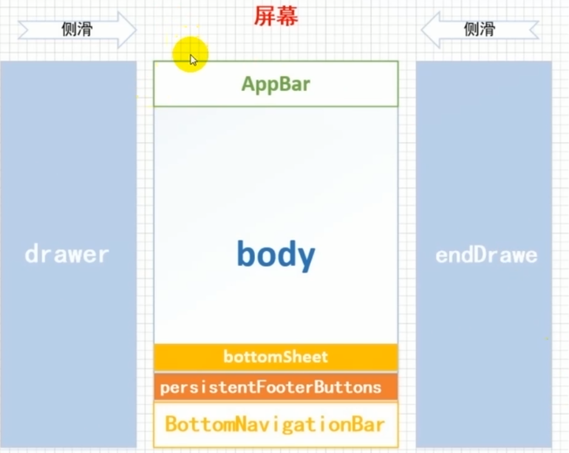
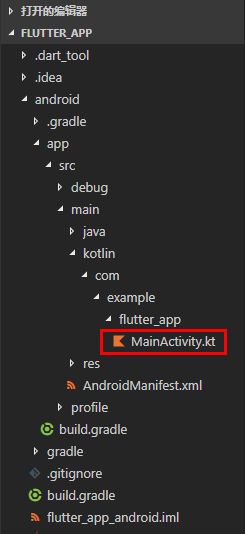

# Dart

## 变量

```js
var name = 1  //可重复赋值

final name = new Date.now() //不可重复赋值,可为表达式

const name = 1 //不可重复赋值,常量
final a = const [] //创建常量值端构造函数

String name = '1' //指定类型
```

## 数据类型

```dart
Number 
    int doulbe	 // 类型 num
String	
Boolean
List (也被称为 Array)
Map //对象
Set	//无序数组 唯一值
Rune (用于在字符串中表示 Unicode 字符)
Symbol
```

- int

  ```
  移位<< >>  按位与^ 按位或|
  assert((3 << 1) == 6); // 0011 << 1 == 0110
  assert((3 >> 1) == 1); // 0011 >> 1 == 0001
  assert((3 | 4) == 7); // 0011 | 0100 == 0111
  ```

- String

  ```dart
  $表达式
  var name = 'walle'
  print('abc$name'); // abcwalle
  
  + 拼接
  ''' ''', """ """ 保持换行空格样式;
  
  ```

- Boolean

  ```dart
  // 检查空字符串。
  var fullName = '';
  assert(fullName.isEmpty);
  
  // 检查 0 值。
  var hitPoints = 0;
  assert(hitPoints <= 0);
  
  // 检查 null 值。
  var unicorn;
  assert(unicorn == null);
  
  // 检查 NaN 。
  var iMeantToDoThis = 0 / 0;
  assert(iMeantToDoThis.isNaN);
  ```

- Set

  ```dart
  var names = <String>{};
  // Set<String> names = {}; // 这样也是可以的。
  // var names = {}; // 这样会创建一个 Map ，而不是 Set 。
  ```

- Map

  ```dart
  var gifts = Map();
  var gifts =new Map(); //new 可选
  gifts['first'] = 'partridge';
  常量声明
  final constantMap = const {
    2: 'helium',
    10: 'neon',
    18: 'argon',
  };
  ```

  

## 数据转换

```dart
String --> int
var one = int.parse('1')

String --> double
var one = double.parse('1')

// int -> String
String oneAsString = 1.toString();
assert(oneAsString == '1');

// double -> String
String piAsString = 3.14159.toStringAsFixed(2);
assert(piAsString == '3.14');
```

## 函数

```dart
bool isNoble(int atomicNumber) {
  return _nobleGases[atomicNumber] != null;
}

isNoble(atomicNumber) {
  return _nobleGases[atomicNumber] != null;
}

bool isNoble(int atomicNumber) => _nobleGases[atomicNumber] != null;
```

- 参数

  ```dart
  可选参数
  String say(String from, String msg, [String device]) {
    var result = '$from says $msg';
    if (device != null) {
      result = '$result with a $device';
    }
    return result;
  }
  ```

  ```dart
  默认参数
  void enableFlags({bool bold = false, bool hidden = false}) {...}
  ```

  ```dart
  list map 默认参数
  void doStuff(
      {List<int> list = const [1, 2, 3],
      Map<String, String> gifts = const {
        'first': 'paper',
        'second': 'cotton',
        'third': 'leather'
      }}) {
    print('list:  $list');
    print('gifts: $gifts');
  }
  ```

  

## 类

封装 继承 多态

```dart
class Person {
  // 变量
  String name = 'walle';
  int age = 13;
  // new 时传入参数
  Person(this.name, this.age); //与初始化二存一
  // 命名构造函数 且传入参数
  Person.now(a, b) {
    this.age = a;
    this.name = b;
  }
  // 初始化
  // Person()
  //     : age = 18,
  //       name = "walle" {
  //   print(age);
  // }
  // 私有属性,方法 为文件时有效
  int _flag;
  void _run() {
    print(this._flag);
  }
  // 静态
  static int age2 = 200; //调用 静态不用 this ;age2外部可访问
  static void func(){} //无法访问非静态方法和属性
  // get 类似计算属性
  String get reutnName {
    return this.name;
  }

  // set
  set setAge(num b) {
    this.age = b;
  }

  void fun(a) {
    print("${age}:${this.name}+$a");
  }
}

main() {
  var p1 = new Person('w', 10);
  var age2 = Person.age2; //访问静态
  var func = Person.func(); //访问静态方法
  var p2 = new Person.now(1, 's');
  p1.fun(22);
  print(p1.name);
}

```

```dart
? 	条件运算符 //判断类属性,方法是否为空 安全操作
as	类型转换  //(p as className).name
is	类型判断  //
..	级联操作
	Person p1 new Person()
	p1..name="walle"
	  ..age=30;
```

### 继承

```dart
class Web extends Person{
   String sex;
  // 给Person 传参数
  //Web(String name, int age) : super(name, age);
Web(String name, int age, String sex) : super(name, age){
    this.sex = sex;
  }
  //重写父类属性
  @override
  void fun(a){
    super.age; //调用父类属性 方法
  }
}
```

### 多态 - 抽象类 方法

```dart
多态:
	每个子类有不同的表现;

//子类必须定义抽象方法;
abstract class Doer { //抽象类 不能实例化,只有子类可以实例化
  // 定义实例变量和方法 ...

  void doSomething(); // 定义一个抽象方法。
  void func(){
      //抽象类的方法
  }
}

class EffectiveDoer extends Doer {
  void doSomething() {
    // 提供方法实现，所以这里的方法就不是抽象方法了...
  }
}
```

接口

```dart
class Impostor implements Person {
  get _name => '';
	
  String greet(String who) => 'Hi $who. Do you know who I am?';
}
```

------


# flutter

hello world

```dart
import 'package:flutter/material.dart';

void main() => runApp(new MyApp());

class MyApp extends StatelessWidget {
  @override
  Widget build(BuildContext context) {
    return new MaterialApp(
      title: 'Welcome to Flutter',
      home: new Scaffold(
        appBar: new AppBar(
          title: new Text('Welcome to Flutter'),
        ),
        body: new Center(
          child: new Text('Hello World'),
        ),
      ),
    );
  }
}
```

命令

```
flutter ctrate 项目名称  // 创建项目


flutter packages get // 类似 npm i
flutter run			// 运行
```

## 生命周期

```
上图就是 State 的生命周期图。

StatefulWidget.createState()

Framework 调用会通过调用 StatefulWidget.createState() 来创建一个 State。

initState()

新创建的 State 会和一个 BuildContext 产生关联，此时认为 State 已经被安装好了，initState() 函数将会被调用。

通常，我们可以重写这个函数，进行初始化操作。

didChangeDependencies()

在 initState() 调用结束后，这个函数会被调用。

事实上，当 State 对象的依赖关系发生变化时，这个函数总会被 Framework 调用。

build()

经过以上步骤，系统认为一个 State 已经准备好了，就会调用 build() 来构建视图。

我们需要在这个函数中，返回一个 Widget。

deactivate()

当 State 被暂时从视图树中移除时，会调用这个函数。

页面切换时，也会调用它，因为此时 State 在视图树中的位置发生了变化，需要先暂时移除后添加。

⚠️注意，重写的时候必须要调用 super.deactivate()。

dispose()

当 State 被永久的从视图树中移除，Framework 会调用该函数。

在销毁前触发，我们可以在这里进行最终的资源释放。

在调用这个函数之前，总会先调用 deactivate()。

⚠️注意，重写的时候必须要调用 super.dispose()。

didUpdateWidget(covariant T oldWidget)

当 widget 的配置发生变化时，会调用这个函数。

比如，Hot-reload 的时候就会调用这个函数。

这个函数调用后，会调用 build()。

setState()

当我需要更新 State 的视图时，需要手动调用这个函数，它会触发 build() 。
```

```
当sestate 执行时会触发 build;

initstate

build

dispose


```

## 事件event

```dart

gesturedetector

点击:
	onTapDown: 		用户手指按下
    onTapUp: 		手指抬起
	onTap: 			点击完成
    onTapCancel: 	按下过程取消

双击:
	onDoubleTap: 	双击

长按:
	onLongPress:	在屏幕上保持一段时间

纵向拖拽:
	onVerticalDragStart: 	接触并开始纵向移动
    onVerticalDragUpdate:	移动
	onVerticalDragEnd:		结束


横向拖拽:
	onHorizontlDragStart: 	接触并开始纵向移动
    onHorizontlDragUpdate:	移动
	onHorizontlDragEnd:		结束
        
globalPosition  获取相对屏幕位置
localPosition	相对于Widget位置信息
```

```dart
body:Listener(
		onPointerDown:(event){
			event.position		// 屏幕中位置
			event.localPosition // 在组件中的位置
		}
	)
指针事件:
	onPointerDownEvent
    onPointerMoveEvent
    onPoiinterUpEvent 
    onPointerCancelEvent

```

```dart
Inkwell 和 GestureDetector区别

  new InkWell(
    child: new Text("Click me!"),
    onTap: () {
      // 单击
    },
    onDoubleTap: () {
      // 双击
    },
    onLongPress: () {
      // 长按
    }
  );
  
  
  GestureDetector: 
  		是无状态组件 
  		无水波纹

  Inkwell:
  		水波纹
  		widget
            
可自定义水波纹:
	Ink(
        highlightColor: Colors.purple[800], //颜色在最上层 会覆盖
    	splashColor:Color.red
    )
```

事件传递

```dart
event_bus //第三方库
```


## StatelessWidget

## StatefullWidget

```dart
StatelessWidget //无状态
StatefullWidget //可变状态
```

## MaterialApp

https://api.flutter.dev/flutter/material/MaterialApp-class.html

```dart
MaterialApp({
  Key key,
  this.title = '', // 设备用于为用户识别应用程序的单行描述
  this.home, // 应用程序默认路由的小部件,用来定义当前应用打开的时候，所显示的界面
  this.color, // 在操作系统界面中应用程序使用的主色。
  this.theme, // 应用程序小部件使用的颜色。
  this.routes = const <String, WidgetBuilder>{}, // 应用程序的顶级路由表
  this.navigatorKey, // 在构建导航器时使用的键。
  this.initialRoute, // 如果构建了导航器，则显示的第一个路由的名称
  this.onGenerateRoute, // 应用程序导航到指定路由时使用的路由生成器回调
  this.onUnknownRoute, // 当 onGenerateRoute 无法生成路由(initialRoute除外)时调用
  this.navigatorObservers = const <NavigatorObserver>[], // 为该应用程序创建的导航器的观察者列表
  this.builder, // 用于在导航器上面插入小部件，但在由WidgetsApp小部件创建的其他小部件下面插入小部件，或用于完全替换导航器
  this.onGenerateTitle, // 如果非空，则调用此回调函数来生成应用程序的标题字符串，否则使用标题。
  this.locale, // 此应用程序本地化小部件的初始区域设置基于此值。
  this.localizationsDelegates, // 这个应用程序本地化小部件的委托。
  this.localeListResolutionCallback, // 这个回调负责在应用程序启动时以及用户更改设备的区域设置时选择应用程序的区域设置。
  this.localeResolutionCallback, // 
  this.supportedLocales = const <Locale>[Locale('en', 'US')], // 此应用程序已本地化的地区列表 
  this.debugShowMaterialGrid = false, // 打开绘制基线网格材质应用程序的网格纸覆盖
  this.showPerformanceOverlay = false, // 打开性能叠加
  this.checkerboardRasterCacheImages = false, // 打开栅格缓存图像的棋盘格
  this.checkerboardOffscreenLayers = false, // 打开渲染到屏幕外位图的图层的棋盘格
  this.showSemanticsDebugger = false, // 打开显示框架报告的可访问性信息的覆盖
  this.debugShowCheckedModeBanner = true, // 在选中模式下打开一个小的“DEBUG”横幅，表示应用程序处于选中模式
}) 
```

```dart
import 'package:flutter/material.dart';

void main() => runApp(new MyApp());

class MyApp extends StatelessWidget {
  @override
  Widget build(BuildContext context) {
    return new MaterialApp(
      title: 'Welcome to Flutter',
      theme:new ThemeData(
      	primaryColor: Colors.
      ),
    );
  }
}
```

| key   | type      | detail                       |
| ----- | --------- | ---------------------------- |
| title | String    | 为用户识别应用程序的单行描述 |
| theme | ThemeData |                              |
|       |           |                              |

ThemeData

```dart
factory ThemeData({
  Brightness brightness, // 应用整体主题的亮度。用于按钮之类的小部件，以确定在不使用主色或强调色时选择什么颜色。
  MaterialColor primarySwatch,// 定义一个单一的颜色以及十个色度的色块。
  Color primaryColor, // 应用程序主要部分的背景颜色(toolbars、tab bars 等)
  Brightness primaryColorBrightness, // primaryColor的亮度。用于确定文本的颜色和放置在主颜色之上的图标(例如工具栏文本)。
  Color primaryColorLight, // primaryColor的浅色版
  Color primaryColorDark, // primaryColor的深色版
  Color accentColor, // 小部件的前景色(旋钮、文本、覆盖边缘效果等)。
  Brightness accentColorBrightness, // accentColor的亮度。
  Color canvasColor, //  MaterialType.canvas 的默认颜色
  Color scaffoldBackgroundColor, // Scaffold的默认颜色。典型Material应用程序或应用程序内页面的背景颜色。
  Color bottomAppBarColor, // BottomAppBar的默认颜色
  Color cardColor, // Card的颜色
  Color dividerColor, // Divider和PopupMenuDivider的颜色，也用于ListTile之间、DataTable的行之间等。
  Color highlightColor, // 选中在泼墨动画期间使用的突出显示颜色，或用于指示菜单中的项。
  Color splashColor,  // 墨水飞溅的颜色。InkWell
  InteractiveInkFeatureFactory splashFactory, // 定义由InkWell和InkResponse反应产生的墨溅的外观。
  Color selectedRowColor, // 用于突出显示选定行的颜色。
  Color unselectedWidgetColor, // 用于处于非活动(但已启用)状态的小部件的颜色。例如，未选中的复选框。通常与accentColor形成对比。也看到disabledColor。
  Color disabledColor, // 禁用状态下部件的颜色，无论其当前状态如何。例如，一个禁用的复选框(可以选中或未选中)。
  Color buttonColor, // RaisedButton按钮中使用的Material 的默认填充颜色。
  ButtonThemeData buttonTheme, // 定义按钮部件的默认配置，如RaisedButton和FlatButton。
  Color secondaryHeaderColor, // 选定行时PaginatedDataTable标题的颜色。
  Color textSelectionColor, // 文本框中文本选择的颜色，如TextField
  Color cursorColor, // 文本框中光标的颜色，如TextField
  Color textSelectionHandleColor,  // 用于调整当前选定的文本部分的句柄的颜色。
  Color backgroundColor, // 与主色形成对比的颜色，例如用作进度条的剩余部分。
  Color dialogBackgroundColor, // Dialog 元素的背景颜色
  Color indicatorColor, // 选项卡中选定的选项卡指示器的颜色。
  Color hintColor, // 用于提示文本或占位符文本的颜色，例如在TextField中。
  Color errorColor, // 用于输入验证错误的颜色，例如在TextField中
  Color toggleableActiveColor, // 用于突出显示Switch、Radio和Checkbox等可切换小部件的活动状态的颜色。
  String fontFamily, // 文本字体
  TextTheme textTheme, // 文本的颜色与卡片和画布的颜色形成对比。
  TextTheme primaryTextTheme, // 与primaryColor形成对比的文本主题
  TextTheme accentTextTheme, // 与accentColor形成对比的文本主题。
  InputDecorationTheme inputDecorationTheme, // 基于这个主题的 InputDecorator、TextField和TextFormField的默认InputDecoration值。
  IconThemeData iconTheme, // 与卡片和画布颜色形成对比的图标主题
  IconThemeData primaryIconTheme, // 与primaryColor形成对比的图标主题
  IconThemeData accentIconTheme, // 与accentColor形成对比的图标主题。
  SliderThemeData sliderTheme,  // 用于呈现Slider的颜色和形状
  TabBarTheme tabBarTheme, // 用于自定义选项卡栏指示器的大小、形状和颜色的主题。
  CardTheme cardTheme, // Card的颜色和样式
  ChipThemeData chipTheme, // Chip的颜色和样式
  TargetPlatform platform, 
  MaterialTapTargetSize materialTapTargetSize, // 配置某些Material部件的命中测试大小
  PageTransitionsTheme pageTransitionsTheme, 
  AppBarTheme appBarTheme, // 用于自定义Appbar的颜色、高度、亮度、iconTheme和textTheme的主题。
  BottomAppBarTheme bottomAppBarTheme, // 自定义BottomAppBar的形状、高度和颜色的主题。
  ColorScheme colorScheme, // 拥有13种颜色，可用于配置大多数组件的颜色。
  DialogTheme dialogTheme, // 自定义Dialog的主题形状
  Typography typography, // 用于配置TextTheme、primaryTextTheme和accentTextTheme的颜色和几何TextTheme值。
  CupertinoThemeData cupertinoOverrideTheme 
})
```


## Scaffold



## 底部导航栏

```dart

import 'package:flutter/material.dart';

class BottomBar extends StatefulWidget {
  @override
  BottomBarState createState() => BottomBarState();
}

class BottomBarState extends State<BottomBar> {
  @override
  Widget build(BuildContext context) {
    return BottomNavigationBar(
      items: [
        BottomNavigationBarItem(
            icon: Icon(
              Icons.home,
              color: Colors.blue,
            ),
            title: Text('HOME', style: TextStyle(color: Colors.blue))),
        BottomNavigationBarItem(
            icon: Icon(
              Icons.home,
              color: Colors.blue,
            ),
            title: Text('HOME', style: TextStyle(color: Colors.blue)))
      ],
    );
  }
}

mixin StateBottomBar {}

```

```
import 'package:flutter/material.dart';

import './pages/main_BottomBar/main_BottomBar.dart';

void main() => runApp(new MyApp());

class MyApp extends StatelessWidget {
  @override
  Widget build(BuildContext context) {
    return new MaterialApp(
      title: 'Welcome to Flutter',
      home: new Scaffold(
        appBar: new AppBar(
          title: new Text('Welcome to Flutster'),
        ),
        body: new Center(
          // child: new Text(
          //   'Hello Worlds',
          //   textDirection: TextDirection.ltr,
          //   style: TextStyle(
          //       fontSize: 14.0, color: Color.fromRGBO(255, 122, 122, .5)),
          // ),
          heightFactor: 1,
          widthFactor: 1,
          // child: new HomeContent(),
          // child: new ImageCom(),
          child: ListView(
            children: <Widget>[
              ListTile(
                title: Text('title'),
                subtitle: Text('data'),
                trailing: Text('trailing'),
                isThreeLine: true,
                dense: true,
                onLongPress: () {
                  print('222');
                },
              ),

              TextField(
                  decoration: InputDecoration(
                      hintText: 'dddd',
                      border: OutlineInputBorder(),
                      labelText: '用户')),
              SizedBox(height: 20),
              TextField(
                  obscureText: true,
                  decoration: InputDecoration(
                      hintText: 'dddd',
                      border: OutlineInputBorder(),
                      labelText: '用户')),

              // MyInput()
            ],
          ),
          // child: new PaddingTestRoute(),
        ),
       bottomNavigationBar:BottomBar(),
      ),
    );
  }
}
```


## 布局

### container

绘制顺序

1. transform
2. decoration
3. child
4. foregroundDecoration

```dart
class HomeContent extends StatelessWidget {
  @override
  Widget build(BuildContext context) {
    return Container(
      child: Text('ss'),
      height: 200.0,
      width: 300.0,
      padding:EdgeInsets.all(20.0),
      alignment:Alignment.centerRight,
      decoration: BoxDecoration(
          color: Colors.yellow,
          border: Border.all(
            width: 1.0,
            color: Colors.blue,
          )),
    );
  }
}
```

|      |      |      |
| ---- | ---- | ---- |
|      |      |      |
|      |      |      |
|      |      |      |


### Align

```dart
const Align({
    Key key,
    this.alignment = Alignment.center,
    this.widthFactor,
    this.heightFactor,
    Widget child,
})
```

### Row

```dart
Row({
    Key key,
    // 主轴 水平方向
    MainAxisAlignment mainAxisAlignment = MainAxisAlignment.start,
    MainAxisSize mainAxisSize = MainAxisSize.max,
    // 主轴 垂直方向
    CrossAxisAlignment crossAxisAlignment = CrossAxisAlignment.center,
    TextDirection textDirection,
    VerticalDirection verticalDirection = VerticalDirection.down,
    TextBaseline textBaseline,
    List<Widget> children = const <Widget>[],
  })
```

### Column

```dart
 Column({
    Key key,
     // 主轴 垂直方向
    MainAxisAlignment mainAxisAlignment = MainAxisAlignment.start,
     // 盒子 max=block min=aline
    MainAxisSize mainAxisSize = MainAxisSize.max,
     // 副轴	水平方向
    CrossAxisAlignment crossAxisAlignment = CrossAxisAlignment.center,
    TextDirection textDirection,
     // item 排序方式 
    VerticalDirection verticalDirection = VerticalDirection.down,
    TextBaseline textBaseline,
    List<Widget> children = const <Widget>[],
  })
```

### Expanded

```dart
body:Column(
  mainAxisAlignment: MainAxisAlignment.center,
  children: <Widget>[
    Center(child:Text('I am JSPang')),
      // 当前元素 最大占据
    Expanded(child:Center(child:Text('my website is jspang.com'))),
    Center(child:Text('I love coding'))
  ],
)
```

### CircleAvatar

```dart
  const CircleAvatar({
    Key key,
    this.child,
    this.backgroundColor,
    this.backgroundImage,
    this.onBackgroundImageError,
    this.foregroundColor,
    this.radius,
    this.minRadius,
    this.maxRadius,
  })
```

### Stack

```dart
 Stack({
    Key key,
    this.alignment = AlignmentDirectional.topStart,
    this.textDirection,
    this.fit = StackFit.loose,
    this.overflow = Overflow.clip,
    List<Widget> children = const <Widget>[],
  })
     
     
var stack = new Stack(

        children: <Widget>[
          new CircleAvatar(
            backgroundImage: new NetworkImage('http://jspang.com/static//myimg/blogtouxiang.jpg'),
            radius: 100.0,
          ),
          new Positioned(
            top:10.0,
            left:10.0,
            child: new Text('JSPang.com'),
          ),
          new Positioned( // 定位
            bottom:10.0,
            right:10.0,
            child: new Text('技术胖'),
          )
        ],
      );
```

sliverList

sliverAppBar

pageview.builder 有懒加载

## 流式布局

Wrap

|                    |      |      |
| ------------------ | ---- | ---- |
| direction          | axis |      |
| alignment          |      |      |
| runSpacing         |      |      |
| runAlignment       |      |      |
| crossAxisAlignment |      |      |
| VerticalDirection  |      |      |
| textDirection      |      |      |
| children           |      |      |


### 辅助布局

#### center

```

```

|      |      |      |
| ---- | ---- | ---- |
|      |      |      |
|      |      |      |
|      |      |      |

#### SizeBox


#### AspectRatio


#### FractionallySizedBox

#### card

## 辅助样式

color

```dart
Color _bottombarcolor = Color(0xFFF63515);
```


### padding

```dart
	用法:
Padding(
	padding: const EdgeInsets.all(10.0),
	child: Text("title")
)

    属性:
padding:
	EdgeInsets.all(10.0); //全部 padding:
	EdgeInsets.only(	//padding-top:
    	left:20.0,
        top:20.0,
        right:20.0,
        bottom:20.0,
    );
	EdgeInsets.symmetric(
    	vertical:100.0, //垂直方向 padding-top/bottom 100
        horizontal:100.0  //水平方向
    );
	EdgeInsets.fromLTRB(
    	left:10.0,
        top:10.0,
        right:10.0,
        bottom:10.0,
    )
```

### Alignment

```dart
const Align({
    Key key,
    this.alignment = Alignment.center,
    this.widthFactor,
    this.heightFactor,
    Widget child
  })
    


alignment: 
	Alignment.center,
	Alignment.topLeft,
	Alignment.topCenter,
	Alignment.topRight,
	Alignment.centerLeft,
	Alignment(x,y), //中心为(0,0) (1,1)为右下角
```

### textDirection

```dart
// 文字排列方式
textDirection:
	TextDirection.ltr;
	TextDirection.rtl;
```

### BoxFit

```dart
fit:
	BoxFit.fit 			//全图显示 充满父容器
	BoxFit.contain		//全图显示 显示原比例 可能会有空隙
	BoxFit.cover		//显示可能拉伸，可能裁切，充满
	BoxFit.fitWidth		//宽度充满 会拉伸
	BoxFit.fitHeight	//高度充满
	BoxFit.scaleDown	//不允许显示超过源图片大小，可小不可大
```

### Icon

```dart
Icon(
   Icons.search,
   color: Color(0xffcccccc),
   size:18.0,
),
```

BoxDecoration

```
gradient:LinearGradient() //.渐变
```


## image

- Image.asset 本地

  ```dart
   Image.asset(
      String name, {
      Key key,
      AssetBundle bundle,
      this.frameBuilder,
      this.errorBuilder,
      this.semanticLabel,
      this.excludeFromSemantics = false,
      double scale,
      this.width,
      this.height,
      this.color,
      this.colorBlendMode,
      this.fit,
          |-BoxFit.cover //不变形
      this.alignment = Alignment.center,
      this.repeat = ImageRepeat.noRepeat,
      this.centerSlice,
      this.matchTextDirection = false,
      this.gaplessPlayback = false,
      String package,
      this.filterQuality = FilterQuality.low,
      int cacheWidth,
      int cacheHeight,
    })
  ```

  ```dart
  lib同级目录下 创建images文件
  
  |-images
  	|-2.0x
  	|-3.0x
  	|-a.png
  	
  new Image.asset('images/logo.png')
      
  
  ```

  ```
   pubspec.yaml 
   
  flutter:
  
    # The following line ensures that the Material Icons font is
    # included with your application, so that you can use the icons in
    # the material Icons class.
    uses-material-design: true
    assets:
      - images/logo.png
      - images/2.0x/logo.png
      - images/3.0x/logo.png
  ```

  

- Image.network 网路

  ```dart
  new Image.network ('https://test.jpg'))
  ```

- Image.file

  ```dart
  加载本地图片
  new Image.file(new File('/storage/xxx/xxx/test.jpg'))
  ```

  

## form

```dart

class MyStatefulWidget extends StatefulWidget {
  MyStatefulWidget({Key key}) : super(key: key);
  @override
  _MyStatefulWidgetState createState() => _MyStatefulWidgetState();
}

class _MyStatefulWidgetState extends State<MyStatefulWidget> {
  final _formKey = GlobalKey<FormState>();
  var userName = new TextEditingController(); // 声明

  @override
  void initState() {
    super.initState();
    userName.text = '22220';
  }
    var flag = true;
  @override
  Widget build(BuildContext context) {
    
    return Form(
      key: _formKey,
      child: Column(
        crossAxisAlignment: CrossAxisAlignment.start,
        children: <Widget>[
          TextFormField(
            
            decoration: const InputDecoration(
              hintText: 'Enter your email',
            ),
            validator: (value) {
              if (value.isEmpty) {
                return 'Please enter some text';
              }
              return null;
            },
            controller: userName, //绑定
            onChanged: (value){
              print('$value');
              print(userName.text); // 双向绑定
            },
          ),
          Padding(
            padding: const EdgeInsets.symmetric(vertical: 16.0),
            child: RaisedButton(
              onPressed: () {
                // Validate will return true if the form is valid, or false if
                // the form is invalid.
                if (_formKey.currentState.validate()) {
                  // Process data.
                  print('sss');
                }
              },
              child: Text('Submit'),
            ),
          ),
             Checkbox(value:this.flag, onChanged: (value){
            setState(() {
              this.flag = value;
              print(!value);
            });
          })
        ],
      ),
    );
  }
}

```

### input

```dart
const TextField({
    Key key,
    this.controller,    //编辑框的控制器，跟文本框的交互一般都通过该属性完成，如果不创建的话默认会自动创建
    this.focusNode,  //用于管理焦点
    this.decoration = const InputDecoration(),   //输入框的装饰器，用来修改外观
    TextInputType keyboardType,   //设置输入类型，不同的输入类型键盘不一样
    this.textInputAction,   //用于控制键盘动作（一般位于右下角，默认是完成）
    this.textCapitalization = TextCapitalization.none,
    this.style,    //输入的文本样式
    this.textAlign = TextAlign.start,   //输入的文本位置
    this.textDirection,    //输入的文字排列方向，一般不会修改这个属性
    this.autofocus = false,   //是否自动获取焦点
    this.obscureText = false,   //是否隐藏输入的文字，一般用在密码输入框中
    this.autocorrect = true,   //是否自动校验
    this.maxLines = 1,   //最大行
    this.maxLength,   //能输入的最大字符个数
    this.maxLengthEnforced = true,  //配合maxLength一起使用，在达到最大长度时是否阻止输入
    this.onChanged,  //输入文本发生变化时的回调
    this.onEditingComplete,   //点击键盘完成按钮时触发的回调，该回调没有参数，(){}
    this.onSubmitted,  //同样是点击键盘完成按钮时触发的回调，该回调有参数，参数即为当前输入框中的值。(String){}
    this.inputFormatters,   //对输入文本的校验
    this.enabled,    //输入框是否可用
    this.cursorWidth = 2.0,  //光标的宽度
    this.cursorRadius,  //光标的圆角
    this.cursorColor,  //光标的颜色
    this.keyboardAppearance,
    this.scrollPadding = const EdgeInsets.all(20.0),
    this.dragStartBehavior = DragStartBehavior.down,
    this.enableInteractiveSelection,
    this.onTap,    //点击输入框时的回调(){}
    this.buildCounter,
  })

```

checkbox

```
RadioListTile(
              value: 1,
              onChanged: (v) {
                setState(() {
                  this.sex = v;
                });
              },
              groupValue: this.sex,
            ),
```

```
  RadioListTile(
            groupValue: this.sex,
            onChanged: (value) {
              print(value);
              setState(() {
                this.sex = value;
              });
            },
            value: 1,
            title: Text('sss'),
          ),
```

# routes

MaterialPageRoute

`MaterialPageRoute`继承自`PageRoute`类，`PageRoute`类是一个抽象类，表示占有整个屏幕空间的一个模态路由页面，它还定义了路由构建及切换时过渡动画的相关接口及属性。`MaterialPageRoute` 是Material组件库提供的组件，它可以针对不同平台，实现与平台页面切换动画风格一致的路由切换动画：

```
  MaterialPageRoute({
    WidgetBuilder builder,
    RouteSettings settings,
    bool maintainState = true,
    bool fullscreenDialog = false, //返回按键变X
  });
 
```

- `builder` 是一个WidgetBuilder类型的回调函数，它的作用是构建路由页面的具体内容，返回值是一个widget。我们通常要实现此回调，返回新路由的实例。
- `settings` 包含路由的配置信息，如路由名称、是否初始路由（首页）。
- `maintainState`：默认情况下，当入栈一个新路由时，原来的路由仍然会被保存在内存中，如果想在路由没用的时候释放其所占用的所有资源，可以设置`maintainState`为false。
- `fullscreenDialog`表示新的路由页面是否是一个全屏的模态对话框，在iOS中，如果`fullscreenDialog`为`true`，新页面将会从屏幕底部滑入（而不是水平方向）。

普通路由:

```dart
import '../home/HomeTest.dart';

//进入
navigattor.of(context).push(MaterialPageRoute(
	builder:(context){
		return HomeTest()
	}
))
//进入    
 Navigator.push(
          context,
          MaterialPageRoute(builder: (context) {
            return HomeTest();
          }),
        );
//返回
 Navigator.of(context).pop();

Navigator.of().pushNamed('/home') //命名路由
```

普通路由传值:

```dart
 Navigator.push(
          context,
          MaterialPageRoute(
            builder: (context) {
              return HomeTest(title:'wo');
            },
          ),
        ); // 传值

class HomeTest extends StatefulWidget {
  HomeTest({Key key, this.title}) : super(key: key);
  final String title; //接收
  @override
  _HomeTestState createState() => _HomeTestState();
}

class _HomeTestState extends State<HomeTest> {
  @override
  Widget build(BuildContext context) {
    return Scaffold(
      appBar: AppBar(
        title:Text(widget.title), // 赋值
      ),
      body: Text('data'),
    );
  }
}
```

命名路由:

```dart
申明:
main.dart
import 'package:flutter/material.dart';
import './routers/router.dart';
import './home/HomeTest.dart';
    void main() {
  runApp(MyApp());
}

class MyApp extends StatelessWidget {

  @override
  Widget build(BuildContext context) {
    return MaterialApp(
      routes:{
        '/home':(context)=>HomeTest(), //申明 全局引用
      },
      initialRoute: "/",
      onGenerateRoute: onGenerateRoute,
    );
  }
};

页面调用:
  Navigator.pushNamed(context, '/home',);
```

动态图命名路由传值:

```
 Navigator.pushNamed(context, '/HomeTest',arguments: {'title':'4444'}); 传参数;
 
```

```
import 'package:flutter/material.dart';
import '../Tabs/Tabs.dart'; //配置路由
import '../home/HomeTest.dart';
动态路由配置:
final routes = {
  '/': (context) => Tabs(),
  '/HomeTest': (context, {arguments}) => HomeTest(arguments: arguments),
};


// ignore: top_level_function_literal_block
var onGenerateRoute = (RouteSettings settings) {
  // 统一处理
  final String name = settings.name;
  final Function pageContentBuilder = routes[name];

  if (pageContentBuilder != null) {
    if (settings.arguments != null) {
      print(name);
      final Route route = MaterialPageRoute(
          builder: (context) =>
              pageContentBuilder(context, arguments: settings.arguments));
      return route;
    } else {
      final Route route =
          MaterialPageRoute(builder: (context) => pageContentBuilder(context));
      return route;
    }
  }
};

```

```dart
import 'package:flutter/material.dart';

class HomeTest extends StatefulWidget {
  final arguments; // 接收
  HomeTest({Key key, this.arguments}) : super(key: key);

  @override
  _HomeTestState createState() => _HomeTestState();
}

class _HomeTestState extends State<HomeTest> {
  @override
  Widget build(BuildContext context) {
    return Scaffold(
      appBar: AppBar(
        title: Text(widget.arguments['title']), //使用
      ),
      body: FloatingActionButton(
        child: Text('2'),
        onPressed: () {
          Navigator.of(context).pop();
        },
      ),
    );
  }
}

```

页面返回返回参数:

```dart
 Navigator.of(context).pop('返回'); // 传参

写法一:
Navigator.push(
          context,
          MaterialPageRoute(
            builder: (context) {
              return HomeTest(arguments:{'title':'mytitle'});
            },
            // fullscreenDialog: true,
          ),
        ).then((value){
          print('222222');
          print(value);
        });
写法二:
Future future = Navigator.pushNamed(
          context,
          '/HomeTest',
          arguments: {'title': '上个页面的title'},
        );
        future.then((value) {
          print('value--------');
          print(value);
        });
写法三:    
 Navigator.of(context).pushNamed(
          '/HomeTest',
          arguments: {'title': '上个页面的title'},
        ).then((value) {
          print(value);
          print('999');
        });

注:点击顶部返回,手机手势返回;不能捕获参数;

```

钩子

```
onGenerateRoute(settings)

onUnkonwnRoute  //不存在路由
```

例

```
routes:{
	'/home':(context)=>About()
},
initialRoute:'/', //默认路径
onGenerateRoute:(settings){
	if(settings.name == '/home'){
		return MaterialPageRoute(
			builder:(context)=>HOme(settings.arguments)
		);
	}
},
onUnkonwnRoute(){
	return MaterialPageRoute(
			builder:(context)=>Eer(settings.arguments)
		);
}

```

```dart
import 'package:flutter/material.dart';
import '../Tabs/Tabs.dart'; //配置路由

final routes = {
  '/': (context) => Tabs(),
}; //固定写法

var onGenerateRoute = (RouteSettings settings) {
  // 统一处理
  final String name = settings.name;
  final Function pageContentBuilder = routes[name];
  if (pageContentBuilder != null) {
    if (settings.arguments != null) {
      final Route route = MaterialPageRoute(
          builder: (context) =>
              pageContentBuilder(context, arguments: settings.arguments));
      return route;
    } else {
      final Route route =
          MaterialPageRoute(builder: (context) => pageContentBuilder(context));
      return route;
    }
  }
};


```


# bottomNavigationBar

```dart
import 'package:flutter/material.dart';
import './Category.dart';
import './Home.dart';
import './My.dart';
import './User.dart';

class Tabs extends StatefulWidget {
  Tabs({Key key, this.title}) : super(key: key);
  final String title;
  @override
  _TabsState createState() => _TabsState();
}

class _TabsState extends State<Tabs> {
  int _currentIndex = 0;

  List _TabsPages = [Home(), Category(), My(), User()];

  @override
  Widget build(BuildContext context) {
    return Scaffold(
      appBar: AppBar(
        title: Text(widget.title),
      ),
      body: _TabsPages[this._currentIndex],
      bottomNavigationBar: BottomNavigationBar(
          currentIndex: this._currentIndex,
          onTap: (index) {
            setState(() {
              this._currentIndex = index;
            });
          },
          type: BottomNavigationBarType.fixed, // 多个底部导航栏需要配置
          items: [
            BottomNavigationBarItem(
              title: Text("首页"),
              icon: Icon(Icons.home),
            ),
            BottomNavigationBarItem(
              title: Text("分类"),
              icon: Icon(Icons.category),
            ),
            BottomNavigationBarItem(
              title: Text("购物车"),
              icon: Icon(Icons.shopping_cart),
            ),
            BottomNavigationBarItem(
              title: Text("我的"),
              icon: Icon(Icons.people),
            ),
          ]),
    );
  }
}

```

```dart
main.dart

import 'package:flutter/material.dart';
import "./Tabs/Tabs.dart";
void main() {
  runApp(MyApp());
}

class MyApp extends StatelessWidget {
  // This widget is the root of your application.
  @override
  Widget build(BuildContext context) {
    return MaterialApp(
      title: 'Flutter Demo',
      theme: ThemeData(
        primarySwatch: Colors.red,
        visualDensity: VisualDensity.adaptivePlatformDensity,
      ),
      home: Tabs(title: 'walle JD'),
    );
  }
}


```


# 问题

'getAppBarWidget' can't be assigned to the parameter type 'PreferredSizeWidget'.

```dart
import 'package:flutter/material.dart';

class HomeAppBar extends StatelessWidget implements PreferredSizeWidget { //加入 接口PreferredSizeWidget
  @override
  Widget build(BuildContext context) {
    return PreferredSize(
      child: AppBar(
        title: Image.asset('images/jd.png'),
        backgroundColor: Colors.red,
        actions: <Widget>[
          Column(
            mainAxisAlignment: MainAxisAlignment.center,
            children: <Widget>[
              Icon(Icons.crop_free),
              Text('扫一扫', style: TextStyle(fontSize: 6.0))
            ],
          ),
          Padding(padding: EdgeInsetsDirectional.fromSTEB(0, 0, 10, 0)),
          Column(
            mainAxisAlignment: MainAxisAlignment.center,
            children: <Widget>[
              Icon(Icons.sms),
              Text('消息', style: TextStyle(fontSize: 6.0))
            ],
          ),
          Padding(padding: EdgeInsetsDirectional.fromSTEB(0, 0, 20, 0))
        ],
      ),
      preferredSize: Size.fromHeight(44),
    );

    
  }
  // final String name;
  // HomeAppBar({Key key, @required this.name}) :super(key: key);
  @override
  // TODO: implement preferredSize
    Size get preferredSize => getSize();
    
      getSize() {
         return new Size(100.0, 44.0);
      }
}

```

## 去除顶部半透明



```kotlin
package com.example.helloflutter

import io.flutter.embedding.android.FlutterActivity
//---增加部分
import android.os.Build;
import android.os.Bundle;
//----end
class MainActivity: FlutterActivity() {
   //-----增加部分
    //设置状态栏沉浸式透明（修改flutter状态栏黑色半透明为全透明）
override fun onCreate(savedInstanceState: Bundle?) {
    super.onCreate(savedInstanceState);
    if (Build.VERSION.SDK_INT >= Build.VERSION_CODES.LOLLIPOP) {
        window.statusBarColor = 0
    }
}
//---- end
}
```

## flutter_swiper 裁剪border radius

```dart
外层加入:
PhysicalModel(
            color: Colors.transparent,
            borderRadius: BorderRadius.circular(12),
            clipBehavior: Clip.antiAlias,
)
```

# flutter 插件

## 国外论坛

```
https://dev.to/
```


## 工具集

```
https://dev.to/parabeac/5-tools-to-supercharge-your-flutter-development-1m0l
```


## flutter_swiper

地址:https://pub.dev/packages/flutter_swiper

```dart
import 'package:flutter/material.dart';
import 'package:flutter_swiper/flutter_swiper.dart';


class Home extends StatefulWidget {
  Home({Key key, this.title}) : super(key: key);
  final String title;

  @override
  _HomeState createState() => _HomeState();
}

class _HomeState extends State<Home> {
  var title;

  Widget _swiperview() {
    List<String> imgList = [
      "https://zhijia-pro.oss-cn-shenzhen.aliyuncs.com/h5/ad/AI%E9%A3%8E%E6%A0%BCh5.png",
      "https://zhijia-pro.oss-cn-shenzhen.aliyuncs.com/h5/ad/AI%E6%99%BA%E9%80%89%20%28h5%29.png",
      "https://zhijia-pro.oss-cn-shenzhen.aliyuncs.com/h5/ad/0%E5%85%83%E6%90%9E%E5%AE%9A%E8%AE%BE%E8%AE%A1h5.png",
    ];

    return Container(
        // 必须设置宽高 或AspectRatio 设置宽高比
      child: AspectRatio(
        aspectRatio: 540 / 216,
        child: Swiper(
          itemBuilder: (BuildContext context, int index) {
            return new Image.network(
              imgList[index],
              fit: BoxFit.cover,
            );
          },
          itemCount: imgList.length,
          // pagination: new SwiperPagination(),
          pagination: SwiperPagination(
            builder: RectSwiperPaginationBuilder(
              size: Size(20.0, 8.0),
              activeSize: Size(20.0, 8.0),
              activeColor: Colors.white,
              color: Colors.black,
            ),
            alignment: Alignment.bottomCenter,
          ),

          // control: new SwiperControl(),
          autoplay: true,
          loop: true,
          // viewportFraction: 0.8,
          // scale: 0.9,
        ),
      ),
    );
  }

  @override
  Widget build(BuildContext context) {
    return ListView(
      children: [
        _swiperview(),
      ],
    );
  }
}
```

