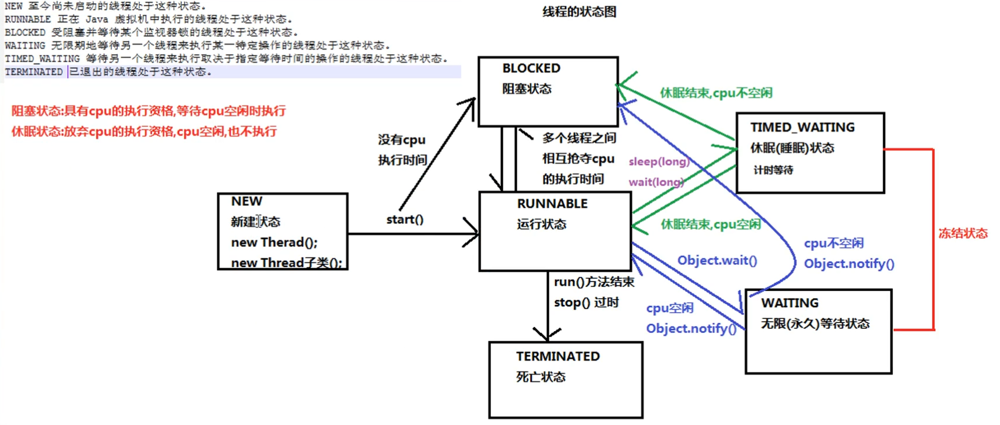

vscode 插件

```java
Java Extension Pack
```

idea 破解

```
https://www.jb51.net/article/204399.htm
```

权限修饰符合

```
private 私有 本类访问
default 同一个包下
protected
public 
```

抽象类定义

```java
public abstract class Stu {
	public abstract void eat();
}

不能直接new;
只能继承,且必须覆盖重写抽象类抽象方法;

public class Child extends Stu {
  @override
  public void  eat(){
        
    }
}
```

接口

```java
public interface Myinterface {
    // public abstract 默认可以省略
    public abstract void  methods();
    
    // 默认方法
    public default void methods1() {
        System.out.println("methods1");
        privmethod();
    }
    // 不能被实现类使用。使用 Myinterface.name;
    public static String name = "inte1111";
    // 9< 私有方法
    private void privmethod (){
        System.out.println("privmethod");
    };
}

// use
public class Intface implements Myinterface {

    @Override
    public void methods() {
        System.out.println("interface");
    }
}
```

接口多继承

```java
pulic interface My extends intf1 , intf2{
	public default void intf1methods1() {
    }
}
抽象方法重复,没关系;
默认方法重复,子接口必须进行重写;并且带着default
```

# 线程

## 创建方式一

```java
public class Demo01 {
	public static void main(String[] args) {
		//创建自定义线程对象
		MyThread mt = new MyThread("新的线程！");
		//开启新线程
		mt.start();
		//在主方法中执行for循环
		for (int i = 0; i < 10; i++) {
			System.out.println("main线程！"+i);
		}
	}
}
```

自定义线程类：

```java
public class MyThread extends Thread {
	//定义指定线程名称的构造方法
	public MyThread(String name) {
		//调用父类的String参数的构造方法，指定线程的名称
		super(name);
	}
	/**
	 * 重写run方法，完成该线程执行的逻辑
	 */
	@Override
	public void run() {
		for (int i = 0; i < 10; i++) {
			System.out.println(getName()+"：正在执行！"+i);
		}
	}
}
```

获取线程名称:

```java
方法一:
MyThread mt = new MyThread("设置线程名称");
构造接收,super;
public MyThread(String name) {
        //调用父类的String参数的构造方法，指定线程的名称
        super(name);
}
方式二:getName();
public class MyThread extends Thread {
    @Override
    public void run() {
        String name = getName();
        System.out.println(name);
    }
}
方式三:
public class MyThread extends Thread {
    @Override
    public void run() {
         Thread t = Thread.currentThread();
        String name = t.getName();
    }
}
```

线程常用方法:

- setName

  ```java
   MyThread mt = new MyThread();
   mt.setName("这是名称");
  ```

  ```java
  构造接收,super;
  public MyThread(String name) {
          //调用父类的String参数的构造方法，指定线程的名称
          super(name);
  }
  ```

- Sleep(int:1000)

  ```java
  try {
      Thread.sleep(1000);
  } catch (InterruptedException e) {
     e.printStackTrace();
  }
  ```

  

## 创建方式二

**Runnable** 接口

```java
public class MyRunnable implements Runnable{
    @Override
    public void run() {
        System.out.println("MyRunnable");
    }
}

main(){
     MyRunnable run = new MyRunnable();
        Thread t = new Thread(run);
        t.start();
}

```

实现Runnable接口比继承hread类所具有的优势：

1. 适合多个相同的程序代码的线程去共享同一个资源。 

2. 可以避免java中的单继承的局限性。 

3. 增加程序的健壮性，实现解耦操作，代码可以被多个线程共享，代码和线程独立。 

4. 线程池只能放入实现Runable或Callable类线程，不能直接放入继承Thread的类。

## 匿名Thread

```java
main(){
	 Thread t = new Thread();
        t.start();
        new Thread(){
            @Override
            public void run(){
                System.out.println("run");
            }
        }.start();

        new Thread(  new Runnable(){
            @Override
            public void run() {
                System.out.println("Runnable");
            }
        }
        ).start();
}
```

## 线程安全

```
若有多个线程同时执行写操作，一般都需要考虑线程同步，
```

## 线程同步

1. 同步代码块:synchronized

   ```java
   public class MyRunnable implements Runnable {
       private int r = 5;
   
       @Override
       public void run() {
           Object obj = new Object();
           while (r > 0) {
               synchronized (obj) {
                   r--;
               }
           }
           ;
       }
   }
   ```

2. 同步方法。

   ```java
   public class MyRunnable implements Runnable {
       private int r = 5;
      // static int r = 5;
       @Override
       public void run() {
           Object obj = new Object();
           while (r > 0) {
               doSome();
           }
           ;
       }
   
       public synchronized void doSome() {
           if (r > 0) {
               r--;
           }
       }
       // 或者
        public  void doSome2() {
           synchronized(this){
               if (r > 0) {
                   r--;
               }
           };
   
       }
       // 或者
       static  void doSome2() {
           synchronized(Runnable.class){
               if (r > 0) {
                   r--;
               }
           };
       }
   }
   
   ```

   

3. 锁机制。Lock ; java.util.concurrent.locks.Lock

   方法:Lock();unLock();

   ```java
   
   ```

   

## 线程状态:

```

```

| **线程状态**             | **线程状态**                                                 |
| ------------------------ | ------------------------------------------------------------ |
| NEW(新建)                | 线程刚被创建，但是并未启动。还没调用start方法。              |
| Runnable(可 运行)        | 线程可以在java虚拟机中运行的状态，可能正在运行自己代码，也可能没有，这取决于操 |
| Blocked(锁阻 塞)         | 作系统处理器。 当一个线程试图获取一个对象锁，而该对象锁被其他的线程持有，则该线程进入Blocked状 态；当该线程持有锁时，该线程将变成Runnable状态 |
| Waiting(无限 等待)       | 一个线程在等待另一个线程执行一个（唤醒）动作时，该线程进入Waiting状态。进入这个 状态后是不能自动唤醒的，必须等待另一个线程调用notify或者notifyAll方法才能够唤醒。 |
| Timed Waiting(计时 等待) | 同waiting状态，有几个方法有超时参数，调用他们将进入Timed Waiting状态。这一状态 将一直保持到超时期满或者接收到唤醒通知。带有超时参数的常用方法有Thread.sleep 、 Object.wait。 |
| Teminated(被终止)        | 因为run方法正常退出而死亡，或者因为没有捕获的异常终止了run方法而死亡。 |

