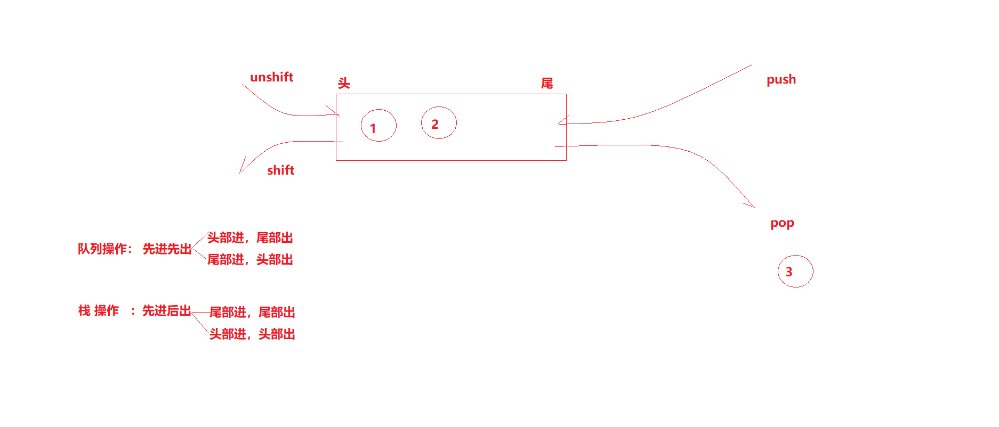
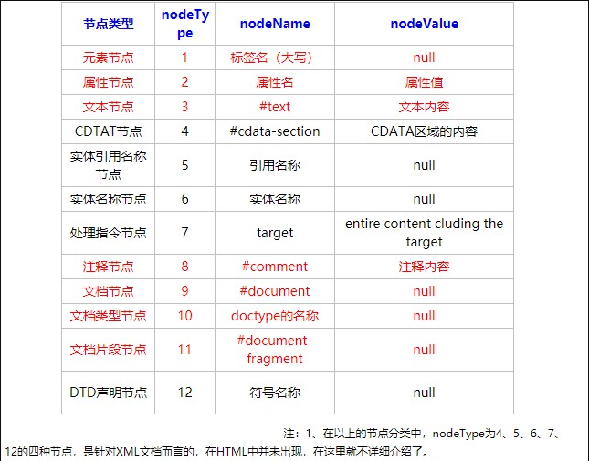

# JS基础

学习方法

​	代码量

## js书写位置

```javascript
行内式：on开头属性。
	可以将 **单行或少量JS代码** 写在HTML标签的事件属		性（以 `on` 开头的属性），如：`onclick`
<input type="button" value="点击有惊喜" οnclick="surprise()">

内嵌：
     <script>
        alert('Hello JS World~!');
        alert('Keep learning~!');
      </script>
  
外联：
	<script src="outdoor.js"></script>

```

## 输入输出

- 输入：

    ```javascript
    prompt（）
    接收浏览器用户输入的 内容 --- 一律 返回 字符串
    ```

    ```javascript
    confirm（）
    接收浏览器用户 确认选择 框 --- 返回 布尔值 - 确认(true) 取消(false)
    ```

- 输出：

    ```javascript
    alert（）
    - 给浏览器普通用户看
    ```

    ```javascript
    console.log()
    - 给开发者看的
    console.time('name')
console.timeEnd('name')
    
    console.table 
    
    debugger
    ```
```
    
    ```javascript
    document.write()
     将数据 写到 body 中
```

​    

## 数据类型

### 1、number数值类型

#### e科学计算

```javascript
整数、负数、小数；
科学计算e：
		0.002=2e-3,向左移3位小数点；
		3000=3e3，3位0；

数值范围：
	正数：
		最大值：Nunber.MAX_VALUE // 1.7976931348623157e+308
		最小值：Nunber.MIN_VALUE // 5e-324 （无限接近0）
	负数
    	最大值：-Nunber.MIN_VALUE //-1.7976931348623157e+308
		最小值：-Nunber.MAX_VALUE //-5e-324
	无穷
    	Infinity // 无穷大
		-Infinity // 无穷小
```

#### 	NaN

数值类型 特殊值-【特殊值】：Infinity 、-Infinity 、【NaN】;

【 NaN - 非数值】 (Not a number) ： 代表 算数运算后的错误结果.

```js
特点:
d.【 NaN - 非数值】 (Not a number) ： 代表 算数运算后的错误结果 ;
d1. 当 算数运算符 运算 一个 不是 数值的 数据时，无法计算结果，所以 返回 NaN;
d2. 任何值 与 NaN 运算结果 都是 NaN;
d3. NaN 与任何值都不相等 ，包括它自己;
d4. 使用 isNaN(x) 来 检测 x 是不是 一个 NaN
             如果 x 是 一个 NaN , 就返回 true
                  不是        ，       false
```

#### 进制

```
十进制
	var num = 9;
	进行算数计算时，八进制和十六进制表示的数值最终都将被转换成十进制数值。
十六进制
	var num = 0xA;
	数字序列范围：0~9以及A~F
八进制
    var num1 = 07;   // 对应十进制的7
    var num2 = 019;  // 对应十进制的19
    var num3 = 08;   // 对应十进制的8
    数字序列范围：0~7
    如果字面值中的数值超出了范围，那么前导零将被忽略，后面的数值将被当作十进制数值解析
```


### 2、string字符串类型

```javascript
'',""单引号或双引号；
	// 注：引号必须成对出现；

嵌套关系
var strMsg = '我是"高帅富"程序猿';  // 可以用   '' 包含 ""
var strMsg2 = "我是'高帅富'程序猿"; // 也可以用 "" 包含 ''

当有连接符+时,另一边会自动变成字符串.包括true\false~undefined~null
```

#### 字符串拼接

```js
console.log(11 + 11);
console.log('hello' + ' world');
console.log('100' + '100');
console.log('11' + 11);
console.log('male:' + true);

1. 两边只要有一个是字符串，那么+就是字符串拼接功能
2. 两边如果都是数字，那么就是算术功能。
```

#### 字符串长度length

```js
var str = '程序猿 Hello World';
console.log(str.length);
```

#### 转义符

```js
\n   换行
\'   代表 一个 单引号
\"   代表 一个 双引号
\t   制表符(tab键)"空格"
\\   带包 一个 \
\b	 空格
\f	 进纸

 var str = '我爱你\n但是\t我不\'敢\'说\n说了\\怕你\\打我';
```


### 3、Boolean布尔值

```javascript
true/false
	true本质就是 1；
	false本质就是 0；
    
注意:区分大小写.

		1+true=2；
		1+false=1;
```

### 4、undefined未定义类型

```javascript
一个声明后没有被赋值的变量会有个默认值 undefined.
	var usrName; // 声明变量后没有直接赋值，此时它的默认值就是 undefined
	alert(usrName); // 显示 undefined
```

### 5、null空对象类型

```javascript
null类型被看做空对象指针，前文说到null类型也是空的对象引用。
只有一个值，即 null 值.

- 如果你定义了一个变量，但是想在以后把这个变量当做一个对象来用，那么最好将该对象初始化为 null 值
- 如果你想把一个对象占用的内存释放掉，办法之一就是把这个变量设置为 null
- 设置 null 的两个方式：
    - 手动设置给变量
    - JS引擎  也会在释放对象空间后把变量设置为 null
    - 在调用prompt方法时，如果用户点击取消，也会返回 null


```

### 6、复杂数据类型,引用类型

```js
Object - 对象
Array - 数组
Function - 函数
自定义类型
```


### undefined 和 null 判等

```js
undefined == null // true 因为都表示为空，都能转成 0
undefined === null // false 因为数据类型不同
```


### typeof 获取数据类型

```
检测数据类型
```

- typeof 可用来获取数据的数据类型，返回 被检测数据 的 `类型名称字符串

    - 语法

    - typeof  数据

    - typeof( 数据 ) 

        ```js
        console.log(typeof 520);                 // 'number'
        console.log(typeof '想和你一起跳 P城~~');  // 'string'
        console.log(typeof true);                // 'boolean'
        ```

|              |                    |             |
| ------------ | ------------------ | ----------- |
| String       | typeof "小白"      | "string"    |
| Number       | typeof 3747        | "number"    |
| Boolean      | typeof true        | "boolean"   |
| Undefined    | typeof undefined   | "undefined" |
| Null         | typeof null        | "object"    |
| 函数         | typeof alert;      | "function"  |
| 任何其它对象 | typeof  new Date() | "obejct"    |
|              | typeof NaN         | number      |
|              | typeof Infinity    | number      |

值类型,拷贝;

复杂类型,拷贝地址.

## 数据转换

### 转数值

#### parseInt 转整型数值

```js
遇到非数值停止,只输出数值;
第一个为非数值时,为NaN；
第一个为空格,忽略空格;
console.log(+'120');
console.log(parseInt('120')); // 120
console.log(parseInt('120110gogogo')); // 120110
console.log(parseInt('120110go21gogo')); // 120110
console.log(parseInt('a120')); // NaN

console.log(parseInt('12.22')); // 12  - 类似 Math.floor()

console.log(parseInt('12 0')); // 12 -- 数值后面的空格 会当成 非数值
console.log(parseInt(' 121')); // 121 -- 数值前面的空格 会 自动 删除，然后再转换
```

#### parseFloat 浮点数 数值

```js
和以上一样，
可以输出小数点数值。
console.log(parseFloat('12.22')); // 12.22
```

#### Number 转整型\浮点型\\\

```js
只能转换数值和boolena；
包含有非数值则为NaN；
注意：只能将 数值字符串 转成数值，中间不能有任何非数值存在！！
console.log(Number('121'));
console.log(Number('121.1314'));
console.log(Number(true));
console.log(Number(false));

console.log(Number('11a')); // NaN
```

### 转字符串.toString() \ String(X)

**.toString()**

```js
1 数值转 字符串 
var money = 100000;
    console.log(money); // 100000
    console.log(money.toString()); // '100000'

2 布尔值 转 字符串 
 var gender = true;
    console.log(gender); // true
    console.log(gender.toString()); // 'true'

注意:
Null、Undefined没有.toString()方法；需要通过String()来转换。
```

String(X):用于转换没有toString(),如:undefined,null;

```js
//b.String(x)：可以 用来 将 x 转成 字符串 ----------------
    //     可以用来 将 没有 toString()方法的 数据 转成 字符串，比如：undefined 和 null
    console.log(String(undefined));
    console.log(String(null));

    
    //b.1 数值转 字符串 
    console.log(String(1231));

    //b.2 布尔值 转 字符串
    console.log(String(true));
```


### 转布尔值Boolean()

```js
Boolean(x)  用来 将 数据 转成 true 或者 false
会转成 false 的有 8 种： 
0 ， -0，NaN ，''，undefined , null , false , document.all

    其他的全都转成 true
    
console.log(Boolean(0)); // false
```

总结

```js
1. 显式转换 ：程序员主动调用语法去转换 (易读性高，最常用)
            转number ：
                parseInt():转换整数
                parseFloat():转换小数
                Number() : 其他类型转数字
            转string
                String():
                变量名.toString():
            Boolean；
                Boolean(数据):
        2. 隐式转换 ：当运算符左右两边数据类型不一致，编译器会偷偷帮我们转成一致再计算。这种转换方式称之为隐式转换
            * 转number：
                自增自减：++ --
                算术表达式： + - * / %
            * 转string：
                + 连接符
            * 转boolean：
                ! 逻辑非
//1.转number

        //1.1 ++ --
        var str = '10';
        str++;//Number(str)++
        console.log(str);//11

        //1.2 算术
        console.log('10' - 1);// Number('10') - 1 = 10 -1 =9

        //2.转string ： + 
        console.log(1 + '1');//String(1) + '1' = '1' + '1' = '11'

//容易混淆点： 算术运算符+ 和 字符串连接符 + 搞混淆
        console.log(1 + true);//2  算术运算符  1 + Number(true) = 1 + 1 = 2
        console.log('1' + true);//1true 连接符 '1' + String(true) = '1' + 'true' = '1true'
        
//3.转boolean: !
        console.log(!1);// !Boolean(1) = !true = false
```


## 变量

- 概念：变量是用于存放数据的**容器**.
- 本质：变量是程序在 内存 中申请的一块用来存放数据的 空间
- 方便的获取或者修改内存中的数据.

变量声明

- 第一种：**先声明，后赋值**  -- 注意：var 和 变量名 之间的空格 不能省

```js
var age；
age=10；
```

- 第二种：**声明和赋值一行完成** -- 注意：var 和 变量名 之间的空格 不能省

```js
var age = 10; // 声明和赋值一次完成
```

- 每个变量中只能存放一个值，所以一旦放一个新的值，会把原来的值替换


```js
- 变量名 和 字符串 容易弄混
var uName = 'a';
	console.log('uName'); // 字符串 'uName'
	console.log(uName); // 'a'

- 不声明，不赋值，报错！
	console.log(ccc); // 报错，因为访问了一个 不存在的变量

- 只声明，不赋值，默认为 undefined
	var usrName; // 声明变量
	console.log(usrName); // undefined - 未定义

- 不使用 var 关键字来创建变量（不建议使用）

	usrAge = 27; // 不使用 var 关键字来声明变量 并赋值
	console.log(usrAge); // 27

- 声明同名变量，后面的会覆盖前面的
	var age = 1;
	console.log(age); // 1
	var age = 2;
	console.log(age); // 2
```

### 变量命名规则

由 字母(A-Za-z)、数字(0-9)、下划线(_)、美元符号( $ )组成，

```js
var usrAge, num01, _name
```

- **不能** 以数字开头 `var 1$$$__8age = 1;`
- **不能** 是关键字、保留字 和 代码符号，例如：var、for、while、+ 、&
- js区分大小写。

### 变量命名规范

- 变量名必须有意义 ；

- 遵守驼峰命名法。首字母小写，后面单词的首字母需要大写。

    如：`usrName` 、 `usrPassword ` 、`xiAn`

## 运算符


| 运算符 | 描述         | 实例                                    |
| ------ | ------------ | --------------------------------------- |
| +      | 加           | 10 + 20 = 30                            |
| -      | 减           | 10 - 20 = -10                           |
| *      | 乘           | 10 * 20 = 200                           |
| /      | 除           | 10 / 20 = 0.5                           |
| %      | 取余数(取模) | 返回除法的余数 9 % 2 = 1                |
| **     | 幂           | 次方、乘方，2 ** 3 = 8 （2 * 2 *2 = 8） |
|        |              |                                         |

注意：

- 数字 / 0 = Infinity ，因为除数不能为 0 （除数为0 会得到 无穷大）

- 0 / 0 = NaN

- 数学中除不尽时会得到无限位小数，JS 中只保留小数点后面 15-17位，如：

    `10 / 3 = 3.3333333333333335`

    在JS 中，不要直接 使用 小数数值进行运算

### 关系运算符(比较运算符)

```js
<  >  >=  <= == != === !==
```

### 逻辑运算符号

| 写法 | 意义    | 特点                       |
| ---- | ------- | -------------------------- |
| &&   | 与 (且) | 【口诀：一假都假】两真为真 |
| \|\| | 或      | 【口诀：一真都真】两假为假 |
| !    | 非      | 取反                       |

```js
var isOk = 1 > 2 && 2 < 1 || 1 > 2;
    //              false     || 1 > 2;
    //              false     ||  false
    // isOk =                 false
```

```js
&&:
  1）只要“&&”前面是false，无论“&&”后面是true还是false，结果都将返“&&”前面的值。
  2）只要“&&”前面是true，无论“&&”后面是true还是false，结果都将返“&&”后面的值。
  
||:
	1）只要“||”前面为false,不管“||”后面是true还是false，都返回“||”后面的值。
  2）只要“||”前面为true,不管“||”后面是true还是false，都返回“||”前面的值。
```

不等号 !=   全不等号 !==

```js
console.log(1 != '1'); //false
console.log(1 !== '1'); //true
```

### 运算符的优先级

```js
优先级从高到底
	1. ()  优先级最高
	2. 一元运算符  ++   --   !
	3. 算数运算符  先*  /  %   后 +   -
	4. 关系运算符  >   >=   <   <=
	5. 相等运算符   ==   !=    ===    !==
	6. 逻辑运算符 先&&   后||
	7. 赋值运算符
```

### 自增自减

```js
 //自增自减操作符 与 复合赋值运算符 一样，都只能用于 变量 本身的数据的改变！！
    //1.1 自增 ++ ， 在变量 原来值 的基础上 + 1
    var age = 18;
    // age += 1; // age = age + 1;
    age++; // age += 1; // age = age + 1;
    console.log(age);

    //1.2 自减 -- ，在变量 原来值 的基础上 -1
    var money = 999999;
    money--;
    console.log(money);

总结
前置++：先加1，后参与运算
后置++：先参与运算，后加1
上面两个理解后，下面两个自通
前置--  ：先减1，后参与运算
后置--  ：先参与运算，后减1

++a;  //先+后赋值
	a++;
	var b=a;
a++;
	var b=a; //先赋值 后+
	a++;

	var a = 1;
    var b = ++a;
    console.log(' a= ' + a); //2
    console.log(' b= ' + b);//2

	var a = 1;
    var b = a++;
    console.log(' a= ' + a);//2
    console.log(' b= ' + b);//1
```

### 比较关系符

```js
1.比较运算符：比大小的~~！！
    //  运算符 本身 没有意义，要和 两边的数据 组成 表达式 才有意义
    //  >    <     >=    <=    ==   !=    ===    !==
    // 【永远都会返回 bool值】

= 是赋值；
== 等于，只判断数值，不判断类型；//console.log(1 == 1); // true
=== 全等于;判断值 也 判断类型.//console.log(1 === '1'); // false

注意： undefined 和 null 判等 ------
    console.log(undefined == null); // true
    console.log(undefined === null); // false
```

### 字符串的转义符

```js
\n   换行
\'   代表 一个 单引号
\"   代表 一个 双引号
\t   制表符(tab键)"空格"
\\   带包 一个 \

 var str = '我爱你\n但是\t我不\'敢\'说\n说了\\怕你\\打我';
```

**神奇的 + 号**

**string+number 会自动转换位 string；**

```js
alert('a' + 'b'); // 'ab'
//1.1 字符串 "相加"
alert('hello' + ' ' + 'world'); // ’hello world‘
//1.2 数值字符串 "相加"
alert('100' + '100'); // ’100100‘
//1.3 数值字符串 + 数值
alert('11' + 12); // '11' + '12'   ->  ’1112‘
//1.4 字符串 + 布尔值
alert('male：' + true); // ’male：true‘
```

**+string 会自动转换为 number；**

```js
var num = +'120'; // 120
console.log( typeof num ); // number
```

**string+string；为拼接；**


## Math高级数学函数

### 1.Math.PI-圆周率

```JS
console.log(Math.PI); // 3.141592653589793
```

### 2.Math.abs-绝对值

```js
var absNum = Math.abs(- 2);
console.log (absNum); //2
```

### 3.Math.pow-求次方函数

```js
var ciNum = Math.pow(2,3); // 求 2 的 3次方 = 2* 2* 2  -> 2**3
console.log (ciNum); // 8
```

### 4.Math.ceil-进一位取整

```js
天花板函数**：如果是小数，则去掉小数，整数 +1；进一取整
console.log ( Math.ceil ( 5.3 ) );//6
```

###  5.Math.floor-地板取整

```js
console.log ( Math.floor ( 5.2 ) );//5 往后取整
```

### 6.Math.round-四舍五入

```js
console.log ( Math.round ( 8.5 ) );//9
console.log ( Math.round ( 8.4 ) );//8
```

### 7.Math.max-最大值

```js
var maxNum = Math.max( 99, 88, 100, - 5, 20 );
console.log('最大值为：' + maxNum); // 100
```

### 8.Math.min-最小值函数

```js
var minNum = Math.min( 99, 88, 100, - 5, 20 );
console.log('最小值为：' + minNum); // -5
```

### 9.Math.random-随机数函数

生成 0~1 之间的随机小数

随机小数范围 [0，1) --> 大于等于 0，小于 1

```js
var ranNum = Math.random();
console.log(ranNum);

生成 0~100 之间的随机整数
var ranIntNum = Math.random() * 100;
console.log(ranIntNum); // 77.39207143088139

ranIntNum = Math.floor(ranIntNum); // 地板函数 去掉 小数部分 77
console.log(ranIntNum); // 77
```


## 分支语句

### if-else条件分支语句

语法:

```js
if(条件){
	
}else{

}

三元表达式:
var 变量=判断语句 ? true表达式:false表达式;
```

### switch case分支语句

```js
switch(变量) {
 case '值1':{
	代码块1~~~~
	break; // 退出 整个 switch 结构 
	}
 case '值1':
 case '值2':{
        
    }
   default:{
   default 代码块~~~~(可省略)
}
注意:
        必须有break;如没有break;将全部输出.
        case里面比较的值是严格模式.(===).

1.switch穿透：
当 case 中 没有 写 break 来 退出 整个 swtich结构时，就叫做 switch穿透。
  //没写 break 的 case {} 代码结束后，会执行 下一个 case{} 代码块里的代码！！直到遇到 break 或 default 为止！！！
 
```

## 循环语句

### while循环

```js
语法:
while(条件语句){
	循环体;
	i++;   //计数器
}
-------------------------
实例:
var i=0;
while(i<10){
	console.log('');
	i++;   //计数器
}
注意:不要忘记写i++;否则容易死循环.
```

**do while**

```
do {
	循环体
}while( i<100 );
```

两者区别:

```
while特点:先判断,后执行;可能一次都不执行.
do while特点:先执行,后判断,最少执行一次.
```

### for 循环

```js
for(表达式1;判断表达式<2>;表达式4){
	循环体3;
}
for(var i=0; i<100 ; i++){
    
}
------------------------
continue 执行,则跳出本次循环,回到for句首,跳到下一个循环.

break 跳出整个循环体,后续不再执行.

标签语句:
 var num=0;
            outermost:for(var i = 0 ; i <10 ; i++){
                for(var j = 0 ; j <10 ; j++){
                    console.log('c');
                    if(i==5 && j==5){
                        break outermost; //指定返回到outermost
                    }   
                  num++;
                }
            }

            console.log(num);


总结:for运用类型:
1.找到循环体规律,纯循环;
2.遍历,嵌套遍历,多层嵌套遍历套出结果(套出if);
3.遍历+与循环i存在关联;类9x9乘法口诀.
4.遍历事件元素,保存事件函数.
```

### 循环语句总结比较

```
for 适用于有明确循环次数;

while do-while 次数不确定是用;

```

## 数组

数组本质:数组是程序在 内存 中申请的N块连续的 空间，可以用来保存一组数据

为了解决变量只能存一个值.数组可以存储多个值.

数组可以把一组相关的数据一起存放，并提供方便的访问方式。

数组存储数据类型不限.


创建方式:

```js
/1.数组字面量;
var arr  = [];
var arr = [1,2,a,d];

/2.new 创建方式;
var arr = new Array（）；//注意是();
var arr = new Array（5）；//有5个空间的数组,默认值undefinedx5;
var arr = new Array(1,2,sd);

/注:
var arr = [, , ,]; //空数组,最后一个","不管用.
console.log(arr); //empty
console.log(arr[0]); //undefined
```

访问:

```js
数组名[下标]; /访问没有存在的下标,则为undefined;
```

添加,修改:

```js
arr[arr.lenght]; /尾部添加;
//如果下标有对应的值，会把原来的值覆盖，如果下标不存在，会给数组新增一个元素。
arr[2]='新元素'; /修改;
```

lenght

```js
var arr =[1,2,3,4,5];
arr.lenght=9; // 1,2,3,4,5,empy x4;自动添加4个空位undefined;
arr.lenght=2; //[1,2];
arr.lenght=0; //清空;
```

数组三大要素:

```js

元素:数组中的数据;
下标:用于索引元素;
lenght:数组元素的数量;
```

遍历数组:

```js
for(var i=0;i<arr.lenght;i++){
	console.log(arr[i]);
}
```

新增元素:

```js
arr.push('新元素');

```

删除元素:

```js
splice 删除指定下标元素;
语法:
splice(beginIndex，count)；
		beginIndex：要删除的元素的下标；
		count：要删除的个数；
arr.splice(2.1); //如果不传count,则会往后一直删.
```

## 排序算法

总结出现的问题:

```js
function 里没有 return;
i和j相互错乱.


```


### 冒泡排序

```js
function invArr(arr) {
            var temp;
            for (i = 0; i < arr.length - 1; i++) {
                var flag = true;
                for (let j = 0; j < arr.length - 1 - i; j++) {
                    if (arr[j] > arr[j + 1]) {
                        temp = arr[j];
                        arr[j] = arr[j + 1];
                        arr[j + 1] = temp;
                        flag = false;
                    }
                    if (flag) {
                        break;
                    }
                }
                return arr;
            }
        }
```

### 选择排序

```js
var arr = [5, 4, 3, 2, 1, 0];
var temp;
var k = 0;
        for (let i = 0; i < arr.length; i++) {
            k = i;
            for (let j = i; j < arr.length; j++) {
                if (arr[j] < arr[k]) {
                    k = j; //获取最后一次比较的下标
                }
            } 
            temp = arr[i]; //换值
            arr[i] = arr[k];
            arr[k] = temp;
        }

利用变量绑定下标,控制控制替换\排序. 
```

### 插入排序

```js
for (let i = 1; i < arr.length; i++) {
            for (let j = i; j>=0; j--) {
                if (arr[j-1]>arr[j]) {
                    temp=arr[j-1];
                    arr[j-1]=arr[j];
                    arr[j]=temp;
                }else {
                    break; //优化,如果[j-1]<[j]则跳出此循环.
                }
            }
        }
        console.log(arr);

方法二\
var len=arr.length;
var preIndex,current;
for (var i=1;i<len;i++){
    preIndex=i-1;
    current=arr[i];
    while (preIndex>=0 && arr[preIndex]>current){
        arr[preIndex+1]=arr[preIndex];
        preIndex--;
    }
    arr[preIndex+1]=current;
}
```

### 希尔排序（Shell Sort)

```

```

### 归并排序(Merge Sort)

```js
function mergeSort(arr){ //拆分
      var len=arr.length;
      if (len<2) {
          return arr;
      }
      var middle=Math.floor(len/2);
      var left=arr.slice(0,middle);//拆分[0,middle)
      var right=arr.slice(middle);
      return merge(mergeSort(left),mergeSort(right)); //递归
        }

function merge(left,right){  //合并
      var temp=[];
      while (left.length>0&&right.length>0) {
          if (left[0]<=right[0]) {
               temp.push(left.shift());
          }else {
              temp.push(right.shift());
          }
      }
      while (left.length) {
           temp.push(left.shift());
      }
      while (right.length){
           temp.push(right.shift());
      }
      console.log(temp);
      return temp;    // [5,6] 
}
```

## 数组去重

1.冒泡去重

```js
1.先排序; 	//冒泡排序或 sort
2.相邻元素比较; arr[i] ==arr[i+1] ?
3.arr[i] !=arr[i+1]	newArr.push(arr[i]);
```

2.开关去重

```json
var newArr = [];
for(var i=0 ;i<arr.length;i++){
    var canadd = true;
    for(var j = 0 ; newarr.length;j++){
        if(newArr[j] ==arr[i]){
            canadd = false;
            break;
        }
    }
	if(canadd){
        newArr.push(arr[i]);
    }
}
```

3.indexOf去重	常用

```js
var newArr = [];
for(var i=0 ;i<arr.length;i++){
    if(newArr.indexOf(arr[i]) ==-1){
        newArr.push(arr[i]);
    }
}
```

4.对象法去重

```js
用数组每一个值作为obj的属性名;判断obj该属性名是否有值(undefined);
var obj = {};
var newArr = [];
for(var i = 0;i <arr.length ;i++){
    var key = arr[i];
    if(obj[key] == undefined){
       	newArr.push(arr[i]);
        obj[key] = 1; //随便给个值,为了判断其不为undefined
       }
}
```

5.删除法去重

```js
function del(arr){
    for(i=0;i<arr.length;i++){
        for(j=0;j<arr.length;j++){
            if(arr[i]===arr[j]){
                arr.splice(j,1);
            }
        }
    }
}
//改变原数组
```

6.ES6-filter

```js
var nums = [10,234,56,23,32,32,32,32,78,567]
var newnums = []

nums.filter(item =>{
    if(!newnums.includes(item)){
        newnums.push(item);
        return true
    }
    return false
})
//不改变原数组
```

7.ES6 -Set

```js
var nums = [10,234,56,23,32,32,32,32,78,567]

var s = new Set(nums) //伪数组

var s = [...new Set(nums)] //转为真数组

//不改变原数组
```

8.ES6-Map

```js
  let Arr  = [123,'mdf',[12,8],[12,3],[12,'3'],[12,3],{a:1},{a:{b:99}},{a:1}]
    function filterMap(arr) {
      var map1 = new Map()
      arr.forEach(item=>{
          map1.set(JSON.stringify(item),item)
      })
      return [...map1.values()]
    }

    console.log(filterMap(Arr));
```


------

## 函数

可用数值作为返回值,输出多个值.

函数的作用就是封装一段代码，将来可以重复使用;

特点：

函数声明的时候，函数体并不会执行，只要当函数被调用的时候才会执行。

一段相对独立的具有特定功能的代码块;


### 函数的3种声明方式:

```js
声明式:
    function 函数名(){
      // 函数体
    }

函数表达式(匿名函数):
    var fn = function() {
      // 函数体
    }

函数对象方式: //很少用
var shoowLove = new Function('形参n','函数体');
```

### 自执行函数

```js
(function 函数名(){ //所以不需要函数名.
      // 函数体
    }) ();
外部访问不了,自执行函数. //   is not defined
```


### 返回值语法：

```js
//声明一个带返回值的函数
function 函数名(形参1, 形参2, 形参...){
  //函数体
  return 返回值;
}

//可以通过变量来接收这个返回值
var 变量 = 函数名(实参1, 实参2, 实参3);
```

### 返回值详解：

```js
 / 如果函数没有显示的使用 return语句 ，那么函数有默认的返回值：undefined
    如果函数使用 return语句，那么跟再return后面的值，就成了函数的返回值
    如果函数使用 return语句，但是return后面没有任何值，那么函数的返回值也是：undefined
 / 函数使用return语句后，这个函数会在执行完 return 语句之后停止并立即退出，也就是说return后面的所有其他代码都不会再执行。
```

### 预解析:

```js
变量提升:声明提升至 作用域内最顶端.
源代码:
    console.log(num);
    var num=1;              //undefined

预解析后:
    var num;
    console.log(num);
    num=1;   //声明提前,赋值位置不变;
-------------------------------------
函数提升: 只对声明式函数.
  函数预解析:
	源代码:
		name();
		function name(){
            
        }
		
	预解析:
        function name(){

         }
         name(); //函数声明提前,[函数提升]
-------------------------------------
   / 声明提前,赋值位置不变.
   / 函数内的变量,先访问局部作用域内,如没有再访问全局变量.
   / 函数内没有用var 声明,则这变量为全局变量. 
   
     function f1(){
         console.log(loverName)；//报错,没有使用var,没有声明.
         loverName='小苍苍';	
         console.log(loverName)；
     }
    f1();
    console.log(loverName)；
```

### 作用域链

### arguments

```js
函数内特殊属性，，保存函数被调用时传入的实参；
arguments 实参变量,以类数组方式存放所有实参.
```

### 回调函数-函数作为参数传递

```js
把函数当做参数,作为参数时,只用填写函数名.
function name(func){
	func();      //调用外部函数,并执行.
}
function name2(){
	console.log('数')
}
name(name2); //只用写函数名.不需要();
---------------------------
函数做为返回值 //return 函数名;
function name(func){
	return name2//
}
function name2(){
	console.log('数')
}
```

### 函数做为返回值

```js
function a（）{
	return b； //函数做为返回值
}
function b（）{
	console.log();
}
var x=a(); //var x=b;
x();//b()
```

------

## 对象object

对象拓展性和四个特性

```
https://www.cnblogs.com/Juaoie/p/12004176.html
```


### 创建方式

```js
对象字面量：
var o = {
  name: 'zs,
  age: 18,
  sex: true,
  sayHi: function () {
    console.log(this.name);
  }
};
-------------------
new Object()创建对象：

var person = new Object();
  person.name = 'lisi';  
  person.age = 35;
  person.job = 'actor';
  person.sayHi = function(){
  console.log('Hello,everyBody');
}
-----------------------------
 / 工厂函数创建对象
function createPerson(name, age, job) {
  var person = new Object();
  person.name = name;
  person.age = age;
  person.job = job;
  person.sayHi = function(){
    console.log('Hello,everyBody');
  }
  return person;
}
var p1 = createPerson('张三', 22, 'actor');

			------
            
function createPerson(name, age, job) { //用于批量生产对象,通过形参给对象属性赋值.
  var person = {
  	name:name,
  	age:age,
  	job:job,
  	sayHi:function(){
    	console.log('Hello,everyBody');
  	}
  }
  return person;
}
var p1 = createPerson('张三', 22, 'actor');

>构造函数 ，是一种特殊的函数。主要用来在创建对象时初始化对象， 即为对象成员变量赋初始值，总与new运算符一起使用在创建对象的语句中。

1. 构造函数用于创建一类对象，首字母要大写。
2. 构造函数要和new一起使用才有意义。
----------------------------------------------
自定义构造函数：
function Person(name,age,job){ //首字母大写,名词
  this.name = name;
  this.age = age;
  this.job = job;
  this.sayHi = function(){
  	console.log('Hello,everyBody');
  }
}
var p1 = new Person('张三', 22, 'actor'); //需要加入new,创建函数规则内的属性对象.
	a.创建空对象;
	b.将空对象传给了 构造函数里的 this;
	c.调用 构造函数,传入参数;
	d.返回值给 p1;
```

#### 访问

```js
Person.name;
Person['name'];

Person.sayHi();
Person['sayHi']();
```

#### 删除

```
delete 对象名.属性名;
```

### in 与 hasOwnProperty

```js
'属性名' in 对象名; //true false
'name' in obj;
	作用:判断对象是否为数组或对象内的元素/属性;
	语法:（变量 in 对象）//返回 true / false
	特点:会判断原型.
    
hasOwnProperty:
	作用:判断对象中是否有该属性;
	语法:obj.hasOwnProperty('key');
	特点:不会去判断原型;

1. keys() => 输出为一个数组，取到的是 obj 的所有的自身可枚举属性。其功能和for in + hasOwnProperty（）功能是一致的 
2. getOwnPropertyNames() => 输出为一个数组，取到的是 obj 的所有自身属性。（可枚举、不可枚举，但不包括symbol类型的属性） 
3. getOwnPropertySymbol() => 输出为一个数组，取到的是 obj 的所有自身的Symbol属性 
4. for in => 遍历 obj 的所有属性，包括自身属性和原型上的所有可枚举的属性 
5. JSON.stringify() => 只能将自身的可枚举的属性转化成字符串

```

### 遍历对象-for in

```js
for(var key in 对象名){
	var a= 对象名[key];
} //一个个输出;
遍历 数组返回 下标;
	字符串返回 下标;
	对象返回 属性名;
```

### this

```

谁点出方法,就是谁
```

------

### 对象合并-浅拷贝

```js
	一、
function extend(o,n,override) {
    for(var key in n){
        if(n.hasOwnProperty(key) && (!o.hasOwnProperty(key) || override)){
            o[key]=n[key];
        }
    }
    return o;
}
-------------------------
    二、
Object.assign();//-----------------------ES6
https://developer.mozilla.org/zh-CN/docs/Web/JavaScript/Reference/Global_Objects/Object/assign
	作用:将所有可枚举属性的值从一个或多个源对象复制到目标对象。它将返回目标对象。
    语法:Object.assign(target, ...sources);//将sources复制到target;
    //-------------复制
    const obj = { a: 1 };
    const copy = Object.assign({}, obj);
    console.log(copy); // { a: 1 }
	//------------合并
	const o1 = { a: 1 };
	const o2 = { b: 2 };
	const o3 = { c: 3 };
	const obj = Object.assign(o1, o2, o3);//有相同属性会被后者覆盖

	三、
	jQuery.extend([deep], target, object1, [objectN]);
	如果第一个参数设置为true，则jQuery返回一个深层次的副本
    
    
 MessageChannel消息通信拷贝,了解
```

### 深拷贝

```js
1.浅拷贝：将源对象或者原数组的引用 ```直接赋给``` 新对象/新数组 ，新对象/新数组只是```对原对象的一个引用```
2.深拷贝：创建一个新的对象或者数组，将源对象的各项属性的值拷贝过来  
---------------------
1）深复制在计算机中开辟了一块内存地址用于存放复制的对象，
2）而浅复制仅仅是指向被复制的内存地址，如果原地址中对象被改变了，那么浅复制出来的对象也会相应改变。

深拷贝:
作用:希望在改变新数组/对象的时候，不改变原数组/对象;

递归实现深拷贝

function isObj(obj) {
    return (typeof obj === 'object' || typeof obj === 'function') && obj !== null
}
function deepCopy(obj) {
    let tempObj = Array.isArray(obj) ? [] : {}
    for(let key in obj) {
        tempObj[key] = isObj(obj[key]) ? deepCopy(obj[key]) : obj[key]
    }
    return tempObj
}

---------------------------
    
var json1={"name":"辉哥","age":18,"arr1":[1,2,3,4,5],"string":'afasfsafa',"arr2":[1,2,3,4,5],"arr3":[{"name1":"呵呵呵"},{"job":"前端开发求职"}]};
var json2={};
function copy(obj1,obj2){
  var obj2=obj2||{}; //最初的时候给它一个初始值=它自己或者是一个json
  for(var key in obj1){
    if(typeof obj1[key] === "object"){ //先判断一下obj[name]是不是一个对象
      obj2[key]= (obj1[key].constructor===Array)?[]:{};//判断构造函数为数组或对象
      copy(obj1[key],obj2[key]); //然后来无限调用函数自己 递归思想
    }else{
      obj2[key]=obj1[key];  //如果不是对象，直接等于即可，不会发生引用。
    }
  }
  return obj2; //然后在把复制好的对象给return出去
}
json2=copy(json1,json2)
json1.arr1.push(6);
alert(json1.arr1);  //123456
alert(json2.arr1);  //12345
	无法拷贝函数,箭头函数,正则
-------------------------------------------------------
-------------------------
JSON实现第一层拷贝
	原理:可以先用JSON.stringify把对象转成字符串，
		 再用JSON.parse把字符串转成新的对象
	特点:只能拷贝普通数组,对象;函数,箭头函数,正则(为空对象)都不能实现拷贝;
它会抛弃对象的constructor，深拷贝之后，不管这个对象原来的构造函数是什么，在深拷贝之后都会变成Object；
function deepCopy(obj1){
        var copyObj=JSON.parse(JSON.stringify(obj1));
        return copyObj;
}
    var result=deepCopy(obj);
```

```js
解决正则和Date函数,以及函数
function isObj(obj) {
            return (typeof obj === 'object')&& obj !== null
        }
function deepCopy(obj, hash = new WeakMap()) {
            let cloneObj
            let Constructor = obj.constructor
            switch (Constructor) {
                case RegExp:
                    cloneObj = new Constructor(obj)
                    break
                case Date:
                    cloneObj = new Constructor(obj.getTime())
                    break
                default:
                    if (hash.has(obj)) return hash.get(obj)
                    cloneObj = new Constructor()
                    hash.set(obj, cloneObj)
            }
            for (let key in obj) {
                cloneObj[key] = isObj(obj[key]) ? deepCopy(obj[key], hash) : obj[key];
            }
            return cloneObj
        }

//WeakMap 对象是一组键/值对的集合，其中的键是弱引用的。其键必须是对象，而值可以是任意的。

https://github.com/lodash/lodash/blob/master/.internal/Stack.js?1528957393114

------ lodash中的_.cloneDeep() 方法
https://www.lodashjs.com/

        function isObj(obj) {
            //Array和Object 的typeof  都为'object'
            return (typeof obj === 'object' ) && obj !== null
        }
        function deepCopy(obj, hash = new WeakMap()) {
            let cloneObj
            let Constructor = obj.constructor //获取obj 的构造函数
            switch (Constructor ) { //也可以用if(obj instanceof RegExp) obj的构造函数是否为RegExp
                case RegExp: //如果构造函数为RegExp 则new一个 并传入参数
                    cloneObj = new Constructor(obj)
                    break
                case Date: //如果构造函数为Date 则new一个 并传入参数
                    cloneObj = new Constructor(obj.getTime())
                    break
                default:
                    if (hash.has(obj)) return hash.get(obj) //如果有保存过这个对象则return,防止递归栈溢出
                    cloneObj = new Constructor()  //从该层递归的 obj的构造函数new一个空对象{} 或 数组[]
                    hash.set(obj, cloneObj) //把出现过的obj 存入 hash 
            }
            for (key in obj) {
                if (obj.hasOwnProperty(key)) {//不遍历原型链上的属性
                    cloneObj[key] = isObj(obj[key]) ? deepCopy(obj[key], hash) : obj[key];
                }
            }
            return cloneObj
        }
        obj1.a=obj1 //对象相互引用 --用于判断是否解决 栈溢出
        var obj2 = deepCopy(obj1) //obj1深拷贝给 obj2
        console.log(obj1);
        console.log(obj2);

//对象
        const obj1 = {
            arr: [1,[2,[3,4],5],6,{arry:7},8,9],
            obj: {
                key: '对象',
                fu3: function () {
                    console.log('fn3');
                }
            },
            fn: () => {console.log('fn函数')},
            fn2: function () {
                console.log('bb')
            },
            date: new Date(),       //Date对象
            reg: /正则/ig,          //正则对象
            a: '0',
        };
```

### 对象的内置属性

```js
value:  	//值
writable:	//默认true, 是否可读写;
enumerable:	//默认 true, 是否for in 可枚举;
getter:		//函数或nudefined取值时;
setter:		//函数或nudefined设置时;
configurable://默认 true,是否可删除或改变特征值;

两类属性:
	数据属性:value,writable,enumerable,configurable
	访问器:getter,setter,
        enumerable,configurable
```

```js
Object.getOwnPropertyDescriptor(obj,key);
//{value:name,writable:true, ```}
```


## Date对象

```js
自定义时间
function getCNDate() {
      var date = new Date();
      var year = date.getFullYear();
      var month = date.getMonth() + 1;
      var day = date.getDate();
      var hours = date.getHours();
      var minute = date.getMinutes();
      var sec = date.getSeconds();
      var mSec = date.getMilliseconds();

      var str = year + '年' + month + '月' + day + '日 ' + hours + '时' + minute + '分' + sec + '秒' + mSec +'毫秒';
      console.log(str);
    }
----------------
获取 毫秒数 总数 --- 从 1970年1月1号 0点0分0秒 到 现在 的 总毫秒数
var date = new Date();
var allMS = date.getTime(); // 获取总毫秒

// 将 总毫秒数 转成 年月日
    function changeDateFormat(cellval) {
      if (!cellval) return "暂无";
      cellval = cellval.toString();
      var date = new Date(parseInt(cellval.replace("/Date(", "").replace(")/", ""), 10));`	`
      var month = date.getMonth() + 1 < 10 ? "0" + (date.getMonth() + 1) : date.getMonth() + 1;
      var currentDate = date.getDate() < 10 ? "0" + date.getDate() : date.getDate();
      date.get
      return date.getFullYear() + "-" + month + "-" + currentDate;
    }

    // 将 总毫秒数 转成 年月日时分秒
    function changeDateFormatWithTime(cellval) {
      if (!cellval) return "暂无";
      cellval = cellval.toString();
      var date = new Date(parseInt(cellval.replace("/Date(", "").replace(")/", ""), 10));
      var month = date.getMonth() + 1 < 10 ? "0" + (date.getMonth() + 1) : date.getMonth() + 1;
      var currentDate = date.getDate() < 10 ? "0" + date.getDate() : date.getDate();
      var hours = date.getHours() < 10 ? "0" + (date.getHours()) : date.getHours();
      var minute = date.getMinutes() < 10 ? "0" + (date.getMinutes()) : date.getMinutes();
      var second = date.getSeconds() < 10 ? "0" + (date.getSeconds()) : date.getSeconds();
      return date.getFullYear() + "-" + month + "-" + currentDate + " " + hours + ":" + minute + ":" + second;
    }
```

### 后端带T时间处理

```js
2020-03-18T18:55:27.207转2020-03-18 18:55;
安卓会把这个带T字母的时间看做UTC时间格式，
（包括ios打包后也会相差8个小时）与北京时间相差8个小时。

 var dateee = new Date(val).toJSON();

 var date = new Date(dateee)
          .toISOString()
          .replace(/T/g, " ")
          .replace(/\.[\d]{3}Z/, "");
```

```
getParseTime:function(time, cFormat){   //('2020-03-18T18:55:27.207', '{y}-{m}-{d} | {h}:{i}' )

    if (!time) {
        return '';
    }
    var myDate = new Date(time + '+0800');
    if (myDate == 'Invalid Date') {
        time = time.replace(/T/g, ' ');
        time = time.replace(/-/g, '/');
        time = time.replace(/\.\d+/, ' ');//去掉毫秒
        myDate = new Date(time + '+0800');
    }
    time = myDate;


    if (time == null) {
        return '';
    }
    if (arguments.length === 0) {
        return null
    }
    var format = cFormat || '{y}-{m}-{d} {h}:{i}:{s}'
    var date
    if (typeof time === 'object') {
        date = time
    } else {
        if ((typeof time === 'string') && (/^[0-9]+$/.test(time))) {
            time = parseInt(time)
        }
        if ((typeof time === 'number') && (time.toString().length === 10)) {
            time = time * 1000
        }
        date = new Date(time)
    }
    var formatObj = {
        y: date.getFullYear(),
        m: date.getMonth() + 1,
        d: date.getDate(),
        h: date.getHours(),
        i: date.getMinutes(),
        s: date.getSeconds(),
        a: date.getDay()
    }
    var time_str = format.replace(/{([ymdhisa])+}/g, (result, key) => {
        var value = formatObj[key]
        // Note: getDay() returns 0 on Sunday
        if (key === 'a') {
            return ['日', '一', '二', '三', '四', '五', '六'][value]
        }
        //return value.toString().padStart(2, '0')  //时间补零，padStart可能出现兼容问题
        return value.toString()
    })
    return time_str
},
```


## Array对象

### concat

```js
arr = arr.concat(arr,[],[]);//
返回新数组;
链接数组;
```

### join

```js
将元素 添加连接符 拼接成 字符串 返回 /  默认 用 , 分隔 
 var arrCity = ['P城', 'C城', 'Y城', 'R城', '军事基地'];
 var str = arrCity.join('-'); 
```

### reverse

```
 翻转数组;直接改原数组;直接 对 本数组 的元素做翻转操作，不需要返回值
```

### splice-删除-替换-插入

```js
//beginIndex - 要删除的元素的开始下标啊
//count      - 要删除的元素的个数

删除元素
splice(beginIndex,count)

替换 指定元素
splice(beginIndex,count,...用来替换的值)
var arrCity = ['Y城', 'R城', 'N港', '军事基地', '武汉'];
    //          0      1      2      3          4
arrCity.splice(2, 1, '医院', '导弹基地');//删除下标为2的元素,替换为"'医院', '导弹基地'"

插入 指定元素  将 count 设置为 0
arrCity.splice(2, 0, '医院'); //插入下标为2之前
```

### sort 排序

原理:

sort`方法接受一个`比较器`，这个`比较器`比较传入的两个参数：`a`和`b`。`a>b`则返回`正数`，`a<b`返回`负数`，`a==b`返回`0`。然后sort调用内部实现的比较算法，配合这个`比较器`，就能排序了。

```js
1、对数组排序，不开辟新的内存，对原有数组元素进行调换
    arr.sort(); //字符串排序,a-z排序
    arr.sort(function(a,b){return a-b})	//小到大排序
    arr.sort(function(a,b){return b-a}); //大到小排序

    arr.sort(function(a,b){return a.length-b.length}) //按字符长度排序

2、按数组对象中的某个属性排序
    var arr = [
        {name:'zopp',age:0},
        {name:'gpp',age:18},
        {name:'yjj',age:8}
    ];
    function compare(property){
        return function(a,b){
            var value1 = a[property];
            var value2 = b[property];
            return value1 - value2;
        }
    }
    console.log(arr.sort(compare('age')))
	--------------------------------------
	function sortBy(attr, rev) {
            if (rev == undefined) {
                rev = 1;	//如不填写,则默认正序
            }else {
                rev = (rev)?1:-1;	// rev= ( rev?1:-1 )
            }
            return function (a, b) {
                a = a[attr];
                b = b[attr];
                if (a < b) {
                    return rev * -1;	//a>b则返回`正数，a<b返回`负
                }
                if (a > b) {
                    return rev * 1;
                }
                return 0;
            }
        }
        console.log(arr.sort(sortBy('age', false)))

3、让数组乱序
    arr.sort(function(a,b){
        return Math.random() - 0.5;
    })
```


### 队列\栈



队列操作:先进先出;

unshift > pop

push > shift


栈操作:先进后出;

unshift>shift

push>pop


## String字符串对象

#### charAt

```js
var str = '我们都是最棒的~~';
返回 对应 下标的 字符
var char = str.charAt(5);
console.log(char); // '棒'
-------
遍历字符串
for(var i = 0;i< str.length;i++){ 
             console.log(str.charAt(i)); 
             console.log(str[i]); 
        }
```

#### indexOf

```js
返回 对应 字符的 下标，如果 找不到 字符，就返回 -1
var index = str.indexOf('棒'); //5
-------
判断 字符串中 是否 包含
//srcStr - 原始字符串
//targetStr - 要查找 的目标字符串
function isIn(srcStr, targetStr) {
      var index = srcStr.indexOf(targetStr);
      if(index <= -1){
        return false;
      }else {
        return true;
      }
    }
```

#### lastIndexof

```js
对应的 最后一个 字符的下标
var lastIndex = str.lastIndexOf('棒'); //
```

#### concat

```js
连接字符,返回新;
var str = '我们都是最棒的 IT学习者~~~';
str = str.concat('在前端的路上，一往无前，学无止境~真棒~~',123123,'小必败');
console.log(str);
```

#### replace 指定替换

```js
替换指定 字符串
var str = '我爱广州小蛮腰~~~小蛮腰上月很高~~~';
    str = str.replace('小','大');

str = str.replace(/小/g,'大');//采用正则表达式/ /g,可以替换全部

```

#### split 分隔

```js
将字符串 按照 分隔符 拆成若干个元素;返回数组
var arr = str.splic('-');
```

#### substr *(index,count)* 

```js
从 指定 下标 复制取出 count 个字符，并返回
var str = '我爱广州小蛮腰~~~小蛮腰上月很高~~~';
    //          01 2 3 4 5 6     
    var subStr1 = str.substr(2,4); // 广州小蛮
```

#### substring*(beginIndex,endIndex)* 

```js
var str = '我爱广州小蛮腰~~~小蛮腰上月很高~~~';
    //     0 1 2 3 4        
    var subStr2 = str.substring(2,4);// [2,4) --广州
```

#### toUpperCase

```js
将 字符串中 所有 英文字母 都转成 大写
var loverWords = 'i love you ~~~';
    loverWords = loverWords.toUpperCase();
```

#### toLowerCase

```
将 字符串中 所有 英文字母 都转成 小写
```

字符串反转

```js
str.split('').reverse().join('')
```


------


# WEBAPI

## *DOM*

```js
学习思路:
1.作用?
2.什么用?-语法.
3.注意点.

事件三要素:
1.事件源,获取元素;
2.事件类型,注册事件;
3.事件处理函数.

开发思路:
1.明确需求;
2.根据需求整理思路;
3.根据思路敲代码.

需求描述:
网页的互交需求;什么元素,什么事件,做什么或改变什么(事件处理).
```


### *获取元素方式*

#### 	1、获取-ID

```js
	document.getElementBYId('')  //返回对象

	id只能由document来调用;
```

#### 	2、获取标签-tag

```js
	document.getElementsByTagName('li')  //返回伪数组
```

#### 	3、获取类名-class

```js
	document.getElementsByClassName('one') //返回伪数组
```

#### 	4、获取-name

```js
	document.getElementsByName('sex') //返回伪数组
```

#### 	5、选择器-获取元素

```js
document.querySelector（'#id'）//获取符合条件的第一个对象 反则返回null

document.querySelectorAll('.one') //获取满足条件的所有元素 伪数组
```

#### 	6、获取-伪类元素

```js
/待定
document.defaultView.getComputedStyle(ospan,'after')

document.defaultView.getComputedStyle(ospan,'after').height
好像只能覆盖
```

------


### 获取元素属性

#### 点语法

```js
特点:
只能获取行内;
获得时string,带单位;
只能获取元素的width/height
可获取,可修改;

获取元素
var liList = document.getElementsById('id');

获取style属性 //style是对象 ,所有样式的集合
liList.style.wigth

赋值
liList.style.wigth = '500px'
```

#### offset家族

offset家族特点:

 	*a. 既能获取行内，也可以获取行外*

​	 *b. 获取的是number，不带单位*

​	c. 获取的是真实宽高 （width+padding+border）

​	*d. 只能获取。不能修改*

```js
offsetWidth
offsetHeight
真实宽高 （width+padding+border）
```

offsetParent

```js
1.获取元素最近的定位父级;

特点:
1.如果元素时固定定位(fixed),则定位父级时null;
2.如果父级都没有定位,则定位的时body;
3.body的定位父级时null;
```

offsetTop - offsetLfte

```js
获取自身外边框到
自身border 到 父元素的 padding 的距离.
```

#### scroll

```js
是对象的实际内容的宽，不包边线宽度，会随对象中内容的多少改变
```

#### client

```js
是对象可见的宽度，不包滚动条等边线，会随窗口的显示大小改变。
```


#### window.getComputedStyle获取属性

```js
获取样式属性
ele:要获取的元素对象;
pseudoEle:伪元素 一般为null;
window.getComputedStyle(box,null);
window.getComputedStyle(box,'::after'); //伪元素获取方法;
1.获取一切样式属性;
2.获取的时string,带单位;<---------- //数值计算时注意转换
3.能获取,不能修改;
```

```js
1、数组 . 对象类型获属性方法:
	document.getElementsById('a')[0]; //伪数组，没有数组方法
	document.getElementsById('obj.name');

2、样式获取
  .style.height = ''
  
3、获取文本
  .innerText	用于双标签
  .innerHTML	获取文本和标签
  
4、href
  a.href = ''
  
5、路径
    img.src = ''
    div.style.backgroundColor ='url(./`````)'
```

#### attributes添加属性方法

```js
一、
语法: 会覆盖原来类名
getAttribute('属性名')		获取属性   //获取自定义的属性
setAttribute('属性名',属性值)		设置属性
removeAttribute('属性名',) 删除属性		//可以同时删除属性名,属性值

div.setAttribute('cl','99');
div.getAttribute('id')

将不知道的属性先存入自定义属性里,后面可调用

点语法 是 操作标准属性
点语法删除属性
box.className = '';删除属性值,属性名还在.

二、
classList.add 不会覆盖
div.classList.add('类名1','类名2');//不会覆盖
div.classList.remove('');


三、检测含有某个类名
div.classList.contains('类名');//true or false
function hasClass(element,cls){
    return (''+element.className+'').indexOf("+cls+'')>-1;
};
                                             hasClass(box,'box')
```


#### 表单元素常用属性

```js

2. 状态属性:
	disabled:是否禁用; //true为禁用  inputList[i].disabled = true;
	checked:   //boolear   input[i].checked = true;
	selected:  //selected =" selected " ;为选中 为true optio[i].selected = true;

3.表单元素文本获取:value
	
出生年月:<select>
  <option>选项1</option>
  <option>选项2</option>
  <option>选项3</option>
</select>
```

注意点:

```

```

### clientWidth、offsetWidth、scrollWidth等区别

```js
clientWidth:
		1，clientWidth的实际宽度
        clientWidth = width+左右padding

        2，clientHeigh的实际高度
         clientHeigh = height + 上下padding 

        3，clientTop的实际宽度
          clientTop = boder.top(上边框的宽度)

        4，clientLeft的实际宽度
          clientLeft = boder.left(左边框的宽度)
//不包含border
```

```js
offsetWidth
		1,offsetWidth的实际宽度
            offsetWidth = width + 左右padding + 左右boder

         2,offsetHeith的实际高度
            offsetHeith = height + 上下padding + 上下boder

         3，offsetTop实际宽度
            offsetTop：当前元素上边框外边缘到最近的已定位父级（offsetParent)上边框内边缘的距离。
            如果父级都没有定位，则分别是到body 顶部 和左边的距离

         4，offsetLeft实际宽度
             offsetLeft：当前元素 左边框 外边缘 到 最近的已定位父级（offsetParent） 左边框 内边缘的距离。
              如果父级都没有定位，则分别是到body 顶部 和左边的距离
//包含boder
```

```js
	1，scrollWidth实际宽度
      scrollWidth：获取指定标签内容层的真实宽度（可视区域宽度+被隐藏区域宽度）。

    2，scrollHeight的实际高度
       scrollHeight：获取指定标签内容层的真实高度（可视区域高度+被隐藏区域高度）
    3，scrollTop
       scrollTop :内容层顶部 到 可视区域顶部的距离。
       实例：var scrollTop = document.documentElement.scrollTop || window.pageYOffset || document.body.scrollTop;
       持续获取高度的方式：
	window.addEventListener('scroll', ()=>{
		var scrollTop = document.documentElement.scrollTop || 
        window.pageYOffset || document.body.scrollTop;
	});

     4，scrollLeft
        scrollLeft:内容层左端 到 可视区域左端的距离.

//包含隐藏滚动的部分+boder
```


### 事件类型

```js
鼠标单击： onclick

鼠标双击： ondblclick

鼠标移入： onmouseover

鼠标移除： onmouseout

成为焦点: onfocus

失去焦点: onblur
```


### 事件遍历 for-总

```js
for循环的延申；
for （var i = 0; i < xList.length ; i++）{
	x.onclick = function (){	// for遍历 给每一个x注册(保存)该事件;
        for (var j=0 ; j< y.length ; j++){	//该事件涉及到多个元素,遍历获取;
            事件;
        }
    }
}

--------------------------------------------

开关思想: 先假设,找到事件与该假设的联系.
var flag = true;
	if(){	//如果符合?? 则进行
       	flag = false;
       }
    x = flag;

--------------------------------------------

排他思想: 善用this获取 该元素触发事件 执行事件函数.
for （var i = 0; i < xList.length ; i++）{
	x.onclick = function (){	
        this.属性名 = xxx;		//this = 触发事件的该元素;
        for (var j=0 ; j< y.length ; j++){	//遍历+判断 排this外元素
            if (y[j] != this){
                y[j].属性名 = !xxx;
             }
        }
    }
}
```


### DOM树

.png)

### DOM节点的基本类别

1.什么是节点：在HTML文档中，一切皆节点（HTML文档本身、标签、属性、注释内容、文本）



### 获取节点三要素

```js
 .nodeType  节点类型
 .nodeName	节点名称
 .nodeValue	节点内容

console.log(box.nodeType);
```

### 节点关系判断

```js
包含关系推荐使用Node.contains()方法；

判断当前元素是否是IMG，可以 ：
event.target.tagName/nodeName == 'IMG'
/^img$/i.test(event.target.tagName)
event.target.tagName.toLowerCase() == 'img'
event.target instanceof Image

前后节点关系判断使用Node.compareDocumentPosition()。
```


### 获取节点与元素

|                        |                |
| ---------------------- | -------------- |
| childNodes             | 子节点         |
| children               | 子元素(伪数组) |
| previousSibling        | 上一个节点     |
| nextSibling            | 下一个节点     |
| previousElementSibling | 上一个元素     |
| nextElementSibling     | 下一个元素     |
| firstChild             | 第一个节点     |
| firstElementChild      | 第一个元素     |
| lastChild              | 最后一个节点   |
| lastElementChild       | 最后一个元素   |
|                        |                |
| parentNode             | 获取父节点     |
| parentElement          |                |

### Dom增删改页面元素

|                              |                                   |                          |
| ---------------------------- | --------------------------------- | ------------------------ |
| document.createElement()     | document.createElement('li')      | 创建空标签元素           |
| 父元素.removeChild(子元素)   | ul.removeChild(li)                | 自能移除自身子元素       |
| 父元素.appendChild(子元素)   | ul.appendChild(‘li’)              | 添加子元素,加入最后面    |
| 父元素.insertBefore(子元素,) | ul.insertBefore(元素A，元素B)     | 将元素A插入到元素B的前面 |
| 父元素.replaceChild(子元素)  | ul.replaceChild(元素A，元素B)     | 元素A替换元素B,          |
| node.cloneNode(true/false)   | 默认是 false本身。true:复制子元素 | 复制/克隆                |

```js
var newNode=box.cloneNode(true);
main.appendChild(newNode);
```


#### 创建元素方法-createElement

```js
document,write(); 不推荐,文档流结束后,再执行会覆盖;

innerHTML	
	少用;100内.赋值会替换, 增加可用+=;
	消耗性能;
	原因:字符串恒定性;字符串常量区一旦创建不可修改,只会增加.

var div = document.createElement('div')
	1.创建元素
	2.创建的时空标签;  div.innerHTML = '';
	3.只是再内存创建,不会自动添加到doc树; 	
		body.appendChild(div);

var div = document.createElement('div')
	div.innerHTML = '';
	body.appendChild;
```

#### 增-appendChild -insertBefore

```js
（1）如果是一个新的子元素，则默认会添加到最后
(2)如果是一个已存在的子元素，相当于移动到最后面
（3）如果添加的元素有子元素，子元素也会一起移动到最后面
```

#### insertBefore 插入

```js
元素B父元素.insertBefore(元素A，元素B),/将元素A插入到元素B的前面
（1）如果是新元素则插入到指定位置
（2）如果是已存在元素则移动到指定位置
（3）如果元素有子元素，则子元素随着它一起移动
- 如果想插入到某元素后面，没有直接的api，可以先获取该元素的下一个元素，然后插入到下一个元素前面即可
```

#### 改.替换-replaceChild

```js
b父元素.replaceChile(a元素,b元素) /元素A替换元素B, b元素消失

- 1.如果是新创建的元素，则直接替换
- 2.如果是已存在的元素（不论这个元素是自己的子元素还是别人的）会将新元素移动到旧元素位置，并且旧元素被移除
- 3.如果已存在的元素有子元素，则子元素会随着父元素一起替换
```

#### 删-removeChild

```
父元素.removeChild(子元素)

- 1.不能自己移除自己（只能让爸爸干掉自己）
- 2.父元素只能移除自己的子元素，不能移除别人的子元素（只有亲爸爸才能干掉自己）
```

------

## ········^··········总结

### 注意点

```js
1.返回伪数组类型的用下标获取; //伪数组：没有数组的方法。
2.对象用.属性名;
3.只能获取到行内样式的属性值，无法得到行外(内联/外联)样式的属性值,但可赋值;
4.如果css样式的属性有 `-`用驼峰;如style.backgroundColor;
5.添加类名时,注意加空格;div.className += " two";
```

### 错误总结

```js
1、伪数组与对象 点 属性时伪数组忘加 【下标】；
2、function， n-c调换，单词写错；
3、onclick 写在调用前面。/		
```

------

​															

## 事件对象

### 事件方法

```js
https://www.runoob.com/jsref/dom-obj-event.html

鼠标单击： onclick

鼠标双击： ondblclick

鼠标移入： onmouseover
		  onmouseente不支持事件冒泡;

		  onmouseleave 不支持事件冒泡
鼠标移除： onmouseout

鼠标移动:  onmousemove

成为焦点: onfocus
	tabindex='1' //行内设置可添加焦点
	outline=none //去除焦点边框
失去焦点: onblur

按下鼠标: onmousedown

移动:		onmousemove //document.onmousemove

鼠标抬起:  onmouseup


键盘按下:	onkeydown	//不区分大小写,默认大写;不过滤特殊字符
键盘按下:	onkeypress	//区分大小写,过滤特殊
键盘抬起:	onkeyup
获取键盘按键:
	e.keyCode || e.charCode || e.which
	
String.fromCharCode(ascii码) //转字符串


onscroll

onresize

执行鼠标事件
var e = document.createEvent('MouseEvents');
e.initEvent('mouseover',true,true);
document.getElementById('ul').children[i].dispatchEvent(e);

事件穿透:
pointer-events:  auto | none//穿透
```

### 模拟触发事件

```js
js原生:
	let btn_1 = document.getElementById('btn-1');
    let btn_2 = document.getElementById('btn-2');
    	btn_1.onclick = function () {
        	var myEvent = new Event('click');
        	btn_2.dispatchEvent(myEvent);//触发事件
    	}
    btn_2.onclick = function () {
        alert('OK');
    // do something
    }
```


### H5拖拽事件

H5拖拽事件:

```js
H5拖拽事件:

标签先加 draggable = "true"
 
拖拽:	ondraggable	
拖拽开始:	ondragstart
正在拖拽:	ondrag		鼠标移动就会触发
拖拽结束:	ondragend	鼠标松开触发
```

容器盒子

```js
ondragenter  元素进入
ondragleave  元素离开
ondragover	 在容器内移动
ondrop		 元素结束拖拽后 鼠标还在容器内
			//默认不触发,
			//触发条件:

element.ondrop = function(){
                father.appendChild(son);
            }
element.ondragover = function(e){
                e.preventDefault();	 // 拖动的默认处理方式是在新窗口打开，所以阻止其执行
            }

e.dataTransfer.setData("key",e.target.id);

var data=e.dataTransfer.getData("key");

text文本数据传输;
dataTransfer对象中的数据只能在drop事件程序中读取;
```

文件拖拽事件

```js
docment.body.ondrop = function(e){
    e.preventDefault();
    var file e.dataTransfer.files[0];
    var url = URL.createObjectURL(file);
    document.getElementById('img').src=url;
}
```

如何获取事件对象

```js
谷歌火狐:只需要给事件处理函数声明形参即可 event e  ev
box.onclick = function(e){
	consolo.log(e)
}

IE8 : 全局属性 window.event

能力检测兼容:
if(e){
    var obj = e;
}else {
    var obj =window.event;
}
e = e || window.event;
```

### 获取事件对象坐标:

```js
box.onclick = function(e){
	consolo.log(e)
}

相对屏幕位置
screenX		
screenY

获取鼠标实时相对页面左上角; //类似固定定位
clientX
clientY

获取鼠标相对于页面左上角,参照位置滚动也不变; //常用 //类似相对定位
pageX
pageY

图标跟随
 window.onmousemove = function (e) {
            e = e || window.event;
            div.style.left =e.pageX - div.offsetWidth / 2+'px';
            div.style.top = e.pageY - div.offsetHeight / 2 + 'px';
        }
```

### 事件冒泡

一个元素的事件触发时,所有父元素的同名事件会被依次触发.

- 1.事件冒泡：从触发事件元素，一级一级往上找父元素触发同名事件，如果有就触发
- 2.事件捕获：从最顶级的父元素一级一级往下找子元素触发同名事件，直到触发事件的元素为止
    - 事件捕获与事件冒泡触发事件的顺序完全相反
- 3.事件捕获，只能通过addEventListener并且参数写true才是事件捕获
    - 其他都是冒泡（不是通过addEventListener添加、addEventListener参数为false）
- 4.事件对象.stopPropagation() 除了可以阻止冒泡还可以阻止捕获

事件3个阶段

1-事件捕获;

2-事件目标

3-冒泡

事件对象.eventPhase 可以获得触发这个事件时，到底是哪个阶段

```js
好处,节省 遍历给所有元素注册事件,
.onclick = function(e){
	e.target.innerText; //获取事件的子元素
    e.target.className;
    e.target.id;
    e.target.targetName;
}


阻止事件冒泡:

.onclick = function(e){
	e.target.innerText; //获取事件的子元素
    e.stopPropagation(); //该事件后,的父事件都不会冒泡;
}
```

```js
一、onclick 添加事件不能绑定多个事件，后面绑定的会覆盖前面的。
        
二、addEventListener 能添加多个事件绑定，按顺序执行。
    
三、addEventListener方式，不支持低版本的IE。（attachEvent 支持IE）。

四、普通方式绑定事件后，不可以取消。addEventListener绑定后则可以用 removeEvenListener 取消。

五、addEventListener 是W3C DOM 规范中提供的注册事件监听器的方法。
    addEventListener用法：
	语法：target.addEventListener( type , listener , useCapture )
    示例：document.getElementById("item").addEventListener( 'click' , function , false )

六、addEventListener 第三个参数：
        为 true 时，浏览器采用Capture（捕捉）
        为 false 时，浏览器采用bubbing（冒泡）-- 建议使用！
--------------------- 
```

### addEventListener

```js
addEventListener
@param{type} :事件类型,不要on
@param{type} :事件处理函数
@param{type} :true / false

可注册多个同名事件
btn.addEventListener('click',function(){

}.false)


点语法移除事件: btn.onclick = null;

移除事件:
removeEventListener
btn.removeEventListener('click',事件名)
```

------

### target

```js
	event.target.nodeName  　　 //获取事件触发元素标签name
 
    event.target.id　　　　　　　//获取事件触发元素id
 
    event.target.className　　  //获取事件触发元素classname
 
    event.target.innerHTML　　  //获取事件触发元素的内容
	
	e.currentTarget
```


### 阻止a标签默认跳转

```js
1.设置a标签href属性为伪链接;
	javascript:告诉浏览器不要跳转而是执行js代码
    void(0)调用默认的空函数;
	<a href="javascript:void(0)">

2.e.preventDefault(); //只阻止默认行为

3.return false; //阻止默认行为 , 阻止事件冒泡  性能高

页面跳转方式
 btn.onclick = function(){
     window.location.href="地址"  //当前页面变换
 }

window.open('地址') //打开新页面
```

### 禁止文本被选中

```js
user-select: none|auto|text|contain|all;
 
/*firefox浏览器*/
-moz-user-select: none|text|all;
 
/*safari、chrome浏览器*/
-webkit-user-select: none|text|all; /*Safari中不支持该属性值，只能使用none或者text，或者是在html的标签属性中使用*/
 
/*ie浏览器*/
-ms-user-select: none|text|element;
 
属性值：
none :  元素和子元素的文本将无法被选中

text :  文本可以被选中

auto :  文本将根据浏览器的默认属性进行选择

all  :  当所有内容作为一个整体时可以被选择。如果双击或者在上下文上点击子元素，那么被选择的部分将是以该子元素向上回溯的最高祖先元素

contain、element :  可以选择文本，但选择范围受元素边界的约束，也就是选择的文本将包含在该元素的范围内。只支持Internet Explorer
```


### onresize-事件

```js
onresize 事件会在窗口或框架被调整大小时发生。
window.onresize =function (){	//window注册没有兼容性
            if(window.innerHeight){
                winHeight = window.innerHeight //谷歌火狐
            }else if (document.body && document.body.clientHeight) {
                winHeight = document.body.clientHeight;
            }
            // banner.style.height= winHeight;
            var b = winHeight;
            var c = b + 'px'
            banner.style.height = c;
            console.log( 'kuku'+ winHeight);
            // return winHeight;
        }
	onresize()； //实时更新

获取页面大小

横竖屏判断
w>h 横屏
w<h	竖屏

谷歌火狐:	window.innerWidth,window.innerHeight
IE :	   document.documentElement.clientWidth
其他浏览器:  document.body.clientWidth
```

### onscroll-事件

```js
 window.onscroll = function (){
           var stop = document.documentElement.scrollTop || document.body.scrollTop;
           if (stop > 900) {
               nav[0].style.position = 'fixed';
               nav[0].style.top = 0;
           }else {
                nav[0].style.position = '';
                nav[0].style.top = '';
           }
       }

获取元素内容的宽高;
scrollTop
scrollLeft
scrollWidth
scrollHeight

//兼容:
	谷歌火狐:window.pageXOffset,window.pageYOffset;
	常用IE:document.documentElement.scrollLeft,
    其他:document.body.scrollLeft
```


## *BOM*

**BOM**:

​	浏览器对象模型（**B**rowser **O**bject Model (BOM)）;

​	所有 JavaScript 全局对象、函数以及变量均自动成为 window 对象的成员。

Bom主要由五大对象组成：

- window:浏览器核心对象
- location：包含当前页面的URL信息
- history：history对象主要用于记录你当前窗口的历史记录
- navigator：包含当前浏览器的信息，例如用的什么浏览器，操作系统版本等
- screen：获取用户电脑的屏幕分辨率

### window浏览器窗口

#### 三个特点：

```js
1. 是js的顶级对象；（全局变量，全局函数，）
2. window有一个默认属性name，他的值一定是字符串；
3. 只要是window的属性，使用时都可 省略window。
```

#### window对象两个方法

```js
open（）

close（）
```

```js
拓展:
	iE8以下不支持
    window.innerHeight - 浏览器窗口的内部高度(包括滚动条)
    window.innerWidth - 浏览器窗口的内部宽度(包括滚动条)
    
	var w=window.innerWidth
	|| document.documentElement.clientWidth	//兼容ie
	|| document.body.clientWidth;	//兼容ie

	var h=window.innerHeight
	|| document.documentElement.clientHeight
	|| document.body.clientHeight; 

```

#### window对象三个事件

```js
window.onload()
页面所有内容加载完毕.
window.onload = function () {
   console.log('页面加载完毕');
   var box = document.getElementById('box');
   console.log(box);
};

window.onbeforeunload() //页面即将关闭


window.onunload() //页面正在关闭


```

#### client家族

```js
获取元素可视区域的真时宽高;
clientWidth	clientHeight
clientLeft	clientTop
兼容:
1.谷歌火狐: window	window.innerWidth
2.IE:	HTML	document.documentElement.clientWidth
3.其他:	document.body.clientWidth
```


### location地址栏

```js
对象用于获得当前页面的地址 (URL)，并把浏览器重定向到新的页面。

location	地址栏
1、location.assign('地址'); 跳转网页,可返回
2、location.replace('地址'); 替换网页,不可返回
3、location.reload(); 类似F5;

5、location.pathname	返回 URL 的路径名
6、location.href	返回（当前页面的）整个 URL
```

### history历史纪录

```js

1、history.back() 返回
2、history.forward() 前进
3、history.go(number)	前进后退页面个数


例:
<input type="button" value="Back" onclick="goBack()">
    
function goBack()
    {
        window.history.back()
    }
```

### navigator浏览器信息

```js
对象包含有关访问者浏览器的信息

浏览器型号,电脑信息
window.navigator	
window.navigator.userAgent  用户代理,获取用户电脑信息,浏览器

//Mozilla/5.0 (Linux; Android 6.0; Nexus 5 Build/MRA58N) AppleWebKit/537.36 (KHTML, like Gecko) Chrome/75.0.3770.100 Mobile Safari/537.36

//查询浏览器类型
var str = window.navigator.userAgent;

if(str.indexOf('Chrome')!=-1){
   console.log(Chrome)
   }

```

#### 获取设备像素比

```js
window.devicePixelRatio
```


### Screen 屏幕

```js
获取屏幕宽高度;不含底部窗口任务栏;

screen.availWidth - 可用的屏幕宽度;
screen.availHeight - 可用的屏幕高度;

```

### 数据存储对象

#### localStorage

```js
localStorage 永久存储,存到硬盘;只能手动删除

增加数据 localStorage.setItem('属性名',属性值)
只能存储字符串类型,其他类型会自动转成字符串;

读取数据 localStorage.getItem('属性名')

删除     localStorage.removerItem('属性名')

清除     localStorage.clear

document.getElementById('btn1').onclick = function () {
            localStorage.setItem('username','banzhang');
            localStorage.setItem('age',18);
            localStorage.setItem('girlFriend',['苍老师','白石','阿泽']);
        };

```

#### sessionStorage

```js
sessionStorage 临时存储,存在内存中,页面一关闭，数据就没了

增加数据 localStorage.setItem('属性名',属性值)
只能存储字符串类型,其他类型会自动转成字符串;

读取数据 localStorage.getItem('属性名')

删除     localStorage.removerItem('属性名')

清除     localStorage.clear()

document.getElementById('btn1').onclick = function () {
            sessionStorage.setItem('username','banzhang');
            sessionStorage.setItem('age',18);
            sessionStorage.setItem('girlFriend',['苍老师','白石','阿泽']);
        };

document.getElementById('btn4').onclick = function () {
            //删除所有数据
            sessionStorage.clear();
        };
```

------


## 动画

www.17sucai.com

### 定时器

定时器:让一段代码间隔时间执行;

#### 1、永久定时器

##### setInterval 

```js

语法:
 var id = setInterval(function(){},1000);
```

##### clearInterval

```js
清除定时器
clearInterval(id);
```

#### 2、一次定时器

##### setTimeout

```js

setTimeout(function(){},1000);
```

##### clearTimeout

```js
clearTimeout(id);

sa
```

案例

```js
定时器

倒计时
```


------


### 缓动

```js
1.清除定时器
2.本次开始
3.获取元素
4.计算本次移动距离=目标位置-当前位置)/10;
5.取整
6.开始移动
7.终点检测,清除定时器

function animationSlow(ele,target){
    clearInterval(ele.timeID);
    ele.timeID = setInterval(function(){
        var current = ele.offsetLeft;
        var step = (target - current)/10;
        step = current > target ? Math.floor(step): Math.ceil(step);
        
        current +=step;
        ele.style.left = current +'px';
        if(current == target){
         	clearInterval(ele.timeID);  
         }
    },20);
}
```


## 案例

### 表格综合案例

```js
思路:
1.创建一个函数,for in 遍历对象,
2.获取属性名,属性值,并且document.createElement创建td,
3.innderText添加内容obj[key]
4.table.appendChild(tr);

<!DOCTYPE html>
<html>
<head lang="en">
    <meta charset="UTF-8">
    <title></title>
    <style>
        .main,
        table {
            width: 800px;
            margin: 0 auto;
        }

        .main {
            height: 40px;
            line-height: 40px;
        }

        table,
        th,
        td {
            border: 1px solid black;
            border-collapse: collapse;
        }

        .optd {
            width: 200px;
        }

        .addTable {
            width: 780px;
            padding: 10px;
            border: 1px solid green;
            /* 固定位置 */
            /* position: fixed; */
            /* top: 200px; */
            /* left: 50%; */
            margin-left: -400px;
            /* 标准流 */
            margin: 0 auto;
            background-color: #fff;
            display: none;
        }

        .addTable table {
            width: 100%;
            text-align: center;
            margin-bottom: 10px;
        }
    </style>
</head>

<body>
    <div class="main">
        <input type="button" value="新增一行" id="add" />
    </div>
    <table id="table">

    </table>
    <!--用于新增表格获取数据的模块-->
    <div class="addTable" id="addRow">
        <table>
            <tr>
                <th>学号</th>
                <th>姓名</th>
                <th>性别</th>
                <th>年龄</th>
            </tr>
            <tr>
                <td><input type="text" id="number" /></td>
                <td><input type="text" id="name" /></td>
                <td>
                    <select id="gender">
                        <option>男</option>
                        <option>女</option>
                    </select>
                </td>
                <td><input type="text" id="age" /></td>
            </tr>
        </table>

        <div>
            <input type="button" value="确定" id="sure" />
            <input type="button" value="取消" id="cancle" />
        </div>
    </div>
    <script>

        var head = ["学号", "姓名", "性别", "年龄", "操作"];
        var data = [
            { "number": "001", "name": "李狗蛋", "gender": "男", "age": 16 },
            { "number": "002", "name": "王大柱", "gender": "女", "age": 17 },
            { "number": "003", "name": "李葫芦", "gender": "男", "age": 15 },
            { "number": "004", "name": "小明", "gender": "男", "age": 18 },
            { "number": "005", "name": "小红", "gender": "女", "age": 16 }
        ];

        var table = document.getElementById('table');
        var add = document.getElementById('add');//新增一行按钮
        var addRow = document.getElementById('addRow');//新增一行div
        //头部
        var headtr = document.createElement('tr');
        for (var i = 0; i < head.length; i++) {
            var headth = document.createElement('th');
            headth.innerText = head[i];
            headtr.appendChild(headth);
        }
        table.appendChild(headtr);


        for (var i = 0; i < data.length; i++) {
            addData(data[i]);
        }
        function addData(obj) {
            var tr = document.createElement('tr');
            for (var key in obj) {
                var td = document.createElement('td');
                td.innerText = obj[key];
                tr.appendChild(td);
            }
            var td = document.createElement('td');

            var inputUp = document.createElement('input');
            inputUp.type = 'button';
            inputUp.value = '向上移动';
            td.appendChild(inputUp);
            inputUp.onclick = upMove

            var inputdown = document.createElement('input');
            inputdown.type = 'button';
            inputdown.value = '向下移动';
            td.appendChild(inputdown);
            inputdown.onclick = downMove

            var inputmove = document.createElement('input');
            inputmove.type = 'button';
            inputmove.value = '删除';
            td.appendChild(inputmove);
            inputmove.onclick = clearMove

            tr.appendChild(td);
            table.appendChild(tr);
        }

        function upMove() {
            if (this.parentElement.parentElement == table.children[1]) {
                alert('不可以哦!!')
            } else {
                table.insertBefore(this.parentElement.parentElement, this.parentElement.parentElement.previousElementSibling);
            }
        }

        function downMove() {
            if (this.parentElement.parentElement == table.lastElementChild) {
                alert('不可以哦!!')
            } else {
                table.insertBefore(this.parentElement.parentElement.nextElementSibling, this.parentElement.parentElement);
            }
        }

        function clearMove(){
           var sure =  confirm('确定吗?');
            if (sure) {
                table.removeChild(this.parentElement.parentElement);
            }
        }

        add.onclick = function(){
            addRow.style.display = 'block';
        }
       
        document.getElementById('sure').onclick = function(){
            var temporallyObj = {};

            if (document.getElementById('number').value.length==0 || document.getElementById('name').value.length == 0 || document.getElementById('age').value.length==0) {
                alert('空的亲');
            }else {
                temporallyObj.number = document.getElementById('number').value;
                temporallyObj.name = document.getElementById('name').value;
                temporallyObj.age = document.getElementById('age').value;
                if (document.getElementById('gender')[0].selected == true) {
                    temporallyObj.gender = '男';
                } else {
                    temporallyObj.gender = '女';
                }
                addData(temporallyObj);
                document.getElementById('number').value = '';
                 document.getElementById('name').value = '';
                document.getElementById('age').value = '';
                document.getElementById('gender')[0].selected = true;
            }
           
        }
         document.getElementById('cancle').onclick = function(){
             document.getElementById('number').value = '';
             document.getElementById('name').value= '';
             document.getElementById('age').value = '';
             document.getElementById('gender')[0].selected = true;
             addRow.style.display = 'none';
         }

    </script>
</body>
</html>
```


### 案例:筋斗云

```js
思路:
1.声明一个全局变量=点击的元素;
1.获取onmouseover元素的offsetLeft;给云朵style.left;
2.onmouseout回到全局变量;
3.onclick让全局变量=this;
var cloud = document.getElementBId('cloud');
var navBar= document.getElementBId('navBar');
声明筋斗云主人
var owner = navBar.children[0];

for(var i = 0 ; navBar.children.length-1; i++){
    
    navBar.children[i]onmouseover = function(){
        animationSlow(cloud,this.offsetLeft);
    }
    
    navBar.children[i]onmouseout = function(){
        animationSlow(cloud,owner.offsetLeft);
    }
    
    navBar.children[i]onclick = function(){
        owner = this;
    }
}
```

### 缓动封装

```js
<!DOCTYPE html>
<html lang="en">
<head>
    <meta charset="UTF-8">
    <meta name="viewport" content="width=device-width, initial-scale=1.0">
    <meta http-equiv="X-UA-Compatible" content="ie=edge">
    <title>Document</title>
    <style>
        #box {
            width: 100px;
            height: 100px;
            background-color: #000;
            position: absolute;
            left: 0px;
            top: 50px;
            opacity: 1;
            /* border: 1px solid red; */
        }
        #box1 {
            width: 100px;
            height: 100px;
            background-color: skyblue;
            position: absolute;
            left: 0px;
            top: 200px;
        }
    </style>
</head>
<body>
    <input type="button" value="缓动到400" id="btn" />
    <div id="box"></div>
    <div id="box1"></div>

    <script>
        var box = document.getElementById('box');
        var btn = document.getElementById('btn');

        var obj = {
            width: 400,
            height: 600,
            left: 400,
            top: 200,
            opacity:0.5,
            zIndex:2
        }
        
        var bgcfn = function(){
             alert('kukuku');
        }

        btn.onclick = function () {
            animationSlow(box,obj,bgcfn)};

        function animationSlow(ele, obj, fn) {
            clearInterval(ele.timeId);
            ele.timeId = setInterval(function () {
                var flag = true;
                for (var key in obj) {
                    if (key == 'zIndex') {	//层级
                        ele.style.zIndex = obj[key];
                    }else if (key == 'opacity'){	//透明度
                        	//
                        var current =parseFloat(getStyle(ele, key)) *100;
                        var target = obj[key] * 100;
                        var step  =(target - current) /10;
                        step = step > 0 ? Math.ceil(step) : Math.floor(step);
                        current += step;
                        ele.style.opacity = current/100 ;
                        if (current != target) {
                            flag = false;
                        }
                    }else { //普通类型
                        var current = parseInt(getStyle(ele, key));	//获取原属性值
                        var step = (obj[key] - current) / 10;	//缓动计算
                        step = step > 0 ? Math.ceil(step) : Math.floor(step);
                       			 //取整+上,-下^
                        current += step;	//自增计算
                        ele.style[key] = current + 'px';	//DOM 赋值
                        if (current != obj[key]) {		//边界判断
                            flag = false;
                        }
                    }
                }
                if (flag) {
                    clearInterval(ele.timeId);
                    if (typeof fn == 'function') {
                        fn();
                    }
                }
            }, 20);
        }

        function getStyle(ele, key) {
            return getComputedStyle(ele, null)[key];
        }
    </script>
</body>
</html>
```

### 案例：轮播图

```js
<!DOCTYPE html>
<html lang="en">
<head>
    <meta charset="UTF-8">
    <title></title>
    <style type="text/css">
        * {
            padding: 0;
            margin: 0;
            list-style: none;
            border: 0;
        }
        .all {
            width: 500px;
            height: 200px;
            padding: 7px;
            border: 1px solid #ccc;
            margin: 100px auto;
            position: relative;
        }
        .screen {
            width: 500px;
            height: 200px;
            overflow: hidden;
            position: relative;
        }
        .screen li {
            width: 500px;
            height: 200px;
            overflow: hidden;
            float: left;
        }
        .screen ul {
            position: absolute;
            left: 0;
            top: 0px;
            width: 3000px;
        }
        .all ol {
            position: absolute;
            right: 10px;
            bottom: 10px;
            line-height: 20px;
            text-align: center;
        }
        .all ol li {
            float: left;
            width: 20px;
            height: 20px;
            background: #fff;
            border: 1px solid #ccc;
            margin-left: 10px;
            cursor: pointer;
        }
        .all ol li.current {
            background: yellow;
        }
        #arr {
            display: none;
        }
        #arr span {
            width: 40px;
            height: 40px;
            position: absolute;
            left: 5px;
            top: 50%;
            margin-top: -20px;
            background: #000;
            cursor: pointer;
            line-height: 40px;
            text-align: center;
            font-weight: bold;
            font-family: '黑体';
            font-size: 30px;
            color: #fff;
            opacity: 0.3;
            border: 1px solid #fff;
        }
        #arr #right {
            right: 5px;
            left: auto;
        }
    </style>
</head>

<body>
    <div class="all" id='box'>
        <div class="screen">
            <ul>
                <li></li>
                <li></li>
                <li></li>
                <li></li>
                <li></li>
                <li></li>
            </ul>
            <ol>
                <li class="current">1</li>
                <li>2</li>
                <li>3</li>
                <li>4</li>
                <li>5</li>
            </ol>
        </div>
        <div id="arr">
            <span id="left">&lt;</span>
            <span id="right">&gt;</span>
        </div>
    </div>
</body>

<!-- <script src="./animation.js"></script> -->
<script>
    //获取元素
    var box = document.getElementById('box');
    var screen = document.getElementsByClassName('screen')[0];
    var ul = screen.children[0];
    var ol = screen.children[1];
    var arr = document.getElementById('arr');
    var left = document.getElementById('left');
    var right = document.getElementById('right');
    var index = 0;

    //一匀速运动
    /*
    //创建动画函数
    //1清除动画,排除
    //2创建定时器
    //3获取当前位置
    //4判断位置 前后
    //5移动
    //6边界检测
    */
    function animationMove(ele, target) {
        clearInterval(ele.timeID);
        ele.timeID = setInterval(function () {
            var currentLeft = ele.offsetLeft;
            var isLeft = currentLeft <= target ? true : false;
            isLeft ? currentLeft += 15 : currentLeft -=15;
            ele.style.left = currentLeft + 'px';
            if (isLeft ? currentLeft >= target : currentLeft <= target) {
                clearInterval(ele.timeID);
                ele.style.left = target + 'px';
            }
        }, 20);

    }
	//有右点击封装;
    function nextpage(){
        if (index == ul.children.length - 1) {
            ul.style.left = '0px';
            index = 0;
        }
        index++;
        animationMove(ul, -index * screen.offsetWidth);

        for (var i = 0; i < ol.children.length; i++) {
            if (index == i) {
                ol.children[i].className = 'current';
            } else {
                ol.children[i].className = '';
            }
        }
        if (index == ul.children.length - 1) {
            ol.children[0].className = 'current';
        }
    }
    //创建定时器,执行右点击效果;
     var  timeID2 = setInterval(function(){
        nextpage();
    },2000);

    //注册事件
	//移入清除定时器;
    box.onmouseover =function () {
        arr.style.display = 'block';
        clearInterval(timeID2);
        
    }
	//移出继续执行定时器;
    box.onmouseout = function (){
        arr.style.display = '';
        timeID2 = setInterval(function () {
            nextpage();
        }, 2000);
    }
	//右点击
	//1.如为最后一张则left距离为0;
	//2.index++,执行匀速动画;
	//3.改变页码,遍历,排他
	//	3.1特别处:如果为最后一张(假的第一张);页码1高亮;
    right.onclick = function() {
        // if (index == ul.children.length-1) {
        //     ul.style.left = '0px';
        //     index=0;
        // }
        // index++;
        // animationMove(ul,-index*screen.offsetWidth);

        // for(var i = 0 ; i <ol.children.length ; i++){
        //     if (index == i) {
        //         ol.children[i].className = 'current'; 
        //     }else {
        //         ol.children[i].className = '';
        //     }
        // }
        // if (index == ul.children.length-1) {
        //     ol.children[0].className = 'current';
        // }
        nextpage();
    }
	//左点击
	//1.如果为0则,跳到最有一页(假的第一页);
	//2.index--执行匀速动画;
	//3.遍历,排他,控制下标
    left.onclick = function () {
        if (index == 0) {
            ul.style.left =-(ul.children.length-1)*screen.offsetWidth +'px';
            index=ul.children.length-1;
        }
        index--;
        animationMove(ul,-index*screen.offsetWidth);

        for(var i = 0 ; i <ol.children.length ; i++){
            if (index == i) {
                ol.children[i].className = 'current';
            }else {
                ol.children[i].className = '';
            }
        }
    }
    //页码事件
	//1.遍历注册事件
	//2.setAttribute保存下标,
	//3.下标给index,执行动画;
	//4.遍历 排他 高亮下标
	//5.bug解决:当index为假的第一张时,再点击left回到第一张位置
    for(var i = 0 ; i <ol.children.length ; i++){
        ol.children[i].setAttribute('yemaindex',i);
        ol.children[i].onclick = function (){
             if (index == ul.children.length-1) {
                ul.style.left = '0px';
            }
            index = this.getAttribute('yemaindex');
            animationMove(ul,-index*screen.offsetWidth);
            for(var j = 0 ; j <ol.children.length ; j++){
                if (index == j ) {
                    ol.children[j].className = 'current';
                }else {
                    ol.children[j].className='';
                }
            }
        }
    }
</script>
</html>
```

### 旋转木马

```js
思路:
1.缓动
2.调整数组数据,让图片移动
<!DOCTYPE html>
<html>
<head lang="en">
    <meta charset="UTF-8">
    <title>旋转木马轮播图</title>
    <style>
        /*初始化  reset*/
        blockquote,
        body,
        button,
        dd,
        dl,
        dt,
        fieldset,
        form,
        h1,
        h2,
        h3,
        h4,
        h5,
        h6,
        hr,
        input,
        legend,
        li,
        ol,
        p,
        pre,
        td,
        textarea,
        th,
        ul {
            margin: 0;
            padding: 0
        }

        body,
        button,
        input,
        select,
        textarea {
            font: 12px/1.5 "Microsoft YaHei", "微软雅黑", SimSun, "宋体", sans-serif;
            color: #666;
        }

        ol,
        ul {
            list-style: none
        }

        a {
            text-decoration: none
        }

        fieldset,
        img {
            border: 0;
            vertical-align: top;
        }

        a,
        input,
        button,
        select,
        textarea {
            outline: none;
        }

        a,
        button {
            cursor: pointer;
        }

        .wrap {
            width: 1200px;
            margin: 100px auto;
            border: 1px solid red;
        }

        .slide {
            height: 500px;
            position: relative;
        }

        .slide li {
            position: absolute;
            left: 200px;
            top: 0;
        }

        .slide li img {
            width: 100%;
            /*让图片的大小和父盒子一样的大，要不然会出问题，会撑出父盒子*/
        }

        .arrow {
            display: none;
        }

        .prev,
        .next {
            width: 76px;
            height: 112px;
            position: absolute;
            top: 50%;
            margin-top: -56px;
            /*background-color: red;*/
            background: url(images/prev.png) no-repeat;
            z-index: 99;
        }

        .next {
            right: 0;
            background-image: url(images/next.png);
        }


        .slide .one {
            width: 400px;
            top: 20px;
            left: 50px;
            opacity: 0.2;
            z-index: 2
        }

        .slide .two {
            width: 600px;
            top: 70px;
            left: 0px;
            opacity: 0.8;
            z-index: 3
        }

        .slide .three {
            width: 800px;
            top: 100px;
            left: 200px;
            opacity: 1;
            z-index: 4
        }

        .slide .four {
            width: 600px;
            top: 70px;
            left: 600px;
            opacity: 0.8;
            z-index: 3
        }

        .slide .five {
            width: 400px;
            top: 20px;
            left: 750px;
            opacity: 0.2;
            z-index: 2
        }
    </style>
</head>

<body>
    <div class="wrap" id="wrap">
        <div class="slide" id="slide">
            <ul id="ul">
                <li class="one"><a href="#"></a></li>
                <li class="two"><a href="#"></a></li>
                <li class="three"><a href="#"></a></li>
                <li class="four"><a href="#"></a></li>
                <li class="five"><a href="#"></a></li>
            </ul>
            <div class="arrow" id="arrow">
                <a href="javascript:;" class="prev" id="arrLeft"></a>
                <a href="javascript:;" class="next" id="arrRight"></a>
            </div>
        </div>
    </div>

    <script src="animation.js"></script>
    <script>
        /*旋转木马核心思路：li元素样式互换
        1.需求分析：
          鼠标移入移出wrap：显示和隐藏上一页下一页arrow
          鼠标点击上一页下一页：元素样式互换
              上一页：将config数组第一个元素移动到最后面
              下一页：将config数组最后一个元素移动到最前面
         */

        //0.将每一个元素样式放入数组中
        var config = [
            {
                "width": 400,
                "top": 20,
                "left": 50,
                "opacity": 0.2,
                "zIndex": 2
            },//0
            {
                "width": 600,
                "top": 70,
                "left": 0,
                "opacity": 0.8,
                "zIndex": 3
            },//1
            {
                "width": 800,
                "top": 100,
                "left": 200,
                "opacity": 1,
                "zIndex": 4
            },//2
            {
                "width": 600,
                "top": 70,
                "left": 600,
                "opacity": 0.8,
                "zIndex": 3
            },//3
            {
                "width": 400,
                "top": 20,
                "left": 750,
                "opacity": 0.2,
                "zIndex": 2
            }//4
        ];

        console.log(config);

        //1. 获取元素：
        var wrap = document.getElementById('wrap');//最外面盒子
        var arrow = document.getElementById('arrow');//上一页下一个按钮
        var arrLeft = document.getElementById('arrLeft');//上一页
        var arrRight = document.getElementById('arrRight');//下一页
        var ul = document.getElementById('slide').children[0];//旋转木马ul

        wrap.onmouseover = function () {
            arrow.style.display = 'block';
            clearInterval(TrightdId);
        }
        wrap.onmouseout = function () {
            arrow.style.display = '';
            TrightdId = setInterval(function () {
                rightd()
            }, 2000)
        }

        var TrightdId = setInterval(function () {
            rightd()
        }, 2000)

        function rightd() {
            config.push(config.shift());
            for (var i = 0; i < ul.children.length; i++) {
                animationSlow(ul.children[i], config[i]);
            }
        }

        arrLeft.onclick = function () {
            config.push(config.shift());
            for (var i = 0; i < ul.children.length; i++) {
                animationSlow(ul.children[i], config[i]);
            }
        }
        arrRight.onclick = function () {
            config.unshift(config.pop());
            for (var i = 0; i < ul.children.length; i++) {
                animationSlow(ul.children[i], config[i]);
            }
        }

        //点击图片,旋转
        for (var i = 0; i < ul.children.length; i++) {
            ul.children[i].onclick = function () {
                var k = this.offsetLeft;
                switch (k) {
                    case 50: {
                        for (var j = 0; j < 2; j++) {
                            config.push(config.shift());
                        }
                        for (var j = 0; j < ul.children.length; j++) {
                            animationSlow(ul.children[j], config[j]);
                        }
                        break;
                    }
                    case 0: {
                        config.push(config.shift());
                        for (var x = 0; x < ul.children.length; x++) {
                            animationSlow(ul.children[x], config[x]);
                        }
                        break;
                    }
                    case 600: {
                        config.unshift(config.pop());
                        for (var j = 0; j < ul.children.length; j++) {
                            animationSlow(ul.children[j], config[j]);
                        }
                        break;
                    }
                    case 750: {
                        for (var x = 0; x < 2; x++) {
                            config.unshift(config.pop());
                        }
                        for (var j = 0; j < ul.children.length; j++) {
                            animationSlow(ul.children[j], config[j]);
                        }
                        break;
                    }
                    default: {
                    }
                }
            }
        }

        function animationSlow(ele, obj, fn) {
            clearInterval(ele.timeId);

            ele.timeId = setInterval(function () {
                var flag = true;
                for (var key in obj) {
                    if (key == 'zIndex') {
                        ele.style.zIndex = obj[key];
                    } else if (key == 'opacity') {
                        var current = parseFloat(getStyle(ele, key)) * 100;
                        var target = obj[key] * 100;
                        var step = (target - current) / 10;
                        step = step > 0 ? Math.ceil(step) : Math.floor(step);
                        current += step;
                        ele.style.opacity = current / 100;
                        if (current != target) {
                            flag = false;
                        }
                    } else {
                        var current = parseInt(getStyle(ele, key));
                        var step = (obj[key] - current) / 10;
                        step = step > 0 ? Math.ceil(step) : Math.floor(step);
                        current += step;
                        ele.style[key] = current + 'px';
                        if (current != obj[key]) {
                            flag = false;
                        }
                    }
                }
                if (flag) {
                    clearInterval(ele.timeId);
                    if (typeof fn == 'function') {
                        fn();
                    }
                }
            }, 20);
        }

        function getStyle(ele, key) {
            return getComputedStyle(ele, null)[key];
        }
    </script>
</body>
</html>
```

### 拖拽改变大小

```js
var oDiv = document.getElementById('div1');
        var oDiv2 = document.getElementById('div2');
        var k = oDiv.offsetHeight / oDiv.offsetWidth;
oDiv2.onmousedown = function(e){
            e = e ||event;		//忽略
            var x = e.pageX;	//忽略
            var y = e.pageY;	//忽略
            document.onmousemove = function(e){
                var w = e.pageX-oDiv.offsetLeft;
                var h = e.pageY- oDiv.offsetTop;

                oDiv.style.width = w +'px';
                oDiv.style.height = w*k +'px';
                console.log(oDiv.style.width );
            }
            document.onmouseup = function(){
                document.onmousemove =null;
            }
        }
```


### 案例:放大镜

```js
<!DOCTYPE html>
<html>

<head lang="en">
    <meta charset="UTF-8">
    <title></title>
    <style>
        * {
            margin: 0;
            padding: 0;
        }

        .box {
            width: 350px;
            height: 350px;
            margin: 100px;
            border: 1px solid #ccc;
            position: relative;
        }

        .big {
            width: 400px;
            height: 400px;
            position: absolute;
            top: 0;
            left: 360px;
            border: 1px solid #ccc;
            overflow: hidden;
            display: none;
        }

        .mask {
            width: 175px;
            height: 175px;
            background: rgba(255, 255, 0, 0.4);
            position: absolute;
            top: 0;
            left: 0;
            cursor: move;
            display: none;
        }

        .small {
            position: relative;
        }

        .box img {
            vertical-align: top;
        }

        #bigBox>img {
            /*是让里面的图片脱标，为的就是让里面的图片进行一个移动*/
            position: absolute;
        }
    </style>

</head>

<body>
    <div class="box" id="box">
        <div class="small" id="smallBox">
            

            <div class="mask" id="mask"></div>
        </div>
        <div class="big" id="bigBox">
            
        </div>
    </div>

    <script>

        var smallBox = document.getElementById('smallBox');//小盒子
        var bigBox = document.getElementById('bigBox');//大盒子
        var mask = document.getElementById('mask');//遮罩
        var bigImg = document.getElementById('bigImg');//大盒子图片
        var box = document.getElementById('box');//最外面大盒子 （box.offsetLeft到body的距离）

        smallBox.onmouseover = function () {
            mask.style.display = 'block';
            bigBox.style.display = 'block';
        }
        smallBox.onmouseout = function () {
            mask.style.display = 'none';
            bigBox.style.display = 'none';
        }

        smallBox.onmousemove = function (e) {
            e = e || window.event;
            var x = e.pageX - box.offsetLeft;
            var y = e.pageY - box.offsetTop;

            x = x - mask.offsetWidth / 2;
            y = y - mask.offsetHeight / 2;

            x = x < 0 ? 0 : x;
            x = x > 175 ? 175 : x;
            y = y < 0 ? 0 : y;
            y = y > 175 ? 175 : y;

            mask.style.left = x + 'px';
            mask.style.top = y + 'px';

            var b = bigBox.offsetWidth / mask.offsetWidth;

            bigImg.style.left = -x*b + 'px';
            bigImg.style.top = -y*b + 'px';
        }
    </script>
</body>
</html>
```


------


# js高级

### 面向对象

时一种解决问题的思维方式;

面向对象注重的是结果;

面向过程时注重过程;

本质:对面向过程的封装;

### 构造函数

```js
function Person(name,age){
    this.name=name;
    this.age=age;
};
var p1 = new Person('bbb',20);
new关键字工作原理:
1.创建空对象;
2.this指向这个对象;
3.执行构造函数代码(完成赋值);
4.返回这个对象;

弊端:
1.浪费空间;
2.全局变量污染;

解决:原型

- 实例成员：属于构造函数实例化对象的成员变量，称之为实例成员
- 静态成员：属于构造函数对象自身的成员变量，称之为静态成员
```

### prototype

每一个构造函数在声明时,系统自动创建一个与之对应的对象.

```js
function Person(name,age){
    this.name=name;
    this.age=age;
    
};

Person.prototype.play = function(){
    console.log('娃娃');
}

原型中的成员谁可以访问:
1.构造函数自身:
	Person.prototype.play();
2.这个构造函数创建的每一个实例化对象(new的对象):
	var p1 = new Person('班长',18);
	p1.prototype.play();
```

### _proto__

```js
1.构造函数有一个prototype属性,指向自身原型对象;
2.只要是实例化对象_proto_属性,指向构造函数原型;

_proto_
	属于实例化对象,指向原型对象;
作用:让实例化对象访问原型中的成员;


```

### constructor

```js
constructor (翻译:)
	属于原型对象,执行构造函数
作用:可以让实例化对象知道自己是本哪个构造函数创建的;
```


```js
哪些属性应该放到原型中?
	1.共同属性;
对象访问成员
	1.自己有访问自己,没有则访问原型;
	Person.prototype.sayHi = function(){
		console.log('访问自己');
	}
原型重新赋值
	1.修改前实例化:访问修改前的;
	2.修改后实例化:访问修改后的;
	Person.prototype = {
         sayHi:function(){
            console.log('访问自己');
        }
	}
```

### 函数三种方式

```js
1.普通函数
	function fn(){

	}

2.对象方法
	var obj = {
	play:function(){
		log
		}
	}
3.构造函数
	function fuc(){
		this.name = '保健坤';
	}
```

## 构造函数

### 构造函数调用公用方法

```js
//第一种，外部函数回调调用
        function MyConstructor() {
            this.show = function  (callback) {
                var a = '做事需要的参数'
                callback.call(this,a)
            };
            this.addEvent = function  () {
            };
        }
        //平时这个函数是写构造函数内部的，直接调用，但是需要写回调所以放到外面
         function public (a) {
            console.log('我要干的事:'+a+"->接下来写方法")
         }
         var my = new MyConstructor();
         my.show(public)
         //打印结果:我要干的事:做事需要的参数->接下来写方法
 ———————————————— 
//第二种 ：构造函数内部调用自己的方法
        function MyConstructor() {
            this.show = function  (callback1,callback2) {
                var a = '做事需要的参数'
                callback1.call(this,a)
                callback2.call(this,a)
            };
            this.addEvent = function  () {
            };
            this.publicMethods ={
                public1:function  (a) {
                    console.log('我要干的事:'+a+"->接下来写方法")
                },
                public2:function  (a) {
                    console.log('我要干的事:'+a+"->接下来写方法")
                }
            }
        }
        var my = new MyConstructor();
            my.show(my.publicMethods.public1,my.publicMethods.public2)
            //打印结果：我要干的事:做事需要的参数->接下来写方法；我要干的事:做事需要的参数->接下来写方法
 ———————————————— 
//第三种：构造函数内或者外定义公用大F的链式叠加，然后new 实例化进行调用
        function MyConstructor() {
            this.show = function  (callback) {
                var a = '做事需要的参数';
                publicMethods.public1(a);
                callback?callback.call(this,a):null
                return this;//进行链式调用
            };
            this.addEvent = function  () {
                //addEvent内部需要使用公用方法1，进行调用传入参数
                var a = '我是方法1'
                publicMethods.public2(a);
                return this;//进行链式调用
            };
//-->   此段容如果放到 构造函数 外面，其实可以作为回调函数用的，参考第一种但是个人考虑公用F的污染的问题，还是放到 构造函数内
            //定义公用大F的链式叠加添加方法函数
            Function.prototype.addMthod = function (name,fn) {
                this.prototype[name] = fn;
                return this; //进行链式添加
            }
            //定义方法函数进行添加
            var AddMethods = function(){};
            AddMethods.addMthod('public1',function  (a) {
                console.log('公用函数1要做的事'+a)
                return this; //进行链式调用，但是如果有参数进行操作的话，是不能返回当前this的
            }).addMthod('public2',function (a) {
                console.log('公用函数2要做的事')
                return this; //进行链式调用，但是如果有参数进行操作的话，是不能返回当前this的
            })
            //进行调用
            var publicMethods = new AddMethods();
            /* 注释1
             *  publicMethods.public1().public2()
            */
//-->           
        }
            //当实例化成功后，(注释1)中内部的公用方法就实现了调用，但是这些方法是要在构造函数内部调用的，所以不需要直接调用
            var my = new MyConstructor();
            my.show().addEvent() //打印结果：公用函数1要做的事做事需要的参数；公用函数2要做的事
 ———————————————— 
```


### 函数第四种执行方式

```js
动态修改this
 fn.call(1);//Number(1)
    fn.call(true);//Boolean(true)
    fn.call('1');//String('1');
    //如果修改为undefined与null，程序不会报错，但是修改无效，还是window
    fn.call(undefined);//window
    fn.call(null);//window
    fn.call();//window
    fn.call(window);//window

call()
	语法:函数名.call(修改后的this指向,arg1,~~~);
                fn(10,20); //this指向window
				fn.call({name:'pp'},10,20);
                
定时器种的this默认指向window;
                
1.把this改成基本数据类型
	String number boolean :系统会自动转成对应数据对象:new String	newNumber boolean;
	nudefined null: 修改无效
```

```js
apply()
	语法:函数名.apply(修改后this指向,数组或伪数组);
	fn.apply({name:'pp'},[10,20]);
	
应用场景:
	1.求最大值:
	var max = Math.Max(arr[0],arr[1],~~~~)
	var max = Math.Max.apply(Math,arr)
```

```
bind()
	语法:函数名.bind(修改后的this指向,arg1,~~~);
	特点:不会立即执行函数,而是返回一个修改this之后的新函数;
	场景:定时器,事件处理函数;
```

伪数组转数组

```js
- 1.伪数组：只有数组的三要素（元素、下标、长度），没有数组的api
- 2.转数组目的：让伪数组也可以调用数组的api
 var weiArr = {
        0:'林黑群',
        1:'林绿群',
        2:'保健坤',
        3:'社会龙哥',
        4:'社会王',
        5:'班长',
        length:6
    };
	var arr = [];
    arr.push.apply(arr,weiArr);	//方式一

	//使用上下文call的方式来调用Array原型中的slice方法，将this指向改成伪数组，就好像是真正的数组在调用一样
	var newArr = Array.prototype.slice.call(weiArr,0);

	var arr = [];
	concat() : 连接数组
 	arr = arr.concat.apply(arr, weiArr)

伪数组排序
    var weiArr = {
            0:88,
            1:100,
            2:5,
            3:999,
            4:500,
            length:5
        };
//伪数组调用数组的sort方法排序
	Array.prototype.sort.call(weiArr,function ( a,b ) {
        return a - b;
    });

//求最大值
var max = Math.max.apply(Math,arr);
```

万能数据检测

```js
typeof null  //object
typeof [10,20]	//object

Object 的 toString	//[object object]
Object.prototype.toString.call()

```

借用构造函数继承

```js
function Person(name,age){
        this.name = name;
        this.age = age;
    };

function Student(name,age,score){
        //这行代码意思：调用Person构造函数，修改Person中的this指向为当前Student这个构造函数中new创建的对象
        Person.call(this,name, age);
        this.age = age;
    };
```

prototype成员

```js
检测一个对象中是否有某个成员(一个对象是否是自己的)
hasOwnProperty('属性名') //true/false
```

```js
is检测一个对象是不是另一个对象的原型
语法: 对象A.isPrototypeof(对象B):对象A是不是对象B的原型


```

```js
propertyIsEnumerable():检测对象是否可以枚举某个成员;
语法:对象.propertyIsEnumerable('属性');
枚举: 1.这个属性时对象自己的,2.可以被for-in循环遍历的
```

函数对象常用成员

```js
caller : 获取调用这个函数的引用(我被谁调用了);
function fn1(){
    console.log('aaa');
    console.lgo(fn1.caller) // fn2
}
function fn2(){
    console.log('a')
}
全局调用fn1的caller是null
```

```js
length: 获取函数形参数量

```

```js
name : 获取函数名
```

```js
arguments

arguments下的属性
	length:获取实参的数量
	callee: 函数自身(匿名函数递归调用)
console.log(fn.arguments == arguments) //false
```

区别

```js
call caller callee
call:属于Function.prototype,作用,修改this的指向;
caller:属于函数对象,获取调用这个函数的引用;
callee: 属于arguments,获取函数自身;
```

给内置构造函数原型添加方法

```js
Array.prototype.mySort = function (  ) {
        //this:调用这个方法的具体数组（谁调这个方法，this就是谁）
        for(var i = 0;i<this.length-1;i++){
                for(var j = 0;j<this.length-1-i;j++){
                    if (this[j]>this[j+1]){
                        var temp = this[j];
                        this[j] = this[j+1];
                        this[j+1] = temp;
                    }
                }
            }
        return this;
    }
    console.log ( arr1.mySort () );//[20, 66, 88, 90, 100]
```

### 如何安全的给内置构造函数原型添加方法

```javascript
/*1.给内置构造函数原型添加方法弊端
        a.存在潜在bug ： 多人开发中，每个人都给内置构造函数原型添加方法，就有可能导致变量名一致，产生覆盖的情况
        b.资源浪费：你加的方法别人用不上，别人加的方法你用不上
     */

    //程序员A
    Array.prototype.sayHi = function () {
      console.log("哈哈,很帅");
    }
    //程序员B
    Array.prototype.sayHi = function () {
      console.log("你帅nm啊...");
    }
    //程序员A
    var arr = [10,20,30];
    arr.sayHi();

    /*2.解决方案：使用替换原型继承(自定义构造函数，将原型指向内置对象)
     */

    function MyArr (  ) {
        this.sayHi = function  (  ) {
            console.log ( "学习使我感到快乐" );
        };
    };

     /*这里为什么是空数组而不是Array.prototype呢？
    Array.prototype：对象类型赋值的时候拷贝的是地址，修改了MyArr的原型之后，Array.prototype也会修改
    []：由于空数组的原型会指向Array.prototype，根据原型链中成员访问规则，MyArr实例对象可以访问数组成员的成员
        并且，修改MyArr的原型对象，本质上是修改这个空数组，不会对Array.protpotype造成影响
     */
    MyArr.prototype = [];//此时MyArr的原型拥有数组对象所有的方法

    var arr = new MyArr();
    arr.push(10,20,30);
    arr.sayHi();
    console.log ( arr );
```

## 递归

```js
var res = (function(n){return n ==1 ? 1:n*arguments.callee(n-1)})(5);
										//自调用

经典场景:遍历DOM树;
var box = document.getElementById('box');
var arr=[];
function getHouDai(ele){
    for(var i = 0 ; i<ele.children.length;i++){
        arr.push(ele.children[i]);
        getHoDai(ele.children[i]);
    }
}
```

## 闭包

```js

局部作用域(局部变量):
	生命周期:从函数执行-->
        
var p1 = fn();
	每调用一次就会创建一个新对象,无法获取同一个;

闭包:是一个可以在函数外面 访问 函数内部变量到 函数;
	作用:可以在函数外访问函数内到变量;
	1.在外部函数中 声明 闭包函数;
	2.在闭包函数,返回你想要访问到局部变量;
	3.返回这个闭包函数;
	
本质: 闭包时函数内部和外部沟通到一座桥梁.
弊端:局部变量无法释放,浪费性能;
解决方案:设置闭包函数到值为null; 

闭包形成:函数内return一个函数,该函数return出想要的变量;
```

#### 闭包书写方式

```js

```

#### 闭包理解

```js
function outer(){
            var num = Math.floor(Math.random()*100);
            //1.在外部函数里面声明闭包函数   （2级链可以访问1级链）
            function closure(){
                //2.在闭包函数中 返回你想要访问的变量
                return num;
            };
            //3. 返回这个闭包函数
            return closure;
};
var bibao = outer();
        var num1 = bibao();
        var num2 = bibao();
        var num3 = bibao();
        console.log(num1);//12	//外部outer()只执行一次;
        console.log(num2);//12	//bibao()执行的是closure()
        console.log(num3);//12

		console.log(outer()());//不一样到值
        console.log(outer()());//不一样到值
        console.log(outer()());//不一样到值

function toupiao(){
            var num = 10;
            return function(){ //2
                num++;
                return num;
            };
        };

        var bibao = toupiao();
        console.log(bibao());//11 外部的toupiao执行一次,每次调用
        console.log(bibao());//12 每次调用执行一次 //2
        console.log(bibao());//13

        console.log(toupiao()());//11
        console.log(toupiao()());//11
        console.log(toupiao()());//11
```

#### 闭包应用

```js
	<button>按钮</button>
    <button>按钮</button>
    <button>按钮</button>
    <button>按钮</button>
    <button>按钮</button>
    <script>
        var buttonlist = document.getElementsByTagName('button');
        for(var i = 0 ; i <buttonlist.length ; i++){
            function outer(){
                var num = i;
                return function(){
                    console.log(num);
                }
            }
            buttonlist[i].onclick = outer();
        }
```

## 正则

```js
作用:一个对字符串进行逻辑匹配运算 的 (内置)对象.
创建对象: new RegExp();
		调用方法:test();
	字面量写法:
		/abc/.test('adsfwedsabc');//true
场景:表单验证,
    
    var reg = new RegExp(/a/);
	console.log(reg.test('sdfsdfa'));//true

var strstyle = $('#circle-ul>li').eq(1).attr('style'); 
    var pattern =/[0-9.]+deg/ig;
    var arr = strstyle.match(pattern);
    var indexro = parseInt(arr[0]);

获取rotat()值;
var pattern =/[0-9.]+deg/ig;
var arr = strstyle.match(pattern);
```

正则语法

```js
regexper.com
http://tool.oschina.net/regex/#
原义文本字符:字符串本身含义;

 ele.style.transform.replace(/[^0-9\-,]/g, '').split(',')[0] 

原字符:
[]	: [abc] 含义:有a||b||c;//true
	  [^abc] 含义:有不属于a||b||c;则符合;//true
	  /[^abc]/.test('abcacacbbbac');//true;

	范围类:
	/[0-9]/ /[a-z]/ /[A-Z]/,/0-9a-zA-Z/;
	注意点:闭区间,包含头尾;左边<右边;
\	:
	\. :除了会车和换行之外的所有字符 为true
    \d :查找数字 只要有数字为true
    \D :非数字		只要有非数字为true
    \s :查找空白字符
    \S :非空白 字符
    \w :检测单词字符(a-zA-Z_0-9);
	\W :!(a-zA-Z_0-9);只要有一个没有的为true;

边界:
	^ :开头;/^a/ 以a开头;
			/^abc/ 以a开头 +bc;
			/^(abc)/以abc开头;
    $ :结尾;/a&/
			/^abc&/.test('abc' )//true //严格匹配

量词:
    ? :最多出现一次;<=1;
    + :至少出现一次;>=1;
    * :任意次
    {n} :出现n次;
	{n,m} :出现n-m次;
	{n,} :出现至少n次;  

分组:
     ()  
'2019-07-26'.replace(,'$2-$3-$1')
     
修饰符:默认只能匹配一个;
     .replace(/a/g,'x');替换所有a为x;
     			/i 不区分大小写(intensity);
     			/g 全局匹配;(global)
     			/m     识别换行符
                
                /(rotate\([\-\+]?((\d+)(deg))\))/i
```

# 函数封装到几种方式

## 1.全局对象封装

```js
用全局对象包装
var plugin = {
    add: function(n1,n2){...},//加
    sub: function(n1,n2){...},//减
    mul: function(n1,n2){...},//乘
    div: function(n1,n2){...},//除
    sur: function(n1,n2){...} //余
}
// 调用
plugin.add(1,2)
//防止重名影响           
if(!plugin){ //这里的if条件也可以用： (typeof plugin == 'undefined')
    var plugin = {
        // 以此写你的函数逻辑
    }
}
```

## 2.利用闭包包装

```js
	一、
;(function(global,undefined) {
    var plugin = {
        add: function(n1,n2){...}
        ...
    }
    // 最后将插件对象暴露给全局对象
    'plugin' in global && (global.plugin = plugin);
})(window);
    
    传入window只能用于window;所以有第二方法;
---------------------------------
1.在定义插件之前添加一个分号，可以解决js合并时可能会产生的错误问题；
2.undefined在老一辈的浏览器是不被支持的，直接使用会报错，js框架要考虑到兼容性，因此增加一个形参undefined，就算有人把外面的 undefined 定义了，里面的 undefined 依然不受影响；
3.把window对象作为参数传入，是避免了函数执行的时候到外部去查找。
--------------------------------
    二、
;(function(global,undefined) {
    "use strict" //使用js严格模式检查，使语法更规范
    var _global;
    var plugin = {
        add: function(n1,n2){...}
        ...
    }
    // 最后将插件对象暴露给全局对象
    _global = (function(){ return this || (0, eval)('this'); }());
    !('plugin' in _global) && (_global.plugin = plugin);
}());    
        1. (0, eval)('this')://中到0上防止严格模式错误;
        	//https://www.cnblogs.com/qianlegeqian/p/3950044.html
        2.in: 
        	作用:判断对象是否为数组或对象内的元素/属性;
    		语法:（变量 in 对象）//返回 true / false
    
自执行函数写法
// 写法一
(function(){})()
//写法二
(function(){}()) //推荐
    不推荐使用:
    	void function(){...}();
	// 或者
	!function foo(){...}();
	// 或者
	+function foot(){...}();
```

# 事件获取下标方法

```js
<div id="demo">
        <p>p1</p>
        <p>p2</p>
        <p>p3</p>
        <p>p4</p>
        <p>p5</p>
</div>
var oDiv = document.getElementById("demo");
var eles = oDiv.getElementsByTagName("p");
---------------------------------------------------
一、给对象添加属性记录:
for (var k = 0; k < eles.length; k++) {
    eles[k].index = k
    eles[k].addEventListener('click', function (e) {
     console.log(this.index);
    });
}

二、自执行函数包起来 //注意带参数
for (var k = 0; k < eles.length; k++) {
   (function(k){
   eles[k].addEventListener('click', function (e) {
     	console.log(k);
    });
   }(k))
    
}
三、用ES6 let声明
for (let k = 0; k < eles.length; k++) {
    eles[k].addEventListener('click', function (e) {
     console.log(k);
    });
}
四、自定义属性记录index值
for (var k = 0; k < eles.length; k++) {
    eles[k].setAttribute('index',k)
    eles[k].addEventListener('click', function () {
     	console.log(this.getAttribute('index'))
    });
}
----------------------

事件委托获取下标方法
四、循环+e.target判断
oDiv.addEventListener('click',function(e){
     for(var i = 0 ; i <eles.length ; i++){
      if (eles[i] === e.target) {
         console.log(i);
      }
     }
})
```

# 数据类型检测

## isArray

```

```

## typeof

```
无法判断Array object null
```

## instanceof

```
无法判断null undefined
```

## constructor

```js
指向是可以改变的 无法判断null undefined
```

## Object.prototype.toString.call()

```
 var a = Object.prototype.toString;
 2 
 3 console.log(a.call("aaa"));
 4 console.log(a.call(1));
 5 console.log(a.call(true));
 6 console.log(a.call(null));
 7 console.log(a.call(undefined));
 8 console.log(a.call([]));
 9 console.log(a.call(function() {}));
10 console.log(a.call({}));
改动原型也可用
```

# 常用函数封装

### 1.节流防抖

```js
防抖
多次只执行一次
function debounce(callback,delay){
    var t = unll;
    return function(){
        clearTimeout(t);
        t=setTimeout(callback,delay);
    }
}
window.onscroll = debounce(function(){
    
},500);

节流
一段时间只执行一次
function throttle(callback,duration){
    var lasttime = new Date().getTime();
    return function(){
        var nowtime = new Date().getTime()
        if(nowtime-lasttime>duration){
            cllback();
            lasttime=nowtime;
        }
    }
}
window.onscroll = throttle(function(){
    
},500);

//可传参数 节流
const Throttle = function(fn, gapTime) {
  let _lastTime = null;
  return function() {
    let _this = this;
    let args = arguments;
    let _nowTime = +new Date();
    if (_nowTime - _lastTime > gapTime || !_lastTime) {
      fn.apply(_this, args);
      _lastTime = _nowTime;
    }
  };
};
```

### 2.类型判断函数

```js
function isType(type) {
    return function(obj) {
        return Object.prototype.toString.call(obj) === `[object ${type}]
    }
}
const isArray = isType('Array');
console.log(isArray([1, 2, [3,4]]); // true
```

### 3.预置函数

```js
function after(time, cb) {
    return function() {
        if (--time === 0) {
            cb();
        }
    }
}
let eat = after(3, function() {
    console.log('吃饱了');
});
eat();
eat();
eat(); //'吃饱了'
```

### 4.分时函数

```js
function timeChunk(data, fn, count = 1, wait) {
    let obj, timer;

    function start() {
        let len = Math.min(count, data.length);
        for (let i = 0; i < len; i++) {
            val = data.shift();     // 每次取出一个数据，传给fn当做值来用
            fn(val);
        }
    }

    return function() {
        timer = setInterval(function() {
            if (data.length === 0) {    // 如果数据为空了，就清空定时器
                return clearInterval(timer);
            }
            start();    
        }, wait);   // 分批执行的时间间隔
    }
}

// 测试用例
let arr = [];
for (let i = 0; i < 100000; i++) {  // 这里跑了10万数据
    arr.push(i);
}
let render = timeChunk(arr, function(n) {   // n为data.shift()取到的数据
    let div = document.createElement('div');
    div.innerHTML = n;
    document.body.appendChild(div);
}, 8, 20);

render();

```

# post传参方式

https://www.cnblogs.com/mmzuo-798/p/11634055.html

## 1.form-data

 就是http请求中的multipart/form-data,它会将表单的数据处理为一条消息，以标签为单元，用分隔符分开。**既可以上传键值对，也可以上传文件**。当上传的字段是文件时，会有Content-Type来说明文件类型；content-disposition，用来说明字段的一些信息；

由于有boundary隔离，所以multipart/form-data既可以上传文件，也可以上传键值对，它采用了键值对的方式，所以可以上传多个文件。

浏览器会把整个表单以控件为单位分割，并为每个部分加上 Content-Disposition(form-data或者file),Content-Type(默认为text/plain),name(控件 name)等信息，并加上分割符(boundary)。

```js
 header:{
     "content-type": "multipart/form-data;charset=utf-8",
    }
```


## 2.urlencoded

```js
header:{
     "content-type": "application/x-www-form-urlencoded"
    }
```

## 3.raw

```js
header:{
     'content-type': 'application/json',
    }
```

## 4.binary

```js
header:{
     'content-type': 'application/octet-stream'
    }
```


# Element API

```
https://developer.mozilla.org/zh-CN/docs/Web/API/Element
```


## element.getBoundingClientRect()

```
https://developer.mozilla.org/zh-CN/docs/Web/API/Element/getBoundingClientRect
```

```typescript
Object  element.getBoundingClientRect();

retunr {
    width,
    height,
    left,
    right,
    top,
    right
}
```


# New Blob

```
https://developer.mozilla.org/zh-CN/docs/Web/API/Blob
```

# Web_Audio_API

```
https://developer.mozilla.org/zh-CN/docs/Web/API/Web_Audio_API

https://blog.csdn.net/weixin_34010949/article/details/85828884?utm_medium=distribute.pc_relevant.none-task-blog-BlogCommendFromMachineLearnPai2-1.edu_weight&depth_1-utm_source=distribute.pc_relevant.none-task-blog-BlogCommendFromMachineLearnPai2-1.edu_weight
```

