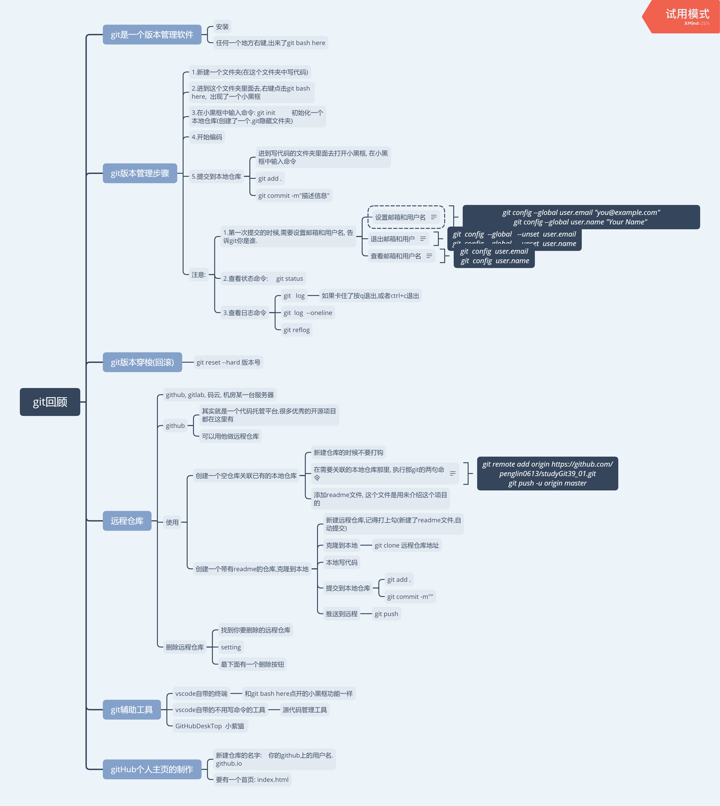
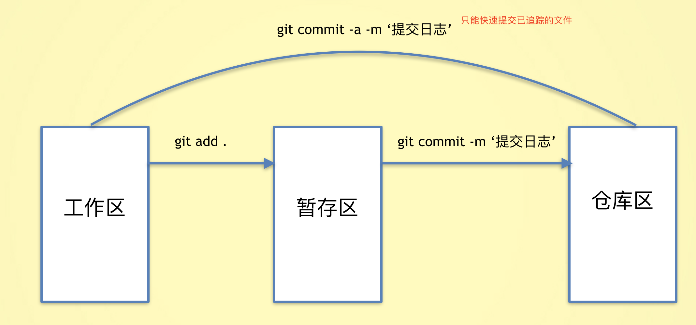
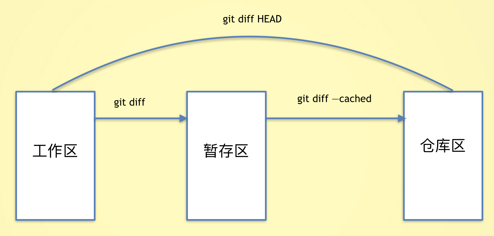

# git

是版本管理软件

版本管理

### git init

```js
作用：初始化git仓库，想要使用git对某个项目进行管理，需要`git init`进行初始化
```

### git add .

```js
# 将index.html添加到暂存区
git add index.html

# 将css目录下所有的文件添加到暂存区
git add css

# 将当前目录下所有的js文件添加到暂存区
git add *.js

# 添加当前目录下所有的文件
git add .
git add -A
git add --all

注意点：空的文件夹是会被忽略掉的，如果想要提交这个文件夹，一般会在该目录下创建一个.gitkeep文件
```

### git status 

```js
查看提交状态
- 红色表示工作区中的文件需要提交
- 绿色表示暂存区中的文件需要提交
```


### git commit 

```js
# 将文件从暂存区提交到仓库
git commit -m "提交说明"

# 如果不写提交说明，会进入vi编辑器，没有写提交说明，是提交不成功的。
git commit   # 需要使用vi输入内容

# 如果是一个已经暂存过的文件，可以快速提交，如果是未追踪的文件，那么命令将不生效。
git commit -a -m '提交说明'

# 修改最近的一次提交说明， 如果提交说明不小心输错了，可以使用这个命令
git commit --amend -m "提交说明"
```

### git log

```js
- 作用：查看提交日志
git log查看提交的日志 
git log --oneline   
git reflog 查看全部
```



### git diff

```js
# 查看工作区与暂存区的不同
git diff

# 查看暂存区与仓库区的不同
git diff --cached

# 查看工作区与仓库区的不同，HEAD表示最新的那次提交
git diff HEAD

# 查看两个版本之间的不同
git diff c265262 de4845b

# 查看pull下来的和上一次提交的差别
git diff HEAD^1

# 比当前提交新2个的提交的比较：
git diff HEAD~2
```



### git reset

```js
作用：版本回退，将代码恢复到已经提交的某一个版本中。

git reset --hard 版本号

git reset --hard head~1`将版本回退到上一次提交
- ~1:上一次提交
- ~2:上上次提交
- ~0:当前提交

git reflog 查看所有版本信息
```

### git忽视文件

```js
在仓库的根目录创建一个`.gitignore`的文件，文件名是固定的。

将不需要被git管理的文件路径添加到`.gitignore`中.
# 忽视idea.txt文件
idea.txt

# 忽视css下的index.js文件
css/index.js

# 忽视css下的所有的js文件
css/*.js

# 忽视css下的所有文件
css/*.*
# 忽视css文件夹
css
```

### git pull

```js
拉 同步最新代码
```


### 查看设置邮箱和用户

```js
	git config user.email
	git config user.name

##### 修改用户邮箱和用户名:

第一种办法:  直接重新再设置一下,他就会覆盖.

git config --global user.email "you@example.com"
git config --global user.name "Your Name" 

第二种办法:  退出再登录

	退出:
git  config  --global   --unset  user.email
git  config  --global   --unset  user.name
推荐大家使用 github注册的邮箱和用户名来登录.
```

### git branch

```js
新建分支: git branch 分支名
切换分支: git checkout 分支名
合并分支: git merge 分支名 //回到主分支合并
删除分支: git branch -d 分支名
```

## git stash -u 存档

```
git stash -u 存档
git stash pop

```


### 远程仓库github

是代码托管平台

1.github

2.gitlab

3.码云

4.公司机房


### 本地同步至githab

```js
git remote rm origin  //清除

git remote add origin https://

git push -u origin master
# 给远程仓库设置一个别名
git remote add 仓库别名 仓库地址
git remote add autumnFish git@github.com:autumnFish/test.git

# autumnFish
git remote remove autumnFish

# git clone的仓库默认有一个origin的别名


修改远程仓库地址
git remote set-url origin [url]
git push origin master
```

### git clone

```js
git clone https://

git push 
```

​               

### 本地git工作流程

### 


# github

### 远程仓库

以下这些都可以作为远程仓库.

1.github

2.gitlab

3.码云

4.公司的机房里某一台服务器(电脑)

5.....

### github 是什么

<https://github.com/>

1.是一个免费的远程仓库

2.是一个代码托管平台,很多优秀的开源的项目都有放在github上,供大家学习/使用.

3.自嘲:"全球最大的同性交友网站"

##### github和git有关系吗?

没有,就是名字长的很像而已, 就像北大和北大某鸟的关系...

git是代码版本管理工具, 同样的工具还要svn等之类的.

github是一个代码托管平台.


### git辅助工具

#### 1.vscode自带的小黑框-终端

1. 1vscode自带小黑框(终端)

    

2. 2注意,一定要注意路径的问题,  一定要是在git管理的那个文件夹下.

#### 2.vscode自带了一个不用写命令的工具

 

2.1 选中你要add的文件, 点加号,  就相当于git add .

2.2 点击勾勾√  , 就相当于  git commit -m""

2.3 点击...后,选择推送  ,  就相当于是git push


#### 3.像vscode自带的git这样的工具有很多种.

 TortoiseGit  小乌龟

  sourceTree  

  GitHubDeskTop  小紫猫     GitBub官方推出的.

 

3.1  小紫猫的使用.​      

 

 

# 制作github个人主页


把这个新建的库克隆到本地

   


这个文件夹里面一定要有一个index.html页面


注意:

​       不要往这个个人主页这个文件夹里面丢java,c#等其他语言的代码.

​       不要丢之前写的图灵的聊天机器人


廖雪峰讲git:

https://www.liaoxuefeng.com/wiki/896043488029600/896067008724000


https://www.liaoxuefeng.com/wiki/1022910821149312


http://www.ruanyifeng.com/blog/2015/07/flex-examples.html


http://es6.ruanyifeng.com/

​    


# 大事件

## iframe

```js
 <iframe src="" frameborder="0" name="myiframe"></iframe>

 <a href="" target="myiframe"></a>
iframe为子页面;
修改父主页时,需要parent.
```

serialize()

```js
serialize()是jq方法
获取form表单里带有name属性的标签的值,一次性获取.
var data = $('form').serialize();

返回key1=value1;的字符串;
```

# 插件

## 分页插件

```js
http://josecebe.github.io/twbs-pagination/
--------------
$('#pagination-demo').twbsPagination({
        totalPages: 35,
        visiblePages: 7,
        onPageClick: function (event, page) {
            $('#page-content').text('Page ' + page);
        }
    });
-----------------动态总页数
    var $pagination = $('selector');
    var defaultOpts = {
        totalPages: 20
    };
    $pagination.twbsPagination(defaultOpts);
    $.ajax({
        ...,
        success: function (data) {
            var totalPages = data.newTotalPages;
            var currentPage = $pagination.twbsPagination('getCurrentPage');
            $pagination.twbsPagination('destroy');
            $pagination.twbsPagination($.extend({}, defaultOpts, {
                startPage: currentPage,
                totalPages: totalPages
            }));
        }
    });  
```

