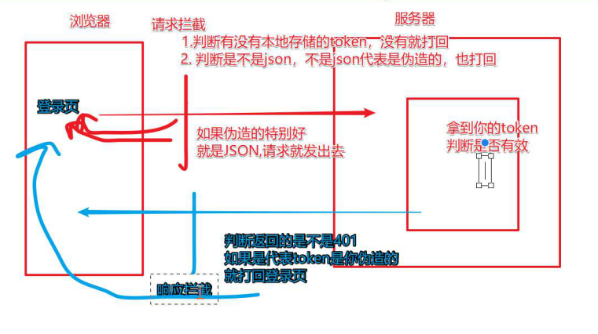

# 一、VUE-指令

- vue提供给HTML标签新增的属性

- 是带有v-前缀的特殊特性

    

## 1. v-text

```js

	-特点:
		--强制覆盖标签内所有的内容;
		--不能解析html;
	-语法:
    	<span v-text="msg"></span>
    	<!-- 和下面的一样 -->
    	<span>{{msg}}</span>
	
 --{{ }}
	-特点:
		--可三元表达式;
		--数值运算,字符串拼接;
		--数据可是arr,obj
```

## 2. v-html

```
强制覆盖里面的内容
```

## 3. v-bind

#### 3.0 - 基本使用

```js
简写: :
作用:将data里数据,绑定到htm标签的属性上

语法:
    
    <p v-bind:title='msg'>
        {{msg}}
    </p>

class操作:
	v-bind:class='参数' ;
	v-bind:class='true ? classA : '' '; //三元表达式,classA为data的参数;
	v-bind:class="[classA,classB]"; //数值传入多个 类名参数;
	v-bind:class="[classA,classObj]" //
	v-bind:class="classObj";	//对象通过value的true或false ;
		classObj:{
            classA:true,
            classB:false
        }

style操作:
	v-bind:style='{height="200px"}';
	v-bind:style='styleobj';
	v-bind:style='[styleobj1,styleobj2]'

<div v-bind="{ id: someProp, 'other-attr': otherProp }"></div> //批量绑定

```

#### 3.1 - class

##### 	3.1.1 	-	对象语法

- ```js
   v-bind:class="{ active: isActive, 'text-danger': hasError }"
   data: {
    isActive: true,
    error: null
  },
  ```

#####    3.1.2 	-	数组语法

- ```js
  <div v-bind:class="[activeClass, errorClass]"></div>
  data: {
    activeClass: 'active',
    errorClass: 'text-danger'
  }
  
  结果:<div class="active text-danger"></div>
  
  
  数组三元表达式:
  <div v-bind:class="[isActive ? activeClass : '', errorClass]"></div>
  
  计算属性类名:
  <div :class="Aclass"></div>
  computer:{
      Aclass(){
          return [
              'active',
              activeA:true,
          ]
      }
  }
  ```

#####   3.1.3 	-	组件类名叠加

- ```js
  组件类目叠加规则：
  Vue.component('my-component', {
    template: '<p class="foo bar">Hi</p>'
  })
  
  <my-component class="baz boo"></my-component>
  
  渲染结果:<p class="foo bar baz boo">Hi</p>
  
  标签类名叠加：
  <p class="foo" ：calss="bar">Hi</p>
  ```

####  3.2 - style

##### 	3.2.1 - 对象语法

- ```js
  <div v-bind:style="{ color: activeColor, fontSize: fontSize + 'px' }"></div>
  
  data: {
    activeColor: 'red',
    fontSize: 30
  }
  ```

##### 	3.2.2 - 数组语法

- ```js
  <div v-bind:style="[baseStyles, overridingStyles]"></div>
  
  baseStyles 为对象
  ```

##### 	3.2.3 - 多重值

- ```js
  <div :style="{ display: ['-webkit-box', '-ms-flexbox', 'flex'] }"></div>
  
  这样写只会渲染数组中最后一个被浏览器支持的值。在本例中，如果浏览器支持不带浏览器前缀的 flexbox，那么就只会渲染 display: flex。
  ```

## 	4. v-on

#### 	4.0 - 基本

- ```js
  简写:@
  作用:给元素绑定事件
  	
  	事件声明用:methods
      
  <div id="app" >
          <button v-on:click = 'fn'>点击</button>
  		<button @:click = 'fn'>点击2</button>
  </div>
  
  const app = new Vue({
      el:"#app",
      data:{
          msg:"库"
      },
      methods:{
          fn(){
             this.msg = '酷酷' //改变msg的属性值
          },
          fn2(){
              console.log(event) //vue的事件对象是event
          }
      }
  })
  ```

  

#### 	   4.1 - 事件修饰符

- ```js
  阻止事件默认行为
  	<button v-on:click.prevent = 'fn'>点击</button>
  
  .stop - 调用 event.stopPropagation()。
  .prevent - 调用 event.preventDefault()。
  .capture - 添加事件侦听器时使用 capture 模式。
  .self - 只当事件是从侦听器绑定的元素本身触发时才触发回调。
  .{keyCode | keyAlias} - 只当事件是从特定键触发时才触发回调。
  .native - 监听组件根元素的原生事件。
  .once - 只触发一次回调。
  .left - (2.2.0) 只当点击鼠标左键时触发。
  .right - (2.2.0) 只当点击鼠标右键时触发。
  .middle - (2.2.0) 只当点击鼠标中键时触发。
  .passive - (2.3.0) 以 { passive: true } 模式添加侦听器
  ```

#### 	this

```js
this指向vue的实例;

箭头函数:this指向的是window//参数指向的是window
```

## 5. v-model

```js
用于input textarea select ,动态绑定,双向绑定
用来获取用户输入的内容;


修饰符:
.lazy - 取代 input 监听 change 事件
.number - 输入字符串转为有效的数字
.trim - 输入首尾空格过滤
.sync 修饰符多个v-model
<my-dialog  :visible="dialogVisible"  @update:visible="newVisible => dialogVisible = newVisible"/>

```

## 6. v-for

作用：用于渲染列表；必须带key

#### 	6.1 - 数组渲染

- ```js
  <p v-for="(item,index) in arr"></p>
  <p v-for="item in arr"></p>
  
  ```

####    6.2 - 对象渲染

- ```js
  <div v-for="(value, key, index) in object">
  ```

####    6.3 - 计算属性 方法

- ```js
  用于过滤数据后渲染
  
  <li v-for="n in evenNumbers">{{ n }}</li>
  <li v-for="n in even(numbers)">{{ n }}</li>
  
  data: {
    numbers: [ 1, 2, 3, 4, 5 ]
  },
  computed: {
    evenNumbers: function () {
      return this.numbers.filter(function (number) {
        return number % 2 === 0
      })
    }，
    even: function (numbers) {
      return numbers.filter(function (number) {
        return number % 2 === 0
      })
    }
  }
  ```

####    6.4 - 使用template

- ```js
  用template 包裹多个标签，template不会被渲染到页面，避免多余标签。
  <template v-if='true'>
  	<p>1</p>
  	<p>1</p>
  	.......
  </template>
  ----------------
  
  应用：渲染不同的 li标签
  <ul>
    <template v-for="item in items">
      <li>{{ item.msg }}</li>
      <li class="divider"></li>
    </template>
  </ul>
  ```

  

####   6.5 - 渲染组件

- ```js
  有些 HTML 元素，<ul>、<ol>、<table> 和 <select>，
  内部只能放特定标签<li>,<tr> <option>等；
  
  <blog-post-row /> 为组件
  
  <ul>
    <blog-post-row></blog-post-row>
  </ul>
  <blog-post-row> 会被作为无效的内容提升到外部，并导致最终渲染结果出错。
  
  <ul>
    <tr is="blog-post-row"></tr>
  </ul>
  
  需要注意的是如果我们从以下来源使用模板的话，这条限制是不存在的：
  
  字符串 (例如：template: '...')
  单文件组件 (.vue)
  <script type="text/x-template">
  ```

  

#### 6.6 - v-for中获取不到DOM解决

##### 	6.6.1 - this.$nextTick

- ```js
  1.
  mounted（）{
      this.$nextTick(() => {
        //获取DOM
   	});
  }，
  
  2.当-for中渲染数据为异步请求时；1中方法可能获取不到；需要把this.$nextTick放在获取数据之后；
  
  mounted(){
  	this.$axios.get('/data').then((res=>{
          //data 为渲染for的数据
          this.data = res.data
          this.$nextTick(() => {
        		//获取DOM
   		});
      }))
  }
  
  ```

##### 	6.6.2 - 放入updated中获取

- ```
  每次跟新视图，都会触发该操作。
  ```

#####     6.6.3 - 放入setTimeout中获取

- ```js
  mounted(){
      setTimeout(() => {
  		//获取DOM
      }, timeout);
  }
  ```

#### 6.7 - v-for强制渲染

- ```js
  层级过深可能影响渲染：用如下强制渲染
  this.$forceUpdate()
  ```

  

## 	v-if

```js
v-if
v-else-if
v-else

v-else 元素必须立即跟在 v-if 或 v-show 元素的后面——否则它不能被识别。
```

## 	v-show

```js
v-show='isshow=false'
v-show='isshow'
data:{
    isshow:true
}
通过控制data的isshow,来控制v-show
```

## v-cloak

```js
防止暴露{{val}}语法
<style>
	[v-cloak]{
        display:none;
    }
</style>
<div id='app' v-cloak>
</div>
```

## v-once

```js
只被渲染一次
<p v-once>{{msg}}</p> 
```

## v-pre

```js
不解析
<p v-pre>{{msg}}</p> // {{msg}}
```


# 插槽slot

```js
父用子组件时标签内的内容不会被渲染;所以在子组件加入<slot></slot>插槽,接收父调用子组件标签内的内容.

父:
<son> 
	<div>1</div>
	<div>2</div>
</son>
子:
<div>
	<slot></slot> // 1 2
	<slot></slot> // 1 2
</div>


```

#### 具名插槽:

```js
2.6后弃用
父:
<son> 
	<div slot="a">1</div>
	<div slot="b">2</div>
</son>

子:
<div>
	<slot name="a"></slot> // 1 
	<slot  name="b"></slot> // 2
</div>

新语法: v-slot: 只能用在组件上或用<template>包起来
	-父:
        <son> 
            <template v-slot:a> //a不需要用""
                <div>1</div>
            </template>

            <template v-slot:b>
                <div>2</div>
            </template>
        </son>

	-子:
        <div>
            <slot name="a"></slot> // 1 
            <slot  name="b"></slot> // 2
        </div>
```

#### 作用域插槽

```js
子:
<slot  name="slotName" :b="sondata"> </slot>
data(){
	return{
        sondata:'啦啦'
    }
}
```

```js
解决子组件数据向父传递

新语法:
父:
`1.正常写法:`
<template v-slot:slotName="c" > //指定插槽并接收数据 slotName为插件槽名,默认:difault
    <div>{{c.b}}</div> //啦啦
</template>
```

```js
`2.解构写法:`
<template v-slot:slotName="{b}" > 
    <div>{{b}}</div> //啦啦
</template>
```

```js
动态插槽名
<template v-slot:[slotName]="{b}" > 
    <div>{{b}}</div> //啦啦
</template>
```

#### this.$slots

```js
子组件中判断是否有用某个slots
mounted() {
    this.desc = this.$slots.slotName !== undefined;
  }

默认为slotName为 default
```


# 二、VUE-方法

## filters-过滤器

```js
html中使用：

<p> {{val | fn(a) }} </p>
<div :id="message | fn(a)"></div>


1.filter的第一个参数为html中的值；
2.需要return 新值
3.可传参；
filters:{
	fn(val,a){
		return ~~(val/60)+'分'+(val%60)+'a'; //使用val不使用this
	}
}


1.过滤器可传参数;

2.链式调用
{{val | fn | fn2```}}//顺序左到右


3.全局过滤器
 单个
Vue.filter('formaTime',(val)=>{
	return 
})

	多个：
import * as filters from './filters'

Object.keys(filters).forEach(key => {
  Vue.filter(key, filters[key])
})
```

filters中获取this的方法

- ```js
  var that = this
  export default {
  	beforeCreate () {
      	that = this
  	},
  	filters:{
  		fn(val){
  			
  			return x
  		}
  	}
  }
  ```


## computed-计算属性

```js
用法：
1.在computed属性对象中定义计算属性的方法，在页面中使用{{方法名}}来显示计算的结果。

2.通过getter\setter实现对属性数据的显示和监视，计算属性存在缓存，多次读取只执行一次getter计算。
	只有当计算属性重新赋值时才执行set；

computed:{
	fn(){
		return ~~(this.num/60)+'分'+(this.num%60)
	}
},

<p> {{fn }} </p>

写法二/
computed：{
    fn：{ //对象写法
        get（）{
        
        },
        set(){
            
        }
    }
}
写法三:传入参数
computed:{
    Compute_data(){
        return (params)=>{
            return params+2
        }
    }
}

案例设置全选:
<span @click="isAll = !isAll"></span>
isAll: {
      get () {
        // 所有商品都勾选，为true
        return this.goodsList.every(v => {
          return v.checked
        })
      },
      set (newValue) { //点击时改变isAll则会触发set()
        console.log(newValue)
        this.goodsList.forEach(v => {
          v.checked = newValue
        })
      }
    }
```

## watch-侦听器

```js
data: {
    myNumber: 'Dawei',
        obj: {
        a: ''
    }
  },
watch:{
   	/*第一种写法: 方法写法*/
	myNumber(new,old){
		
	}
    
    /*第二种写法: 字符串方法名*/
    myNumber:'方法名'
    
    /*第三种写法: 对象*/
    myNumber:{
        handler(new,old){
            
        }
        immediate: true //true为立即执行,首次绑定是否执行
    }
    
     /*第四种写法: 字符串对象*/
    'obj.name':{ //直接找到要侦听对象,减少性能损耗
        handler(new,old){
            
        },
        deep:true //深度监听 复杂类型侦听
        immediate: true //true为立即执行,首次绑定是否执行
    },
    
}

判断:
watch:{
	"$route.params.keywords"(new,old){ //注意加""   
		
	}
   //检测$route.params的变化
}
```

方法:

```js
handler(new,old){};//要执行的方法
immediate:true;//首次绑定是否执行
deep:true//深侦听
```


#### 注销侦听

```js
1.组件内的侦听器会随着组件销毁而销毁;
2.组件外的侦听器需要运用unWatch方法注销;防止内存溢出;

侦听中的handler()如用箭头函数,则this无法获取vue的实例;
```


# 三、生命周期

  


```js
beforeCreate 	组件实例刚被创建，组件属性计算之前，如data属性等
created 	组件实例创建完成，属性已绑定，但DOM还未生成，$el属性还不存在

beforeMount 	模板编译 / 挂载之前
mounted 	    模板编译 / 挂载之后

beforeUpdate 	组件更新之前
update 	        组件更新之后

beforeDestory 	组件销毁前调用
destoryed 	    组件销毁后调用

activated 	    组件被激活时调用(能看到的)
deactivated 	组件被移除时调用(离开,看不到的)
```


### updated

```js
生命周期是一个方法,
    与el,data平级;
页面渲染后执行
updated(){
    
}
会监听所有数据,导致性能浪费

解决优化:
	
this.$nextTick(()=>{
    //等页面更新渲染完成后,再执行
})


```

### mounted

```js
生命周期:
vue把内部的data和页面内容初始化完毕并渲染挂载到页面上之后,自动执行mounted
mounted(){
    
}
```

### created

```
vue创建后
```


### 获取dom元素,ref

```js
<p ref='p'> </p>

mounted(){
	this.$refs.p
}
------------
mounted() {
	myScroll = new IScroll(this.$refs.box, {
		moserWheel: true,
		scrollbars: true
	})
},
undate(){
	this.myScroll.refresh()
}
```

## $nextTick

```js
async created() {
    localStorage.setItem("login", "login");
    setTimeout(() => {
      console.log(4);
    }, 1000);
    console.log(1);
  },
mounted() {
    console.log(2);
    setTimeout(() => {
      this.data = 2000;
      console.log(5);
      this.$nextTick(() => {
        console.log(7);
        console.log(this.$refs.divbox1);
        console.log(document.getElementsByClassName("box")[12].offsetLeft);
      });
    }, 1000);
    this.$nextTick(()=>{
          console.log(3);
          
    })
  },
updated() {
    console.log(6);
    this.data=20
    this.$nextTick(() => {
      console.log(8);
    });
  }
```


## 自定义指令-directives

```js
局部指令:
    directives:{
     hm:{
         inserted(ele){
             el.focus();//
         }
     }
    }
<input type='text' v-hm> //ele为input元素,执行focus();

全局指令:
    Vue.directive('focus',{
    	inserted:function(el){
        	el.focus()
    	}
	})
```

### 钩子函数

```js
bind：只调用一次，指令第一次绑定到元素时调用。在这里可以进行一次性的初始化设置。

inserted：被绑定元素插入父节点时调用 (仅保证父节点存在，但不一定已被插入文档中)。

update：所在组件的 VNode 更新时调用，但是可能发生在其子 VNode 更新之前。指令的值可能发生了改变，也可能没有。但是你可以通过比较更新前后的值来忽略不必要的模板更新 (详细的钩子函数参数见下)。
```


```js
异常处理            
try{
	return  //试着执行这句,是否有异常,异常则执行catch
}catch{
    return
}
0123 4444
```


# vue-ES6

## ES6导入导出

```js
所有方式的导入,都会执行被导入文件.
一个文件默认只能暴露一个
-导入方式:
`1-默认`:
    默认暴露(导出):
    export default name
    export default {对象}
        默认导入:
    import name from '路径'

2-按名字暴露:
	export const name="jack"
    export const age="18"
    
    导入:
	import { name } from '路径'
	import {name,age} from '路径'
```

例子

```js
文件:one.js
export const name = 'jack'
export default 'abc'

import name from "./one.js" // abc
import {name} from "./one.js" // jack
```

## async await

```js
// async 是用来修饰函数（方法）的
// 代表这个函数里面要做异步操作：读取文件、发请求
// 结论1：如果仅仅只有async跟不加也没区别
// 结论2：await不能单独使用，必须配合async使用，如果你写await所在的函数没用async修饰，会报错
// 结论3：用await修饰的代码，它所在的函数里的后面的代码暂时不执行，要等await修饰的异步操作结束才执行，
//        但是不影响await函数外的代码
// 可以这么说：如果执行了await，相当于可以理解为这个函数就执行完了
// 这么记：await跟return有点像，都会让函数先结束，区别在于return后面的绝对不执行，而await会等异步操作完了后执行


async function readSome(){

    console.log('111111'); //1
    
    await fs.readFile('./files/a.txt',(error,data) => {

        console.log(data.toString());
        
    });

    await fs.readFile('./files/b.txt',(error,data) => {

        console.log(data.toString());
        
    })

    await fs.readFile('./files/c.txt',(error,data) => {

        console.log(data.toString());
        
    })
    
}
readSome()
console.log('我在函数外面');//2

----------

优化axios请求:

1.axios.get方法返回值是promise对象;
2..then,代表promise里面resolve赋值

await 特点:
	1.要等它异步执行完再执行它后面的代码
    2.它的返回值是promise对象的resolve的参数
async created(){
    //加await res返回值是backdata(响应体) 特点2
    let res = await this.$axios.get('url')
	this.form = res.data.data
    
	let res2 = await this.$axios.get("url")
    this.form2 = res2.data.data
}    

```


# 动画

- ### 过渡的类名

    ```css
    .fade-leave-active,
    .fade-enter-active {
      		transition: all .3s ease;
    	}
    
    .fade-enter,
    .fade-leave-to{
      	transform: translateX(10px);
      	opacity: 0;
      }
    
     <transition name="fade">
        <p v-if="show">hello</p>
      </transition>
    ```

    

------

- ### css动画

    ```css
    .bounce-enter-active {
      animation: bounce-in .5s;
    }
    .bounce-leave-active {
      animation: bounce-in .5s reverse;
    }
    @keyframes bounce-in {
      0% {
        transform: scale(0);
      }
      50% {
        transform: scale(1.5);
      }
      100% {
        transform: scale(1);
      }
    }
    
    <transition name="bounce">
        <p v-if="show">Lorem</p>
    </transition>
    ```

    

### 过渡动画

```js
<transtion name='fade'> </transtion>


transition-delay': index*100+'ms'


  .bounceInDown-enter-active,
    .bounceInDown-leave-active {
      animation: bounceInDown 1s;
    } 
 

    .bounceInDown-enter,
    .bounceInDown-leave-to { 
      opacity: 0;
      transform: translateY(30px);
     }
     .bounceInDown-enter-to,
     .bounceInDown-leave{
      opacity: 0;
     }

<transition-group class="weather_list" name="bounceInDown" tag="ul">
    <li :key='index'>
```

## <audio\>

```js
https://developer.mozilla.org/zh-CN/docs/Web/Guide/Events/Media_events


```

------


# 插件

## iScroll插件

```js
http://caibaojian.com/iscroll-5/

const wraper = document.queryseletcor('.wraper')
const myScroll = new Iscroll(wraper,{
   scrollbars:true,//显示滚动条（默认是false不显示）
   mouseWheel:true,//支持鼠标触发区域滚动
   bounce:true,//取消达到边界的缓冲效果
})

this.myScroll.refresh()
刷新
```

```js
mouseWheel: true,//允许鼠标滚动
scrollbars:true//显示滚动条
bounce:true//反弹动画
click:true//允许容器内元素能绑定点击事件
disableMouse: true,//禁用鼠标
scrollX:true,//横向可以用
scrollY:true,//纵向可以使用
startX:0//X方向滚动的起始位置
startY:0//X方向滚动的起始位置
```

```js
https://blog.csdn.net/justlpf/article/details/82783147
myScroll.destroy();//销毁iscroll
myScroll = null;//清空引用
```

## NProgress插件

```js
npm i --save nprogress

import NProgress from 'nprogress'
import 'nprogress/nprogress.css'

NProgress.start() 开启一个进度条
nprogress.done() 关闭一个进度条
```

## 富文本插件

```js
https://github.com/surmon-china/vue-quill-editor
npm install vue-quill-editor --save

// require styles
import 'quill/dist/quill.core.css '
import 'quill/dist/quill.snow.css'
import 'quill/dist/quill.bubble.css'

import { quillEditor } from 'vue-quill-editor'

注册成组件
export default {
  components: {
    quillEditor
  }
}

<channelModel></channelModel>
```

## DayJs

```js

```

## moment-Js

```js
npm install moment --save  

import moment from 'moment'

//全局过滤属性
Vue.filter('dateFormat', function (daraStr, pattern = 'YYYY-MM-DD HH:mm:ss') {
  return moment(daraStr).format(pattern)
})

计算属性中使用:
com_date:function(){
     return moment(new Date()).add(7,'days').format('YYYY-MM-DD')
    }
```

| Input      | Example          | Description                                            |
| :--------- | :--------------- | :----------------------------------------------------- |
| `YYYY`     | `2014`           | 4 or 2 digit year                                      |
| `YY`       | `14`             | 2 digit year                                           |
| `Y`        | `-25`            | Year with any number of digits and sign                |
| `Q`        | `1..4`           | Quarter of year. Sets month to first month in quarter. |
| `M MM`     | `1..12`          | Month number                                           |
| `MMM MMMM` | `Jan..December`  | Month name in locale set by `moment.locale()`          |
| `D DD`     | `1..31`          | Day of month                                           |
| `Do`       | `1st..31st`      | 每月中的第几天                                         |
| `DDD DDDD` | `1..365`         | 一年中的第几天                                         |
| `X`        | `1410715640.579` | Unix timestamp                                         |
| `x`        | `1410715640579`  | Unix ms timestamp                                      |

## bigint

```js
安装:npm i json-bigint

import JSONbig from 'json-bigint'


```

## 移动端自适应

```js
npm install lib-flexible --save-dev

安装:webpack loader:px2rem-loader
npm install px2rem-loader --save-dev

----------
 npm install postcss-pxtorem --save-dev
npm i -S amfe-flexible

mani.js
引入import 'amfe-flexible'

postcss.config.js
module.exports = {
  plugins: {
    'autoprefixer': {
      browsers: ['Android >= 4.0', 'iOS >= 7']
    },
    'postcss-pxtorem': {
      rootValue: 37.5,
      propList: ['*']
    }
  }
}
```

stylus安装

```js
npm install stylus stylus-loader --save-dev

vue.app
<style scoped lang="stylus" rel="stylesheet/stylus">

</style>

mani.js
import './common/stylus/index.styl'

或style
 @import "assets/base.styl";
```

# vue渲染render()

https://www.jianshu.com/p/7508d2a114d3

## 	一、vue渲染方式

- **独立构建**：包含模板编译器，渲染过程`HTML字符串 → render函数 → VNode → 真实DOM节点`
- **运行时构建**：不包含模板编译器，渲染过程`render函数 → VNode → 真实DOM节点`

运行时构建的包，会比独立构建少一个模板编译器。在`$mount`函数上也不同。而`$mount`方法又是整个渲染过程的起始点。用一张流程图来说明：


### 1.	自定义`render函数`

#### 	非单页写法：

```js
Vue.component('anchored-heading', {
    render: function (createElement) {
        return createElement (
            'h' + this.level,   // tag name标签名称
            this.$slots.default // 子组件中的阵列
        )
    },
    props: {
        level: {
            type: Number,
            required: true
        }
    }
})
```

#### 	vue-cli写法：

```vue
.vue文件
去掉<template>即可


<script>
export default {
  methods: {
    btn() {
      console.log("bbb");
    }
  },
  render(h) {
    return h(
      "div",
      {
        class: "menb",
        attrs: {
          id: "boo",
          data: "789"
        },
        // domProps: {
        //   innerText: "啦啦啦"
        // }
        on: {
          click: this.btn
        }
      },
      [h("p", "hellso"), h("p", "lalla")]
    );
  }
};
</script>

<style>
</style>
```

```js
导入：
<template>
	<menA />    
</template>

import menA from './menB'
export default {
	components:{
	menA
	}
}
```

#### 	jsx写法：

```jsx
export default {
    data(){
        return {
            title:'我们'
        }
    },
    render(){
        return <div>
            jsxjsx,{this.title}
        </div>
    }
}
```


### 2.	 `template`写法

```js
let app = new Vue({
    template: `<div>{{ msg }}</div>`,
    data () {
        return {
            msg: ''
        }
    }
})
```

### 3.	`el`写法

```js
let app = new Vue({
    el: '#app',
    data () {
        return {
            msg: 'Hello Vue!'
        }
    }
})
```

## 二、Vue.createElement

### 1.	参数:

- #### param-1: `{String | Object | Function}` 元素

```js
#String 
<div id="app">
    <custom-element></custom-element>
</div>

Vue.component('custom-element', {
    render: function (createElement) {
        return createElement('div')
    }
})

let app = new Vue({
    el: '#app'
})
```


```js
#Object 
Vue.component('custom-element', {
    render: function (createElement) {
        return createElement({
            template: `<div>Hello Vue!</div>`
        })
    }
})
```

```js
#Function
Vue.component('custom-element', {
    render: function (createElement) {
        var eleFun = function () {
            return {
                template: `<div>Hello Vue!</div>`
            }
        }
        return createElement(eleFun())
    }
})
```


- param-2: `{Object}`  元素属性

```js
<div id="app">
    <custom-element></custom-element>
</div>

Vue.component('custom-element', {
    render: function (createElement) {
        var self = this

        // 第一个参数是一个简单的HTML标签字符 “必选”
        // 第二个参数是一个包含模板相关属性的数据对象 “可选”
        return createElement('div', {
            'class': {
                foo: true,
                bar: false
            },
            style: {
                color: 'red',
                fontSize: '14px'
            },
            attrs: {
                id: 'boo'
            },
            domProps: {
                innerHTML: 'Hello Vue!'
            }
        })
    }
})

let app = new Vue({
    el: '#app'
})
```

- param-3: `{String | Array}` 可选 子元素

```js
<div id="app">
    <custom-element></custom-element>
</div>

Vue.component('custom-element', {
    render: function (createElement) {
        var self = this

        return createElement(
            'div', // 第一个参数是一个简单的HTML标签字符 “必选”
            {
                class: {
                    title: true
                },
                style: {
                    border: '1px solid',
                    padding: '10px'
                }
            }, // 第二个参数是一个包含模板相关属性的数据对象 “可选”
            [
                createElement('h1', 'Hello Vue!'),
                createElement('p', '开始学习Vue!')
            ] // 第三个参数是传了多个子元素的一个数组 “可选”
        )
    }
})

let app = new Vue({
    el: '#app'
})
```

### 2.属性

```js
{
  // 和`v-bind:class`一样的 API
  // 接收一个字符串、对象或字符串和对象组成的数组
  'class': {
    foo: true,
    bar: false
  },
  // 和`v-bind:style`一样的 API
  // 接收一个字符串、对象或对象组成的数组
  style: {
    color: 'red',
    fontSize: '14px'
  },
  // 正常的 HTML 特性
  attrs: {
    id: 'foo'
  },
  // 组件 props
  props: {
    myProp: 'bar'
  },
  // DOM 属性
  domProps: {
    innerHTML: 'baz'
  },
  // 事件监听器基于 `on`
  // 所以不再支持如 `v-on:keyup.enter` 修饰器
  // 需要手动匹配 keyCode。
  on: {
    click: this.clickHandler
  },
  // 仅对于组件，用于监听原生事件，而不是组件内部使用
  // `vm.$emit` 触发的事件。
  nativeOn: {
    click: this.nativeClickHandler
  },
  // 自定义指令。注意，你无法对 `binding` 中的 `oldValue`
  // 赋值，因为 Vue 已经自动为你进行了同步。
  directives: [
    {
      name: 'my-custom-directive',
      value: '2',
      expression: '1 + 1',
      arg: 'foo',
      modifiers: {
        bar: true
      }
    }
  ],
  // 作用域插槽格式
  // { name: props => VNode | Array<VNode> }
  scopedSlots: {
    default: props => createElement('span', props.text)
  },
  // 如果组件是其他组件的子组件，需为插槽指定名称
  slot: 'name-of-slot',
  // 其他特殊顶层属性
  key: 'myKey',
  ref: 'myRef'
}
```


## 三、挂载方式

```js
var MyComponent = Vue.extend({
  template: '<div>Hello!</div>'
})

// 创建并挂载到 #app (会替换 #app)
new MyComponent().$mount('#app')

// 同上
new MyComponent({ el: '#app' })

// 或者，在文档之外渲染并且随后挂载
var component = new MyComponent().$mount()
document.getElementById('app').appendChild(component.$el)

```

# Vue-extend()

​	Vue.extend({ })

```js
import Vue from 'vue'

const testComponent = Vue.extend({
  template: '<div>{{ text }}</div>',
  data: function () {
    return {
      text: 'extend test'
    }
  }
})

1.
//手动渲染
const extendComponent = new testComponent().$mount()
//可以通过 $el 属性来访问 extendComponent 组件实例
document.body.appendChild(extendComponent.$el)

2.渲染并挂载
new testComponent().$mount('#boxId')

3.作为组件挂载到#box
let todowarp = new testComponent()
Vue.component('todo', todoWarp)
var vm = new Vue({
         el: "#box"
     });

4.vue-cli
let Todowarp = new testComponent()
extend defalut {
	components:{
    	Todowarp
    }
}
```

new.extend({})合并规则

```js
var myVue = Vue.extend({
// 预设选项
})

var vm = new myVue({
// 其他选项
})

实例化extends组件构造器时传入的属性必须是propsDate,而不是props
new testComponent({
	propData:{
        text:'dd'
    }
})

new myVue({})后会合并预设选项和其他选项中的所有属性选项：

1.data数据对象在内部会进行浅合并 (一层属性深度)。

2.钩子函数会先执行预设选项中的

3.值为对象的选项，例如 methods, components 将被混合为同一个对象，两个对象键名冲突时，会以new myVue({})对象的选项为准。

注意：混入 (mixins) 也使用同样的策略进行合并。
```

应用:

>```js
>.vue
>
><template>
><transition name="fade">
>    <div class="message" :class="type" v-show="show">
>      <i class="icon"></i>
>      <span class="text">{{text}}</span>
>    </div>
></transition>
></template>
>
><script type="text/ecmascript-6">
>  export default {
>    name: 'message',
>    props: {
>      type: {
>        type: String,
>        default: 'info',
>        validator: val => ['info', 'success', 'warning', 'error'].includes(val)
>//['info', 'success', 'warning', 'error'] 表示type只接收这四个字符串作为参数传入message组件
>      },
>      text: {
>        type: String,
>        default: ''
>      },
>      show: {
>        type: Boolean,
>        default: false
>      }
>    }
>  }
></script>
>```
>
>
>
>```js
>index.js
>import Message from './Message.vue'
>
>const MESSAGE = {
>  duration: 3000, // 显示的时间 ms
>  animateTime: 300, // 动画时间,表示这个组件切换show的动画时间
>  install(Vue) {
>    if (typeof window !== 'undefined' && window.Vue) {
>      Vue = window.Vue
>    }
>    Vue.component('Message', Message)
>
>    function msg(type, text, callBack) {
>      let msg
>      let duration = MESSAGE.duration
>      if (typeof text === 'string') {
>        msg = text
>      } else if (text instanceof Object) {
>        msg = text.text || ''
>        if (text.duration) {
>          duration = text.duration
>        }
>      }
>      let VueMessage = Vue.extend({
>        render(h) {
>          let props = {
>            type,
>            text: msg,
>            show: this.show
>          }
>          return h('message', {props})
>        },
>        data() {
>          return {
>            show: false
>          }
>        }
>      })
>      let newMessage = new VueMessage()
>      let vm = newMessage.$mount()
>      let el = vm.$el
>      document.body.appendChild(el) // 把生成的提示的dom插入body中
>      vm.show = true
>      let t1 = setTimeout(() => {
>        clearTimeout(t1)
>        vm.show = false  //隐藏提示组件，此时会有300ms的动画效果，等动画效果过了再从body中移除dom
>        let t2 = setTimeout(() => {
>          clearTimeout(t2)
>          document.body.removeChild(el) //从body中移除dom
>          newMessage.$destroy()
>          vm = null // 设置为null，好让js垃圾回收算法回收，释放内存
>
>          callBack && (typeof callBack === 'function') && callBack() 
>      // 如果有回调函数就执行，没有就不执行，用&&操作符，
>      // 只有&&左边 的代码为true才执行&&右边的代码，避免用面条代码：
>      // if(true){
>      //   ... 
>      //   if(true){
>      //   ...
>      //   }
>      // }
>        }, MESSAGE.animateTime)
>      }, duration)
>    }
>
>// 挂载到vue原型上，暴露四个方法
>    Vue.prototype.$message = {
>      info(text, callBack) {
>        if (!text) return
>        msg('info', text, callBack)
>      },
>      success(text, callBack) {
>        if (!text) return
>        msg('success', text, callBack)
>      },
>      error(text, callBack) {
>        if (!text) return
>        msg('error', text, callBack)
>      },
>      warning(text, callBack) {
>        if (!text) return
>        msg('warning', text, callBack)
>      }
>    }
>  }
>}
>export default MESSAGE
>```
>
>```js
>import Vue from 'vue'
>import vMessage from './components/Message/index' 
>Vue.use(vMessage)
>```
>
>

# vue.component

vue.component用于全局注册组件

```js
// 注册组件，传入一个扩展过的构造器
Vue.component('my-component', Vue.extend({ /* ... */ }))

// 注册组件，传入一个选项对象 (自动调用 Vue.extend)
Vue.component('my-component', { /* ... */ })

// 获取注册的组件 (始终返回构造器)
var MyComponent = Vue.component('my-component')
```


# mixin

 来分发 Vue 组件中的可复用功能 

```js
// 定义一个混入对象
var myMixin = {
  created: function () {
    this.hello()
  },
  methods: {
    hello: function () {
      console.log('hello from mixin!')
    }
  }
}

// 定义一个使用混入对象的组件
var Component = Vue.extend({
  mixins: [myMixin]
})

var component = new Component() // => "hello from mixin!"
```

### 1.基础用法

```js
let mixin = {
  data() {
    return {
      msg: 'hello mixin'
    }
  },
  created() {
    console.log('混入的钩子函数');
  },
  methods: {
    show() {
      console.log(this.msg);
    }
  }
}
export default mixin;
```

```js
index.vue

<template>
  <div id="myVue">
    <span @click="show">{{msg}}</span>
  </div>
</template>
<script>
  import myMixin from './mixin.js';
  export default {
    name: 'myVue',
    mixins: [myMixin],
    created() {
      console.log('组件自身的钩子函数');
    }
  }
</script>
```

### 2.main.js中直接全局注册

```js
import Vue from 'vue';
import App from './App';

Vue.mixin({
  created() {
    console.log('全局混入的钩子函数');
  }
});

/* eslint-disable no-new */
new Vue({
  el: '#app',
  components: { App },
  template: '<App/>'
});
```

### 3.模块化注册

```js
export default {
  install(Vue) {
    Vue.mixin({
      created() {
        console.log('全局混入的钩子函数');
      }
    })
  }
}
```

```js
main.js
import Vue from 'vue';
import App from './App';
import myMixin from './mixin.js';

Vue.use(myMixin);

/* eslint-disable no-new */ 
new Vue({
  el: '#app',
  components: { App },
  template: '<App/>'
});
```

# $attrs 和 $listeners

```js
$attrs 所有组件标签中的行内属性,除class和style

组件内调用:this.$attrs;
如何组件内某个标签用:
父:<son :data="data"></son>
子:
<div>  //根标签也会继承
	<input v-bind:$attrs>    
</div>
取消根标签继承:禁用特性继承
export default {
    inheritAttrs:false
}
```

```js
$listeners

子接收:<input v-on="$listeners"> 
    //接收所有父组件写在子组件的事件
```

# $options

```js
this.$options 获取data外得值

export default {
	name:'拉拉',
    data(){
        return{
            
        }
    },
    methods:{
        btn(){
            this.$options.name // 拉拉
        }
    }
}
```


# SPA单页面

```js
预留:什么是SSR服务端渲染
```

```js
https://router.vuejs.org/zh/installation.html
```

```js
vue Router
```

```html
<!DOCTYPE html>
<html lang="en">

<head>
    <meta charset="UTF-8">
    <meta name="viewport" content="width=device-width, initial-scale=1.0">
    <meta http-equiv="X-UA-Compatible" content="ie=edge">
    <title>Document</title>
</head>

<body>
    <div id="app">
        <p>
            <!-- 使用 router-link 组件来导航. -->
            <!-- 通过传入 `to` 属性指定链接. -->
            <!-- <router-link> 默认会被渲染成一个 `<a>` 标签 -->
            <router-link to="/haha">哈哈</router-link>
            <router-link to="/hehe">呵呵</router-link>
            <router-link to="/xixi">嘻嘻</router-link>
            <router-link to="/lala">啦啦</router-link>
        </p>
        <!-- 路由出口 -->
        <!-- 路由匹配到的组件将渲染在这里 -->
        <router-view></router-view>
    </div>
</body>

</html>
<script src="./lib/vue.js"></script>
<script src="./lib/vue-router.js"></script>
<script>
    // 定义 (路由) 组件
    const MyBox1 = {
        data() {
            return {
                msg: "学好vue"
            }
        },
        template: "<div><p>{{msg}}</p></div>"
    }
    const MyBox2 = {
        template: "<div></div>"
    }
    const MyBox3 = {
        template: "<div></div>"
    }
    const MyBox4 = {
        template: "<div></div>"
    }

    // 2. 定义路由
    // 每个路由应该映射一个组件
    const routes = [{
        path: '/haha',
        component: MyBox1
    }, {
        path: '/hehe',
        component: MyBox2
    }, {
        path: '/xixi',
        component: MyBox3
    }, {
        path: '/lala',
        component: MyBox4
    }]

    // 3. 创建 router 实例，然后传 `routes` 配置
    const router = new VueRouter({
       // routes // (缩写) 相当于 routes: routes
        routes:[{
        path: '/haha',
        component: MyBox1
    }, {
        path: '/hehe',
        component: MyBox2
    }, {
        path: '/xixi',
        component: MyBox3
    }, {
        path: '/lala',
        component: MyBox4
    },{
        path:'/long',
        redirect:'/long' // 重定向默认地址
    }],
        linkActiveClass
    })
	
   

    // 4. 创建和挂载根实例。
    // 记得要通过 router 配置参数注入路由，
    // 从而让整个应用都有路由功能
    const app = new Vue({
        el: "#app",
        router
    })
</script>
```

## 编程式导航

```
声明式导航
<a href="/run">aa</a>
<router-link to="/run">aa</router-link>
编程式导航
window.location.href = "地址"
router.push('地址')
```


```js
router.push({ 
    path: 'register', //路径地址
    query: { 
        plan: 'private' //路径参数
    }
})
//输出 /register?plan=private


// 字符串
router.push('home')

// 对象
router.push({ path: 'home' })

// 命名的路由
router.push({ name: 'user', params: { userId: '123' }})

// 带查询参数，变成 /register?key=value
router.push({ path: 'register', query: { key: 'value' }})


this.$router.params.key

 const routes = [{
    path: '/results/:key',
    component: results
  }
```

## 实现原理

>1.History API
>
>```js
>pushState //添加历史
>onpopstate 事件	//响应
>```
>
>2.hash
>
>```js
>location.hash //
>hashchange //监听地址变化
>```
>
>


# VUE-Component 组件

组件化与模块化的不同：

　　　模块化：是从代码逻辑的角度进行分析，方便代码分层开发，保证每个功能模块的只能单一　　

　　　组件化：是从UI界面的角度进行划分，前端的组件化，方便UI组件的重用。

```js
<script type='html/text' id="tempid">  //type="text/x-component"
    <div>
        //和正常vue操作
    {{mymsg}} //kuku
    {{msg}} //bbb
    {{mymsg2}} //aaa
    
    </div>	//只能一个父标签,不能有父元素同级
</script>

Vue.component('my-box',{//建议使用带-
	data:function(){
		return{
			msg:'ddd'
		}
	},
	template:`<p>kukuku {{msg}}</p>`拼接方法
    //template:"#tempid"//引用方法  推荐
    props:{
    	mymsg:{//属性名
			type:String,//Array
    		default:()=>{
    			return 'aaaa'
			}
		},
        mymsg2:{//属性名
			type:String,//Array
    		default:()=>{
    			return 'aaaa'
			}
		},
        mymsg:String,//限制父传过来的数据类型
        mymsg:{
            type:Number,
            required:true //必须传
	}
    或:
	props:['mymsg']
})
const app =new Vue({
    el:"#app",
    data:{
        msg:"bbb"
    }
}) 

<my-box mymsg="kuku"></my-box> //html中调用 
<my-box :mymsg2="msg"></my-box>  //属性:绑定后可以用父的data的值,和组件中props return的值
<my-box :mymsg2="mymsg2"></my-box> 

```

## 1.组件的创建方式

### 	1.vue.component

```jsx
Vue.component('my-component', {
  template: '<div>A custom component!</div>'
})
var vm = new Vue({
  el: '#example',
  data: {
       
  } 
})
```

### 	2.vue.component - 2

`Vue.component` 返回的结果是一个 `function`！它返回的并不是 组件实例，而是一个构造函数。

那到这里其实我们就清楚了。 对于 `Vue.component` 声明的组件，我们先通过 `Vue.component` 获取它的构造函数，再 `new` 出一个组件实例，最后 通过`$mount` 挂载到 `html` 上。

```js
Vue.component("button-counter", {
  data: function() {
    return {
      count: 0
    };
  },
  template:
    '<button v-on:click="count++">You clicked me {{ count }} times.</button>'
});

Vue.component("app", {
  data: function() {
    return {
      count: 0
    };
  },
  template:
    '<div> <h1>App Component</h1><button @click="insert">click to insert new Component</button> <div id="appId"> </div></div>',
  methods: {
    insert() {
      const component = Vue.component("button-counter");
      const instance = new component();
      instance.$mount("#appId");
    }
  }
});

new Vue({
  el: "#app"
});
```


### 	3.vue.extend({ })

通过传入一个包含 `Component options` 的对象， `Vue.extend` 帮助我们创建一个 继承了 `Vue constructor` 的子类，也就是我们需要的构造函数。 

```js
var MyComponent = Vue.extend({
  template: '<div>A custom component!</div>'
});

// 注册
Vue.component('my-component', MyComponent);
var vm = new Vue({
  el: '#example',
  data: {  }
})
```

```js
// 创建构造器
var Profile = Vue.extend({
  template: '<p>{{firstName}} {{lastName}} aka {{alias}}</p>',
  data: function () {
    return {
      firstName: 'Walter',
      lastName: 'White',
      alias: 'Heisenberg'
    }
  }
})
// 创建 Profile 实例，并挂载到一个元素上。
new Profile().$mount('#mount-point')
```


### 	4.vm.$mount

```js
var MyComponent = Vue.extend({
  template: '<div>Hello!</div>'
})

// 创建并挂载到 #app (会替换 #app)
new MyComponent().$mount('#app')

// 同上
new MyComponent({ el: '#app' })

// 或者，在文档之外渲染并且随后挂载
var component = new MyComponent().$mount()
document.getElementById('app').appendChild(component.$el)

```


### 	5.template

```js
<div id="app1">
    <my-love></my-love>
</div>

<template id="temp-com">
    <div>
        <h3>使用template定义的组件</h3>
        <p>使用template定义的组件的内容！</p>
    </div>
</template>

Vue.component('my-love', {
    template: '#temp-com'
});
```


### 	6.使用script定义 

```js
<div id="app1">
    <my-love></my-love>
</div>

<script type="text/template" id="temp-com">
    <div>
        <h3>使用template定义的组件</h3>
        <p>使用template定义的组件的内容！</p>
    </div>
</script>

Vue.component('my-love', {
    template: '#temp-com'
});

```


### 	7.vue-cli组件挂载方式

通过传入一个包含 `Component options` 的对象， `Vue.extend` 帮助我们创建一个 继承了 `Vue constructor` 的子类，也就是我们之前需要的构造函数。 （传入一个组件，获取构造函数）

```js
<template>
  <div id="app">
    <div>
    
  </div>
    <div>
    <button @click="insert">click me to insert ButtonCounter</button>
  </div>
    <div id="container"></div>
  </div>
</template>

<script>
import ButtonCounter from './components/ButtonCounter';
import Vue from 'vue';
export default {
  name: 'App',
  components: {
    ButtonCounter,
  },
  methods: {
    insert() {
      const bcConstructor = Vue.extend(ButtonCounter);
      const instance = new bcConstructor();
      instance.$mount('#container');
    },
  },
};
</script>
```


组件构造函数的构造实例.$mount进行挂载。

$mount为构造实例的方法。


## 2.组件传值

```js
在组件中的使用props中设置 自定义属性名 、html调用组件中 设置同名自定义属性名,绑定v-bind后,可调用父data里的数据
```

### 子向父传

```js
<div id="sonapp">
	<son @click='myclick'> </son>
</div>

//子组件
methods:{
    myclick(){
        this.$emit('func',datanum,...) //func为父的绑定的自定义事件
    }
}

    
//父组件
const app = new Vue({
	el:"#app",
	data:{
	
	},
	methods:{
		showfn(data,...){
			console.log(data,...)
		}
	},
    component:{
        son
    }
})
    //父
    <div id="app">
	<son @func='showfn'> </son>
    <son @func='txt=$event'> </son>
	</div>
```

### 子父,父子相互传

```js
子:

<input :value='msg' type="text" @input="$emit('change',$event.target.value)">
    
    props:['msg']

父:
<son @change="text=$event"  :msg="txt">
    
export default {
    components:{
        son
    },
    data() {
        return {
            txt:""
        }
    },
}
```

>

```js
----------
父:
语法糖:他会帮你生成一段代码
// <son @change="txt = $event" :msg="txt"></son> 相当于此
<son v-model="txt"><son>
---

子:
<input type='text' :value='msg' @input="$emit('change',$event.target.value)">
//如果不是原生标签$event即可
props:['msg']
//子组件写model 父调用时会自动生成
//<son @change='txt=$event' :msg="txt"></son>
model:{
	prop:"msg",
	event:"change"
}

-----------------------------------------
//每个组件都有model,event默认值是input;prop的默认值是value
model:{ //默认如下
    event:'input'
}

默认下的简写
子:
<input :value="value" type="text" @input="$emit('input',$event.target.value)"> 
    props:['value']

父:
<son v-model="txt"></son>

--------------
父
<my-comp v-model="checked"></my-comp>

子:
export default {
  name: 'MyComp',
  props: ['checked'],
  model: {
    prop: 'checked',
    event: 'change'
  }
}

```

## 3.组件传参方式

### 1.prop

```js
1.父组件中定义值;
2.调用子组件并引用;
3.在引用的标签上给子组件传值。

父:
<child message="我是子组件一！"></child>
<child v-bind:message="msg"></child>

子:
 export default {
 	props: ['message']
 }
```

> ```js
> props: {
> // 基础的类型检查 (`null` 和 `undefined` 会通过任何类型验证)
> propA: Number,
>   
> // 多个可能的类型
> propB: [String, Number],
>   
> // 必填的字符串
> propC: {
> type: String,
> required: true, //必填
> default: 100		//默认值
>   default:()=>[1,2,3] //如默认为object则用函数写法
> },     
>   
> // 带有默认值的对象
> propE: {
> type: Object,
> // 对象或数组默认值必须从一个工厂函数获取
> default: function () {
>   return { message: 'hello' }
> }
> },
>   
> // 自定义验证函数
> propF: {
>     validator: function (value) {
>       // 这个值必须匹配下列字符串中的一个
>       return ['success', 'warning', 'danger'].indexOf(value) !== -1
>     }
>  }
>     
> }
> ```
>
> 

### 2.$ref

```js
父:
<child ref="msg"></child>
    mounted: function () {
      	this.$refs.msg.getMessage('啦啦！')
     }
 
 子:
     methods:{
      	getMessage(m){
      		this.message=m; //啦啦！
      	}
     }
```

###  3.**$emit**  子 => 父

```js
子:
 mounted: function () {
  this.$emit('getMessage', '我是父组件！')
 }

父:
<child @getMessage="showMsg"></child>

methods:{
  showMsg(title){
  	this.title=title; //我是父组件！
  }
 }
```

### 4.bus

```js
//bus.js
import Vue from 'vue'
export default new Vue()

import Bus from './bus.js'
export default {
  methods: {
       elementByValue: function () {
            Bus.$emit('val', this.elementValue)
       }//val 自定义事件 
  	}
 }

import Bus from './bus.js'
 Bus.$on('val', (data) => {
    this.name = data
   })
```

## 4.Vue子组件调用父组件的方法

 https://www.cnblogs.com/jin-zhe/p/9523782.html 

```js
第一种方法是直接在子组件中通过this.$parent.event来调用父组件的方法

this.$parent.fatherMethod(); //fatherMethod 组件中的方法
```

```js
第二种在子组件里用$emit向父组件触发一个事件

this.$emit('fatherMethod');
```

```js
第三种是父组件把方法传入子组件中，在子组件里直接调用这个方法
利用props传入
```


## 5.组件缓存方法

```js
使用keep-alive 钩子执行顺序
beforeRouteEnter --> created --> mounted --> activated --> deactivated
```

```js
无keep-alive  钩子执行顺序
beforeRouteEnter -->activated --> deactivated 
```

#### 1.标签包裹方法

```js
组件缓存
include - 字符串或正则表达，只有匹配的组件会被缓存
exclude - 字符串或正则表达式，任何匹配的组件都不会被缓存

<keep-alive include="组件名">
	<组件>
</keep-alive>

<keep-alive exclude="组件名"> //不被缓存
	<组件>
</keep-alive>


如父级也被销毁,则父级组件也要被keep-alive包着;

会用到的钩子
activated 	组件被激活时调用(能看到的)
deactivated 	组件被移除时调用(离开,看不到的)
```

原理:

```js
created钩子会创建一个cache对象，用来作为缓存容器，保存vnode节点。

created () {
    /* 缓存对象 */
    this.cache = Object.create(null)
},
destroyed钩子则在组件被销毁的时候清除cache缓存中的所有组件实例。

/* destroyed钩子中销毁所有cache中的组件实例 */
destroyed () {
    for (const key in this.cache) {
        pruneCacheEntry(this.cache[key])
    }
},
```


#### 2.router.meta方法

```js
router-view 也是一个组件，所有路径匹配到的视图组件都会被
<keep-alive>
    <router-view>
        <!-- 所有路径匹配到的视图组件都会被缓存！ -->
    </router-view>
</keep-alive>


```

> ​	解决办法1
>
> ```js
> <keep-alive include="a">
>     <router-view>
>         <!-- 只有路径匹配到的视图 a 组件会被缓存！ -->
>     </router-view>
> </keep-alive>
> ```

>​	解决办法2
>
>```js
>增加 router.meta 属性
>export default [
>  {
>    path: '/',
>    name: 'home',
>    component: Home,
>    meta: {
>      keepAlive: true // 需要被缓存
>    }
>  }, {
>    path: '/:id',
>    name: 'edit',
>    component: Edit,
>    meta: {
>      keepAlive: false // 不需要被缓存
>    }
>  }
>]
>```
>
>```js
><keep-alive>
>    <router-view v-if="$route.meta.keepAlive">
>        <!-- 这里是会被缓存的视图组件，比如 Home！ -->
>    </router-view>
></keep-alive>
>
><router-view v-if="!$route.meta.keepAlive">
>    <!-- 这里是不被缓存的视图组件，比如 Edit！ -->
></router-view>
>```
>
>

#### 3.路由导航守卫

​	需求:

- B 跳到 A，A 不刷新
- C 跳到 A，A 刷新

>1. 在 A 路由里面设置 *meta* 属性：
>
>```js
>{
>        path: '/',
>        name: 'A',
>        component: A,
>        meta: {
>            keepAlive: true // 需要被缓存
>        }
>}
>```
>
>2. 在 B 组件里面设置 *beforeRouteLeave*：
>
>```js
>export default {
>        data() {
>            return {};
>        },
>        methods: {},
>        beforeRouteLeave(to, from, next) {
>             // 设置下一个路由的 meta
>            to.meta.keepAlive = true;  // 让 A 缓存，即不刷新
>            next();
>        }
>};
>```
>
>3. 在 C 组件里面设置 *beforeRouteLeave*：
>
>```js
>export default {
>        data() {
>            return {};
>        },
>        methods: {},
>        beforeRouteLeave(to, from, next) {
>            // 设置下一个路由的 meta
>            to.meta.keepAlive = false; // 让 A 不缓存，即刷新
>            next();
>        }
>};
>```

#### 4.缓存解决方案

[参考](https://blog.csdn.net/liangcha007/article/details/84763438)

```js
4.1前进刷新>后退不刷新
​```js
<keep-alive>
    <router-view v-if="$route.meta.keepAlive">
</router-view>
</keep-alive>
    <router-view v-if="!$route.meta.keepAlive">
</router-view>
​```

js
var routerList = [];
var keepAlived = ['dispatchIndex', 'serviceIndex', 'manageIndex'];
router.beforeEach((to, from, next) => {
  var li = routerList.length;
  if (li > 0 && routerList[li - 1] == to.name) { // 后退
    routerList.splice(routerList.length - 1, 1)
    if (keepAlived.indexOf(from.name) > -1) {
      from.meta.keepAlive = true;
    }
  } else { // 前进
    if (!ctool.strIsEmpty(from.name)) {
      routerList.push(from.name);
      if (keepAlived.indexOf(to.name) > -1) {
        if (to.meta.keepAlive) {
          to.meta.keepAlive = false;
        } else {
          to.meta.keepAlive = true;
        }
      }
      if (keepAlived.indexOf(from.name) > -1) {
        from.meta.keepAlive = true;
      }
    } else {
      console.log("-------------");
    }
  }
  next()
})

4.2后退可能需要刷新

<keep-alive :include="includedComponents" :exclude="excludedComponents">
        <router-view></router-view>
</keep-alive>

computed:{
      includedComponents(){
        return this.$store.state.includedComponents;
      },
      excludedComponents(){
        return this.$store.state.excludedComponents;
      }
}

 -main.js
var routerList = [];
router.beforeEach((to,from,next)=>{
  var li = routerList.length;
 
  console.log(store.state.includedComponents);
  if(li > 0 && routerList[li - 1] == to.name){
    /*
      如果发现to.name等于list中当前最后一个，则说明是返回操作。
      返回操作的时候，第一步是从list中清掉第一个路由对象。
      第二步是判断一下当前的from.name是不是在缓存属性中，在的话，就从里面拿掉，因为下一次进入的时候，
      要重新刷新。
     */
    routerList.splice(routerList.length - 1, 1);
    if(store.state.includedComponents.indexOf(from.name)>-1){
      console.log('rm',from.name);
      store.commit('removeInclude',from.name);
      store.commit('addToExclude',from.name);
    }
  }else{
    if (!ctool.strIsEmpty(from.name)) {
      routerList.push(from.name);
      if (store.state.excludedComponents.indexOf(to.name) > -1) {
        console.log('ad',to.name);
        store.commit('removeExclude', to.name);
        store.commit('addToInclude', to.name);
      }
    }
  }
  next();
});

	-vuex
import Vue from 'vue'
import vuex from 'vuex'
Vue.use(vuex);
 
const state = {
  includedComponents:['dispatchIndex', 'serviceIndex', 'manageIndex'],
  excludedComponents:[]
}
 
const mutations  = {
  removeInclude(state,str){
    state.includedComponents.splice(state.includedComponents.indexOf(str),1);
  },
  addToInclude(state,str){
    state.includedComponents.push(str);
  },
  removeExclude(state,str){
    state.excludedComponents.splice(state.excludedComponents.indexOf(str),1);
  },
  addToExclude(state,str){
    state.excludedComponents.push(str);
  }
}
 
var store = new vuex.Store({
  state:state,
  mutations:mutations
})
 
export default store;

	-utils.js
clearCache:function(router_name){
    store.commit('removeInclude',router_name);
    store.commit('addToExclude',router_name);
 }

调用修改
ctool.clearCache('B');//ctool挂载在windows上全局对象
this.$router.go(-1);

```


## 6.动态组件

```js
<components is="组件名"> </components> //所有的组件,is指定组件,:is判断显示
```

## 7.异步组件

```js
通过导入方式来生实现
正常写法:
import login from "./login"

异步写法:
const login = ()=> import('./login') //按需才加载 懒加载;

components:{
//****
    login:()=>import ('./login'),//方式1
    login:(resolve)=>require (['./login'],resolve),//方式2
},

//import()返回promise,利用promise的then执行异步
const fn=()=>import('./ddd.vue');
fn.then(function(item){
    console.log(item)
});
//返回不是promise,利用普通的回调执行异步
const fn=(resolve)=>require (['./ddd.vue'],resolve);
fn(function(item){
    console.log(item);
});
    
    
 {
    path: '/test',
    component: () => import(/* webpackChunkName: "test" */ '@/views/test')
  },   
```

## 8.边界情况

```js
- $root ：    找到vue根实例
- $parent： 找到它的父组件
- $children：只是找到儿子们
```

## 9.递归组件

```js
<template>
    <ul class = "dataBaseTree">
        <li v-for = "(item,index) in folder" :key = "index">
            <span @click = "select(item)" :class = "{'active':currentId == item.id}">
                <i class = "folderIcon" v-if = "item.children">
                    <icon :icon = "'xiala'" v-if = "item.show"></icon>
                    <icon :icon = "'xiala2'" v-else></icon>
                </i>
                {{ item.label }}
            </span>
            <el-collapse-transition>
                <DatabaseTree v-if = "item.children && item.show" :folder = "item.children" :select = "select" :currentId = "currentId"></DatabaseTree>
            </el-collapse-transition>
        </li>
    </ul>
</template>

<script>
    import { mapGetters , mapActions} from 'vuex';
    export default{
        name:"DatabaseTree",
        props:["folder","select","currentId"],
        data(){
            return{
                addParams:{
                    label:"",
                    children:[]
                },
                noteData:{
                    children:[]
                }
            }
        },
         computed:{
            ...mapGetters(["catalog"])
        },
        methods:{}
    }
</script>
————————————————
版权声明：本文为CSDN博主「三哥玩前端」的原创文章，遵循 CC 4.0 BY-SA 版权协议，转载请附上原文出处链接及本声明。
原文链接：https://blog.csdn.net/zhaoxiang66/article/details/80940762
```


# VUE-CLI 脚手架

```js
运行nodejs:node -v
安装:npm install -g @vue/cli
创建项目: vue create 文件名
运行:npm run serve

查看webpack配置：
npx vue-cli-service serve [options] [entry]

//查看production配置，并输出到webpack.config.production.js 文件
//加入module.exports ={ }包住，index后加“：”格式化即可无报错。
npx vue-cli-service inspect --mode production >> webpack.config.production.js
npx vue-cli-service inspect --mode development //查看development环境下cli的webpack配置
npx vue-cli-service help serve  //帮助
```

## build

### 1.分析：

```json
"build": "cross-env FILE_NAME=ui vue-cli-service build --report",

packagejson中设置命令行 添加 --report

dist生成report,html打开即可。
```

### 2.打包优化

```json
productionSourceMap: false， //取消生成map文件
productionGzip：true， //开启gzip压缩
```


# VUE-Router 路由

官方地址:https://router.vuejs.org/zh/guide/#html

安装:npm install --save vue-router

```js
总结:
this.$router.push({path:'/login'}) //进行编程式路由跳转
<router-link to="/login"> //中的to属性进行路由切换
<router-view />  用于展示
this.$route.params 获取路由传递参数
this.$route.query	获取路由传递参数
5.params和query都是传递参数区别在于params不会再url上显示出现，
query则是我们通常看到的url后面跟上的？后跟的显示参数
```

```js
// 路由重复点击异常处理
const originalPush = Router.prototype.push
Router.prototype.push = function push(location) {
  return originalPush.call(this, location).catch(err => err)
}
```


#### vue-router路由

```js
Vue-Router 是vue官方的路由管理器。
通过路由地址的变换展现不同的页面;
路由导航有两种:
	声明式导航:router-link
    编程式导航:router.push(path:'url')

通过:router-view标签作为 页面展示区;

```


### 1.组件导航创建 

```html
<div id="app">
  <h1>Hello App!</h1>
  <p>
    <!-- 使用 router-link 组件来导航. -->
    <!-- 通过传入 `to` 属性指定链接. -->
    <!-- <router-link> 默认会被渲染成一个 `<a>` 标签 -->
    <router-link to="/foo">Go to Foo</router-link>
    <router-link to="/bar">Go to Bar</router-link>
  </p>
  <!-- 路由出口 -->
  <!-- 路由匹配到的组件将渲染在这里 -->
  <router-view></router-view>
</div>
```

```js
// 1. 定义 (路由) 组件。
// 可以从其他文件 import 进来
const Foo = { template: '<div>foo</div>' }
const Bar = { template: '<div>bar</div>' }

// 2. 定义路由
const routes = [
  { path: '/foo', component: Foo },
  { path: '/bar', component: Bar }
]

// 3. 创建 router 实例，然后传 `routes` 配置
// 你还可以传别的配置参数, 不过先这么简单着吧。
const router = new VueRouter({
  routes // (缩写) 相当于 routes: routes
})

// 4. 创建和挂载根实例。
// 记得要通过 router 配置参数注入路由，
// 从而让整个应用都有路由功能
const app = new Vue({
  router
})

// 带/则会当做根路径  不带/则会一直嵌套路径
```

独文件写法

```js
`router/index.js`

import Vue from 'vue'
import VueRouter from 'vue-router'

const routes = [
  { path: '/foo', component: Foo },
  { path: '/bar', component: Bar }
]

const router = new VueRouter({
  routes // (缩写) 相当于 routes: routes
})

router.beforeEach(to,from,next){ }

exprot defalute router
```

```js
`main.js`

import router from  './router/index.js'

new Vue({
    render: h => h(App),
    router,
    store
}).$mount('#app')
```


### 2.传参方式

```js
一、
this.$router.push({ path: '/news', query: { userId: 123 }});
接收方式:{{this.$route.query.userId}}

二、
this.$router.push({ name: 'news', params: { userId: 123 }});
接受方式:{{this.$route.params.userId}}

三、 
	传参:
router.push({path: '/foo/' + 'aaaa'})
const routes = [{path: '/foo/:id',component: Foo}]
const routes = [{path: '/foo/:id/:name',component: Foo}] //多个参数
	接收: console.log(this.$route.params.id) //输出aaaa
	接受：this.$router.params

四、prop解耦传参;
    routes:[
        {
        path:'login/:id',
        props:true,
        component:login
        },{
        path:'login/:id',
        props:{
        	id:5,
            age:6
        },
        component:login 
        }
    ]
	接收方式:
    export default {
        name:'login',
        props:['id','age'],
        mounted(){
            console.log(this.id)
            console.log(this.age)
        }
    }
五、指定固定参数
	{
        path:'login/:id',
        props:(route)=>({
            id:route.query.a,
            age:route.query.b
        })
        component:login
     }
地址:localhost:8080/home/?a=1&b=2
 export default {
        name:'login',
        props:['a','b'],
        mounted(){
            console.log(this.a)
            console.log(this.b)
        }
    }

```

>总结
>
>```js
>总结：
>1.params传递参数，需要使用name进行路由跳转，否则无法传递。
>2.params传递参数刷新会丢失数据，/router/:id方式上的id除外
>3.query显示拼接在url上，刷新不丢失，不是必须有，router/:id方式则必须有id参数，否则无法正确进入视图。
>4.props也可以传递参数，但传递的只能是静态参数。
>```
>
>

### 3.children-子路由

```js
子路由
routes:[{
	path:'/index',
	component:template1,
	name:'templatel',
	children:[
        {
          	path:'son',
			component:'son'
        }，
        {
        	path："/son",
        	component:'xxx'
        }
	]
}]

子路由带‘/’与不带‘/’区别：
带‘/’：路由会解析为 baseUrl/son；
不带’/‘：路由会解析为：baseUrl/index/son
```

### 4.导航守卫

```js
导航守卫主要用来通过跳转或取消的方式守卫导航
全局的, 单个路由独享的, 或者组件级的。

全局路由:
router.beforeEach((to, from, next) => {
  // ...去到每个路由之前执行
    next()//放行
    
})

router.afterEach( (to,from) => {
    当进到某个路由后触发的
} )


组件内的导航  
beforeRouteLeave(to,from,next){
    
}
```

全局守卫

```js
全局前置守卫
router.beforeEach((to, from, next) => {
  // ...
})

全局解析守卫
router.beforeResolve

全局后置钩子
router.afterEach((to, from) => {
  // ...
})
```

路由独享守卫

```js
const router = new VueRouter({
  routes: [
    {
      path: '/foo',
      component: Foo,
      beforeEnter: (to, from, next) => {
        // ...
      }
    }
  ]
})
```

组件内守卫

```js
const Foo = {
  template: `...`,
  beforeRouteEnter (to, from, next) {
    // 在渲染该组件的对应路由被 confirm 前调用
    // 不！能！获取组件实例 `this`
    // 因为当守卫执行前，组件实例还没被创建
       next(vm => {
    // 通过 `vm` 访问组件实例
  })
  },
    
    
  beforeRouteUpdate (to, from, next) {
    // 在当前路由改变，但是该组件被复用时调用
    // 举例来说，对于一个带有动态参数的路径 /foo/:id，在 /foo/1 和 /foo/2 之间跳转的时候，
    // 由于会渲染同样的 Foo 组件，因此组件实例会被复用。而这个钩子就会在这个情况下被调用。
    // 可以访问组件实例 `this`
  },
    
    
`这个离开守卫通常用来禁止用户在还未保存修改前突然离开。该导航可以通过 next(false) 来取消。`
    
  beforeRouteLeave (to, from, next) {
    // 导航离开该组件的对应路由时调用
    // 可以访问组件实例 `this`
  }
}
```

#### 	路由解析流程?

```js
1、导航被触发
2、在失活的组件里调用离开守卫 beforeRouterleave
3、调用全局的 beforeEach 守卫
4、在重用的组件里调用 beforeRouteUpdate 守卫
5、在路由配置里调用 beforEnter //路由独享
6、解析异步路由组件
7、在被激活的组件里调用 beforeRouteEnter
8、调用全局的 beforeResolve 守卫
9、导航被确认
10、调用全局的 afterEach 钩子
11、触发 DOM 更新
12、在创建好的实例调用 beforeRouteEnter 守卫中传给 next 的回调函数

作者：woniu12
链接：https://www.jianshu.com/p/96cfc1b9ff21
来源：简书
著作权归作者所有。商业转载请联系作者获得授权，非商业转载请注明出处。
```

  

1. 全局守卫

    - router.beforeEach   全局前置守卫 

        ```js
        const router = new VueRouter({ ... })
          router.beforeEach((to, from, next) => {
          // ...
        })
        ```

        `to: Route:`即将要进入的目标 路由对象

        `from: Route:` 当前导航正要离开的路由

        next: Function:`一定要调用该方法来`resolve`这个钩子。执行效果`依赖 next 方法的调用参数。

    - router.beforeResolve 全局解析守卫

        ```js
        在导航被确认之前，同时在所有组件内守卫和异步路由组件被解析之后，解析守卫就被调用。
        ```


    -  router. afterEach 全局后置钩子
    
    ```js
    不会接受 next 函数也不会改变导航本身：
    router.afterEach((to, from) => {
      // ...
    })
    ```


​    

3. 路由独享守卫

    -  beforeEnter  

    ```js
    const router = new VueRouter({
      routes: [
        {
          path: '/foo',
          component: Foo,
          beforeEnter: (to, from, next) => {
            // ...
          }
        }
      ]
    })
    ```

    

4. 组件内守卫

    -  beforeRouteEnter  不能获取组件实例this;next(vm=>{可获取实例})
    -  beforeRouteUpdate  
    -  beforeRouteLeave 

```js
const Foo = {
  template: `...`,
  beforeRouteEnter (to, from, next) {
    // 在渲染该组件的对应路由被 confirm 前调用
    // 不！能！获取组件实例 `this`
    // 因为当守卫执行前，组件实例还没被创建
  },
  //不过，你可以通过传一个回调给 next来访问组件实例。
  //在导航被确认的时候执行回调，并且把组件实例作为回调方法的参数。
  beforeRouteEnter (to, from, next) {
    next(vm => {
      // 通过 `vm` 访问组件实例
    })
  },
  beforeRouteUpdate (to, from, next) {
    // 在当前路由改变，但是该组件被复用时调用
    // 举例来说，对于一个带有动态参数的路径 /foo/:id，在 /foo/1 和 /foo/2 之间跳转的时候，
    // 由于会渲染同样的 Foo 组件，因此组件实例会被复用。而这个钩子就会在这个情况下被调用。
    // 可以访问组件实例 `this`
  },
    
    //  该组件离开跳转到另外的组件时触发该钩子,常应用于用户表单，当用户填了一部分内容，需要提醒用户是否离开页面
 beforeRouteLeave(to, from, next){
  beforeRouteLeave (to, from, next) {
    // 导航离开该组件的对应路由时调用
    // 可以访问组件实例 `this`
  }
}
```

#### vue-router是如何响应 路由参数变化的:

```js
https://blog.csdn.net/weixin_41639609/article/details/88721627 
watch: {
    '$route' (to, from) {
      // 对路由变化作出响应...
    }
  }
```

```js
 beforeRouteUpdate (to, from, next) {
    // react to route changes...
    // don't forget to call next()
  }
```

#### $route和$router的区别

```
答：$route是“路由信息对象”，包括path，params，hash，query，fullPath，matched，name等路由信息参数。而$router是“路由实例”对象包括了路由的跳转方法，钩子函数等。
```

### 5.路由的原理

#### abstract模式:

```js
服务器端和Node.js. 如果没有浏览器API，路由器将自动强制进入此模式
```

#### hash模式

```
1.就是指 url 尾巴后的 # 号以及后面的字符, 
	请求的时候不会被包含在 http 请求中 只会携带#之前的，
	所以每次改变hash不会重新请求加载页面
2.hash 改变会触发 hashchange 事件
3.hash变化会被浏览器记录，浏览器的前进和后退都能用。
3.能兼容到ie8

监听事件:hashchange事件

https://developer.mozilla.org/zh-CN/docs/Web/API/Location
```

#### history模式

```js
1.页面请求时会带上整个链接，所以后台需要做相对处理，不然返回404
2.不带#号,请求时是整个链接,所以需要服务器的支持把所有路由都重定向到根页面
3.怕刷新,刷新请求,需要服务端配合;

监听事件:popstate

history.back()
history.forward()
history.go()
```


### 6.-属性

#### router

- route为当前路由对象
- router为VueRouter的实例

```js
1.$router.path   //当前路由的路径
2.$router.replace() //
3.$router.go(Number) //
4.$router.back()  //
5.$router.resolve('/login',this.$route,append=true/false)
{
  location: Location;
  route: Route;
  href: string;
} = router.resolve(loction,current?,append?)
```

```js
解决$router.push()不能打开新页面
let routeData = this.$router.resolve({ path: '/reportpreview', query: { id: id } });

window.open(routeData.href, '_blank');
```


#### route

```js
1.$route.params  //参数对象 动态片段和全匹配片段的键值对
2.$route.query   //路由中参数的键值对
3.$route.matched //当前匹配的路径中所包含的所有片段所对应的配置参数对象
4.$route.name    //路径的名字，如果没有使用具名路径
```

### 7.router-link的props属性

#### 1.to

```js
<router-link :to="‘home‘">Home</router-link>

<router-link :to="{ path: ‘home‘ }">Home</router-link>

//命名路由
<router-link :to="{ name: ‘user‘, params: {userId: 123} }">Home</router-link>

//带查询参数，下面的结果为/register?plan=private-->
<router-link :to="{ path: ‘register‘, query: {plan: ‘private‘}}">Register</router-link>
```

#### 2.replace

```js
<router-link :to="{path: ‘/abc‘}" replace>ABC</router-link>

会调用roter.replace()
```

#### 3. append 

```js
<router-link to="b" append>Home</router-link>

设置append属性后，则在当前路径前添加基路径；
如：当前路由为/index；则如上为/index/b
```

#### 4. tag 

```js
<router-link to="/foo" tag="li">FOO</router-link>
// 渲染结果 
<li>FOO</li>

指定<router-link>渲染成某标签；
```

#### 5.active-class

```js
export default New Router({
   linkActiveClass: ‘active‘ 
})

设置链接激活时使用的css类名。默认值可以通过路由的构造选项linkActiveClass来全局配置, 默认值为 ‘router-link-active‘
```

#### 6.exact

```js
"是否激活"，默认是false 。举个粟子，如果当前的路径是/a 开头的，那么<router-link to="/a"> 也会被设置css类名

　　按照这个规则，<router-link to="/"> 将会点亮各个路由！想要链接使用"exact匹配模式"，则使用exact属性：
  
// 这个链接只会在地址为 / 的时候被激活 
<router-link to="/" exact>Home</router-link>

<router-link to="/user">USER</router-link>

<router-link to="/user/userinfo">USER-info</router-link>

// 如果不设置exact，则当路由到了/user/userinfo 页面时，USER也是被设置了router-link-active样式的！
```

#### 7.events

　　声明可以用来触发导航的事件（默认是‘click‘）。可以是一个字符串或者是一个包含字符串的数组

#### 8、将"激活时的css类名"应用在外层元素

　　有时候我们要让"激活的css类名"应用在外层元素，而不是<a>标签本身，那么可以用<router-link>渲染外层元素，包裹着内层的原生<a>标签

```js
<router-link tag="li" to="/foo">
    <a>/foo</a>
</router-link>
//在这种情况下，<a>将作为真实的链接（能获取到正确的href的），而"激活时的css类名"则设置到外层的<li>
```


### 8.写法

```js
正常写法:

import login from '@/views/login'
{
    path:'/login',
    component:login
   	name:login
};

写法二:
const login = ()=> import('./login')  //异步加载
{
    path:'/login',
    component:login
   	name:login
};

写法三:
{
    path:'/login',
    component:()=>import('@/views/login'), //异步加载
   	name:login
};


```

### 9.路由登陆判断

```js
routes:
[
   {
      path: '/cinema',
      redirect: '/page/cinema',
      component: BlankLayout,
      meta: { title: '影院' , requiresAuth: true}
      children: [
        {
          path: '/cinema/plan',
          name: 'cinemaPlan',
          component: () => import('./views/cinema/Plan'),
          meta: { title: '影院排期' }
        },
        {
          path: '/cinema/cinemaDetail',
          name: 'cinemaDetail',
          component: () => import('./views/cinema/CinemaDetail'),
          meta: { title: '影院详情' }
        }
       ]
    }
]
```

```
引入
import Vue from  'vue'
import VueRouter from 'vue-router'
Vue.use(VueRouter)

const router  = new VueRouter({ routes })

export router
```

```js
to.meta && (typeof to.meta.title !== 'undefined' && setDocumentTitle(`${to.meta.title}`))
  if (to.matched.some(record => record.meta.requiresAuth)) {
    // this route requires auth, check if logged in
    // if not, redirect to login page.
    if (!store.getters.token) {
      next({
        path: '/login',
        query: { redirect: to.fullPath }
      })
    } else {
      if (to.query.siteCode) {
        next()
        return
      }
      if (from.query.siteCode) {
        const query = JSON.parse(JSON.stringify(to.query))
        query.siteCode = from.query.siteCode
        next({
          path: to.path,
          query: query
        })
      } else {
        next() // 确保一定要调用 next()
      }
    }
　}
2.主要说明下为什么要使用遍历to.matched数组判断meta的requiresAuth字段，而不直接使用to.meta.requiresAuth来判断，首先例子当中给的是cinema,也即是1级路由设置了requiresAuth.而cinemaPlan没有设置。假设两种情况：

　前提：vue路由匹配时会同时匹配满足情况的所有路由，即如果路由是‘/cinema/plan’的话，‘/cinema’也会触发。另外如果较高等级的路由需要登录控制的话，它所有的嵌套路由都是基本需要登录控制的。

（1）cinema具有登录控制，而cinemaPlan 没有。如果用户正常点击路由跳转的话，它必然是先进一级路由，再去二级路由，一级路由实现登录控制，利用to.meta是能够满足的，注意这里是用户正常点击，但是假如有用户直接改变url地址的话去访问cinemaPlan的话，则需要给cinemaPlan路由添加requiresAuth字段，同理也需要给cinemaDetail添加字段，如果路由比较多的话，就会很麻烦。

（2）cinema没有登录控制，而cinemaPlan有。这种情况确实不怕用户直接改变url访问二级路由了，但是同样如果过多二级路由，也是需要设置许多requiresAuth。

   所以，为了方便，直接遍历to.matched数组，该数组中保存着匹配到的所有路由信息。就该例而言，访问cinema时，matched数组长度为1，访问cinemaPlan时，matched数组长度为2，即保存着‘/cinema’以及‘/cinema/plan’。其实啰嗦了这么多，直接使用to.meta判断字段也可以，就是需要给所有需要控制的路由添加requiresAuth。而to.matched则只需要给较高一级的路由添加requiresAuth即可，其下的所有子路由不必添加。


```

>some()
>
>```js
>to.matched.some(record => record.meta.requiresAuth)
>some() 方法用于检测数组中的元素是否满足指定条件（函数提供）
>some() 方法会依次执行数组的每个元素
>
>some( ) 不会对空数组进行检测。
>some( ) 不会改变原始数组。
>```
>
>


# VUE-Vuex 状态管理

```js
安装:npm install vuex --save

https://router.vuejs.org/zh/api/#路由对象
```

```
页面通过mapAction异步提交事件到action。action通过commit把对应参数同步提交到mutation。 mutation会修改state中对应的值。 最后通过getter把对应值跑出去，在页面的计算属性中通过mapGetter来动态获取state中的值;
```

vuex持久化

```js
 localStorage.getItem("store") && this.$store.replaceState(Object.assign(this.$store.state, JSON.parse(localStorage.getItem("store"))));

    localStorage.clear()

    //在页面刷新时将vuex里的信息保存到localStorage里
    window.addEventListener("beforeunload", () => {
      localStorage.setItem("store", JSON.stringify(this.$store.state))
    })
```


### 1.创建:

```js
src文件下创建 store文件夹
import Vue from 'vue'
import Vuex from 'vuex'

Vue.use(Vuex);

const store = new Vuex.Store({
    state: {	//状态
        userInfo: {
            name: '',
            photo:''
        }
    },    
    
    mutations: { //方法,
        utationA(state,user) {
            state.userInfo.name = user.name
            state.userInfo.photo = user.photo
        }
    },
    
    actions:{ //放异步方法
        actionevent(context){
          //context上下文 为store对象 
          // context.commit, context.state, context.getters, context,.dispatch
        }
        //或
        actionevent({commit}){ // 解构写法
    		commit('utationA')
		}
    },
    
    computed:{ //解决引用繁长,调用直接用计算属性{{name}}
        name(){
            return this.$store.state.userInfo.name
        },
        
        // 需引入:import { mapGetters } from 'vuex'
        ...mapGetters([
            'namelen' //调用{{namelen}},调用getters中的namelen计算方法
        ]),
        // 对象写法,改变名称
        ...mapGetters({
            newName:'namelen' //调用{{namelen}},调用getters中的namelen计算方法
        })
    },
    // 
    getters:{ //调用:$store.getters.namelen
        namelen(state){
            return ...
        }
    },
    
	
});

export default store;
```

#### 组件分发方式

```js
this.$store.commit('xxx')	// 分发mutations
this.$store.dispatch('xxx') // 分发action

map分发:
import { mapState, mapActions,mapMutations } from 'vuex'
 computed: {
        ...mapState({ //将state映射 为 计算属性
            lang: state => state.lang,
            theme: state => state.theme
            homemodule: state=> state.Home.homemodule
            //命名空间写法 
            //模块中写入 namespaced: true,
        })
    },
    methods: {
        ...mapActions(['increment','increment2'])
        ...mapActions({
            login: 'auth/loginByEmail',
            loadLang: 'loadLang'
       }),
    }
//调用用 this.login
```


### 2.main.js

```js
import store from './store'
new Vue({
    render: h => h(App),
    router,
    store  //挂载
}).$mount('#app')
```

### 3.其他文件引用

```js
js调用:
this.$store.state.name='jack' //不建议,因无记录
如但文件导入则只需store
this.$store.commit("userChange",this.form) 

html引用:
{{$store.state.userInfo.name}}
{{name}} //计算属性引用
```

>这个状态自管理应用包含以下几个部分：
>
>- **state**，驱动应用的数据源；
>- **view**，以声明方式将 **state** 映射到视图；
>- **actions**，响应在 **view** 上的用户输入导致的状态变化。
>
>以下是一个表示“单向数据流”理念的简单示意：


### 4.模块化结构-项目结构

```
└── store
    ├── index.js          # 我们组装模块并导出 store 的地方
    ├──	state.js		  # 根级别的 mutation
    ├── mutations.js      # 根级别的 mutation 同步事件
    ├── actions.js        # 根级别的 action   异步事件
    └── modules
        ├── cart       	  # 购物车模块文件夹
        ├── products   	  # 产品模块文件夹
        └── index.js
```

>├──index.js
>
>>```js
>>import Vue from 'vue'
>>import Vuex from 'vuex'
>>import vuexModules from './modules'
>>
>>import state from './state'
>>import mutations from './mutations'
>>import actions from './actions'
>>
>>Vue.use(Vuex)
>>
>>export default new Vuex.Store({
>>    state,
>>    mutations,
>>    actions,
>>    modules: vuexModules
>>})
>>```
>
>├──	state.js
>
>>```js
>>export default {
>>    lang: '',
>>}
>>```
>
>├── mutations.js
>
>```js
>export default {
>    setLang(state, data){
>
>    },
>}
>```

>├── actions.js
>
>```js
>
>export default {
>    loadLang({dispatch, commit, state}, lang) {
>                commit('addLangPack', lang) //commit触发mutations
>                dispatch('loadLang', i18n.fallbackLocale)  //dispatch触发 actions
>    loadLang(context, lang) {
>		context.commit('addLangPack', lang) //commit触发mutations
>		context.dispatch('loadLang', i18n.fallbackLocale)  //dispatch触发 actions
>}
>```

>└── modules
>
>>├──m1文件夹
>>
>>>├──m1.js
>>>
>>>```js
>>>const state = {
>>>    cachePage: false,
>>>}
>>>
>>>const mutations = {
>>>    addTagNav(state, data){
>>>    }
>>>}
>>>
>>>export default {
>>>    namespaced: true,
>>>    state,
>>>    mutations
>>>}
>>>```
>>
>>index.js
>>
>>```js
>>import user from './m1.js'
>>import tagNav from './tagNav'
>>
>>export default {
>>    user: user,
>>    tagNav: tagNav
>>}
>>```


### 5.命名空间

默认情况下，模块内部的 action、mutation 和 getter 是注册在**全局命名空间**的。

注意：SET_A_name 命名不可用。

```js
未命名写法: 
...mapState({
      homename: "homename",
      homemodule: state=> state.Home.homemodule
    })
...mapMutations({
      SET_homeName: "SET_homeName",
      SET_homemodule: "SET_homemodule" //直接使用
    }),
```

当模块被注册后，它的所有 getter、action 及 mutation 都会自动根据模块注册的路径调整命名。

#### 命名空间写法

1. 写法-1-

```js
modules: {
    moduleA: {
      namespaced: true, //指定为命名空间
      state:{}
    }

...mapState({
      homename: "homename",
      homemodule: state=> state.Home.homemodule
    })
...mapMutations({
      SET_homeName: "SET_homeName",
      SET_homemodule: "moduleA/SET_homemodule"
    }),
    
 -写法-2-

```

2. 写法-2	

```js
computed: {
  ...mapState('moduleA', {
    a: state => state.a,
    b: state => state.b
  })
},
methods: {
  ...mapActions('moduleA', [
    'foo', // -> this.foo()
    'bar' // -> this.bar()
  ])
}
```

3. 写法-3

```js
import { createNamespacedHelpers } from 'vuex'

const { mapState, mapActions } = createNamespacedHelpers('some/nested/module')

export default {
  computed: {
    // 在 `some/nested/module` 中查找
    ...mapState({
      a: state => state.a,
      b: state => state.b
    })
  },
  methods: {
    // 在 `some/nested/module` 中查找
    ...mapActions([
      'foo',
      'bar'
    ])
  }
}
```


#### 在带命名空间的模块内访问全局内容

1. 希望使用全局 state 和 getter，`rootState` 和 `rootGetters` 会作为第三和第四参数传入 getter，也会通过 `context` 对象的属性传入 action。
2. 若需要在全局命名空间内分发 action 或提交 mutation，将 `{ root: true }` 作为第三参数传给 `dispatch` 或 `commit` 即可。

```js
modules: {
  foo: {
    namespaced: true,

    getters: {
      // 在这个模块的 getter 中，`getters` 被局部化了
      // 你可以使用 getter 的第四个参数来调用 `rootGetters`
      someGetter (state, getters, rootState, rootGetters) {
        getters.someOtherGetter // -> 'foo/someOtherGetter'
        rootGetters.someOtherGetter // -> 'someOtherGetter'
      },
      someOtherGetter: state => { ... }
    },

    actions: {
      // 在这个模块中， dispatch 和 commit 也被局部化了
      // 他们可以接受 `root` 属性以访问根 dispatch 或 commit
      someAction ({ dispatch, commit, getters, rootGetters }) {
        getters.someGetter // -> 'foo/someGetter'
        rootGetters.someGetter // -> 'someGetter'

        dispatch('someOtherAction') // -> 'foo/someOtherAction'
        dispatch('someOtherAction', null, { root: true }) // -> 'someOtherAction'

        commit('someMutation') // -> 'foo/someMutation'
        commit('someMutation', null, { root: true }) // -> 'someMutation'
      },
      someOtherAction (ctx, payload) { ... }
    }
  }
}
```

#### 在带命名空间的模块注册全局 action

1. 若需要在带命名空间的模块注册全局 action，你可添加 `root: true`，并将这个 action 的定义放在函数 `handler` 中。例如：

```js
{
  actions: {
    someOtherAction ({dispatch}) {
      dispatch('someAction')
    }
  },
  modules: {
    foo: {
      namespaced: true,
      actions: {
        someAction: {
          root: true,
          handler (namespacedContext, payload) { ... } // -> 'someAction'
        }
      }
    }
  }
}
```

### 6.刷新事件beforunload解决持久化

持久化插件:

```js
https://github.com/robinvdvleuten/vuex-persistedstate
npm install --save vuex-persistedstate

import Vue from 'vue'
import Vuex from 'vuex'
import createPersistedState from "vuex-persistedstate"
Vue.use(Vuex)

export default new Vuex.Store({
  state: {
    name:'walle',
    routeInfo:'',
    age:'18888888888888'
  },
  mutations: {
  },
  actions: {
  },
  modules: {
  },
  plugins: [createPersistedState({
    storage: window.localStorage,
    key:'store',
    reducer(state) { //指定需要持久化state
      return {
      // 只储存state中的assessmentData
      assessmentData: state.age
     }
     }
  })]
})
```

刷新

```js
created(){
    window.localStorage.getItem('store') && this.$store.replaceState(Object.assign({},this.$store.state,JSON.parse(localStorage.getItem('store'))))

    //window.localStorage.clear() 防止用户看到 或 加密
    
    // window.addEventListener('beforeunload',()=>{
    window.addEventListener('pagehide',()=>{ //移动端beforeunload不生效 代替方案
      localStorage.setItem('store',JSON.stringify(this.$store.state))
    })
  }
>>>>>>> d540ae3776f88c5ffa8e51fafca101a17f31a2b7
```


# VUE-Axios

> 官方网址: http://www.axios-js.com/zh-cn/docs/
>
> 安装: npm install --save axios vue-axios
>
> vue专注于网路请求的一个轻量库,没有dom的功能操作
> 需要导包
> 使用箭头函数,this指向vue
>
> https://www.cnblogs.com/chaoyuehedy/p/9931146.html

### axios与ajax

```js
axios 对原生XHR的封装,是一个基于 Promise 的http请求库，可以用在浏览器和node.js中.
1.从 node.js 创建 http 请求
2.支持 Promise API
3.自动转换 JSON 数据
3.客户端支持防止CSRF
4.提供了一些并发请求的接口

这个支持防止CSRF其实挺好玩的，是怎么做到的呢，就是让你的每个请求都带一个从cookie中拿到的key, 根据浏览器同源策略，假冒的网站是拿不到你cookie中得key的，这样，后台就可以轻松辨别出这个请求是否是用户在假冒网站上的误导输入，从而采取正确的策略。

Axios既提供了并发的封装，也没有下文会提到的fetch的各种问题，而且体积也较小，当之无愧现在最应该选用的请求的方式。

ajax：
本身是针对MVC的编程,不符合现在前端MVVM的浪潮
基于原生的XHR开发，XHR本身的架构不清晰，已经有了fetch的替代方案
JQuery整个项目太大，单纯使用ajax却要引入整个JQuery非常的不合理（采取个性化打包的方案又不能享受CDN服务

axios：
从 node.js 创建 http 请求
支持 Promise API
客户端支持防止CSRF
提供了一些并发请求的接口（重要，方便了很多的操作）
```


```js

axios.get('url',{
    headers:{ //设置请求头
        `Bearer $(res.token)`
    },
    params:{//geturl不传参,可在此写参
         page:page,
    }
}).then((backdata)=>{
	
   
}).catch((err)=>{

})

axios.post('url',{
	key:'',//post请求参数
	info:''//post请求参数
}).then((backdata)=>{

}).catch((err)=>{

})
    
修改axios获取的返回数据
axios.defaults.transformResponse=[
    function(data){
        try{
           return JSONbig.parse(data);
        }catch(error){
            return data;
        }finally{
            不管有没有错都会执行这个  
        }
    }
]
    
多并发:
    
function getUserAccount() {
  return axios.get('/user/12345');
}
 
function getUserPermissions() {
  return axios.get('/user/12345/permissions');
}
axios.all([getUserAccount(), getUserPermissions()])
  .then(axios.spread(function (acct, perms) {
    // 两个请求现在都执行完成
  }));
```

### axiso引用方式

#### 	1.绑定原型方式:

```js
axios是一个库，并不是vue中的第三方插件，使用时不能通过Vue.use()安装插件，需要在原型上进行绑定：
安装:npm install --save axios

mian.js文件中:

import Vue from 'vue'
import axios from ‘axios’
Vue.prototype.$http = axios //用法:axios
//或 Vue.prototype.$axios = axios//用法:this.$axios

用法:
axios.get('url?id=123456').then(response=>{

}).catch(error=>{

});
axios.get('url',{
	parms:{
		id:123456
	}
}).then(response=>{

}).catch(error=>{

});
```

#### 2.插件方法

```js
vue-axios是将axios集成到Vue.js的小包装器，可以像插件一样进行安装
安装:npm install --save axios vue-axios  

import Vue from 'vue'
import axios from 'axios'
import VueAxios from 'vue-axios'

Vue.use(VueAxios, axios)

用法:
Vue.axios.get('url').then((response)=>{});
this.axios.get('url').then((response)=>{});
this.$http.get('url').then((respose)=>{});
```

#### 3.接口封装方式

```js
import axios from 'axios'
export const http = axios.create({
    baseURL:'http://ttapi.research.itcast.cn'
})

1.接口方式:
export const login = (data)=>{
    return http.post('/app/v1_0/authorizations',data)
}

2.接口类型方式:
export const postRequests = (url, params) => {
      return service({
            method: 'post',
            url: url,
            data: params,
            headers: {
                  'Authorization': getStore("Authorization") || '',
                  'schoolCode': getStore('schoolCode')
            }
      });
};

	引入:
import {postRequests} from './api'
export const postFind = (params) => {
   return postRequests('/travelPlanWeb', params)
}
>>>>>>>>>>>>>>>>>>^^^^
```

```js
import axios from 'axios'
var baseUrl = ''
// var version = '1.0.1'
// 环境判断
if (process.env.NODE_ENV === 'development') {
  // baseUrl = 'http://192.168.8.32:8082/'
} else if (process.env.NODE_ENV === 'test') {
  baseUrl = 'test'
} else if (process.env.NODE_ENV === 'production') {
  baseUrl = 'prodction'
}

// http://localhost:9010/department/querySubDepar
let axi = axios.create({
  baseUrl: baseUrl,
  timeOut: 8000,
  headers: {
    'Content-Type': 'application/json; charset=UTF-8'
  }
})
var getData = (params) => {
  return axi.get(params.url).then(response => {
    params.success && params.success(response.data)
  }).catch((error) => {
    params.fail && params.fail(error)
  })
}
let postData = (refs) => {
  // 判断是否有数据 转换为表单数据
  var formData = new FormData()
  if (refs.data) {
    for (var key in refs.data) {
      formData.append(key, refs.data[key])
    }
    refs.data = formData
  }
  return axi({
    method: 'post',
    url: refs.url,
    data: refs.data,
    headers: {
            'Content-Type': 'application/json; charset=UTF-8'
        }
  }).then(res => {
    refs.success && refs.success(res.data)
  }).catch(error => {
    refs.fail && refs.fail(error)
  })
}
export {postData, getData}
```


#### 4.多基地址

```js
import axios from 'axios'

let http = axios.create({
    baseURL:'基地址'
})


export const axiosA = axios.create({
	baseURL:"http://www.a.cn"
})
export const axiosb = axios.create({
	baseURL:"http://www.b.cn"
})


调用:按名导入
import { axiosA } from "地址"
```

```js
创一个文件:utils>http>index.js
`js`
import axios from 'axios'
export const http = axios.create({
    baseURL:'http://ttapi.research.itcast.cn'
})

接口方式:
export const login = (data)=>{
    return http.post('/app/v1_0/authorizations',data)
}

`vue`
import { login } from 'diz'
async loging(){
    let res = await login(data);
    console.log(res);
}

```


### axios全局配置

```js
axios.defaults.timeout = 15000;  //超时响应
axios.defaults.headers.post['Content-Type'] = 'application/x-www-form-urlencoded'; // 配置请求头（推荐）
// axios.defaults.headers.post['Content-Type'] = 'application/json;charset=utf-8'; // 配置请求头
axios.defaults.baseURL = $core.use('http'); //确认协议和地址
axios.defaults.withCredentials = true;   // axios 默认不发送cookie，需要全局设置true发送cooki
axios.defaults.headers.common['Authorization'] = AUTH_TOKEN;
```

### axios传参方式

#### 1.get请求

```js
axios.get('/user?id=12345&name=user')
.then(function (res) {
    console.log(res);
}).catch(function (err) {
    console.log(err);
});
--------------------
axios.get('/user', {  //params参数必写 , 如果没有参数传{}也可以
    params: {  
       id: 12345，
       name: user
    }
})
.then(function (res) {
    console.log(res);
})
.catch(function (err) {
    console.log(err);
});
-------------
如有需写路径参数 url/:target     //用 `url${}`,url拼接
body: 需对象传,get需params;post只需{};
--------------------------

this.$axios.get(url.{
	params:{
		参数
	},
    headers:{请求头}
})


```

#### 2.post请求

```js
post/put/patch请求
传参格式为 formData 
 （全局请求头:'Content-Type'= 'application/x-www-form-urlencoded'）

（request的Header:'Content-Type'= 'multipart/form-data'）
ar formData=new FormData();
formData.append('user',123456);
formData.append('pass',12345678);
 
axios.post("/notice",formData)
     .then((res) => {return res})
     .catch((err) => {return err}

this.$axios.post(url,{
	参数
},{
    headers:{请求头}
})
```

####  3. query 形式

```js
传参格式为 query 形式
（全局请求头:'Content-Type'= 'application/x-www-form-urlencoded'）

（request的Header:'Content-Type'= 'application/x-www-form-urlencoded'）


import Qs from 'qs'   //引入方式
Vue.prototype.$qs = Qs  //全局加载
this.$qs.stringify(data);  //使用方式
this.$qs.parse(data);  //使用方式
 
var readyData=this.$qs.stringify({
    id:1234,
    name:user
});
axios.post("/notice",readyData)
     .then((res) => {return res})
     .catch((err) => {return err})
————————————————
使用URLSearchParams
var params = new URLSearchParams();
params.append('param1', 'value1');
params.append('param2', 'value2');
axios.post('/foo', params);
```

#### 4. JSON格式

```js
传参格式为 raw (JSON格式)
（全局请求头:'Content-Type'= 'application/x-www-form-urlencoded'）

（request的Header:'Content-Type'= 'application/json;charset=UTF-8'）
---
var readyData={
    id:1234,
    name:user
};
axios.post("/notice",readyData)
     .then((res) => {return res})
     .catch((err) => {return err})
     -------------
var readyData=JSON.stringify({
    id:1234,
    name:user
});
axios.post("/notice",readyData)
     .then((res) => {return res})
     .catch((err) => {return err})
————————————————

```

#### 5.对象写法

```js
axios({
	url:'',
	method:'get',
	params:{ num=3 }
}).then()


axios({
	url:'',
	method:'post',
	data:{ num=3 }
}).then()
```


### axios拦截器

#### 1.请求拦截

```js
config保存请求时的所有数据,查看请求报文

axios.interceptors.request.use(function(config){
	//发送请求头
    let user = JSON.parse(window.localStorage.getItem('userInfo'))
    config.headers.Authorization= `Bearer ${user.token}`
    return config
},function(error){
    return Promise.reject(error)
})

```



#### 2.响应拦截

```js
// 添加响应拦截器
axios.interceptors.response.use(function (response) {
    // 对响应数据做点什么
    return response;
  }, function (error) {
    
    //执行上一个报错的请求
     return http(error.config)
    
    // 对响应错误做点什么
    return Promise.reject(error);
  });

自定义响应体
响应设置bigint

axios.defaults.transformResponse = [function(data){
 try{
     return JSONbig.parse(data)
 }catch{
     return data
 }   
}]

```

### create方法

```js
const instance = axios.create({
  baseURL: 'https://some-domain.com/api/',
  timeout: 1000, //超时响应时间
  headers: {'X-Custom-Header': 'foobar'}
});
```

### post请求方式

```js
文件上传:
export const uploadFileRequest = (url, params) => {
  return axios({
    method: 'post',
    url: `${base}${url}`,
    data: params,
    headers: {
      'Content-Type': 'multipart/form-data'
    }
  });
}


export const postRequest = (url, params) => {
  return axios({
    method: 'post',
    url: `${base}${url}`,
    data: params,
    transformRequest: [function (data) {
      let ret = ''
      for (let it in data) {
        ret += encodeURIComponent(it) + '=' + encodeURIComponent(data[it]) + '&'
      }
      return ret
    }],
    headers: {
      'Content-Type': 'application/x-www-form-urlencoded'
    }
  });
}
```

### 拦截处理

```js
/**
 * 封装
 * 请求拦截、响应拦截、错误统一处理
 */
import axios from 'axios'
import router from '../router/index'
import store from '../store/index'
import { Message } from 'element-ui'

/**
 * 跳转登录页
 * 携带当前页面路由，以期在登录页面完成登录后返回当前页面
 */
let toLogin = () => {
    localStorage.removeItem('token')
    router.push({
        path: '/login',
        query: {
            redirect: router.currentRoute.fullPath
        }
    })
}


// 创建axios实例
let instance = axios.create({
    timeout: 30000//请求超时时间
})

/**
 * 请求拦截器
 * 每次请求前，如果存在token则在请求头中携带token
 */
instance.interceptors.request.use(
    config => {
        // 登录流程控制中，根据本地是否存在token判断用户的登录情况
        // 但是即使token存在，也有可能token是过期的，所以在每次的请求头中携带token
        // 后台根据携带的token判断用户的登录情况，并返回给我们对应的状态码
        // 而后我们可以在响应拦截器中，根据状态码进行一些统一的操作。
        //设置统一请求头

        //token
        let phSessionToken = ''
        if (localStorage.getItem('token')) {
            phSessionToken = localStorage.token
        } else {
            phSessionToken = ''
        }
        //设置请求头
        config.headers = {
            'Content-Type': 'application/json',
            'phSessionToken': phSessionToken
        }
        return config
    },
    error => Promise.error(error)
)

/**
 * 请求失败后的错误统一处理
 * param {Number} status 请求失败的状态码
 */

//后台沟通状态码规范
let errorHandle = (status, other) => {
    //状态码判断
    switch (status) {
        //400: 客户端请求的语法错误，服务器无法理解
        case 400:
            console.log('400客户端请求的语法错误，服务器无法理解')
            break
        case 401:
            Message({ message: '登录过期，请重新登录', type: 'error' })
            setTimeout(() => {
                toLogin()//跳转到登录
            }, 3000)
            break
        //404请求不存在
        case 404:
            Message({ message: '请求的资源不存在', type: 'error' })
            break
        case 408:
            Message({ message: '网络延时，请稍后', type: 'error' })
            setTimeout(() => {
                toLogin()//跳转到登录
            }, 30000)
            break
        //500
        case 500:
            Message({ message: '网络异常，请重新登录', type: 'error' })
            setTimeout(() => {
                toLogin()//跳转到登录
            }, 30000)
            break
        default:
            console.log(other)
    }
}

//响应拦截器
instance.interceptors.response.use(
    //请求成功
    res => {
        if (res.status === 200) {
            //Promise.resolve(value)方法返回一个以给定值解析后的Promise 对象。
            return Promise.resolve(res)
        } else {
            console.log("响应拦截器失败")
            //Promise.reject(reason)方法返回一个带有拒绝原因reason参数的Promise对象。
            return Promise.reject(res)
        }
    },
    //请求失败
    error => {
        //return Promise.reject(error)
        const { response } = error
        if (response) {
            //请求已发出，但是不在2xx的范围    ------错误处理、token过期等
            errorHandle(response.status, response.data.message)
            return Promise.reject(response)
        } else {
            Message({
                message: '网络异常，即将前往登录页',
                type: 'error'
            })
            setTimeout(() => {
                //跳转到登录
                toLogin()
            }, 5000)
            // 处理断网的情况
            // eg:请求超时或断网时，更新state的network状态
            // network状态在app.vue中控制着一个全局的断网提示组件的显示隐藏
            // 关于断网组件中的刷新重新获取数据，会在断网组件中说明
            //store.commit('changeNetwork', false)
        }
    }
)

export default instance
```


# 路由 生命周期 动画钩子 顺序

```js
进入首页的钩子们

    1 路由钩子 路由跳转前beforeEach

    2 路由钩子 home组件内部：守卫执行前beforeRouteEnter

    3.路由钩子 路由跳转后afterEach

    4 生命周期 home beforeCreate 创建前状态

    5 生命周期 home created 创建完毕状态

    6 生命周期 home beforeMount 挂载前状态

    7 动画钩子 beforeEnter

    8 生命周期 home mounted 挂载结束状态

    9 动画钩子 enter

    10 动画钩子 afterEnter


离开首页，进入别的页面 other

    1 路由钩子 home 导航离开该组件beforeRouteLeave

    2 路由钩子 路由跳转前beforeEach

    3 路由钩子 other组件内部：守卫执行前beforeRouteEnter

    4.路由钩子 路由跳转后afterEach

    5 生命周期 other beforeCreate 创建前状态

    6 生命周期 other created 创建完毕状态

    7 生命周期 other beforeMount 挂载前状态

    8 动画钩子 beforeEnter 
    9 动画钩子 beforeLeave

    10 动画钩子 leave

    11 动画钩子 afterLeave

    12 生命周期 home beforeDestroy 销毁前状态

    13 生命周期 home destroyed 销毁完成状态

    14 生命周期 other mounted 挂载结束状态

    15 动画钩子 enter

    16 动画钩子 afterEnter
```


# 拓展内容

```js
[Vue.delete](https://cn.vuejs.org/v2/api/#Vue-directive)
[vue原理剖析](https://juejin.im/user/59ee29a36fb9a0451c3990e5/posts)
[es6,7,8,9,10新特性一览](https://juejin.im/post/5ca2e1935188254416288eb2)
[iView-基于Vue的ui框架](https://www.iviewui.com/)
[Cube-ui-移动端Vue组件库](https://didi.github.io/cube-ui/#/zh-CN/example)
[Mint-ui -饿了么团队开发的移动端Vue组件库](http://mint-ui.github.io/#!/zh-cn)
[Vux-未适配vue-cli3.x的移动端ui库](https://doc.vux.li/zh-CN/)
[mui  HBuilder团队开发的移动端框架](http://dev.dcloud.net.cn/mui/)
[D2-admin 现成的后台管理界面](https://d2admin.fairyever.com)
[iView-admin 基于iView搭建的后台管理页面](http://admin.iviewui.com/login)
[Element - admin 基于Elementui实现的后台管理页面](https://panjiachen.github.io/vue-element-admin-site/zh/)
[vue-resource（早期结合Vue的网络请求库）](https://github.com/pagekit/vue-resource)
[为什么不在推荐vue-resource](https://medium.com/the-vue-point/retiring-vue-resource-871a82880af4#.2rkai1shx)

[vue-i18n国际化](https://github.com/kazupon/vue-i18n)
              

```

# 本地存储

```js
- localStorage
    - 只要自己不删就一直存在
- sessionStorage
    - 关掉浏览器就自动删除
- 方法
    - setItem
    - getItem
    - removeItem
    - clear

    浏览器缓存技术有哪些
        cookie
        localStorage
        sessionStorage

    其实还想听你对这三个技术的区分和应用场景

    其实还要说共同点和不同点

     相同点：
       1. 把数据保存在浏览器
       2. 都是按域都是保存（按照域名保存）数据安全，数据无法被别的网站访问，自己访问自己的，数据不冲突
       3. 它们都只能保存字符串
       
     不同点：
       1.cookie 要比 localStorage以及sessionStorage的存储容量要小的多
       2.如果某个网站有cookie，那么每次访问这个网站都会自动带cookie 
       		localStorage和sessionStorage除非自己写代码取，不然不会自动带出来
       3.cookie可以设置有效期，
       	   localStorage和sessionStorage都不能设置有效期
           因为localStorage本身就是永久保存，
           而sessionStroage本身就是关掉浏览器就没了，所以不需要有效期

       4.cookie可以设置路径(限制这个域名下的哪个路径才能访问)，
       		但是localStorage和sessionStorage不能设置（他们两是这个域名下的所有路径都可以访问）

        我以前在哪些地方用这些东西
            cookie：项目的登录用过cookie（现在项目用cookie做登录判断的少，现在一般用token）
            记录关闭广告：这个东西我没做过，但是我喜欢看一个技术网站：开发者头条，职业毛病我研究了一下代码，发现它7天免广告的功能就是用cookie
        
             localStorage： 以前做的后台管理项目里有一个新增文章功能，用户点击保存草稿，我就保存到localStorage去了方便下次用户打开页面可以取出来在给它继续写

             sessionStorage：等做完这个项目的登录大家就明白了
```

>
>
>


# install

```js
MyPlugin.install = function (Vue, options) {
  // 1. 添加全局方法或属性
  Vue.myGlobalMethod = function () {
    // 逻辑...
  }

  // 2. 添加全局资源
  Vue.directive('my-directive', {
    bind (el, binding, vnode, oldVnode) {
      // 逻辑...
    }
    ...
  })

  // 3. 注入组件
  Vue.mixin({
    created: function () {
      // 逻辑...
    }
    ...
  })

  // 4. 添加实例方法
  Vue.prototype.$myMethod = function (methodOptions) {
    // 逻辑...
  }
}
```

注册全局组件

```js
import a from './a'
import b from './b'
let components = { a, b }
const installBase = {
  install (Vue) {
    Object.keys(components).map(key => Vue.component(key, components[key]))
  }
}

```

```js
import Vue from 'vue'
import base from './base.js'
Vue.use(base)

new Vue({
  ...
})
```


## 插件

```js
export const bdLoading = {
    install (vue) {
        let LoadingConstructor = vue.extend(Loading)

        let instance = new LoadingConstructor()


        // instance.$mount(document.createElement('div'))
        instance.$mount(document.createElement('div'))
        instance.$el.className = '444'
        document.body.appendChild(instance.$el)
        vue.prototype.$bdLoading = (options = {}) => {
            instance.show = options.show
            instance.text = options.text
        }
    }
}

main.js

Vue.use(bdLoading)

this.$bdLoading({
	show:'',
    text:'ddd'
})
```


## 插件封装

## 	html引入:
```js
-loading.vue

<template>
    <div>
        loading..............
    </div>
</template>

<script>
    export default {

    }
</script>

<style scoped>
    div{
        font-size:40px;
        color:#f60;
        text-align:center;
    }
</style>
```

```js
-index.js

import loadingComponent from './loading.vue'

const loading={
    install:function(Vue){
        Vue.component('Loading',loadingComponent)
    }  //'Loading'这就是后面可以使用的组件的名字，install是默认的一个方法
};

export default loading;

```

```js
-main.js

import loading from './loading'

Vue.use(loading)
```

```js
<Loading></Loading> 
```

文件结构

```js
src
	|_components
		|_loading
			|_index.js
			|_loading.vue
```

js引入:
=======
```js
import ToastComponent from './toast.vue'

const Toast = {};

// 注册Toast
Toast.install = function (Vue) {
    // 生成一个Vue的子类
    // 同时这个子类也就是组件
    const ToastConstructor = Vue.extend(ToastComponent)
    //等价import alert from './main.vue'
	//let MyMsgConstructor = Vue.extend(alert);
    
    // 生成一个该子类的实例
    const instance = new ToastConstructor(
    	el:".leftlist",
        data:{
        	
        }
    );

    // 将这个实例挂载在我创建的div上
    // 并将此div加入全局挂载点内部
    instance.$mount(document.createElement('div'))
    document.body.appendChild(instance.$el)
    
    // 通过Vue的原型注册一个方法
    // 让所有实例共享这个方法 
    Vue.prototype.$toast = (msg, duration = 2000) => {
        instance.message = msg;
        instance.show = true;

        setTimeout(() => {
            
            instance.show = false;
        }, duration);
    }
}

export default Toast
```


```js
import Vue from 'vue';
import elInformComponent from './el-inform.vue'
const elReportCor = Vue.extend(elInformComponent)

let instance;

const elReport = function (msg,ele) {
    instance = new elReportCor({
        el: ele,
        data: {
            msg
        }
    })
    instance.$mount()
    document.body.appendChild(instance.$el)
    return instance;
}

export default elReport;
```

禁用特性继承

```js
inheritAttrs:false

this.$attrs //外面给组件的所有属性

this.$listeners //外面给组件的事件
```

封装this插件

```js
import Vue from 'vue';
import bdxhdialog from './bdxhDialog.vue'
let bdxhDialogConstr = Vue.extend(bdxhdialog);
let bdxhDialog = function (text) {
    return new Promise((res, rej) => { 
        let confirmDom = new bdxhDialogConstr({
            el: document.createElement('div')
        })
        document.body.appendChild(confirmDom.$el); 
        confirmDom.title=text.title
        confirmDom.content=text.content
        confirmDom.BdxhSure = function () {
            res()
            confirmDom.isShow = false
        }
        confirmDom.BdxhCancel = function () {
            rej()
            confirmDom.isShow = false
        }
    })
}
export default bdxhDialog
```

自定义事件

```js
主:
<son @xxoo="do"></son>

子:
<template>
	<div @xxoo="$emit('do',参数)"></div> //$event.target.value
</template>
```


# socket.io

```js
https://socket.io/
导入:npm i socket.io-client
创建

监听有没有人连接

如果监听过来了,可接受客户端传递过来的值;

可以回复

监听断开事件
```

```js
//导入
import io from 'socket.io-client';

//请求
this.socket = io('http://ttapi.research.itcast.cn',{
             query:{
                 a:'sb'
             }
         })

//接收
 this.socket.on('message',function(msg){
             console.log(msg);//回复内容
         })

//发送
 methods:{
        send(){
            this.socket.emit('message',{ //发送
                msg:this.msg,
                timestamp: new Date()
            })
        }
    }

---------------------
import io from 'socket.io-client'

this.socket = io('请求地址')

let socket = io('ws://192.168.14.189:3000')

        // 监听服务器的消息
        socket.on('message',function(msg){

            // 把服务器广播的消息添加到ul里
            $('#messages').append('<li>' + msg +'</li>')
        })

        // 给服务器发消息
        $('form').submit(function(e){

            e.preventDefault();
                    
            // 给服务器发消息
            socket.emit('message', $('#m').val() )

            // 清空内容
            $('#m').val('');
        })
```

```js
// 实例化websocket对象，并且设置请求服务器地址为：echo.websocket.org
        var ws = new WebSocket("wss://echo.websocket.org");

        // 当会话打开时触发的事件（打电话接通的那一步）
        ws.onopen = function (evt) {
            console.log("Connection open ...");

            // 给服务器发送了一段话：Hello itcast
            ws.send("Hello 帅哥!");
        };
        
        // 当服务器给我发一句话时触发
        ws.onmessage = function (evt) {
            // evt.data就是服务器给我返回的话（数据）
            console.log("Received Message: " + evt.data);

            // 关闭链接（挂电话）
            // ws.close();
        };

        // 当会话结束触发
        ws.onclose = function (evt) {
            console.log("Connection closed.");
        };    

        var msg = document.getElementById('msg')
        document.getElementById('send').onclick = function(){
            // 每次点击按钮都把文本框的内容发给服务器
            ws.send(msg.value)
        }
```


# 双向绑定原理

```js
观察者模式

object.defineProperty  添加属性
给一个对象添加属性;
可以监听对象这个属性的取值和赋值;
实现双向绑定的技术

let _name;
object.defineProperty(obj,s'name',{
    get(){
        return _name;
    },
    set(value){
        _name=value
    }
})

赋值调用set();
取值调用get(); 


vue3.0用的是
proxy对象
```

# bus模式传值

```js
-bus.js-
    import Vue from 'vue'
    export default new Vue()

-one.vue-
    <div @click="dosend"></div>
    methods:{
        dosend(){
        	bus.$emit('one-change',this.msg)
    	}
    }

-two.vue-
   created(){
        Bus.$on('one-change',val=>{
        this.twodata = val
    })
   }

```

```js
//  bus.js中只需要写这么多就ok
export default {
    install(Vue){
        Vue.prototype.$bus = new Vue({});
    }
};
------
//  在main.js中引入创建好的bus.js文件
import bus from './bus.js';
Vue.use(bus);
-------
new Vue({
    el: '#app',
    render(h){
        return h(App);
    }
});
-----
<button @click=" $bus.$emit('info','哈哈')">点击兄弟传值</button>

------
//  直接使用生命周期来接受,可以赋值给其他参数！
created(){
  this.$bus.$on('info',data =>{
      console.log(data)
    })
}
```


# MVC模式MVVM模式

```js
- M：model
- V： view
- C： controller

> m负责承载数据，V负责界面展示，C负责逻辑和负责调用数据方法再找到对应的界面元素赋值给它

- 缺点：程序要写一些无聊的代码：找到DOM元素，给它的value或者给其他属性赋值 例： dom.value = data.msg
- 监听界面的事件，根据最新变化赋值给model 例=： data.msg = dom.value


- MVVM其实就是聪明的大牛，发现这一部分无聊的代码，我可以写一个框架，帮你去处理
- 这个中心，叫vm，可以帮你观察数据变化再自动更新到DOM，以及从DOM监听变化，自动更新到数据
```


# VUE-SSR

```js
同构 = 服务器+spa
```

## nuxt

```js
npm i save nuxt
```

realworld

https://github.com/gothinkster/realworld-starter-kit/blob/master/FRONTEND_INSTRUCTIONS.md


```js
钩子 asyncData

nuxt提供的
在服务端就掉用,在vue beforeCreate 之前
asyncData > beforeCreate

beforeCreate 在服务端也会调用,两次调用


一般用
在mounted 里 获取操作后再 发请求
```

# jsonp

```

```

touch事件

```js
touchstart事件：当手指触摸屏幕时候触发，即使已经有一个手指放在屏幕上也会触发。

touchmove事件：当手指在屏幕上滑动的时候连续地触发。在这个事件发生期间，调用preventDefault()事件可以阻止滚动。

touchend事件：当手指从屏幕上离开的时候触发。

touchcancel事件：当系统停止跟踪触摸的时候触发。关于这个事件的确切出发时间，文档中并没有具体说明，咱们只能去猜测了。


clientX：触摸目标在视口中的x坐标。

clientY：触摸目标在视口中的y坐标。

identifier：标识触摸的唯一ID。

pageX：触摸目标在页面中的x坐标。

pageY：触摸目标在页面中的y坐标。

screenX：触摸目标在屏幕中的x坐标。

screenY：触摸目标在屏幕中的y坐标。

target：触目的DOM节点目标。
```

触摸事件封装

```js
var MIN_DISTANCE = 10;

function getDirection(x, y) {
  if (x > y && x > MIN_DISTANCE) {
    return 'horizontal';
  }

  if (y > x && y > MIN_DISTANCE) {
    return 'vertical';
  }

  return '';
}

var TouchMixin = _vue.default.extend({
  data: function data() {
    return {
      direction: ''
    };
  },
  methods: {
    touchStart: function touchStart(event) {
      this.resetTouchStatus();
      this.startX = event.touches[0].clientX;
      this.startY = event.touches[0].clientY;
    },
    touchMove: function touchMove(event) {
      var touch = event.touches[0];
      this.deltaX = touch.clientX - this.startX;
      this.deltaY = touch.clientY - this.startY;
      this.offsetX = Math.abs(this.deltaX);
      this.offsetY = Math.abs(this.deltaY);
      this.direction = this.direction || getDirection(this.offsetX, this.offsetY);
    },
    resetTouchStatus: function resetTouchStatus() {
      this.direction = '';
      this.deltaX = 0;
      this.deltaY = 0;
      this.offsetX = 0;
      this.offsetY = 0;
    }
  }
```

# 本地模拟服务器http-server

```
npm i http-server -g
```

```js
http-server -o 
```


| 参数             | 作用                                                         |
| ---------------- | ------------------------------------------------------------ |
| -p 或者 --port   | 端口设置，默认是 `8080`                                      |
| -a               | 监听地址设置默认是 `0.0.0.0`                                 |
| -d               | 是否显示文件列表 默认`true`                                  |
| -i               | 显示自动索引 默认`true`                                      |
| -g 或者 --gzip   | 默认`false`，当文件的`gzip`版本存在且请求接受`gzip`编码时，它将服务于`./public/some-file.js.gz`，而不是`./public/some-file.js` |
| -e 或者 --ext    | 如果没有提供默认文件扩展名(默认为`html`)                     |
| -s 或者 --silent | 禁止控制台日志信息输出                                       |
| –cors            | 允许跨域资源共享                                             |
| -o               | 启动服务后打开默认浏览器                                     |
| -c               | 设置缓存`cache-control max-age heade`存留时间（以秒为单位），示例：`-c10`是`10`秒，默认是`3600`秒，如果要禁用缓存就使用`-c-1` |
| -U 或者 --utc    | 使用 `UTC`格式，在控制台输出时间信息                         |
| -P 或者 --proxy  | 通过一个 `url`地址，代理不能通过本地解析的资源               |
| -S 或者 --ssl    | 使用`https`协议                                              |
| -C 或者 --cert   | `ssl`证书文件的路径，默认是`cert.pem`                        |
| -K 或者 --key    | `ssl`密匙文件路径                                            |
| -h 或者 --help   | 显示帮助                                                     |

# 时间封装mixin

```js
mixin.js
export default {
  methods: {
    /** 格式化时间戳 */
    MixinUnixToDate(timeStamp) {
      let date = new Date();
      date.setTime(timeStamp);  // 精确到毫秒、如果没有到毫秒就 date.setTime(timeStamp*1000);
      let y = date.getFullYear();
      let m = date.getMonth() + 1;
      m = m < 10 ? ('0' + m) : m;
      let d = date.getDate();
      d = d < 10 ? ('0' + d) : d;
      let h = date.getHours();
      h = h < 10 ? ('0' + h) : h;
      let minute = date.getMinutes();
      let second = date.getSeconds();
      minute = minute < 10 ? ('0' + minute) : minute;
      second = second < 10 ? ('0' + second) : second;
      return y + '-' + m + '-' + d+' '+h+':'+minute+':'+second;
    },
    /**
     * 计算传秒数的倒计时【天、时、分、秒】
     * @param seconds
     * @returns {{day : *, hours : *, minutes : *, seconds : *}}
     */
    countTimeDown(date1) {
      var time = '';
      var date2 = new Date();    //当前系统时间
      var date3 = date2.getTime() - new Date(date1).getTime();   //时间差的毫秒数
      var hours = Math.floor(date3 / (3600 * 1000)); //相差小时
      if (hours > 0) {
        time = hours + '小时前更新'
        if (hours > 24) {//如果小时大于24，计算出天和小时
          var day = parseInt(hours / 24);
          hours %= 24;//算出有多分钟
          time = day + '天' + hours + '小时前更新'
        }
      } else {
        //计算相差分钟数
        var leave2 = date3 % (3600 * 1000);      //计算小时数后剩余的毫秒数
        var minutes = Math.floor(leave2 / (60 * 1000));
        if (minutes > 0) {
          time = minutes + '分钟前更新';
        } else {
          time = '刚刚更新';
        }
      }
      return time;
    },
 
  }
}
```

```js
main.js
import mixin from './mixin'
 
Vue.mixin(mixin)
全局注册

js中使用this.MixinUnixToDate();
html中{{countTimeDown(参数)}}


```

```js
 Vue.prototype.$Time = {
            selectTime: function (e) {
                var allTime = e
                var dateTime = e.split(" ")[0]
                var time = e.split(" ")[1]
                var week = this.getWeek(e.split(" ")[0], '-')
                return {
                    allTime,
                    dateTime,
                    time,
                    week
                }
            },
            addOneDay: function (e) {

                var time = e.split(" ")[1]
                var dateTime = e.split(" ")[0].split('-')
                dateTime[2] = ++dateTime[2]
                dateTime = dateTime.join('-')
                var week = this.getWeek(dateTime, '-')
                var allTime = `${dateTime} ${time}`
                return {
                    allTime,
                    dateTime,
                    time,
                    week
                }
            },
            getWeek: function (date, type) {
                var arys1 = date.split(type); //日期为输入日期，格式为 2013-3-10
                var ssdate = new Date(arys1[0], parseInt(arys1[1] - 1), arys1[2]);
                var week1 = String(ssdate.getDay())
                    .replace("0", "日")
                    .replace("1", "一")
                    .replace("2", "二")
                    .replace("3", "三")
                    .replace("4", "四")
                    .replace("5", "五")
                    .replace("6", "六");
                var week = "星期" + week1;
                return week;
            },
            getNewTime: function (e, time) {
                if (time) {

                    var myDate = new Date(Number(`${time}000`));
                } else {
                    var myDate = new Date();
                }
                var year = myDate.getFullYear();
                var month = myDate.getMonth() + 1 < 10 ? '0' + (myDate.getMonth() + 1) : myDate.getMonth() + 1;
                var day = myDate.getDate() < 10 ? '0' + myDate.getDate() : myDate.getDate()
                var hours = myDate.getHours() < 10 ? '0' + myDate.getHours() : myDate.getHours()
                var minutes = myDate.getMinutes() < 10 ? '0' + myDate.getMinutes() : myDate.getMinutes()

                if (e == '2') {
                    ++day
                }
                return {
                    allTime: `${year}-${month}-${day} ${hours}:${minutes}`,
                    time: `${hours}:${minutes}`,
                    dateTime: `${year}-${month}-${day}`,
                    week: this.getWeek(`${year}-${month}-${day}`, '-')
                }
            },
            timeTamp: function (e) {
                return new Date(e).getTime()
            },
            getSTime: function (date) { //开始时间转成时间戳

                return String(new Date(date).setHours(0, 0, 0, 0)).substring(0, 10)

            },
            getETime: function (date) { //结束时间转成时间戳

                return String(new Date(date).getTime() + 16 * 60 * 60 * 1000 - 1).substring(0, 10)

            },
            getTime: function () { //获取当前时间戳

                return String(new Date().getTime()).substring(0, 10)

            },
            payEndTime: function (date) {
                return String(new Date(date).getTime()).substring(0, 10)
            },
            getOnlineStatus: function (time) { // 1离线 0在线
                var status = 0;

                var timeDiff = (this.getTime() - time) / 60;
                status = timeDiff >= 10 ? 1 : 0;
                return status;
            },
        },
```


# vue开发环境与生产环境 跨域

```
https://segmentfault.com/a/1190000017905030?utm_source=tag-newest
https://github.com/chimurai/http-proxy-middleware#proxycontext-config
```

  /config /index.js

```js
//自行复制黏贴
proxyTable: {
  '/apis':{
    target: 'http://10.1.63.26:19080/',  // 后台api
    changeOrigin: true,  //是否跨域
    // secure: true,
    pathRewrite: {
      '^/apis': ''   //需要rewrite的,
    }
  }
}
```

/config /api.config.js 

```js
//判断是否是生产环境
var isPro = process.env.NODE_ENV === 'production' //process.env.NODE_ENV用于区分是生产环境还是开发环境
//根据环境不同导出不同的baseURL
module.exports = {
    baseURL: isPro ? 'http://sbsb.com:8888/' : '/apis'
}
```

main.js

```js
import Vue from 'vue'
import axios from 'axios'
import apiConfig from '../config/api.config.js'
axios.defaults.baseURL=apiConfig.baseURL
```

 encodeURIComponent() 函数可把字符串作为 URI 组件进行编码。 

## vue-cli3.0+

```js
根目录中创建vue.config.js文件:
module.exports = {
devServer : {
        proxy : {
            '/index' : {
                target : 'http://localhost/index',
                // ws : true,
                changeOrigin : true,
                pathRewrite : {
                    '^/index' : ''
                }
            }
        }
    }
}

axios.defaults.baseURL = '/index'
链接：https://juejin.im/post/5d1cc073f265da1bcb4f486d

build后 基地在为运行时的地址


```

```js
import axios from 'axios'
var baseUrl = ''

// 环境判断
if (process.env.NODE_ENV === 'development') {
   baseUrl = '/index'
} else if (process.env.NODE_ENV === 'test') {
  baseUrl = 'test'
} else if (process.env.NODE_ENV === 'production') {
  baseUrl = 'www.prodction.com'
}

axios.defaults.baseURL = baseUrl

build后 基地址为 production 的地址
	如:www.prodction.com/user

```


```js
第二种:无需配置axios.defaults.baseURL
module.exports = {
devServer : {
      proxy: "http://localhost:3000",
      port: 8080
}
    
build后 基地在为运行时的地址;
    如:生产环境地址为www.baidu.com
    	请求接口地址为:www.baidu.com/user;
    	而不是http://localhost:3000/user
```

## vue-cli3.0+ 配置文件+命令行跨域解决方案

1. 在package.json同级目录下创建 环境配置文件 .env.xxx (xxx一般为:dev / pro /test )
2. package.json配置 命令行
3. 配置axios.defaults.baseURL
4. vue.config.js配置跨域

>1.在package.json同级目录下创建 环境配置文件
>
>
>
>```js
>文件内容格式如下:按需
>NODE_ENV="development"                            //环境名
>VUE_APP_BASE_URL="http://xxx.xxx.xxx"             //服务器地址
>VUE_APP_BASE_API="http://xxx.xxx.xxx:port"        //接口地址
>VUE_APP_DIR_NAME="xxx"                            //打包名
>
>注意:
>	1.必须以VUE_APP开头
>    2.上面地址引号后不可有空格
>    3.设置跨域后VUE_APP_BASE_API接上vue.config.js文件中proxy设置的'/api'
>	如:VUE_APP_BASE_API="http://xxx.xxx.xxx:port/api"
>```
>
>2.package.json配置 命令行
>
>```json
>{
>  "name": "qywx",
>  "version": "0.1.0",
>  "private": true,
>  "scripts": {
>    "serve": "vue-cli-service serve",
>    "build": "vue-cli-service build",
>      //'development'为.env.xxx文件中NODE_ENV对应
>      // --mode 后制定执行的文件
>    "serve:dev": "vue-cli-service serve --mode development",
>    "build:pro": "vue-cli-service build --mode production"
>  },
>} 
>
>命令窗口运行:npm run serve:dev 开发模式
>命令窗口运行:npm run build:pro 打包生产模式
>```
>
>3.配置axios.defaults.baseURL
>
>```js
>import axios from 'axios'
>axios.defaults.baseURL = process.env.VUE_APP_BASE_API
>```
>
>4.vue.config.js中devserver配置跨域;
>
>```js
>let env = process.env.NODE_ENV;
>// npm i compression-webpack-plugin -D
>const CompressionWebpackPlugin = require("compression-webpack-plugin");
>module.exports = {
>    // 如果是hash模式
>    publicPath: env === 'production' ? './' : '/',
>
>    // 如果是history模式
>    // publicPath: env === 'production' ? '/' : '/',
>    outputDir: 'dist/c',
>    filenameHashing: false,
>    productionSourceMap: false,
>
>    // 输出文件目录默认'dist
>    outputDir: "dist",
>
>    runtimeCompiler: false,
>
>    // 静态资源目录 (js, css, img, fonts)
>
>    assetsDir: "assets",
>    //设置打包之后是否打包.map文件
>    productionSourceMap: env !== "development" ? false : true,
>
>    // 所有 webpack-dev-server 的选项都支持
>    devServer: {
>        port: 8083,
>        host: "0.0.0.0",
>        hot: true,
>        open: false,
>        disableHostCheck: true,
>        proxy: {
>            // axios.defaults.baseURL = '/api'
>            //或axios.defaults.baseURL = 'http://xxxxx/api'
>            '/api': {
>                target: "http://localhost:3000",
>                // ws: true,
>                changeOrigin: true,
>                pathRewrite: {
>                    '^/api': ''
>                }
>            },
>        }
>        // proxy: "http://localhost:3000",
>
>    },
>    configureWebpack: config => {
>        if (env !== "development") {
>            // 配置打包 压缩js
>            config.plugins.push(
>                new CompressionWebpackPlugin({
>                    algorithm: "gzip",
>                    test: /\.js$|\.html$|.\css/, //匹配文件名
>                    threshold: 10240, //对超过10k的数据压缩
>                    deleteOriginalAssets: false, //不删除源文件
>                    minRatio: 0.8
>                })
>            );
>        }
>    }
>}
>```
>
>


```js
1
```


# 登陆判断

```js
登陆请求> 获取token且存入vuex和cookie,进入一个值设置为登陆状态 > 刷新先判断登录状态>有>是否有token无则重新请求获取token;
```

# 权限管理

```js
固定路由表：
异步路由表，含meta

 后端返回用户权限字段；admin
 遍历路由是否含有roles里有admin字段； 含有的
 使用router。addRouters动态添加匹配的路由表；做为该用户访问的路由
 固定路由表+过滤后的路由表 


```

Date格式化

```js
Date.prototype.format = function (fmt) {
      var o = {
            "M+": this.getMonth() + 1, //月份
            "d+": this.getDate(), //日
            "h+": this.getHours(), //小时
            "m+": this.getMinutes(), //分
            "s+": this.getSeconds(), //秒
            "q+": Math.floor((this.getMonth() + 3) / 3), //季度
            S: this.getMilliseconds() //毫秒
      };

      if (/(y+)/.test(fmt)) {
            fmt = fmt.replace(
                  RegExp.$1,
                  (this.getFullYear() + "").substr(4 - RegExp.$1.length)
            );
      }

      for (var k in o) {
            if (new RegExp("(" + k + ")").test(fmt)) {
                  fmt = fmt.replace(
                        RegExp.$1,
                        RegExp.$1.length == 1
                              ? o[k]
                              : ("00" + o[k]).substr(("" + o[k]).length)
                  );
            }
      }

      return fmt;
};
调用:
new Date().format("yyyy-MM-dd")
```

插件

```js
cross-env
用于命令行 定义变量 

npm install --save-dev cross-env

{
  "scripts": {
    "build": "cross-env NODE_ENV=production webpack --config build/webpack.config.js"
  }
}
```

```js
chainWebpack


```

```
configureWebpack

merge
```

```

```

# 无感刷新token

```js
https://segmentfault.com/a/1190000020210980
import axios from 'axios'

// 从localStorage中获取token
function getLocalToken () {
    const token = window.localStorage.getItem('token')
    return token
}

// 给实例添加一个setToken方法，用于登录后将最新token动态添加到header，同时将token保存在localStorage中
instance.setToken = (token) => {
  instance.defaults.headers['X-Token'] = token
  window.localStorage.setItem('token', token)
}

function refreshToken () {
    // instance是当前request.js中已创建的axios实例
    return instance.post('/refreshtoken').then(res => res.data)
}

// 创建一个axios实例
const instance = axios.create({
  baseURL: '/api',
  timeout: 300000,
  headers: {
    'Content-Type': 'application/json',
    'X-Token': getLocalToken() // headers塞token
  }
})

// 是否正在刷新的标记
let isRefreshing = false
// 重试队列，每一项将是一个待执行的函数形式
let requests = []

instance.interceptors.response.use(response => {
  const { code } = response.data
  if (code === 1234) {
    const config = response.config
    if (!isRefreshing) {
      isRefreshing = true
      return refreshToken().then(res => {
        const { token } = res.data
        instance.setToken(token)
        config.headers['X-Token'] = token
        config.baseURL = ''
        // 已经刷新了token，将所有队列中的请求进行重试
        requests.forEach(cb => cb(token))
        requests = []
        return instance(config)
      }).catch(res => {
        console.error('refreshtoken error =>', res)
        window.location.href = '/'
      }).finally(() => {
        isRefreshing = false
      })
    } else {
      // 正在刷新token，将返回一个未执行resolve的promise
      return new Promise((resolve) => {
        // 将resolve放进队列，用一个函数形式来保存，等token刷新后直接执行
        requests.push((token) => {
          config.baseURL = ''
          config.headers['X-Token'] = token
          resolve(instance(config))
        })
      })
    }
  }
  return response
}, error => {
  return Promise.reject(error)
})

export default instance
```


# git项目

```js
https://github.com/nieyangyang712/vuecli4.0-admin
vue-cli4 状态管理器vuex UI框架,element-ui 路由vue-router,HTTP请求,axios 接口,api.js 环境,dev test uat prod 本地存储,localStorage 登录, 兼容性ie9及以上
```

```js
移动端饿了么
https://github.com/bailicangdu/vue2-elm

node接口
https://github.com/bailicangdu/node-elm
```

多页应用打包参考

```js
https://github.com/seizeDev/vue-more-pages.git
```

常用插件

```
ly-tab  移动端可滑动（惯性滑动&回弹）Vue导航栏组件 ly-tab

fastclick 解决移动端300毫秒
```

# VUE+TS

```js

<script lang="ts">
import { Component, Emit, Inject, Model, Prop, Provide, Vue, Watch } from 'vue-property-decorator'
import draggable from "vuedraggable";
@Component({
    components: { draggable }
})
export default class HelloWorld extends Vue {
  @Prop() private msg!:string;
  @Prop(Number) msg2!: string;
  @Prop({type:Number,default:1}) msg3!: number;
  mesage: number = 1;
  private created() {
    console.log(222);
  }
  btn(): void {
    this.mesage++;
  }
  // changemsg():void{
  //   console.log('bbb')
  // };
  get computedMSG() {
    return this.mesage + "123344";
  }
  @Watch("mesage")
  changemsg() {
    console.log("bbb");
  }
  @Watch("msg2")
  changemsg2() {
    console.log("ccc");
  }
}
</script>
```

# vue-cli Eslint + prettier\- Code formatter

https://www.jianshu.com/p/65462d2dd51e

```js
setting

{
  "editor.formatOnPaste": true,
  "editor.formatOnSave": true,
  "editor.formatOnType": true,
  "prettier.singleQuote": true,
  "prettier.semi": true,
  "prettier.trailingComma": "none",
  "eslint.autoFixOnSave": true,
  "eslint.migration.2_x": "off"
}

```

```js
.eslintrc.js
module.exports = {
  root: true,
  env: {
    node: true
  },
  extends: ['plugin:vue/essential', 'eslint:recommended', '@vue/prettier'],
  parserOptions: {
    parser: 'babel-eslint'
  },
  rules: {
    'no-console': process.env.NODE_ENV === 'production' ? 'warn' : 'off',
    'no-debugger': process.env.NODE_ENV === 'production' ? 'warn' : 'off',
    'prettier/prettier': [
      'error',
      {
        tabWidth: 2,
        useTabs: false,
        semi: true,
        singleQuote: true,
        trailingComma: 'none',
        bracketSpacing: true,
        jsxBracketSameLine: false,
        arrowParens: 'always',
        printWidth: 200
      }
    ]
    // 'vue/singleline-html-element-content-newline': true,
    // 'vue/multiline-html-element-content-newline': true
  },
  parserOptions: {
    parser: 'babel-eslint'
  },
  globals: {
    $App: true
  }
};

```

vue data中的时间个格式的字符串,请求传参时会转为UTC格式

```js
changeDate(e) {
      var dateee = new Date(e).toJSON();
      var date = new Date(new Date(dateee).getTime() + 8 * 3600 * 1000)
        .toISOString()
        .replace(/T/g, " ")
        .replace(/\.[\d]{3}Z/, "");

      return date;
    }


2020-04-28T16:00:00.000Z 转 2020-04-29 12:00:20
UTC转北京时间
```

时间格式化

```js
//时间格式化函数，此处仅针对yyyy-MM-dd hh:mm:ss 的格式进行格式化
dateFormat:function(time) {
    var date=new Date(time);
    var year=date.getFullYear();
    /* 在日期格式中，月份是从0开始的，因此要加0
     * 使用三元表达式在小于10的前面加0，以达到格式统一  如 09:11:05
     * */
    var month= date.getMonth()+1<10 ? "0"+(date.getMonth()+1) : date.getMonth()+1;
    var day=date.getDate()<10 ? "0"+date.getDate() : date.getDate();
    var hours=date.getHours()<10 ? "0"+date.getHours() : date.getHours();
    var minutes=date.getMinutes()<10 ? "0"+date.getMinutes() : date.getMinutes();
    var seconds=date.getSeconds()<10 ? "0"+date.getSeconds() : date.getSeconds();
    // 拼接
    return year+"-"+month+"-"+day+" "+hours+":"+minutes+":"+seconds;
}


使用dateFormat(2020-04-30T01:00:000+000Z) //2020-04-30 01:00:00
```

# Vue-TS

```js
<script lang="ts">
import {
    Prop, 
    PropSync, 
    Model, 
    Watch, 
    Provide, 
    Inject,
    ProvideReactive, 
    InjectReactive, 
    Emit, 
    Ref,   
    Component, 
    Mixins, 
    Vue} from "vue-property-decorator";
<script>
```

@Prop

```js
@Component
export default class YourComponent extends Vue {
  @Prop(Number) readonly propA: number | undefined
  @Prop({ default: 'default value' }) readonly propB!: string
  @Prop([String, Boolean]) readonly propC: string | boolean | undefined
}
 	@Prop() age!: number
```

@PropSync

```js
<HelloWorld :name.sync="name" /> //父组件
```

```js
<template>
	<input type="text" v-model="syncedName" />
    <div>{{name}}</div>    
</template>

<script lang="ts">
import { Component, Prop, Vue, Watch, PropSync } from "vue-property-decorator";
export default class HelloWorld extends Vue {
    @PropSync("name", { type: String }) syncedName!: string;
}
</script>
```

@Model

子父双向绑定

```js
<HelloWorld @change="onchange" v-model="checked" />
    <div>{{checked}}</div>

onchange(e) {
   console.log(e);
 }
```

```js
 <input type="checkbox"
      @change="changed"
      :checked="checked">
      
@Model("change", { type: Boolean }) checked!: boolean;

changed(ev: any) {
    console.log(ev);
    this.$emit("change", ev.target.checked);
  }
```

### @Watch

```js
@Watch('child')
  onChildChanged(val: string, oldVal: string) {}

  @Watch('person', { immediate: true, deep: true })
  onPersonChanged1(val: Person, oldVal: Person) {}

  @Watch('person')
  onPersonChanged2(val: Person, oldVal: Person) {}
```

### @Provide

```js
@Provide() foo = 'foo'
@Provide('bar') baz = 'bar'
```

@Inject

```js
@Inject() readonly foo!: string
@Inject('bar') readonly bar!: string
@Inject({ from: 'optional', default: 'default' }) readonly optional!: string
@Inject(symbol) readonly baz!: string
```

### @ProvideReactive

```js
父级变化 子也会变化
const key = Symbol()
@Component
class ParentComponent extends Vue {
  @ProvideReactive() one = 'value'
  @ProvideReactive(key) two = 'value'
}

@Component@Component
class ChildComponent extends Vue {
  @InjectReactive() one!: string
  @InjectReactive(key) two!: string
}

```

@Emit

```js

  @Emit()
  addToCount(n: number) {
    this.count += n
  }

  @Emit('reset')
  resetCount() {
    this.count = 0
  }

  @Emit()
  returnValue() {
    return 10
  }

  @Emit()
  onInputChange(e) {
    return e.target.value
  }
    @Emit()
  promise() {
    return new Promise(resolve => {
      setTimeout(() => {
        resolve(20)
      }, 0)
    })
  }
```

```js
methods: {
    addToCount(n) {
      this.count += n
      this.$emit('add-to-count', n)
    },
    resetCount() {
      this.count = 0
      this.$emit('reset')
    },
    returnValue() {
      this.$emit('return-value', 10)
    },
    onInputChange(e) {
      this.$emit('on-input-change', e.target.value, e)
    },
    promise() {
      const promise = new Promise(resolve => {
        setTimeout(() => {
          resolve(20)
        }, 0)
      })

      promise.then(value => {
        this.$emit('promise', value)
      })
    }
  }
```

@Ref

```js
<div ref="getdom">two:{{two}}</div>
  
@Ref("getdom") readonly button: any;
   
     mounted() {
     console.log("button", this.button);
     }
```

