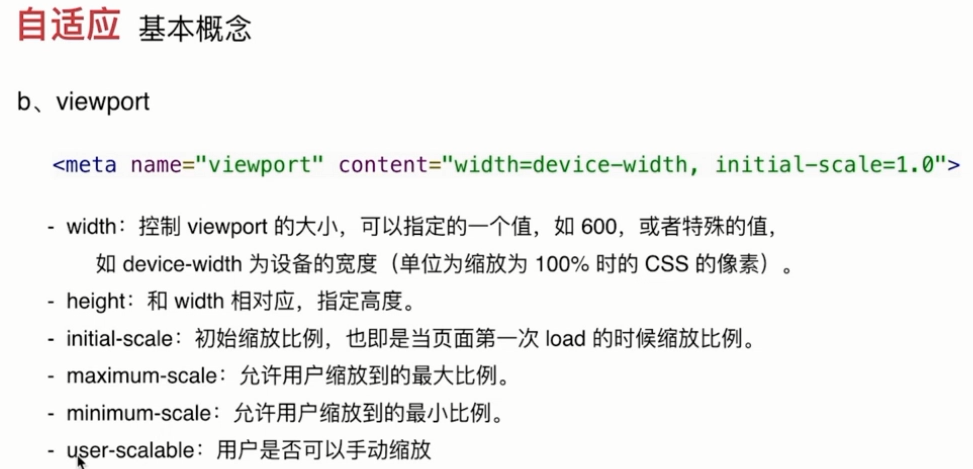

一.技术选型

 1. 构建工具

    > gulp grunt webpack fis prepack rollup

 2. MVVM框架选择

    > vue.js
    >
    > react.js
    >
    > angular.js

 3. 模块化设计

    >css模块化
    >
    >>设计原型
    >>
    >>```js
    >>a.可复用 能继承(可修改) 要完整 
    >>b.周期性迭代
    >>	设计+重构
    >>	实践 迭代
    >>```
    >>
    >>设计方法
    >>
    >>```js
    >>先整体后部分再颗粒化
    >>	布局>页面>功能>业务
    >>先抽象再具体
    >>```
    >>
    >>
    >
    >js模块化
    >
    >>原则
    >>
    >>```js
    >>高内聚 底偶合
    >>
    >>周期性迭代
    >>	业务需求 实践 迭代
    >>先整体后部分再颗粒化
    >>```
    >>
    >>

 4. 自适应方案

    >js+css
    >
    >```js
    >github.com/jawil/blog/issues/21
    >css象素 设备象素 逻辑象素 设备象素比 
    >```
    >
    >
    >
    >

 5. 代码维护及复用性设计的思考

    >需求变更
    >
    >产品迭代
    >
    >bug定位
    >
    >新功能开发


