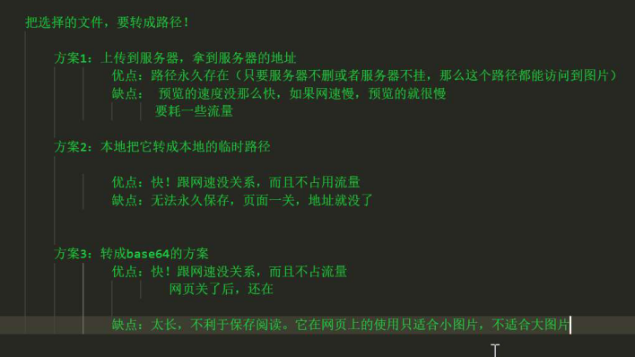

担心源自于未来的未知,希望寄托于未知的未来.

种一棵树最好的时间是十年前和现在.

# Ajax

```js
ajax是什么?
AJAX 是一种在无需重新加载整个网页的情况下，能够更新部分网页的技术(异步显示数据的相关技术).

最大的优点是在不重新加载整个页面的情况下，可以与服务器交换数据并更新部分网页内容.


```

## XMLHttpRequest

```js
说明:https://developer.mozilla.org/zh-CN/docs/Web/API/XMLHttpRequest
XMLHttpRequest的目
	它将后台数据发送到服务器。
	它从服务器请求数据。
	它从服务器接收数据。
	它在不重新加载页面的情况下更新数据。
    abort() 用于取消当前请求。
open()方法类型:    
	open(method,URL) - 它打开指定get或post方法和URL的请求。
	open(method,URL,async) - 它与上面相同但是指定异步或不指定。
	open(method,URL,async,userName,password) - 与上面相同，但指定用户名和密码。
send()方法:
	send() - 它发送get请求
	send(string) - 发送请求,并传参(post)。
abort() :取消当前请求
xhr.responseURL:返回响应的序列化URL;
xhr.readyState //返回0-4
xhr.status //返回状态码如:200,
xhr.statusText //状态码说明;

xhr.responseText //返回字符串数据
xhr.response

状态码说明:https://www.jianshu.com/p/7fd8ff6be0e6
```


## readyState属性有五个状态值

```js
0：是uninitialized，未初始化。已经创建了XMLHttpRequest对象但是未初始化。
1: 服务器连接已建立,即调用open(),并调用send()方法开始向服务端发送请求.
2: 请求已接收
3: 请求处理中
4: 请求已完成，且响应已就绪
```

```js
Ajax接口文档
https://github.com/penglin0613/AjaxApi
jq
去掉空格 trim()
```


# 原生js的ajax请求

## get

```js
https://www.w3cschool.cn/ajax/ajax-xmlhttprequest-send.html

open(method,url,async)//
	method：请求的类型；GET 或 POST //大写
	url：文件在服务器上的位置
	async：true（异步）或 false（同步）
1.创一个XMLHttpRequest对象;
2.调用这个对象的open('get',url?num=2)方法;
3.设置请求成功后的回调函数onload=function(){};
4.调用这个对象的send()方法(发送);

var xhr = new XMLHttpRequest();
xhr.open('get','url?num=3&num2=2');//?num=3 是参数多个&连接
xhr.onload=function(){  //请求成功后拿到数据后执行
    //老浏览器不支持;用onreadystatechange 只要发送
    xhr.response		//response(响应),响应的内容;
    JSON.parse(xhr.response)//转为JSON对象
}
xhr.send();
```

```js
var xhr = new XMLHttpRequest();
xhr.open('get',url,true);
xhr.send();
xhr.onload=function(){
    if(xhr.readystate==4 && xhr.status==200){
     	var data = xhr.response;  	
     }
}
```


## post

```js
区别:
1.设置请求头;
2.传参不同;

var xhr = new XMLHttpRequest();
xhr.open('post',url);
xhr.setRequestHeader('Content-Type','application/x-www-form-urlencoded');
xhr.onload=function(){}
xhr.send("key1=value & key1=value"); //与get不同
```

```js
var xhr = new XMLHttpRequest();
xhr.open('post',url);
xhr.setRequestHeader('Content-Type','application/x-www-form-urlencoded');
xhr.send("key1=value & key2=value2");
xhr.onload=function(){
    if(xhr.readystate==4 && xhr.status ==200){
       		var data = xhr.response;
       }
}
```


## 请求数据处理

```js
xhr.response();
xhr.responseXML();转为dom树
xhr.onreadystatechange 
```

## 封装

```js
回调函数在ajax中的作用:
	回调函数将函数作为参数传递给另一个函数。如果我们必须在网站上执行各种AJAX任务，那么我们可以创建一个用于执行XMLHttpRequest的函数和一个用于执行每个AJAX任务的回调函数。
封装get()
url:请求地址;
data:参数;
callback:回调函数;
funciton get(url,data,callback){
	var xhr = new XMLHttpRequest();
	url +='?';
	url +=data;
	xhr.open('get',url);
	xhr.onload=function(){
		callback(xhr.response);
	};
	xhr.send();
};

get('url','num=3',function(backData){
	执行
});
-----------------------------------------------
封装post();
function post(url,data,callback){
    var xhr = new XMLHttpRequest();
    xhr.open('post',url);
    xhr.setRequestHeader();
    xhr.onload = function(){
        callback(xhr.response);
    }
    xhr.send(data);
}

post(url,参数,function(){
    执行
});
```

### 原生封装

```js
(function(window) {
  var heima = {
    get: function(url, data, callback) {
      //1.创建xhr对象
      var xhr = new XMLHttpRequest();
      //处理url
      url += "?";
      url += data;
      //2.设置请求方式和请求地址.
      xhr.open("get", url);
      //3.注册响应成功后的回调函数.
      xhr.onload = function() {
        //成功拿到响应回来的数据后,执行这个传递进来的函数.
        callback(xhr.response); //把响应回来的数据作为实参进行传递.
      };
      //4.发送请求
      xhr.send();
    },
    post: function(url, data, callback) {
      //1.创建xhr对象
      var xhr = new XMLHttpRequest();
      //2.设置请求方式和请求地址.
      xhr.open("post", url);
      //3.如果是post请求,要设置请求头
      xhr.setRequestHeader("Content-Type", "application/x-www-form-urlencoded");
      //4.注册响应成功后的回调函数.
      xhr.onload = function() {
        //console.log(xhr.response);
        callback(xhr.response); //把这个响应回来的内容作为实参进行传递
      };
      //5.发送请求
      xhr.send(data);
    },
    //既可以调用get方式的请求,也可以调用post方式的请求.
    //参数是一个对象. options
    //options.type  请求的方式get/post
    //options.url   请求的地址
    //options.data  请求的参数 格式 "key=value"
    //options.success 执行的回调函数
    ajax: function(options) {
      //1.创建xhr对象
      var xhr = new XMLHttpRequest();
      //如果是get请求,需要对url做拼接处理
      if (options.type == "get") {
        options.url += "?";
        options.url += options.data;
      }
      //2.设置请求方式和请求地址.
      xhr.open(options.type, options.url);
      //如果是post请求,才要设置请求头.
      if (options.type == "post") {
        //3.如果是post请求,要设置请求头
        xhr.setRequestHeader(
          "Content-Type",
          "application/x-www-form-urlencoded"
        );
      }
      //4.注册响应成功后的回调函数.
      xhr.onload = function() {
        //console.log(xhr.response);
        options.success(xhr.response);
      };

      //5.发送请求
      if (options.type == "get") {
        xhr.send();
      } else {
        xhr.send(options.data);
      }
    }
  };
  //把heima这个对象给暴露出去
  window.heima = heima;
})(window);
```

## 原生FormData

```js
获取表单数据方法:1
FormData
//1.创建formData对象.
    var fd = new FormData(document.querySelector('form')); 
	//小括号里面必须要form表单,而且必须是dom元素
//2.发送ajax请求.
    //1.创建xhr对象
        var xhr = new XMLHttpRequest();
     //2.设置请求方式和请求地址.
        xhr.open('post', 'http://localhost:4399/hero/add');
     //使用FormData数据,不需要设置请求头.
     //4.注册响应成功后的回调函数.
         xhr.onload = function () {
              console.log(xhr.response);
           }
     //5.发送请求
         xhr.send(fd);

获取表单数据方法:2;
jq的serielize() 表单内容序列化;
$('#yourformid').serialize(), 
    注意:
    	1.不能获取带有 disabled 和 没有被选中的;
		2.不能获取 没有name属性的
```


# JQ的ajax方法

```html
dataType:'',
xml:回XML文档，可用 jQuery 处理;
html:返回纯文本HTML信息；包含的script标签会在插入dom时执行。 
script: 返回纯文本 JavaScript 代码。不会自动缓存结果。除非设置了 “cache” 参数。注意：在远程请求时(不在同一个域下)，所有 POST 请求都将转为 GET 请求。（因为将使用 DOM 的 script标签来加载） 
json: 返回 JSON 数据 。 
jsonp: JSONP 格式。使用 JSONP 形式调用函数时，如 “myurl?callback=?” jQuery 将自动替换 ? 为正确的函数名，以执行回调函数。 
text: 返回纯文本字符串

```


## JQuery-get方法

```js
$.get();
$.get({		//get or post 方法根据接口提供的请求方式
	url:"",
    //date:"name=aaa",  //字符串方式
    date:{				//对象方式
    	name:aaa		//name 有接口方式提供
	},
	success:function(backData){ //接受数据参数,自定
		//处理发送ajax请求,响应回来的数据		
	}
});
---------------------------
    完整
 $.ajax({  
    type: "POST",  
    url:your-url,  
    data:$('#yourformid').serialize(), //表单内容序列化-输出name=value
    async: false,  //true为异步,false为同步
    error: function(request) {  
        alert("Connection error");  
    },  
    success: function(data) {  
        //接收后台返回的结果  
 	} 
)}
```

```js
ajax FormData

var fd = new FormData(document.getElementById('form'))

$.ajax({  
    type: "POST",  
    url:your-url,  
    data:fd,
    async: false,  //true为异步,false为同步
    contentType:false,//不设置请求头
	processData:false,//不要把传递的值设置key=vallue;
    
    //如果MIME 类型不是 "application/json",jq则不会自动转为json对象
    dataType:"json", 
    cache:true,	//true会缓存ajax结果;(选)
    
    error: function(request) {  
        alert("Connection error");  
    },  
    success: function(data) {  
        //接收后台返回的结果  
 	} 
)}
```

## jqurey-FormData

```js
//用于formData
contentType:false,//不设置请求头
processData:false,//不要把传递的值设置key=vallue;
```

## template-web模版引擎

```js
解决JSON的字符串拼接繁琐问题!
    art-template模版引擎

1.引入:<script src="art-template.js"></script>;
2.准备一个模版: 给id,给type = "text/html";给变了{{属性名}}
	<script id="tem_sb" type = "text/html">
        {{each data.arr}}	//遍历,要找到要遍历的数据
        	<h2> 适当放松{{name}}</h2>
			<h2> 适当放松{{age}}</h2>
			<h2> 适当放松{{gender}}</h2>

			//  {{$value}}	//遍历出的对象的属性值
			//  <h2> 适当放松{{$value.name}}</h2>

			{{$index}} //遍历的下标

			//{{if $value.age >= 18}}	//判断
					内容
               {{else}}
                	内容2
                {{/if}}
		{{/each}}
     </script>
3.数据:
	<script>
       var obj={
           name:'张三',
           age:'张三',
           gender:'张三',    
       }
    </script>;
4.调用模版方法:
var aa = template('tem_sb',backdata);
5.添加到DOM树
$().html(aa);
```

# 获取数据方法总结

```js
1-window.location.search.split('=')[1]  //获取地址?后的

2-var fd = new FormData();

3-$().serealize();

```


# JSON

```js
　JSON代表JavaScript Object Notation。在AJAX中，它用于在浏览器和服务器之间交换数据。它很容易理解，数据交换比XML快。它支持数组，对象，字符串，数字和值。
 
 JSON：JavaScript 对象表示法（JavaScript Object Notation）。 JSON 是存储和交换文本信息的语法。
JSON 是轻量级的文本数据交换格式
JSON 语法是 JavaScript 语法的子集.

json格式
{
    "book": [
        {
            "id":"01",
            "language": "Java",
            "edition": "third",
            "author": "Herbert Schildt"
        },
        {
            "id":"07",
            "language": "C++",
            "edition": "second"
            "author": "E.Balagurusamy"
    }]
}
JSON 支持以下两种数据结构：
	1.名/值对集合： 这一数据结构由不同的编程语言支持。
	2.有序的值列表： 包括数组，列表，向量或序列等等。
JSON 值可以是：
	1.数字（整数或浮点数）
	2.字符串（在双引号中）
	3.逻辑值（true 或 false）
	4.数组（在方括号中）
	5.对象（在花括号中）
	6.null
	7.空格
JSON 文件
	1.JSON 文件的文件类型是 ".json"
	2.JSON 文本的 MIME 类型是 "application/json"
	MIME描述消息内容类型的因特网标准;
同源策略:它是由Netscape提出的一个著名的安全策略;所有支持JavaScript的浏览器都会使用这个策略，所谓同源是指，协议+域名+端口相同.

JSON检测工具
https://www.w3cschool.cn/tools/index?name=jsonparse

创建JSON
	var jsonobj = new object();
url解析json
https://www.w3cschool.cn/json/1koy1piy.html
```

### JSON转JS对象

```js
JSON.parse(str); //转成对象 或 数组

dataType:'json', //
```

### JS对象转JSON

```js

JSON.stringify（obj）；//转成字符串

```

### eval()

```js
eval("2+3")	// 返回 5
var myeval = eval;	// 可能会抛出 EvalError 异常
myeval("2+3");	// 可能会抛出 EvalError 异常
eval() 函数可编译并执行任何 JavaScript 代码.//存在安全问题
	安全问题:eval() 会执行代码,如代码中加入恶意插入代码则也会执行.
alert(eval("{}"); // return undefined
alert(eval("({})");// return object[Object]
所以需要加eval("("+data+")")
```

# 文件预览



```js
一\本地零时路径预览
document.querySelector('input').onchange = function(){
    var icon = this.files[0];//获取上传的文件
    var url = URL.createObjectURL(icon);//创建并获取文件url
    获取的是虚拟路径,路径只有浏览器知道 ,遵守安全框架
    
}

formData 对象
form表单中的获取数据的标签要有name属性;
var fd = new FormData(document.querySelector('form'));
//必须传入DOM元素;
fd.get('name') //name为表单的name值//name为键,输入的为值;

二\转成base64

file.onchange= function(){
    let read = new FileReader()
    read.readAsDataURL(this.file[0])
    read.onload = function(){
    icon.src = read.result
    }
}
```

# formData

```js
1.使用formData不需要设置请求头
2.form表单中的获取数据的标签要有name属性;
3.name属性名与请求参数保持一致;
4.创建 FormData是()里必须是DOM元素;
var fd = new FormData(document.querySelector('form'));

contentType:false,//不设置请求头
processData:false,//不要把传递的值设置key=vallue;
    
fd.append('k1',value1);
fd.has('h1'),//是否对应的key值
fd.delete('k1');//删除
fd.getAll('k1');//获得k1属性的左右值
fd.set('k1',value2);//设置

fd.keys()//返回所有的key值; 用于for-in循环;
	for (var key of formData.keys()) {
   		console.log(key); 
	}
fd.values();//返回所有值;
	for (var value of formData.values()) {
   		console.log(value); 
	}
-----------
遍历
var i = formData.entries();
 
i.next(); // {done:false, value:["k1", "v1"]}
i.next(); // {done:fase, value:["k1", "v2"]}
i.next(); // {done:fase, value:["k2", "v1"]}
i.next(); // {done:true, value:undefined}
--------------------- 

<form enctype="multipart/form-data"> //html设置为formdata类型

```

把form变成formdata

```js
<form name="form1" id="form1">  
        <p>name:<input type="text" name="name" /></p>  
        <p>gender:<input type="radio" name="gender" value="1" />male <input type="radio" name="gender" value="2" />female</p>
        <p>stu-number：<input type="text" name="number" /></p>  
        <p>photo:<input type="file" name="photo" id="photo"></p>  
        <p><input type="button" name="b1" value="submit" onclick="fsubmit()" /></p>  
</form>  

var form=document.getElementById("form1");
var fd =new FormData(form);

form表单内都添加name
```


# 页面跳转方式

```js
1.
<button onclick='location.href='./edit.html'>
2.
.onclick=function(){
    window.location.href = 'url';
}
3.
重定向301/302
 response.setHeader('location','2.html');
        
    // 向响应报文头中 设置 状态码为 302
response.writeHead(302,'move');
```

常见的状态吗

# 传值方式总结

```js
原生js:
	get : open('get',url?num=2);
    post:send("key1=value & key1=value");
	FormData:
		 var fd = new FormData(document.querySelector('form')); 

JQ:
	data:{};
	data:fd;
	data:'key'='value',
```

# 下拉菜单取值

```js
下拉菜单的value值,是当前选中的option的value值.
如果当前选中的option没有value值, 那就是当前选中的option项的文本值.
```

# 