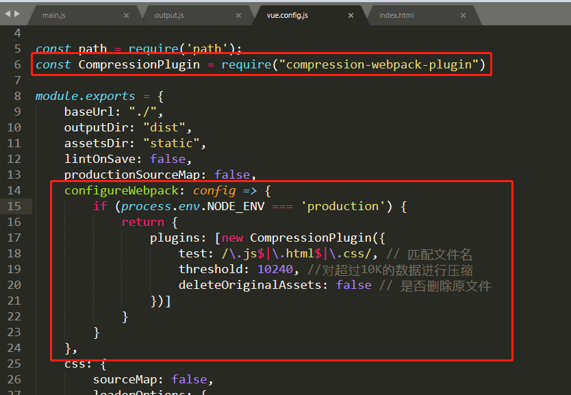

# 1.vue首次打开慢问题

解决:

```js
1.路由改成异步加载,按需加载
2.打包时不生成.map文件
3.打包时进行压缩打包-gzip,生成gz文件
4.内部引用改成外部链接,使用cdn
5.去掉console.log
```

详情:

- >1. 路由改成异步加载,按需加载
    >
    >```js
    >{
    >	path:'',
    >	component:()=>import('./login')
    >}
    >```
    >
    >2. 打包时不生成.map文件
    >
    >```js
    >vue.config.js
    >
    >const path = require("path");
    >const CompressionWebpackPlugin = require("compression-webpack-plugin");
    >const productionGzipExtensions = ["js", "css"];
    >const isProduction = process.env.NODE_ENV === "production";
    >
    >module.exports = {
    >baseUrl: process.env.NODE_ENV === "production" ? "./" : "",
    >//   productionSourceMap: process.env.NODE_ENV === "production" ? false : true,
    >productionSourceMap: false,//不打包出map文件
    >configureWebpack: config => {
    >if (isProduction) {
    >config.plugins.push(
    >  new CompressionWebpackPlugin({
    >    algorithm: "gzip",
    >    test: new RegExp("\\.(" + productionGzipExtensions.join("|") + ")$"),
    >    threshold: 10240,
    >    minRatio: 0.8
    >  })
    >);
    >}
    >}
    >};
    >```
    >
    >3. 打包时进行压缩打包-gzip
    >
    >```js
    >也称 http压缩
    >流程
    >1.找到 config/index.js
    >2.找到 productionGzip: false
    >3.将 false 改为 true
    >4.npm i -D compression-webpack-plugin
    >5.重新允许 npm run build
    >6.可以看到生成了一些 gz 文件
    >7.其他都不用变，把原来的代码和新生成的 gz 文件一并提交到服务器上就行了
    >8.找运维给服务器开启 gzip 即可
    >```
    >
    >```js
    >安装:
    >	npm i -D compression-webpack-plugin
    >```
    >
    >```js
    >vue.config.js
    >
    >const path = require('path')
    >const CompressionWebpackPlugin = require('compression-webpack-plugin')
    >const productionGzipExtensions = ['js', 'css']
    >const isProduction = process.env.NODE_ENV === 'production'
    >
    >module.exports = {
    >configureWebpack: config => {
    >if (isProduction) {
    >config.plugins.push(new CompressionWebpackPlugin({
    >    algorithm: 'gzip',
    >    test: new RegExp('\\.(' + productionGzipExtensions.join('|') + ')$'),
    >    threshold: 10240,
    >    minRatio: 0.8
    >  })
    >)
    >}
    >}
    >}
    >```
    >
    >写法二 
    >
    >```js
    >const path = require('path');
    >const CompressionPlugin = require('compression-webpack-plugin');
    >module.exports = {
    >
    >/*从这里开始添加*/
    >configureWebpack: config => {
    >  if(process.env.NODE_ENV === 'production'){
    >      return {
    >          plugins: [new CompressionPlugin({
    >              test: /\.js$|\.html$|\.css/,
    >              threshold: 10240,
    >              deleteOriginalAssets: false
    >          })]
    >      }
    >  }
    >}
    >/*到这里结束*/
    >
    >}; 
    >```
    >
    >```js
    >如果浏览器支持Gzip则请求头设置:
    >浏览器请求头:设置 Accept-Encoding: gzip
    >
    >服务器响应:设置 Content-Encoding:gzip
    >https://www.cnblogs.com/LO-ME/p/7377082.html
    >
    >本地http-server模拟响应gz文件:运行命令
    >http-server -gzip -o
    >```
    >
    >
    >
    >4. 内部引用改成外部链接,使用cdn
    >
    >```js
    >https://cdn.bootcss.com/mint-ui/2.21/index.js
    >
    ><script
    >src="https://code.jquery.com/jquery-3.1.0.js"
    >integrity="sha256-slogkvB1K3VOkzAI8QITxV3VzpOnkeNVsKvtkYLMjfk="
    >crossorigin="anonymous">
    ></script>
    >
    >module.exports = {
    >//...
    >externals: {
    >jquery: 'jQuery'
    >}
    >};
    >
    >externals中的key是用于import，value表示的在全局中访问到该对象，就是window.echarts
    >```
    >
    >
    >
    >5. 去掉console.log
    >
    >```js
    >npm install terser-webpack-plugin -D
    >
    >module.export = {
    >configureWebpack: (config)=>{
    >if(process.env.NODE_ENV === 'production'){
    >config.optimization.minimizer[0].options.terserOptions.compress.drop_console = true
    >}
    >}
    >}
    >
    >```
    >
    >
    >
    >```js
    >const path = require('path');
    >const CompressionWebpackPlugin = require('compression-webpack-plugin');
    >const isProduction = process.env.NODE_ENV === 'production';
    >
    >module.exports = {
    >configureWebpack: config => {
    >// 生产模式
    >if (isProduction) {
    > config.externals = {
    >   'vue': 'Vue',
    >   'vue-router': 'VueRouter',
    >   'moment': 'moment'
    > }
    > // 打包生产.gz包
    > config.plugins.push(new CompressionWebpackPlugin({
    >   algorithm: 'gzip',
    >   test: new RegExp('\\.(' + productionGzipExtensions.join('|') + ')$'),
    >   threshold: 10240,
    >   minRatio: 0.8
    > }))
    > // 添加自定义代码压缩配置
    > config.plugins.push(
    >   new UglifyJsPlugin({
    >     uglifyOptions: {
    >       compress: {
    >         warnings: false,
    >         drop_debugger: true,
    >         drop_console: true,
    >       },
    >     },
    >     sourceMap: false,
    >     parallel: true,
    >   })
    > )
    >}
    >}
    >
    >使用免费的CDN上线没有多久就GG不能用等悲惨故事！
    >```
    >
    >