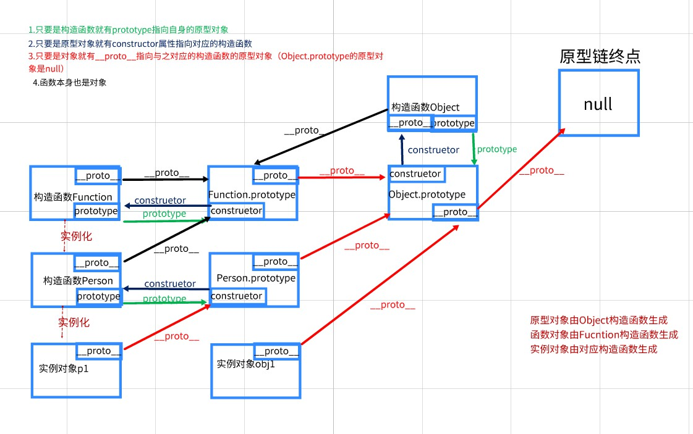

# html-css

## html有哪些常用标签:

```html
header
nav

section
article
aside

footer
```

## 简述一下html语义化理解:

- ```js
    让页面的内容结构化,结构更清晰,便于阅读、维护和理解
    ```

## html5新特性,移除了哪些元素

- ```js
    
    ```

## 什么是盒子模型:画出盒子模型

- ```
    margin
      border
      padding
      content
    ```

## 行内元素有哪些,块级元素有哪些,空元素有哪些

- ```js
    行内元素:span, i, em,
      块级元素:div,h,ul,li,ol
    ```

## display有哪些值,说明他们的作用

- ```js
  块转行内：display:inline;
    行内转块：display:block;
    块、行内元素转换为行内块： display: inline-block;
    隐藏:display:none;
    flex布局:display:flex;
    ```

## css选择器有哪些

- ```
    
    ```

    

## 解释css sprites 精灵图 雪碧图

- ```js
    
    ```

    

## 清除浮动的方式:

- ```
    
    ```

    

## Flex布局有哪些常见属性:

```

```

## 水平居中有哪些方法:

```

```

## 移动端怎么做适配:

```

```

## 简述px,em,rem

- ```
    
    ```

    

# js

## 原型链



## 原型继承方式

### 1原型链继承

- ```js
  function SuperType() {
    this.property = true;
  }
  SuperType.prototype.getSuperValue = function() {
    return this.property;
  }
  function SubType() {
    this.Subproperty = false;
  }
  SubType.prototype = new SuperType(); // 继承了SuperType
  SubType.prototype.getSubValue = function() {
    return this.Subproperty ;
  }
  var instance = new SubType();
  alert(instance.getSuperValue()) // true
  ```

  **优缺点:**

  ```js
  继承原理：通过让子类的原型等于父类的实例，来实现继承。
  优点：继承了超类型的构造函数的所有属性和方法。
  缺点：1、在创建子类实例时，无法向超类型的构造函数传参，继承单一。
  　　　2、所有新实例都会共享父类实例的属性。
  ```

  

### 2构造函数继承

- ```js
  function SuperType() {
    this.colors = ['red', 'blue', 'green'];
  }
  function SubType() {
    SuperType.call(this); //  继承了SuperType
  }
  var instance1 = new SubType();
  instance1.colors.push('black');
  console.log(instance1.colors); // ['red', 'blue', 'green', 'black']
  ```

  **优缺点:**

  ```js
  继承原理：改变子类的this,通过call指向父类;
  优点：可以在子类构造函数中，向超类型构造函数传递参数。
  缺点：只继承了父类构造函数的属性，没有继承父类原型的属性。所有的方法都在构造函数中定义，无法实现复用，影响性能。
  ```

  

### 3组合继承

- ```js
  function SuperType(name) {
    this.name = name;
    this.colors = ['red','blue','green'];
  }
  SuperType.prototype.sayNAme = function() {
    alert(this.name);
  }
  function SubType(name,age) {
    SuperType.call(this, name); // 继承属性
    this.age = age;
  }
  SubType.prototype = new SuperType(); // 继承方法
  SubType.prototype.constructor = SubType;
  SubType.prototype.sayAge = function() {
    alert(this.age);
  }
  
  var instance1 = new SubType('xxx', 15);
  instance1.colors.push('black');
  console.log(instance1.colors); // ['red','blue','green','black']
  instance1.sayNAme(); // xxx
  instance1.sayAge(); // 15
  ```

  **优缺点:**

  ```js
  使用原型链实现对原型属性和方法的继承，通过构造函数来实现对实例属性的继承。这样既通过在原型上定义方法实现了函数的复用，又能够保证每个实例都有它自己的属性。
  缺点：调用两次父类构造函数。
  ```

  

### 4寄生组合继承

- ```js
  function create(prototype) {
  function Super() {}
  Super.prototype = prototype
  return new Super()
  }
  
  function Programmer(age, name) {
  Person.call(this, age)
  this.name = name
  }
  
  Programmer.prototype = create(Person.prototype)
  Programmer.prototype.constructor = Programmer // 修复构造函数指向
  
  let jon = new Programmer(18, 'jon')
  jon.name // jon
  ```

  **优缺点:**

  ```js
  子类构造函数复制父类的自身属性和方法，子类原型只接受父类的原型属性和方法
  ```

  

进描述一下cookies,sessionStorage和localStorage

- ```
    
    ```

    

浏览器的同源策略

- ```
    
    ```

    

正则表达式,匹配以字母开头,后面可以是数字6-30?

- ```
    
    ```

    

统计字符串出现最多的字母aaacccdddddffff

- ```
    
    ```

    

AJAX的原理

- ```js
    
    ```

    

js原生对象有哪些

- ```
    
    ```

    

对象声明三种方式:

- ```
    
    ```

    

前端优化有哪些:

- ```js
    
    ```

# ES6

es6有哪些新特性:

```

```

数组有哪些常见的api:

```


```

# vue

vue的v-model的原理是?

双向绑定是分两个数据传递方向:

```

```

vue的生命周期:

```

```

vue组件传递如何传递:

父>子:

```

```

子>父:

```

```

兄弟互传:

```js

```

