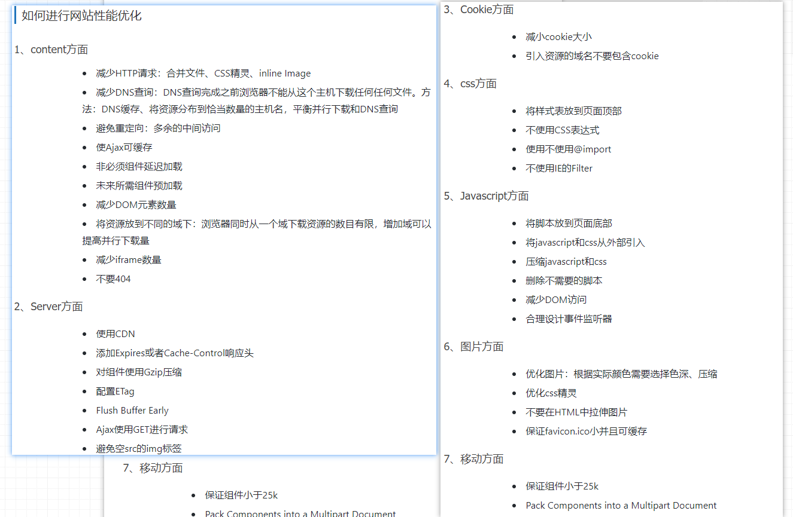

# 一、HTML

## src和href的区别

```js
href标识超文本引用，用在link和a等元素上，href是引用和页面关联，是在当前元素和引用资源之间建立联系
 
src表示引用资源，表示替换当前元素，用在img，script，iframe上，src是页面内容不可缺少的一部分。
```

## 重构 回流

```js
https://segmentfault.com/a/1190000014050350

重构：当元素的某些属性发生变化，这些属性又只影响元素的外观和风格，而不改变元素的布局、大小比如颜色、背景。此时触发的浏览器行为称作重构。
回流：当元素的布局、大小规模和显示方式发生改变时，触发的浏览器行为叫回流。而且，每个页面都会在第一次加载时触发回流。
注意：回流必将引起重绘，而重绘不一定伴随回流。同时，回流对性能的影响要大于重构。

添加、删除元素(回流+重绘)
隐藏元素，display:none(回流+重绘)，visibility:hidden(只重绘，不回流)
移动元素，比如改变top,left(jquery的animate方法就是,改变top,left不一定会影响回- 流)，或者移动元素到另外1个父元素中。(重绘+回流)
对style的操作(对不同的属性操作，影响不一样。比如，元素尺寸改变——边距、填充、边框、宽度和高度，内容改变——比如文本改变或者图片大小改变而引起的计算值宽度和高度改变；)
还有一种是用户的操作，比如改变浏览器大小，改变浏览器的字体大小等(回流+重绘)

引起回流:
    1、添加或者删除可见的DOM元素；

    2、元素位置改变；

    3、元素尺寸改变——边距、填充、边框、宽度和高度

    4、内容改变——比如文本改变或者图片大小改变而引起的计算值宽度和高度改变；

    5、页面渲染初始化；

    6、浏览器窗口尺寸改变——resize事件发生时；
```

优化

```css
1.直接改变className，如果动态改变样式，则使用cssText（考虑没有优化的浏览器）
2.让要操作的元素进行”离线处理”，处理完后一起更新：

使用createdocumentfragment()进行缓存操作,引发一次回流和重绘；
使用display:none技术，只引发两次回流和重绘；
使用cloneNode(true or false) 和 replaceChild 技术，引发一次回流和重绘；
3.不要经常访问会引起浏览器flush队列的属性，如果你确实要访问，利用缓存
4.让元素脱离动画流，减少回流的Render树的规模(即让动画的元素脱离文档流，使用absolute定位等等)。

cssText:


DocumentFragment:
```

> 1. **cssText**
>
> ```css
> 使用方法:
> document.getElementById("d1").style.cssText = "color:red; font-size:13px;";
> var x = elmnt.style.cssText; //会返回内联样式color: red; font-size: 50px;
> 
> 
> 常规:会引起多次回流
> element.style.width=”20px”;
> element.style.height=”20px”;
> element.style.border=”solid 1px red”;
> 优化写法:
> element.style.cssText=”width:20px;height:20px;border:solid 1px red;”;
> 
> 防止清除源样式:
> Element.style.cssText += ‘width:100px;height:100px;top:100px;left:100px;’
> 加冒号:解决ie不起作用问题
> Element.style.cssText += ‘;width:100px;height:100px;top:100px;left:100px;’
> 
> ```
>
> 2. **DocumentFragment**
>
> ```js
> documentFragment是nodeType值为11，nodeName的值为#document-fragment.
> createdocumentfragment()方法创建了一虚拟的节点对象，节点对象包含所有属性和方法。
> 
> 防止多次渲染(回流):
>  var ul = document.createElement('ul');
>  var flag = document.createDocumentFragment(); //创建
>  for(var i=1; i<101;i++){
>      var li = document.createElement('li')
>      var liText = document.createTextNode(i);
>      li.appendChild(liText);
>      flag.appendChild(li);  //添加如虚拟dom
>  }
>  ul.appendChild(flag);	//添加至dom
>  document.body.appendChild(ul);
> ```
>
> 

# 前端性能页面优化

```

```




```js
1.适当减少HTTP请求
	1.css/js合并打包
	2.小图标用iconfont 或者 base64
	3.雪碧图

2.减少静态资源的体积
	1.js,css图片压缩,图片压缩用tinypng.com(进入网站)
	2.先tinypng.com压缩,后在webpack压缩
3.服务器端开启gzip
4.预加载
	1.利用浏览器空闲时间加载
5.静态资源使用 CDN
6.请求缓存
7.设置合适的缓存
8其他
	1.减少dom数量(小程序,weex,RN);
	2.css预处理,减少层级
	3.图片懒加载

9.路由懒加载
	项目经验
```


# session

```
Session:称为“会话控制”
Session 对象存储特定用户会话所需的属性及配置信息。
特点：
 1. session保存的位置是在服务器端

 2. session一般来说是要配合cookie使用，如果是浏览器禁用了cookie功能，也就只能够使用URL重写来实现session存储的功能

 3. 单纯的使用session来维持用户状态的话，那么当同时登录的用户数量较多的时候，或者存在较多的数量的session会导致查询慢的问题

 本质上：session技术就是一种基于后端有别于数据库的临时存储数据的技术
```

#  跨域

```js
同源是指"协议+域名+端口"三者相同

当协议、子域名、主域名、端口号中任意一个不相同时，都算作不同域。不同域之间相互请求资源，就算作“跨域”。常见跨域场景如下图所示： 
```

解决:

```js
CORS支持所有类型的HTTP请求，是跨域HTTP请求的根本解决方案;
JSONP只支持GET请求，JSONP的优势在于支持老式浏览器，以及可以向不支持CORS的网站请求数据;

不管是Node中间件代理还是nginx反向代理，主要是通过同源策略对服务器不加限制。
日常工作中，用得比较多的跨域方案是cors和nginx反向代理


1.jsonp方式,是利用浏览器不对src属性做同源检测;通过给script中的src设置请求地址;请求;src默认是get请求,所以jsonp只支持get请求;

代理服务器:
2.node 中间件代理方式 设置cors跨域中间件;
3.nginx反向代理


4.服务端开启cors跨域;
```

# less,sass,stylus区别

```
基础语法:
less:与css相同; 变量:@ :  嵌套:{} 继承:.类名
sass:可以省花括号,和分号; 变量:$ :  嵌套:缩进 继承:@extend
stylus:可以不用花括号,分号,冒号;更简洁; 变量:直接变量名= 嵌套:缩进

混入基本相同:
less:.名称 声明
sass:@mixin声明
stylus参数赋值用等号
```

# git常用命令

```
git init   初始化
git add .  添加到缓冲区
git commit 提交到git仓库
git log      查看日志
git reset 	 回退
git reflog	 查看历史
git branch 	 创建分支
git checkout 切换分支
```

## 模拟一个new

```js
接口文档：
	公司内部进行分享：wiki；大公司用
    小公司：showdoc  swagger一个网址 可自动生成
```

